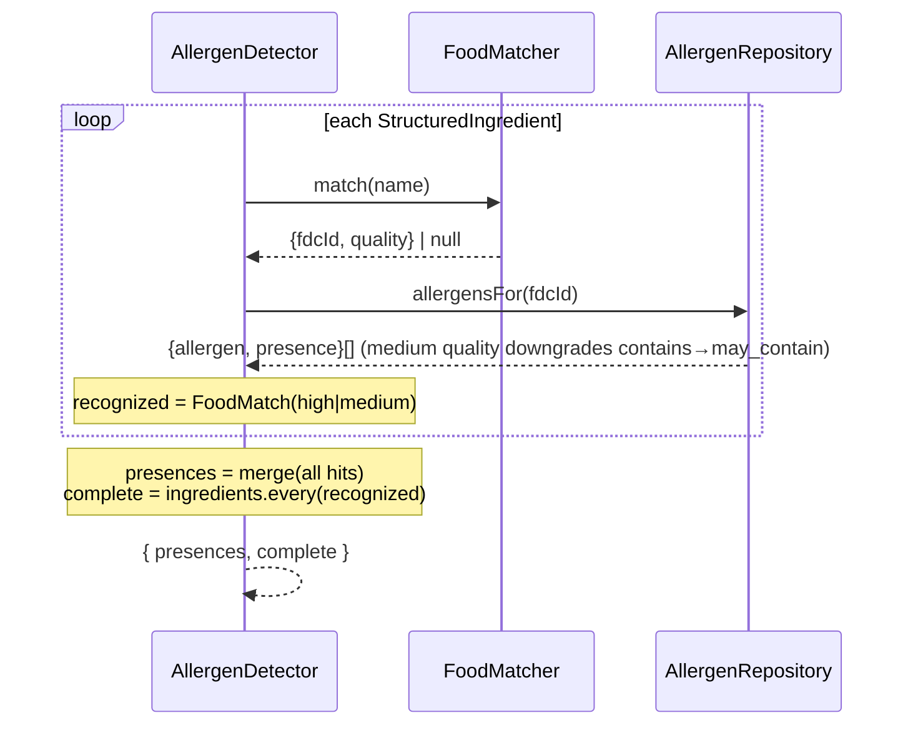
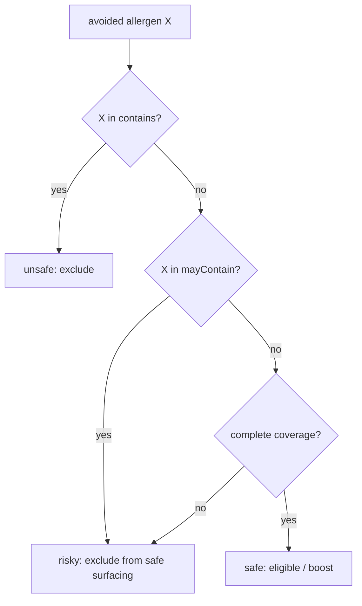
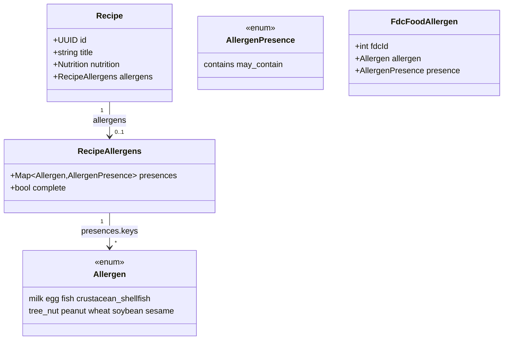
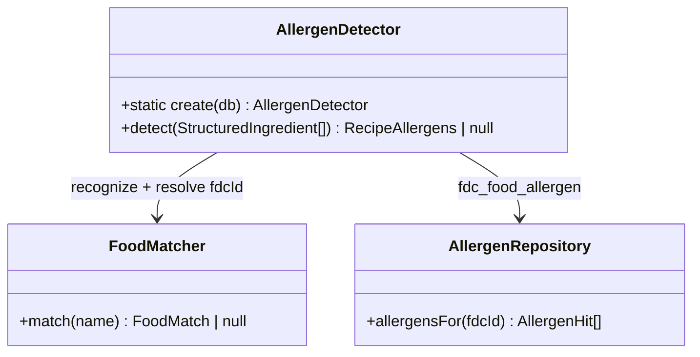
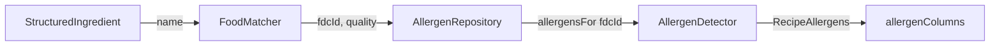

# Allergen Detection — Technical Design

Capture a structured allergen signal on every recipe at ingest — every US major food
allergen — as a ranking input. The signal is **safety-adjacent**: a false "allergen-free"
is far worse than a false positive, so the design degrades toward *undetermined*, never
toward *safe*.

This document mirrors the recently shipped nutrition signal (USDA FoodData Central →
`NutritionEstimator` → best-effort pipeline step → columns on the recipe row). Read it
against `server/src/nutrition/` and `server/src/workflows/import-workflow.ts`.

---

# Reviews

| Reviewer | Status | Feedback |
|---|---|---|
| Architect | not_started | |
| Backend Lead | not_started | |

---

# Recommended Taxonomy

Harvest adopts the **US FDA "major food allergens" ("Big 9")** as its canonical allergen
set, stored at the finest granularity the standard names — species-level subtypes as
reference data. One nine-value enum; nothing invented.

| Token (enum) | Standard name | Notes from source |
|---|---|---|
| `milk` | Milk | Cow, goat, sheep, or other ruminant milk |
| `egg` | Egg | Chicken, duck, goose, quail, or other fowl eggs |
| `fish` | Fish | Category; e.g. bass, flounder, cod |
| `crustacean_shellfish` | Crustacean shellfish | Category; e.g. crab, lobster, shrimp. **Excludes molluscs** |
| `tree_nut` | Tree nuts | Category; exactly 12 named species (below) |
| `peanut` | Peanuts | |
| `wheat` | Wheat | |
| `soybean` | Soybeans | |
| `sesame` | Sesame | Added by the FASTER Act, effective 2023-01-01 |

**Authoritative source.** FDA "major food allergen" is defined in the Federal Food, Drug,
and Cosmetic Act **§201(qq) (21 U.S.C. 321(qq))**, as amended by the **Food Allergen
Labeling and Consumer Protection Act of 2004 (FALCPA, Pub. L. 108-282)** — eight allergens
— and the **Food Allergy Safety, Treatment, Education, and Research Act of 2021 (FASTER
Act, Pub. L. 117-11)**, which added sesame effective 2023-01-01. These nine account for
~90% of food-allergic reactions in the US.
Sources: [21 CFR §1.500](https://www.law.cornell.edu/cfr/text/21/1.500),
[90 FR 1134 (2025-01-07 final guidance)](https://www.govinfo.gov/content/pkg/FR-2025-01-07/html/2024-31533.htm),
[USDA FSIS "The Big 9"](https://www.fsis.usda.gov/food-safety/safe-food-handling-and-preparation/food-safety-basics/food-allergies-big-9).

**Subtypes (finest granularity — seeded as reference data, not enum values).** FDA's 2025
final guidance narrows "tree nuts" to exactly **12** species with a robust evidence base
(Table 1); coconut was **removed** and is no longer a major food allergen:

> almond, black walnut, Brazil nut, California walnut, cashew, filbert/hazelnut,
> heartnut/Japanese walnut, macadamia nut/bush nut, pecan, pine nut/pinon nut, pistachio,
> walnut (English/Persian).

Source: [90 FR 1134, Table 1](https://www.govinfo.gov/content/pkg/FR-2025-01-07/html/2024-31533.htm).
These species, plus the fish and crustacean example species, drive the **FDC catalog
annotation** (see Tables) that maps each recognized food → the nine category tokens. The
recipe signal records category-level presence (`tree_nut`); the annotation retains the
species so species-level surfacing is a later feature over the same data, not a re-seed.

**Why US, not EU or Codex.** Harvest already grounds its nutrition signal in **USDA
FoodData Central** — a US authority. Aligning the allergen taxonomy to the same
jurisdiction keeps one regulatory frame across signals and lets allergen coverage reuse the
FDC catalog as its "known food" oracle (see Detection). The EU list (Reg (EU) 1169/2011
Annex II — 14 allergens) and Codex (CXS 1-1985, revised 2024 — 8 priority + regional list)
are broader; adopting them now would be speculative for a US product. The enum is a closed
`const` array, so internationalizing later is an additive migration, not a redesign
(see Rejected Alternatives and Q-02).

---

# Use Case Implementations

Lightweight IDs for this feature:

- **F-A1: Attach allergen signal at ingest** — every imported recipe carries an allergen
  profile computed from its ingredients.
- **O-A1: Detect allergens for one recipe** — the `AllergenDetector.detect` operation.
- **F-A2: Rank with allergen avoidance** — the ranking engine consumes the profile against
  a user's avoid-set.

## Attach allergen signal at ingest — Implements F-A1

Mirrors `nutritionStep`: a new best-effort `allergenStep` between nutrition and persist.
A detection failure withholds the profile (recipe still persists) — it never fails the
import.

```mermaid
sequenceDiagram
    participant WF as importWorkflow
    participant AS as allergenStep
    participant AD as AllergenDetector
    participant FM as FoodMatcher (FDC)
    participant REPO as AllergenRepository
    participant P as persistAndReady

    rect rgb(240, 248, 255)
    note over WF,AS: after nutritionStep, before persist
    WF->>AS: allergenStep(recipes)
    loop each recipe (isolated try/catch)
        AS->>AD: detect(ingredients)
        loop each ingredient
            AD->>FM: match(name)
            FM-->>AD: {fdcId, quality} | null  (recognized?)
            AD->>REPO: allergensFor(fdcId)
            REPO-->>AD: {allergen, presence}[] | []
        end
        note over AD: merge presences (contains > may_contain);<br/>complete = every ingredient recognized
        AD-->>AS: RecipeAllergens | withhold
    end
    AS-->>WF: recipes + allergen profile
    end

    WF->>P: persistAndReady(recipes)
    note over P: allergenColumns() writes JSON + coverage in the same txn
```

## Detect allergens for one recipe — Implements O-A1



`may_contain` on any ingredient never masks a `contains` for the same allergen; `contains`
wins the merge.

## Rank with allergen avoidance — Implements F-A2

The ranker maps `(recipe profile × user avoid-set)` to a verdict per avoided allergen.
Absence is trusted **only** when coverage is complete.



The only path to `safe` is *not detected* **and** *complete coverage*. Missing data,
unrecognized ingredients, or a detection error all land on `risky`, never `safe`.

---

# Entities



**The three states are encoded, not stored per allergen:**

| Meaning for allergen X | Encoding |
|---|---|
| **contains** | `presences[X] == contains` |
| **may contain** | `presences[X] == may_contain` |
| **confirmed absent** | `X ∉ presences` **and** `complete == true` |
| **undetermined / unknown** | `X ∉ presences` **and** `complete == false` |

We never store `absent` per allergen. Absence is *derived* from non-detection plus complete
coverage — the single rule that enforces the safety asymmetry. If any ingredient is
unrecognized, coverage is incomplete and every non-detected allergen is undetermined.

**Confidence** is carried by the `contains` / `may_contain` tiers, not a separate float
(see Decisions). Two inputs set the tier: the annotation's own `presence` (a food that only
*sometimes* carries an allergen — e.g. a curry paste with shrimp — is annotated
`may_contain`), and match quality (a `medium`-quality FDC match downgrades `contains` to
`may_contain`). The effective tier is the weaker of the two.

---

# Tables

## recipes (changed)

Add two columns to the existing `recipes` table, mirroring how nutrition attaches to the
row (`server/src/schema.ts`).

| Column | Type | Constraints | Notes |
|---|---|---|---|
| `allergens` | text (json) | nullable | `{ contains: Allergen[], mayContain: Allergen[] }`; `null` when withheld |
| `allergens_complete` | integer (boolean) | not null, default `0` | `1` only when every ingredient was recognized; gates "confirmed absent" |

`allergens_complete` defaults to `0` (false) so any row without a computed profile — old
rows, withheld rows, failed detection — reads as *no absence claim*, the safe default.

Store the detected sets as JSON on the row (single read, mirrors the nutrition attach
point). No allergen `source` enum: unlike nutrition, no recipe source reliably declares
allergens, so the column would always read "inferred" and carry no information (see
Rejected Alternatives). A normalized `recipe_allergens` child table is the upgrade path if
the ranker ever needs SQL-level filtering across a large shared catalog (Q-03).

## fdc_food_allergen (new — primary allergen source, keyed to the FDC catalog)

Annotates each FDC food with its allergen set. This is what makes the "confirmed absent"
claim sound: because every recognized food resolves to a defined (possibly empty) allergen
set, a recognized food can never have *unknown* allergens. The existing `fdc_foods` /
`fdc_food_nutrient` tables are **not modified** — this is a new table that references them.

| Column | Type | Constraints | Notes |
|---|---|---|---|
| `fdc_id` | integer | not null, fk → `fdc_foods.fdc_id` | The recognized food |
| `allergen` | text | not null, enum `MAJOR_ALLERGENS` | Category token |
| `presence` | text | not null, enum `ALLERGEN_PRESENCE` | Base tier before match-quality downgrade |
| `species` | text | nullable | e.g. `cashew`; retained for future species-level surfacing |

Compound key `(fdc_id, allergen)`. A food may carry several allergens (e.g. traditional
`soy sauce → soybean, wheat`), and the `presence` column lets a food that only *sometimes*
carries an allergen be annotated `may_contain` (e.g. a curry paste with shrimp). **Seeded
offline** (like the FDC catalog itself) by a rules pass over FDC `category` — `Finfish →
fish`, `Cheese → milk`, `Tree Nuts → tree_nut`, and the 12 named tree-nut species — with
per-food overrides where a category is too coarse (`Legumes` splits into `peanut` vs
`soybean`). A food with no allergen is simply absent from the table; the coverage check
treats any matched `fdc_id` as recognized regardless.

This is the **single source** of allergen mapping. An ingredient `FoodMatcher` can't match
to an FDC food contributes no positive and drops coverage to incomplete — the allergen reads
*undetermined*, never *absent*. We never invent a positive from ingredient wording alone
(see Rejected Alternatives on the dropped term-override table).

---

# Modules





**New modules (one responsibility each):**

- `server/src/allergen/allergen.ts` — domain model: `MAJOR_ALLERGENS`, `ALLERGEN_PRESENCE`
  const arrays, `Allergen` / `AllergenPresence` types, `RecipeAllergens` interface, and
  `mergePresence(a, b)` (`contains` beats `may_contain`).
- `server/src/allergen/allergen-repository.ts` — `static create(db)`, `allergensFor(fdcId)`
  against `fdc_food_allergen`.
- `server/src/allergen/allergen-detector.ts` — `static create(db)`, `detect(ingredients)`:
  per-ingredient match → resolve → coverage, merge, return `RecipeAllergens` or `null` when
  there are no ingredients to reason about.

**Reused unchanged:** `normalize()`, `FoodMatcher` / `FdcFoodRepository` (recognizes the food
*and* resolves the `fdc_id` the allergen set keys off), the import workflow's per-recipe
try/catch pattern, the persist transaction.

## detect() contract

```ts
// allergen-detector.ts
detect(ingredients: StructuredIngredient[]): RecipeAllergens | null
// null  → no ingredients (photo import with empty list): caller withholds, complete stays false
// else  → { presences, complete }
//   per ingredient:
//     match = FoodMatcher.match(name)
//     if match: presences += allergensFor(match.fdcId)   // medium quality downgrades contains→may_contain
//     recognized = match is high|medium
//   presences: only detected allergens appear (contains beats may_contain on merge)
//   complete:  ingredients.every(recognized)
```

An ingredient `FoodMatcher` can't match contributes no positive and leaves `complete` false —
so its allergens read *undetermined*, never *absent*. Because a matched `fdc_id` always
resolves to a defined allergen set, a recognized food never has unknown allergens — that is
what makes `complete` safe to trust (see Q-01).

---

# APIs

No new endpoint. The allergen profile rides the existing recipe read, snake_case with nulls
omitted, exactly like `nutrition` / `nrf_score` on `PublicRecipe`
(`server/src/models/recipe.ts`).

## Recipe read (changed) `GET /v1/recipes/:id`

### Success Response `200` (added fields)

- Body
  - recipe: object
    - `allergens`: object *(omitted when withheld)*
      - `contains`: string[] — allergen tokens
      - `may_contain`: string[] — allergen tokens
      - `complete`: boolean — `true` ⇒ tokens absent from both lists are confirmed absent;
        `false` ⇒ they are undetermined

Client rule: with `complete: false`, treat any non-listed allergen as **unknown**, not
absent. With the `allergens` object absent entirely, treat the whole recipe as unknown.

---

# Seeding the allergen catalog

`fdc_food_allergen` is seeded offline by a new `scripts/build-allergen-catalog.ts`, mirroring
`scripts/build-fdc-catalog.ts` (env-var source → pure row mapping → batched idempotent
insert). It runs **after** the FDC catalog exists — it reads `fdc_foods`, so the `fdc_id`s
must already be in place.

**Inputs — the reference data, versioned in-repo at the finest granularity the standard names:**

- `ALLERGEN_BY_CATEGORY` — config map from an FDC WWEIA `category` → allergen(s) + base
  presence. The blunt first pass: `"Fish" → [{fish, contains}]`, `"Cheese" → [{milk, contains}]`.
- `TREE_NUT_SPECIES`, `FISH_TERMS`, `CRUSTACEAN_TERMS` — the species/example term lists from
  the taxonomy (the 12 tree nuts, etc.), scanned against `description_normalized` to refine a
  coarse category (a `"Nuts and seeds"` food whose description contains `cashew` → `tree_nut`,
  with `species = cashew`).
- `ALLERGEN_OVERRIDES` — a hand-curated list keyed by `fdc_id`, applied last, that adds or
  removes rows a rule gets wrong or can't resolve (`Legumes` splits `peanut` vs `soybean`;
  `almond milk` → `tree_nut`, not `milk`). This is the QA surface Q-01 tracks.

All three are `const` config, not magic strings — same discipline as the nutrition
`FDC_NUTRIENT` map.

**Process — one pure pass per FDC food (`toAllergenRows(food): AllergenRow[]`, unit-tested):**

1. `ALLERGEN_BY_CATEGORY[food.category]` → base rows.
2. Scan `food.descriptionNormalized` for species/example terms → add or confirm rows + `species`.
3. Apply `ALLERGEN_OVERRIDES[food.fdcId]` last — it wins (add or remove).
4. Emit `{ fdcId, allergen, presence, species? }`. A food with no allergen emits nothing.

**Insert:** batches of 500 with `.onConflictDoNothing()` — idempotent and re-runnable, exactly
like the FDC seed.

**Invocation & sequence:** `tsx scripts/build-allergen-catalog.ts` against the same `TURSO_*`
credentials, run once immediately after `build-fdc-catalog.ts`. Re-run it (not a fresh DB)
whenever `ALLERGEN_BY_CATEGORY` / `ALLERGEN_OVERRIDES` change.

**Reuse:** `normalize()` (the same chokepoint the catalog descriptions were normalized with, so
species scans line up), the batched `onConflictDoNothing` idempotency pattern, and the
pure-mapping style of `toFdcFoodRow` so `toAllergenRows` is offline-testable.

---

# Testing

## Test Coverage

| Use Case | Type | Unit | Integration | E2E |
|---|---|---|---|---|
| O-A1: detect allergens | Op | x | | x (golden corpus) |
| F-A1: attach at ingest | Flow | | x | x (live pipeline) |
| F-A2: rank with avoidance | Flow | x | | |
| Seed `fdc_food_allergen` | — | x (`toAllergenRows`) | | |

## Test Approach

### Unit tests

- `allergen-detector.test.ts` (offline, seeded in-memory FDC + `fdc_food_allergen` fixtures):
  - `contains` — `["2 cups milk", "1 egg"]` → `{milk: contains, egg: contains}`.
  - `may_contain` — a variable/compound term maps to `may_contain`, not `contains`.
  - **coverage asymmetry (the critical test)** — one unrecognized ingredient →
    `complete == false`, so a non-detected allergen is undetermined, never absent.
  - `contains` beats `may_contain` on merge across ingredients.
  - tree-nut species (`cashew`, `pecan`) → `tree_nut`; `coconut` → **no** allergen.
  - empty ingredients → `detect` returns `null`.
- `allergen.test.ts` — `mergePresence` truth table.

### Integration tests

- `import-workflow` integration: import a recipe with milk + peanut → row persists with
  `allergens = {contains:["milk","peanut"], mayContain:[]}`, `allergens_complete = 1`.
- **Detection error does not fail import** — force `AllergenDetector.detect` to throw; the
  recipe still persists with `allergens = null`, `allergens_complete = 0`, job `ready`
  (mirrors the nutrition graceful-degradation test, commit `4c99de0`).
- Recipe read returns `allergens` snake_case with nulls omitted.

### End-to-End Tests

Two tiers, both built on the existing nutrition test harness — no new infrastructure.

**Golden corpus (fast tier, `test/**`, deterministic).** `test/fixtures/allergen-recipes.json`
— real recipes hand-labeled with their expected allergen profile, the safety analog of the
existing `test/fixtures/e2e-recipes.json`. Each case is
`{ title, ingredients[], expect: { contains[], mayContain[], complete } }`. The test builds a
throwaway DB with `migratedFileDb()`, seeds the fixture catalog with `seedFdcFixture()` plus
the new `seedAllergens()` annotations, runs the **real** `AllergenDetector`, and asserts
**exact set equality** — not tolerance. For nutrition a few calories off is noise; for
allergens a missing token is a safety defect, so the assertion is strict. Corpus covers:

- one recipe per major allergen — a peanut recipe's `contains` includes `peanut`, etc.;
- a fully-recognized all-vegetable recipe → `complete = true`, every major allergen absent
  (the only place we assert a *confirmed-absent*);
- a recipe with an exotic/unrecognized ingredient → `complete = false`, unlisted allergens
  undetermined;
- the classic traps: `almond milk → tree_nut` (not `milk`), traditional `soy sauce →
  soybean + wheat`, `coconut → no allergen`.

**Live pipeline (slow tier, `tests/e2e/`).** Add an `expectedAllergens` field to the existing
e2e recipe corpus and assert the persisted recipe row carries it, running the whole import
(fetch → parse → nutrition → **allergen** → persist) against the real seeded catalog under
`vitest.e2e.config.ts`. Reuses the e2e `global-setup` and harness unchanged; `npm run test:e2e`.

## Test Infrastructure

- `test/fixtures/allergen-foods.fixture.ts` — allergen annotations for the ~12 fixture FDC
  foods, and `seedAllergens(db, rows)`, mirroring `seedFdcFixture()`. Lets a test declare only
  the `fdc_food_allergen` rows it exercises.
- `test/fixtures/allergen-recipes.json` — the labeled golden corpus above.
- Reused unchanged: `migratedFileDb()`, `seedFdcFixture()`, the e2e `global-setup`/harness.
  No network in the fast tier.

---

# Deployment

## Migrations

| Order | Type | Description | Backwards-Compatible |
|---|---|---|---|
| 1 | schema | Add `allergens`, `allergens_complete` to `recipes` | yes (nullable / default 0) |
| 2 | schema | Create `fdc_food_allergen` + index | yes (new table) |
| 3 | data | `build-allergen-catalog.ts` (runs after the FDC catalog seed — see Seeding) | yes |

All additive. Old code ignores the new columns; new code reads old rows as
"no profile → undetermined." Migrations run before the code deploy.

## Deploy Sequence

Migrate → `build-fdc-catalog.ts` (if not already seeded) → `build-allergen-catalog.ts` →
deploy code. The allergen seed must land before `allergenStep` runs, or every recipe reads
`complete = false` (safe, but useless) until it does.

## Rollback Plan

Roll back code independently; the additive columns/table are inert without it. No data
migration to reverse. Existing recipes keep `allergens_complete = 0` and read as
undetermined — no false "allergen-free" is ever emitted by a rolled-back state.

## Backfill

Out of scope for v1. New imports get the signal; existing recipes read as undetermined
(safe). Backfill is a later batch job reusing `AllergenDetector` (Q-04).

---

# Monitoring

## Metrics

| Name | Type | Use Case | Description |
|---|---|---|---|
| `allergen_detect_outcome` | counter (labels: `detected`, `withheld`, `error`) | F-A1 | Detection result per recipe |
| `allergen_coverage_complete` | counter (labels: `true`, `false`) | F-A1 | How often absence is trustworthy |
| `allergen_annotation_gap` | counter | Q-01 | FDC-recognized foods that resolved to an empty allergen set — spot-audit target for seed-annotation errors |

Log line per recipe mirrors the nutrition step: `[step] allergen job=… title=… contains=…
may=… complete=… recognized=n/total`.

## Alerts

| Condition | Threshold | Severity |
|---|---|---|
| `allergen_detect_outcome{error}` rate | > 1% of recipes / 1h | warn |
| `allergen_coverage_complete{true}` share | drops > 20% week-over-week | warn (annotation drift / new ingredient patterns) |

---

# Decisions

## Encode confidence in the presence tier, not a separate score

**Framework:** Direct criterion — usefulness to the consumer.
A numeric confidence adds a field every consumer must threshold, and the ranker only needs
three buckets (exclude hard / exclude soft / trust). Two tiers (`contains`, `may_contain`)
plus the `complete` flag give exactly those buckets.
**Choice:** Two-value presence enum + boolean coverage. Underwhelmingly simple; add a score
only if a consumer ever needs finer gradation.
### Alternatives Considered
- **`0.0–1.0` confidence float:** rejected — no consumer needs it; invites arbitrary thresholds.

## Absence is derived, never stored

**Framework:** Direct criterion — the false-"allergen-free" asymmetry.
Storing `absent` per allergen would let a mis-annotation or an unrecognized ingredient
produce a confident wrong "free-of." Deriving absence from *(not detected) ∧ (complete
coverage)* means any doubt collapses to undetermined.
**Choice:** No `absent` state on disk. `complete` gates the only path to a negative claim.

## Key the allergen reference to the FDC catalog, not free-text

**Framework:** Direct criterion — soundness of the "confirmed absent" claim.
"Do we recognize this food?" is what `FoodMatcher` already answers for nutrition, and it
already resolves an `fdc_id`. Keying allergens to that `fdc_id` (`fdc_food_allergen`) makes
every recognized food resolve to a defined allergen set — so a recognized food can never
have *unknown* allergens, and `complete` is trustworthy by construction. A free-text lexicon
keyed by ingredient wording cannot make that guarantee: a recognized food whose allergen row
is missing would falsely read `complete`.
**Choice:** Allergens keyed to `fdc_id`, resolved from the same `FoodMatcher` pass that
gives coverage. One shared match, one data source, coverage sound by construction. Multiple
allergens per food and a per-food `may_contain` tier live in the annotation's own rows.
### Alternatives Considered
- **A supplementary term-keyed override table (an earlier revision of this design):** rejected
  — its only unique job was flagging allergens in ingredients `FoodMatcher` can't match to any
  FDC food, and that isn't needed for safety: an unmatched ingredient already drops coverage to
  incomplete, so the allergen reads *undetermined* (excluded from "safe"), never a false
  *absent*. The table bought only affirmative warnings on uncatalogued additives — deferred as
  YAGNI. Multi-allergen and "may contain" compounds are handled by `fdc_food_allergen` rows.
- **Free-text `allergen_lexicon` keyed by ingredient wording (original draft):** rejected —
  cannot guarantee that every recognized food has an allergen set, reopening the false-absent hole.
- **Columns on the existing `fdc_foods` table:** rejected — that table belongs to the
  nutrition subsystem; a referencing join table keeps allergen capture self-contained.
- **A "known safe foods" list for coverage:** rejected — duplicates the FDC catalog.
- **Fold detection into `NutritionEstimator`'s match loop:** rejected — conflates two
  signals in one function. `AllergenDetector` re-matches ingredients; fold into a shared
  single match pass only if import latency measurably suffers.
  <!-- ponytail: re-matches ingredients per recipe; shared match pass if ingest latency matters -->

## JSON column on the recipe row, not a child table

**Framework:** Direct criterion — scale of the query.
Harvest recipes are per-user imports; the ranker scores a user's own modest set, not a
global catalog. A single JSON read on the row matches the nutrition attach point and needs
no join.
**Choice:** `allergens` JSON + `allergens_complete` on `recipes`. Normalized
`recipe_allergens` is the upgrade path if SQL-level cross-catalog filtering ever appears (Q-03).

---

# Open Questions

| ID | Question | Status | Resolution |
|---|---|---|---|
| Q-01 | Keying allergens to `fdc_id` closes the structural false-absent hole, but the seed annotation itself can be wrong (a category rule miscategorizes a food, or an override is missing). What is the QA process for the seed, and which FDC categories need per-food review vs. a blanket rule? | open | Seed by FDC `category` rules, then manually review the ambiguous categories (nuts/seeds, legumes, sauces) and the highest-frequency matched foods. `allergen_annotation_gap` metric (below) flags recognized foods that resolved to an empty allergen set for spot audit. |
| Q-02 | If Harvest internationalizes, do we extend the enum to EU-14 / Codex, or add a per-market avoid-set over the same nine? | open | Enum is a closed `const`; extending is an additive migration. Defer until a non-US market is real. |
| Q-03 | Does the ranking engine need SQL-level allergen filtering across recipes, or does it load candidates and filter in-service? | open | Assumed in-service (per-user scale). Revisit if a shared/global recipe surface appears → child table. |
| Q-04 | Backfill existing recipes, or let them read undetermined until re-imported? | open | v1 leaves them undetermined (safe). Backfill = later batch job over `AllergenDetector`. |
| Q-05 | Molluscs (clams, oysters, squid, scallops) are **not** US major allergens but **are** EU #14 and a common severe allergy. Flag as a non-Big-9 extra now? | open | Out of scope for a US taxonomy. Candidate first entry if the enum is ever extended (Q-02). |

---

# Appendix A — Changelog

| Date | Author | Change |
|---|---|---|
| 2026-08-17 | Backend Lead | Initial draft |
| 2026-08-17 | Backend Lead | Key allergens to the FDC catalog (`fdc_food_allergen`); drop the free-text lexicon |
| 2026-08-17 | Backend Lead | Drop the term-override table — single source of truth |
| 2026-08-17 | Backend Lead | Add Seeding section (`build-allergen-catalog.ts`) and E2E testing (golden corpus + live pipeline) |
