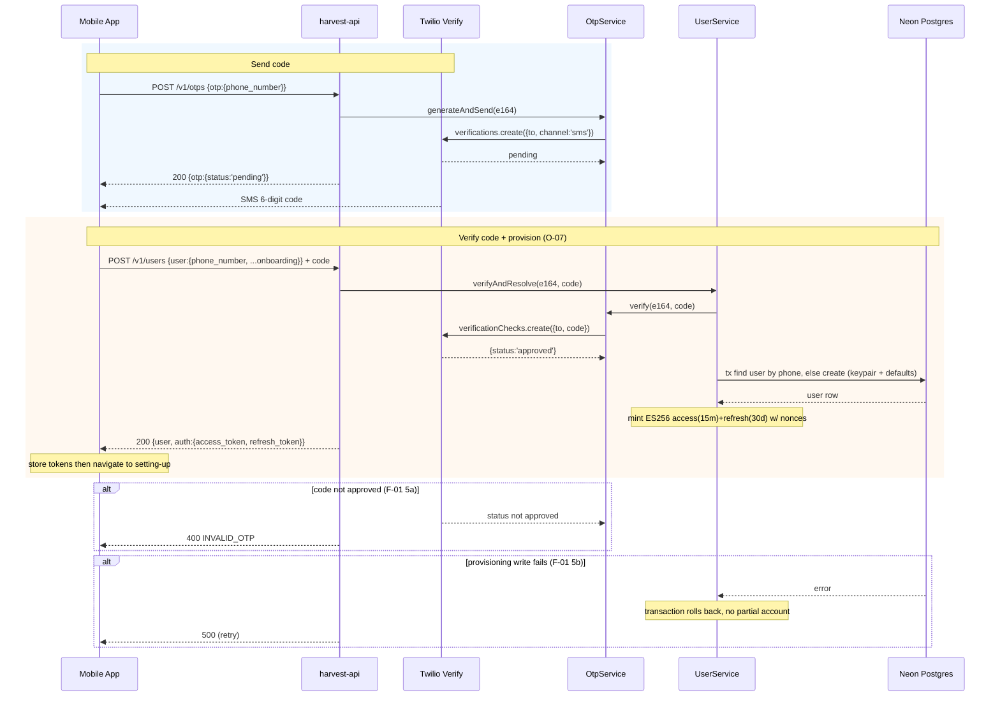
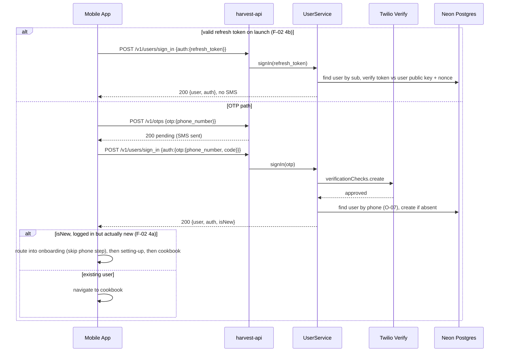
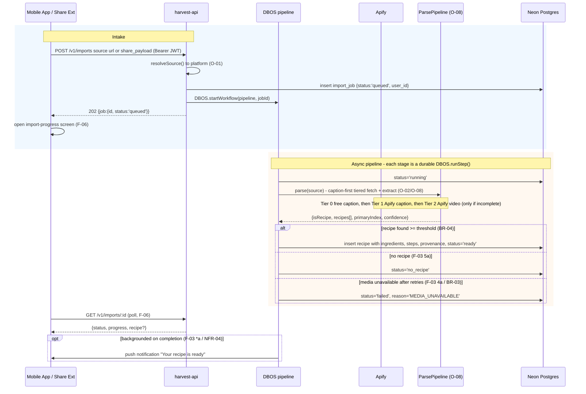
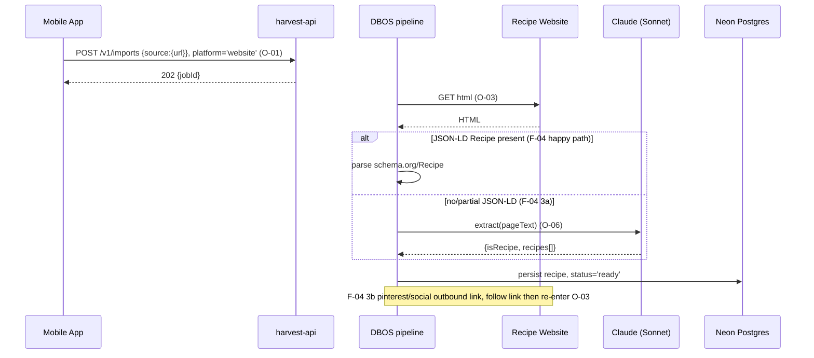
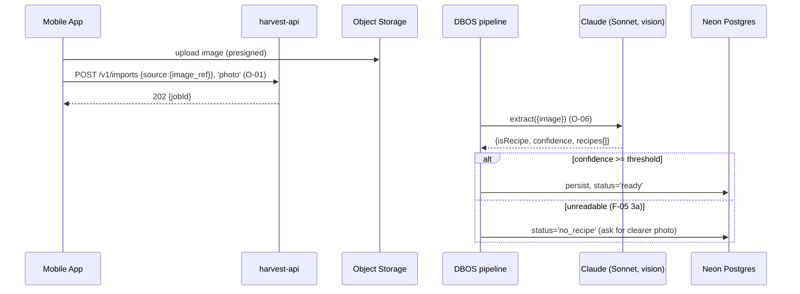
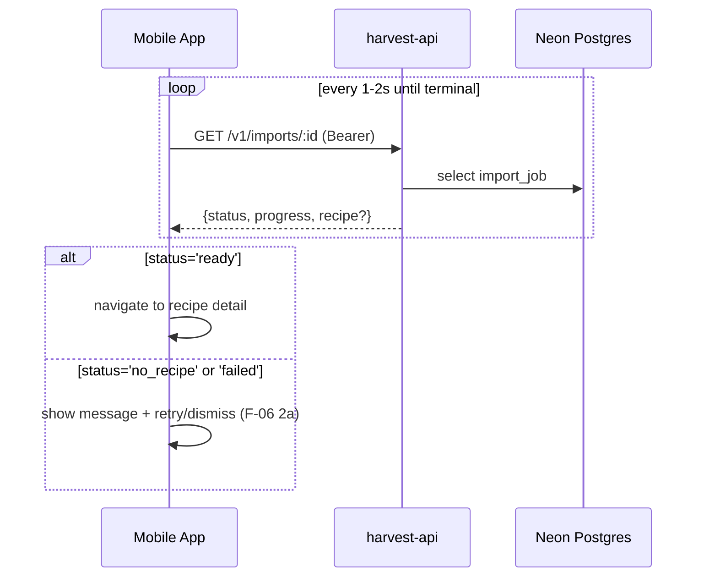
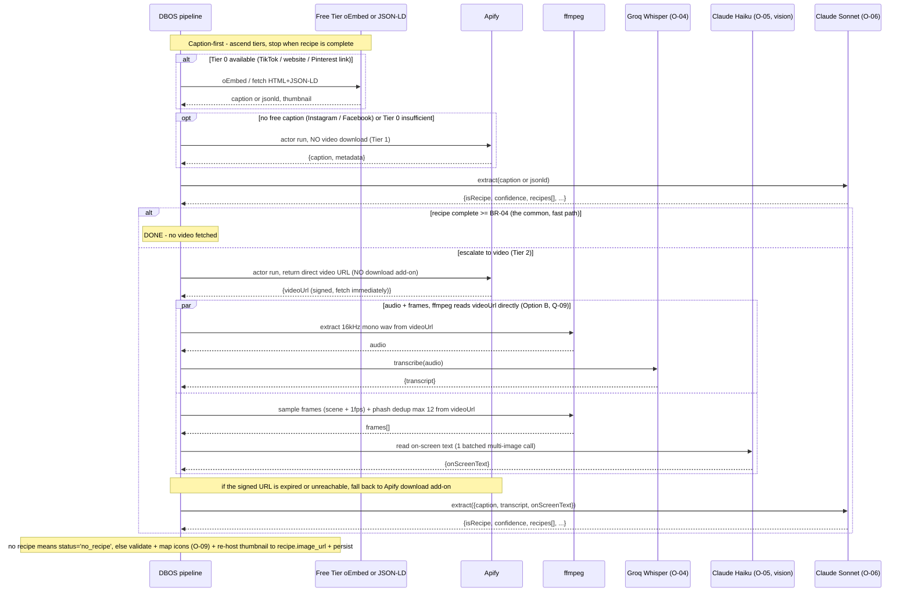
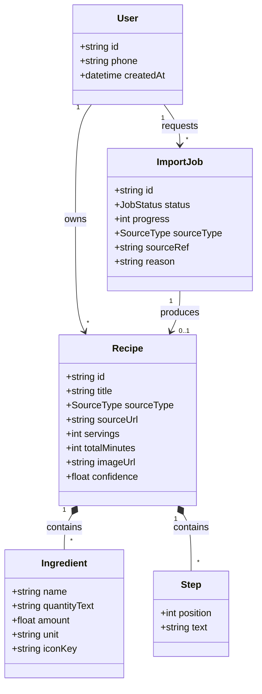
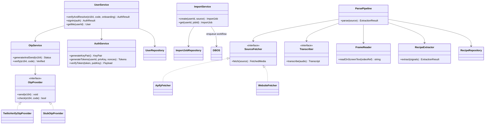
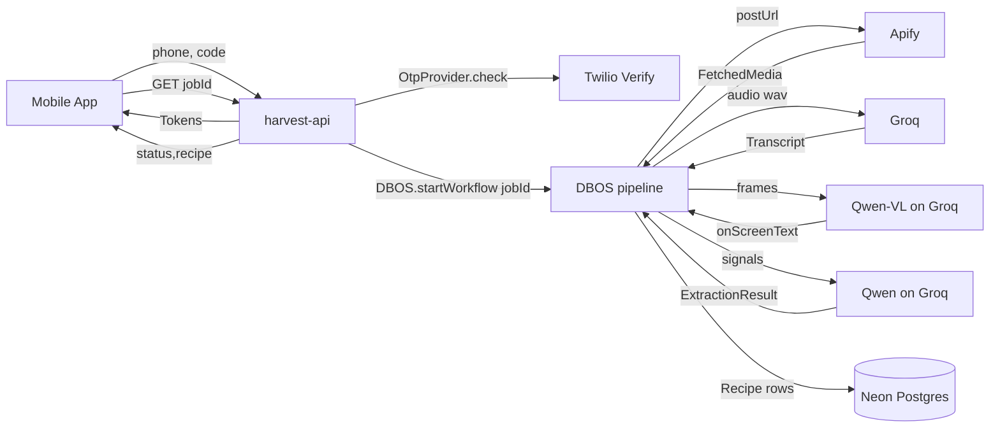

# Reviews

| Reviewer | Status | Feedback |
|---|---|---|
| Jordan | not_started | |

> Traces to `docs/core-use-cases.md`. Every section below references a use case ID (F-xx / O-xx)
> or goal (G-xx). Elements with no referenced use case are speculative and should be cut.

---

# Architecture Overview

Harvest today is a front-end-only Expo prototype (in-memory recipe store, faked imports, no auth).
This design adds a backend and wires the existing screens to it.

- **Mobile app** — the existing Expo/RN app (repo root), plus a new phone-auth onboarding screen, a
  native iOS **Share Extension**, and API-backed replacements for the faked import + in-memory recipe store.
- **Backend** — a single **Fastify** package living in **`server/`** inside this repo, with its own
  `package.json` (independent of the app's — separate deps, TypeScript config, and lockfile). **One process
  for now:** the Fastify server and the DBOS pipeline run in the *same* Node process (`start`) — the API
  handles auth/reads/import-intake and, in-process, DBOS executes the parse workflows off its Postgres queue.
  *No separate worker service yet* (DBOS makes splitting one out later trivial — run a second instance that
  also calls `DBOS.launch()`). Layering follows `phonetastic-server` (controller → service → repository,
  Drizzle, Zod parse at the repo boundary) but **without a DI container — dependencies are wired manually
  via constructor injection in a small composition root** (`server/src/container.ts`).
- **Neon** (serverless Postgres) via **Drizzle** (`pgTable`) — **the single datasource** for all domain
  data (users, recipes, jobs). Schema + migrations live in `server/` (`server/src/db`, `server/drizzle`).
  *This amends requirement #4:* Drizzle is retained; the dialect is Postgres, not libsql/Turso (see Decision).
- **DBOS Transact** — a TypeScript durable-workflow **library** running **in-process** in the same service.
  The pipeline is a workflow of `DBOS.runStep()` steps; `DBOS.startWorkflow(wf, {queueName})` enqueues a run
  and returns a handle, and the same process's DBOS runtime executes it off the **Postgres-backed durable
  queue**. Recovers each workflow "from its last completed step" after a crash. **No separate broker, no
  Redis.** Config via `DBOS.setConfig({ systemDatabaseUrl })` + `DBOS.launch()`.
- **Single-platform persistence:** DBOS keeps its checkpoint/queue bookkeeping in a **DBOS system database
  on the same Neon Postgres** (a separate logical DB/schema it creates and migrates itself). So there is one
  Postgres platform and one connection endpoint holding both our Drizzle app schema and DBOS's system schema
  — no second datastore.
- **Object storage** (S3/R2-compatible bucket) — **persistent re-hosted recipe thumbnails** (the hero image
  shown for each recipe) + transient media staged only during parsing.
- **External:** Twilio Verify (OTP), Apify (per-platform scrapers), Groq (Whisper ASR), Anthropic (Claude).

## Repo layout

```
harvest/                      # Expo app (existing package.json at root)
├─ app/  components/  assets/  # RN screens, incl. new (onboarding)/phone.tsx + share-ext glue
├─ docs/                       # these design docs
└─ server/                     # backend — OWN package.json / tsconfig / lockfile
   ├─ package.json            # scripts: start (Fastify + DBOS.launch in one process), migrate, test
   ├─ drizzle.config.ts       # Drizzle → Neon Postgres (dialect: postgresql)
   ├─ drizzle/                # generated SQL migrations (Postgres domain schema)
   └─ src/
      ├─ index.ts             # entrypoint: build container → DBOS.launch() → Fastify listen
      ├─ container.ts         # composition root — manual constructor wiring (no DI container)
      ├─ api/                 # Fastify app + controllers (DBOS.startWorkflow to enqueue)
      ├─ pipeline/            # DBOS workflow + steps = ParsePipeline (runs in-process)
      ├─ services/ repositories/ providers/
      └─ db/                  # Drizzle schema + client (Neon Postgres)
```

Railway deploys **one service** rooted at `server/` (`start` boots Fastify and `DBOS.launch()` in the same
process). The app and the server are versioned together but built and deployed independently (the app never
bundles `server/`). Splitting the pipeline into its own service later is a config change, not a rewrite.

---

# Use Case Implementations

## Phone Verification & Account Provisioning — Implements F-01



## Returning Sign-In — Implements F-02



## Social Import (end-to-end) — Implements F-03



## Website Import — Implements F-04



## Photo Import — Implements F-05



## Import Progress — Implements F-06



## Parse Pipeline internals — Implements O-08 (with O-01/O-02/O-04/O-05/O-06)



---

# Entities



---

# Tables

All tables are **Neon Postgres via Drizzle `pgTable`**. PKs are `uuid` (default `gen_random_uuid()`,
surrogate). Timestamps are `timestamptz` (default `now()`). Enums use `pgEnum`. JSON is `jsonb`; parsed
amounts are `numeric`. DBOS maintains its **own system schema** on the same Neon instance — it is created
and migrated by `DBOS.launch()`, **not** by our Drizzle migrations, and is omitted here.

> Type mapping from the earlier libsql draft: `text pk` → `uuid pk`; `integer` epoch-ms → `timestamptz`;
> `real` → `numeric`; `text (json)` → `jsonb`.

## users

| Column Name | Type | Constraints | Notes |
|---|---|---|---|
| id | uuid | pk | UUID surrogate PK — never the external identifier (BR-01). |
| phone | text | not null, unique | E.164. **The stable account lookup key** (BR-01). |
| jwt_private_key | text | not null | PEM ECDSA P-256; signs this user's tokens. |
| jwt_public_key | text | not null | PEM; verifies this user's tokens in `authGuard`. |
| access_token_nonce | integer | not null, default 0 | Bump to revoke access tokens. |
| refresh_token_nonce | integer | not null, default 0 | Bump to revoke refresh tokens. |
| onboarding | jsonb | nullable | Answers from goals/age/etc. captured at F-01. |
| created_at | timestamptz | not null, default now() | |

Index: `users_phone_uidx` unique on `(phone)` — powers O-07 lookup and enforces BR-01/BR-05.

## recipes

| Column Name | Type | Constraints | Notes |
|---|---|---|---|
| id | uuid | pk | |
| user_id | uuid | not null, fk → users.id | Owner. |
| title | text | not null | |
| source_type | text | not null | enum: instagram/tiktok/facebook/pinterest/website/photo. |
| source_url | text | nullable | Original URL; null for photo (BR-02). |
| servings | integer | nullable | |
| total_minutes | integer | nullable | Total time in **minutes** (normalized at extraction) — enables range filtering and sort (e.g. "under 30 min"). The app formats it ("1 hr 15 min") at render. |
| image_url | text | nullable | **Our re-hosted copy** of the post thumbnail (or website/JSON-LD image, or the photo) = the recipe's hero image. Remote thumbnail URLs are signed/expiring, so copied to object storage at persist time (BR-07). Null → placeholder art. |
| confidence | numeric | nullable | Extraction confidence at save time. |
| created_at | timestamptz | not null, default now() | |

Index: `recipes_user_idx` on `(user_id, created_at desc)` — powers the cookbook list.

## ingredients

| Column Name | Type | Constraints | Notes |
|---|---|---|---|
| id | uuid | pk | |
| recipe_id | uuid | not null, fk → recipes.id (cascade) | |
| position | integer | not null | Display order. |
| name | text | not null | Normalized; drives icon mapping (O-09). |
| quantity_text | text | nullable | Lossless original ("a pinch"). |
| amount | numeric | nullable | Parsed amount when available. |
| unit | text | nullable | Parsed unit when available. |
| icon_key | text | not null, default 'generic' | Resolved painterly icon (O-09). |

## steps

| Column Name | Type | Constraints | Notes |
|---|---|---|---|
| id | uuid | pk | |
| recipe_id | uuid | not null, fk → recipes.id (cascade) | |
| position | integer | not null | 1-based order. |
| text | text | not null | |

## import_jobs

| Column Name | Type | Constraints | Notes |
|---|---|---|---|
| id | uuid | pk | The `jobId` the app polls (F-06). |
| user_id | uuid | not null, fk → users.id | |
| status | text | not null | enum: queued/running/ready/no_recipe/failed. |
| progress | integer | not null, default 0 | 0–100 for the progress UI. |
| source_type | text | not null | From O-01. |
| source_ref | text | not null | Normalized URL or image ref. |
| recipe_id | uuid | nullable, fk → recipes.id | Set when `ready`. |
| reason | text | nullable | Failure reason code when failed. |
| created_at | timestamptz | not null, default now() | |
| updated_at | timestamptz | not null, default now() | Drives poll freshness / TIMEOUT sweep. |

Index: `import_jobs_user_idx` on `(user_id, created_at desc)`.

---

# Modules





---

# APIs

All app→API requests except the OTP/sign-in endpoints require `authorization: Bearer <access jwt>`,
verified by `authGuard` (decode → load user by `sub` → verify vs `users.jwt_public_key` → require
`type==='access'` and matching nonce).

## Send OTP `POST /v1/otps`

Sends an SMS verification code via Twilio Verify. Implements F-01 step 2 / F-02.

### Request
- Body
    - otp: object
        - phone_number: string (E.164)

### Success Response `200`
- Body
    - otp: object
        - status: string (`pending`)

### Invalid Phone Response `400` / Rate Limited Response `429`
- Body → error: { code: int, message: string } (`OTP_REQUEST_FAILED`)

## Create Account `POST /v1/users`

Verifies the OTP and provisions a new account, returning session tokens. Implements F-01 / O-07.

### Request
- Body
    - user: object
        - phone_number: string (E.164)
        - onboarding: object (optional; questionnaire answers)
        - code: string (OTP)

### Success Response `200`
- Body
    - user: { id: string, phone: string }
    - auth: { access_token: {jwt, expires_at}, refresh_token: {jwt, expires_at} }

### Invalid OTP Response `400` (`INVALID_OTP`) / Provisioning Failed Response `500`

## Sign In `POST /v1/users/sign_in`

Resolves an existing user by OTP or refresh token and returns fresh tokens. Implements F-02 / O-07.

### Request
- Body
    - auth: object (exactly one of)
        - otp: { phone_number: string, code: string }
        - refresh_token: string

### Success Response `200` — `{ user, auth }` (creates the account if the verified number is new, F-02 4a)
### Unauthorized Response `401` (`INVALID_OTP` | `REFRESH_INVALID`)

## Current User `GET /v1/users/me`

Returns the authenticated user and their cookbook summary. Implements G-01/G-02 reads.

### Request — Headers: authorization: `Bearer <jwt>`
### Success Response `200` — `{ user: { id, phone }, recipes: [...] }`
### Unauthorized Response `401`

## Start Import `POST /v1/imports`

Resolves the source, creates an import job, and enqueues it. Implements F-03/F-04/F-05 intake + O-01.

### Request
- Headers: authorization: `Bearer <jwt>`
- Body
    - source: object (exactly one of)
        - url: string (social post or website)
        - share_payload: object (from the Share Extension)
        - image_ref: string (object-storage key for a photo)

### Success Response `202`
- Body → job: { id: string, status: string (`queued`), source_type: string }

### Unsupported Source Response `422` (`UNSUPPORTED` | `UNSUPPORTED_PLATFORM`, F-03 1a/2a)

## Import Status `GET /v1/imports/:id`

Returns current job status for polling. Implements F-06.

### Request — Headers: authorization: `Bearer <jwt>`
### Success Response `200`
- Body → job: { id, status, progress, reason?, recipe? }

### Not Found Response `404` (job not owned by caller)

---

# Testing

## Test Coverage

| Use Case | Type | Unit | Integration | E2E |
|---|---|---|---|---|
| F-01 Verify phone during onboarding | Flow | | x | x |
| F-02 Sign in | Flow | | x | |
| F-03 Social import | Flow | | x | x |
| F-04 Website import | Flow | | x | |
| F-05 Photo import | Flow | | x | |
| F-06 Import progress | Flow | | x | |
| O-01 Resolve source | Op | x | | |
| O-02 Apify fetch | Op | x | x | |
| O-03 Website parse | Op | x | x | |
| O-04 Transcribe | Op | x | | |
| O-05 Frame vision | Op | x | | |
| O-06 Structured extract | Op | x | x | |
| O-07 Verify OTP + resolve user | Op | x | x | |
| O-08 Import job pipeline | Op | | x | |
| O-09 Icon mapping | Op | x | | |

## Test Approach

### Framework & tooling
- **Vitest** is the test runner for the `server/` package (matches `phonetastic-server`'s stack).
  Config in `server/vitest.config.ts`; coverage via `vitest run --coverage` (v8 provider).
- **Two Vitest projects**: `unit` (pure, no DB/network — the default fast suite) and `integration`
  (spins up an ephemeral Postgres, applies Drizzle migrations, boots DBOS). Select with
  `vitest --project unit|integration`.
- **Layout**: co-located `*.test.ts` beside source for units; cross-cutting integration specs under
  `server/tests/`; recorded provider payloads under `server/tests/fixtures/` (one file per fixture in
  `docs/test-fixtures.md`).
- **Provider swap**: tests build the app through the same **composition root** as prod, substituting the
  stub implementations (`StubOtpProvider`, stub `SourceFetcher`/`Transcriber`/`RecipeExtractor`) — no
  module mocking, just constructor wiring. Deterministic, no spend, no network.
- **CI**: `unit` + `integration` run on every PR (`vitest run`); the nightly **live-smoke** suite
  (real Apify/Groq/Qwen on a fixed fixture URL) is gated behind an env flag and excluded from PR CI.
- **Mobile (RN)** tests are out of Vitest scope — the Expo app uses React Native Testing Library for
  component/flow tests and the E2E cases below on a dev build.

### Unit Tests
- **O-01** URL/platform resolution: table-driven over real reel/pin/watch/fb.watch/website/garbage URLs.
- **O-07 / AuthService**: keypair generation, token sign/verify, nonce revocation, expiry — all real crypto,
  no mocks. `OtpService` runs against `StubOtpProvider` (the interface exists precisely for this).
- **O-06 extraction**: golden-input tests with recorded `{caption, transcript, onScreenText}` fixtures →
  assert the wrapper schema, the "not a recipe" path, multi-recipe, and lossless quantity handling. The
  Claude call is stubbed with recorded responses; schema validation runs for real.
- **O-09**: name→icon lookup incl. the generic fallback.

### Integration Tests
- API boundary against a **real ephemeral Postgres** (Testcontainers Postgres, or a per-test Neon branch,
  or PGlite) with migrations applied — exercises controller→service→repository and the O-07 transaction
  (incl. the F-01 5b rollback). DBOS runs against the same test Postgres; the pipeline workflow is driven
  with stubbed step providers to assert short-circuit vs escalation and crash-resume.
- **Twilio Verify, Apify, Groq, Claude are stubbed at the provider interface** (`SourceFetcher`,
  `Transcriber`, `RecipeExtractor`, `OtpProvider`) with recorded fixtures — deterministic, no network,
  no spend. One nightly "live smoke" job may hit real Apify/Groq/Claude on a fixed public post to catch
  upstream drift (behind an env flag; excluded from CI).
- **O-08** pipeline: drive the worker with a fixture `FetchedMedia` and assert short-circuit vs
  escalation branch selection, retry/`MEDIA_UNAVAILABLE`, and `no_recipe`.

### End-to-End Tests
- **F-01** on a dev build (EAS) hitting a staging API with a Twilio **test credential** / magic code:
  onboarding → phone screen → setting-up → cookbook.
- **F-03** happy path with the Share Extension against staging using stubbed upstream providers so the
  run is deterministic; assert a recipe lands in the cookbook.

## Test Infrastructure
- **Provider stubs** for `OtpProvider`, `SourceFetcher`, `Transcriber`, `RecipeExtractor` (fixtures of
  real recorded payloads — build these by capturing one real run per platform).
- **DB factory + seed helpers** (`makeUser`, `makeRecipe`, `makeJob`) and a migrate-fresh-per-test harness.
- **Fixture corpus**: **`docs/test-fixtures.md`** — real public posts pulled via the Apify MCP, bucketed by
  pipeline path (caption-complete, ingredients-only, terse micro-recipe, caption-thin→ASR/VIS, carousel-image
  vision, outbound-link→website, Pinterest image+link, non-recipe/i18n controls). Each row states the expected
  tier + outcome. Record each post's scraped payload once → tests run offline against stubbed providers. This
  is the regression set for O-06 and BR-04/Q-06/Q-11 threshold tuning.

---

# Deployment

## Migrations

| Order | Type | Description | Backwards-Compatible |
|---|---|---|---|
| 1 | infra | Provision Neon Postgres project + object-storage bucket | yes |
| 2 | schema | Drizzle migrations: create `users`, `recipes`, `ingredients`, `steps`, `import_jobs` on Neon | yes (all new) |
| 3 | schema | DBOS system schema — **auto-created/migrated by `DBOS.launch()`** on the same Neon instance; no manual step | yes |
| 4 | infra | Configure Twilio Verify service; set API/worker env (DATABASE_URL, DBOS_SYSTEM_DATABASE_URL, Twilio, Apify, Groq, Anthropic keys) | yes |

No data migration — there is no existing production data (the app ships against an in-memory store today).
No Redis. DBOS's queues + checkpoints live in its Postgres system schema.

## Deploy Sequence
1. Provision Neon; apply Drizzle migrations via the `server` package (`server/` → `npm run migrate`; all
   additive — safe to run before code).
2. Deploy **one Railway service** rooted at **`server/`** (`start` boots Fastify and `DBOS.launch()` in the
   same process; DBOS auto-creates its system schema on first boot). Uses the one Neon Postgres (domain data
   + DBOS state). No Redis, no separate worker.
3. Release the mobile build via EAS. The mobile app requires a **development/production build, not Expo Go**,
   because the Share Extension is native code (config plugin + prebuild). Ship the phone-auth screen and
   API-backed store together.

## Rollback Plan
- **Backend:** Railway keeps prior deploys — roll back the service image. Migrations are additive, so old
  code runs against the new schema unchanged; no schema rollback needed.
- **Mobile:** the app is the risk surface (store review latency). Gate the new API-backed import + phone
  screen behind a remote flag so we can fall back to the current faked/in-memory path without a resubmit
  if the backend is unhealthy (see Q-04).

---

# Monitoring

## Metrics

| Name | Type | Use Case | Description |
|---|---|---|---|
| otp_send_total | counter | F-01/F-02 | OTP sends, tagged result (sent/failed) — watches Twilio health + cost. |
| account_provision_total | counter | G-01 | New accounts created (O-07 create path). |
| auth_verify_fail_total | counter | G-01 | 401s from `authGuard` — spikes signal token/nonce bugs. |
| import_started_total | counter | F-03/F-04/F-05 | Imports started, tagged source_type. |
| import_outcome_total | counter | F-03 | Terminal jobs tagged ready/no_recipe/failed+reason. |
| import_duration_seconds | histogram | NFR-01 | Intake→terminal latency, tagged path (shortcircuit/video); alert on p50/p95 breach. |
| import_shortcircuit_ratio | gauge | NFR-08 | Share of imports served by the caption fast path (cost lever). |
| parse_cost_usd | histogram | NFR-08 | Per-import Apify+ASR+Claude spend. |

## Alerts

| Condition | Threshold | Severity |
|---|---|---|
| import_outcome failed ratio | > 20% over 15m | page |
| import_duration p95 | > 120s over 15m (NFR-01 ceiling) | page |
| otp_send failed ratio | > 10% over 15m | page |
| parse_cost_usd p95 | > $0.15/import over 1h | warn |
| pending workflow runs (backlog) | > 100 for 10m | warn |
| workflow step-retry rate | > 30% over 15m | warn |

## Dashboards
"Imports" — funnel (started → ready), outcome breakdown by source_type + reason, duration percentiles,
short-circuit ratio, per-import cost. "Auth" — OTP send/verify success, account creation, `authGuard` 401s.
Per-workflow run/step timelines, retries, and failures come from **DBOS Conductor/Console** out of the box —
no custom dashboard needed for step-level orchestration health.

## Logging
Structured per job at `info`: `{ jobId, userId, sourceType, platform, path: 'shortcircuit'|'full',
outcome, reason?, durationMs, costUsd }` — one line per terminal job (low cardinality, not in a hot loop).
`warn` on each Apify/Groq/Claude retry with the upstream error. **Never log OTP codes or tokens.**

---

# Decisions

## Phone auth via Twilio Verify + self-owned JWT sessions (not Firebase)

**Framework:** Direct criterion — cost + client simplicity + requirement fit.

Requirement #3 mandates that Harvest owns the users table with the phone number as the stable lookup
key. Firebase Phone Auth is **not free** (SMS is billed per message on Blaze/Identity Platform, with
anti-fraud region policies) and forces client complexity: `@react-native-firebase/auth` native module,
a custom dev client, an APNs key, a reCAPTCHA fallback, and App Check against SMS-pumping — plus a
possible RN 0.81 vs "RN 0.84+" static-linking gap. Twilio Verify runs **server-side**, so the Expo app
needs **no native auth SDK** — it just posts the phone and code to our API. Sessions are our own ES256
JWTs (per-user ECDSA keypair, 15m access / 30d refresh, nonce revocation), mirroring the proven
`phonetastic-server` implementation.

**Choice:** Twilio Verify — it satisfies "own the users table / phone as lookup key" directly, is the
simpler client, and avoids Firebase's non-free SMS and native-module burden.

### Alternatives Considered
- **Firebase Phone Auth:** not free; heavy Expo/iOS native setup; identity split across a second system.
- **Clerk / managed auth:** less code but a second source of truth for identity and vendor lock-in.

### Documentation
- Twilio Verify: https://www.twilio.com/docs/verify/api
- Reference impl: `~/workspace/phonetastic/phonetastic-server` (OtpProvider, AuthService, authGuard).

## Per-platform Apify actors with the durable download add-on

**Framework:** Direct criterion — reliability of "parse ALL videos."

No platform offers an official recipe/video API. Dedicated Apify actors (IG `apify/instagram-reel-scraper`,
TikTok `clockworks/tiktok-video-scraper`, FB `apivault_labs/facebook-reels-video-scraper`, Pinterest
`dltik/pinterest-scraper`) have 94–99.9% success and accept single post URLs. Every scraped media URL is
signed and expires within hours, so we enable each actor's **download add-on** (Apify stores a durable
copy) rather than racing expiry with our own fetch.

**Choice:** per-platform dedicated actors + download add-on. Generic universal downloaders exist but have
single-digit adoption and 50–97% success — too unreliable for a core flow.

### Alternatives Considered
- **Self-hosted yt-dlp:** no per-run vendor cost but we own the anti-bot cat-and-mouse and breakage.
- **oEmbed/official APIs:** ToS-safe but don't return downloadable video → can't satisfy requirement #2.

### Documentation
- Apify Store: https://apify.com/store · TikTok actor: https://apify.com/clockworks/tiktok-video-scraper

## Tiered, caption-first fetch: free/official sources first, Apify as the heavier fallback

**Framework:** Direct criterion — speed + cost + ToS, given most recipes live in the post text.

We fetch in ascending cost/latency, stopping as soon as extraction yields a complete recipe (isRecipe +
ingredients + steps ≥ BR-04). Escalation is gated on **completeness, not merely "caption present."**

| Tier | Source | Platforms | Cost / latency | Returns |
|---|---|---|---|---|
| 0 | **Official / free** — TikTok **oEmbed**; website + Pinterest-outbound-link → HTML + **JSON-LD** | TikTok, website, most Pinterest | **free, <1–2s** | caption/JSON-LD + thumbnail; **no video** |
| 1 | **Apify caption** (actor run, *no* video-download add-on) | **Instagram, Facebook** (no free caption exists), or any post where Tier 0 text was insufficient | ~$0.002, ~10–20s | caption + metadata |
| 2 | **Apify returns direct video URL (no download)** → worker ffmpeg-extracts audio + frames from the URL (Option B) → Groq + Haiku → Sonnet | any post still lacking a complete recipe | ~$0.03–0.08, 10–25s | audio + frames |

**Choice:** try official/free first (TikTok oEmbed, website/Pinterest JSON-LD), then Apify caption for
IG/FB, then Apify video + ASR/vision only when the text is insufficient. This makes the common case (recipe
in the caption) fast and free/near-free, and confines Apify + the heavy pipeline to posts that truly need
video. It is also the most ToS-friendly ordering — oEmbed and JSON-LD are sanctioned mechanisms.

**Asymmetry to accept:** Instagram and Facebook have **no free caption source** — Meta's oEmbed requires an
approved app and returns embed HTML (not caption text), and the Graph API needs post ownership. So IG/FB
always start at Tier 1. No platform offers downloadable video officially, so Tier 2 is always Apify.

### Alternatives Considered
- **Apify for everything (previous design):** simpler one-path fetch, but pays Apify cost + ~10–30s latency
  even for TikTok/website posts whose recipe is one free HTTP GET away.
- **Official APIs only:** free but can't read IG/FB captions or download any video → fails requirement #2.

### Documentation
- TikTok oEmbed: https://developers.tiktok.com/doc/embed-videos · Meta oEmbed (app-gated):
  https://developers.facebook.com/docs/features-reference/oembed · schema.org/Recipe: https://schema.org/Recipe

## Vision-LLM frame reading + Claude extraction (not classical OCR)

**Framework:** Direct criterion — accuracy on stylized social captions.

Many cooking Reels are silent with recipe text baked into stylized/animated overlays — exactly where
Tesseract/EasyOCR degrade. Frontier vision LLMs read decorative fonts, emoji, and layout in one shot and
emit structure directly (no separate OCR→NLP stage). We sample frames (scene-change ∪ 1-FPS floor →
perceptual-hash dedup → cap ~12), batch them into **one Claude Haiku 4.5** call for on-screen text, and
fuse caption + transcript + on-screen text in **one Claude Sonnet 5** call using **native Structured
Outputs** (constrained decoding, schema-valid on the first try) wrapped by AI SDK `generateObject`/Zod.
The wrapper schema `{isRecipe, confidence, recipes[], primaryIndex, reason}` makes "not a recipe" a
first-class decodable outcome (kills hallucinated recipes) and keeps quantities lossless.

**Choice (speed-first, accuracy-guarded).** Speed is the top constraint, so default to **fast flash models
and escalate only when accuracy demands it**:
- **ASR → Groq `whisper-large-v3-turbo`** (fastest option; ~$0.0007/min, sub-second).
- **Extraction (runs on EVERY import, incl. the caption fast path) → Qwen on Groq** (Qwen3-class, LPU
  inference ~hundreds–1000+ tok/s, sub-300ms TTFT) with JSON/structured output. Biggest latency win — it's
  on the hot path.
- **Vision frames (escalation path only) → Qwen-VL on Groq** (same provider for ASR + vision + extraction).
  If the Qwen-VL variant is still preview / not GA on Groq at build time, use a hosted flash VLM (e.g. Gemini
  Flash) as the interim — see Q-11.
- **Accuracy guard:** if the Qwen extraction returns low confidence (< BR-04) or invalid structure,
  **escalate that single import to a heavyweight** (Claude Sonnet / Gemini Pro) and re-extract. Flash-first,
  escalate rarely.

**Qwen on Groq** keeps ASR + vision + extraction on one very fast provider — lowest latency on the common
caption path. All-in ≈ $0.03–0.08/import full path;
**<$0.01 and 2–5s on the caption short-circuit** (flash extraction makes even that faster).

### Alternatives Considered
- **Classical OCR (Tesseract):** fails on stylized overlays; needs a second NLP stage.
- **Gemini 2.5 native video (ingest MP4 directly, audio included):** simplest pipeline and a strong
  fallback, but adds a second model vendor; kept as the escape hatch (see Q-02).
- **All-Claude (Haiku vision + Sonnet extraction) as the default:** higher baseline accuracy but slower and
  pricier than Groq OSS flash on the hot path — retained as the **escalation tier**, not the default.
- **Opus 4.8 for extraction:** highest accuracy, ~5× Sonnet cost; only the top of the escalation ladder.

### Documentation
- Structured outputs: https://platform.claude.com/docs/en/build-with-claude/structured-outputs
- Groq Whisper: https://groq.com/pricing · AI SDK: https://ai-sdk.dev/docs

## Single datastore: Neon serverless Postgres + Drizzle (amends requirement #4)

**Framework:** Direct criterion — one datasource, and a database our durable-execution engine can share.

Requirement #4 originally specified libsql on Drizzle. Adopting a durable-workflow engine forces a choice:
OpenWorkflow (evaluated first) can't run its state on libsql/Turso, which would have meant **two datastores**.
Rather than split storage, we **consolidate on Postgres** and keep **Drizzle** (its Postgres dialect,
`pgTable`). All domain data lives in one **Neon** serverless Postgres, and DBOS stores its workflow state in
a system database on that same Neon instance — a single platform and endpoint.

**Choice:** Neon (serverless Postgres) + Drizzle Postgres dialect. This supersedes the libsql/Turso part of
requirement #4; the ORM choice (Drizzle) is preserved.

### Alternatives Considered
- **libsql/Turso + a separate Postgres for the engine:** honors req #4 literally but creates two datastores —
  the exact thing we're eliminating.
- **Supabase Postgres:** viable serverless Postgres alternative; Neon chosen for scale-to-zero + branching
  (cheap preview/test DBs) and a Neon MCP already in the toolchain. Revisit if we want Supabase's bundled auth/storage.
- **Railway Postgres:** not serverless (always-on billing ≈ $5–8/mo even idle); Neon scales to zero.

### Documentation
- Neon: https://neon.tech/docs · Drizzle + Postgres: https://orm.drizzle.team/docs/get-started-postgresql

## Durable execution: DBOS Transact (in-process, Postgres-backed) + client polling

**Framework:** Direct criterion — multi-step pipeline with retries/short-circuits needs crash-safe resume;
prefer a mature engine that shares our one Postgres.

The pipeline runs as an async DBOS **workflow** (a synchronous HTTP request can't hold it). Each stage is a
`DBOS.runStep(fn, {name})`; the API enqueues with `DBOS.startWorkflow(pipeline, {queueName})` and gets a
handle. DBOS checkpoints step results in its Postgres system DB and "recovers each workflow from its last
completed step" after a crash — real durable per-step state, no re-paying Apify/Groq/Claude for finished
work. It runs **in-process** with **Postgres-backed queues** (no Redis/broker) and ships a Conductor/Console
control plane for run observability.

The client **polls `GET /v1/imports/:id`** every 1–2s (survives app backgrounding; simplest robust mobile
pattern); each step updates `import_jobs.status/progress`, and a push notification covers backgrounded completion.

**Choice:** DBOS Transact (durable, in-process, shares our Neon Postgres) + client polling.

**Note — orchestration, not speed.** DBOS doesn't reduce latency; transform time is dominated by the Apify
scrape + video fetch (see "Latency budget"). Speed comes from the caption-first tiering + partial media.

**Job-state consistency (transactional — important).** Every `import_jobs` status/progress write runs inside
a **DBOS transaction function** (`dataSource.runTransaction()` / `@dataSource.transaction()`), not a plain
Drizzle write. Because our app tables and DBOS's system tables live in the **same Neon Postgres**, that write
commits **atomically with the workflow checkpoint** — the docs: "a single database transaction, atomically
committing both user-defined changes and a DBOS checkpoint." So the row the app polls is never ahead of or
behind the durable workflow state (no dual-write drift; exactly-once). Split of concerns in a workflow:
**external I/O** (Apify, Groq, Claude, ffmpeg) → `DBOS.runStep` (idempotent, at-least-once, retryable);
**`import_jobs` reads/writes** → DBOS transactions (atomic with the checkpoint). Requires
`initializeDBOSSchema()` on the datasource at boot.

### Why DBOS over OpenWorkflow (the engine first evaluated)
- **Single datasource:** DBOS's system DB lives on the **same Neon Postgres** as our data. OpenWorkflow's
  SQLite backend is local-file only (no libsql) and its production backend is a *separate* Postgres → two stores.
- **Maturity:** DBOS Inc. (Postgres/Stonebraker lineage), versioned, multi-language, with a control plane;
  OpenWorkflow's docs state no version/stability/limits.
- Both are in-process, Postgres-queue, TypeScript libraries; DBOS wins on maturity and the single-DB fit.

### Alternatives Considered
- **OpenWorkflow:** good ergonomics but less mature and forced a second datastore (above).
- **Trigger.dev v3 / Inngest / Temporal:** separate platform/service — heavier than an embedded library.
- **BullMQ + hand-rolled step memoization:** needs Redis and reimplements durable steps by hand.
- **Synchronous `/imports`:** impossible within HTTP timeouts. **Client webhooks:** server-to-server only.

### Documentation
- DBOS Transact (TS): https://docs.dbos.dev/typescript/programming-guide · Queues + recovery: https://docs.dbos.dev

## Latency budget: optimize the short-circuit and partial-media fetch, not the engine

**Framework:** Direct criterion — target much faster than the 120s ceiling; the ceiling is worst-case, not typical.

Time is dominated by the third-party fetch, not our compute:

| Path | Dominant cost | Target |
|---|---|---|
| Tier 0 — TikTok oEmbed / website JSON-LD, recipe complete | free HTTP GET + (0–1) Sonnet call | **≤3s, ~free** |
| Tier 1 — IG/FB caption via Apify (no video), recipe complete | Apify caption run | **~10–20s** |
| Tier 2 — social video parse | **Apify video + media fetch** (IG/TikTok ~10–30s; **FB ~20–60s+**); Groq <1s, Haiku/Sonnet a few s, parallel | **10–25s** |
| Worst case (FB + retries) | scraper retries | **120s hard ceiling (failure cutoff, not a target)** |

**Levers (designed in):**
1. **Maximize the short-circuit** — scan caption **and pinned comment/description** for a complete recipe
   before any video work. Most creators put the recipe in text ⇒ most imports hit the ≤5s path.
2. **Partial media, not full download** — we only need the audio track (ASR) + ~12 frames (vision). Pull
   those via ffmpeg over the remote URL (HTTP range / HLS segments) rather than downloading the whole MP4;
   removes the largest variable cost on longer clips.
3. **Optimistic parallelism** — start caption-only extraction while the fetch runs; if the caption yields a
   complete recipe, cancel the video steps.
4. **Parallel ASR ∥ vision** + prompt-cache the Sonnet schema/system prefix.

The Apify step (especially Facebook) is the one cost we don't fully control; hence 120s stays as a failure
ceiling. Perceived latency is further softened by progressive status in the poll + push-on-complete.

---

# Open Questions

| ID | Question | Status | Resolution |
|---|---|---|---|
| Q-01 | Pinterest video pins. | resolved | Live Apify runs (2026-08-02): `videos` scope returned **no pins** (even w/ residential proxy) and the actor exposes **no `video_url`** — only `image_url` + `is_video` + outbound `link`. ⇒ **Treat Pinterest as image + outbound link → website path (F-04); no Pinterest video branch.** Fixtures in `docs/test-fixtures.md`. |
| Q-12 | Instagram media cost: `apify/instagram-scraper` returns `videoUrl`/reel media only on a **paid Apify plan** (free = caption + thumbnail). Confirm the plan/actor + per-import cost for the IG T1/T2 path; the dedicated IG reel-download+transcript actor may be cheaper for video. | open | |
| Q-02 | Do we standardize the video-vision step on Claude Haiku frames, or adopt Gemini 2.5 native video (ingests MP4 + audio in one call) to simplify the pipeline? Depends on real-world accuracy on silent-overlay clips. | open | |
| Q-03 | Store/re-host media? | resolved | **Re-host the thumbnail** to our object storage — it becomes each recipe's hero image (`recipe.image_url`, BR-07). Source thumbnail URLs are signed/expiring, so copy at persist time; never store the remote URL. **Do not persist the source video** (transient parse input only). |
| Q-04 | Phone auth requirement. | resolved | **Mandatory.** Onboarding cannot complete without a verified phone — F-01 gates the `setting-up` screen. No anonymous path, so no local-cookbook merge to design. |
| Q-05 | Changing / reassigning the phone number on an account. | resolved (deferred) | **v1: the phone number on an account is immutable** — no self-service change or re-key flow. Reassignment/porting takeover mitigation also deferred; revisit later. |
| Q-06 | Confidence threshold value for BR-04 — needs tuning against the fixture corpus to balance false "no_recipe" vs. bad saves. | open | |
| Q-07 | Datastore + workflow persistence. | resolved | Consolidated on **one Neon Postgres** — Drizzle `pgTable` for domain data, DBOS system schema on the same instance. Supersedes req #4's libsql (Drizzle retained). No Redis, no second datastore. |
| Q-08 | DBOS + serverless-Postgres (Neon) operational fit: confirm DBOS runs through Neon's pooled endpoint (PgBouncer) or needs a direct/unpooled connection; check whether the constantly-polling engine keeps Neon from scaling to zero and set autosuspend / min-compute (and cost) accordingly. Also confirm DBOS's system DB placement (same Neon project, separate logical DB vs schema). Validate on a spike. | open | |
| Q-09 | Option B (adopted, pending spike): worker ffmpeg-extracts audio + ~12 frames directly from the Apify-returned signed video URL (no download add-on) — expected faster (skips Apify re-host; Groq sub-second). Spike must confirm it is actually faster and that we fetch before the signed URL expires; note progressive MP4s don't cut bandwidth (interleaved audio). Fallback: Apify download add-on. | open | |
| Q-10 | Verify the Tier-0 free caption sources with live checks before building: (a) TikTok oEmbed still returns the full caption in `title` unauthenticated; (b) confirm Instagram/Facebook truly have no free caption-by-URL path (Meta oEmbed app-gating + HTML-only); (c) Pinterest — rely on the outbound link → website path, or is there a usable free pin caption? | open | |
| Q-11 | **Model = Qwen on Groq** (chosen). Remaining: confirm the exact GA variants on Groq at build time (Qwen3-class for text extraction; **Qwen-VL for vision — was preview**, so verify GA or use a Gemini Flash interim), and tune the confidence threshold (ties to BR-04) for escalating an import to a heavyweight (Claude Sonnet / Gemini Pro) on the fixture corpus. Re-check Groq GA/deprecations at build time. | open | |

---

# Appendix A — Changelog

| Date | Author | Change |
|---|---|---|
| 2026-08-02 | System Design | Initial draft |
| 2026-08-02 | System Design | Consolidated per review: Twilio Verify + own JWT (not Firebase); **single Neon serverless Postgres via Drizzle `pgTable`, amending req #4's libsql**; **DBOS Transact** durable execution (replacing OpenWorkflow; no Redis, no second datastore); Fastify backend in `server/`; caption-first, official-API-first tiered fetch (Apify as fallback); tightened latency targets. |
| 2026-08-02 | System Design | Resolved Q-04 (phone auth **mandatory** — gates onboarding, no anonymous path) and Q-05 (phone number **immutable** on an account in v1; change/re-key + reassignment deferred). |
| 2026-08-02 | System Design | Tier-2 media = **Option B** (worker ffmpeg-extracts audio+frames from the Apify direct URL, no download add-on; faster; fallback to add-on). **Single process** (Fastify + DBOS in-process; no separate worker service). **No DI container** (manual composition root). Fixed garbled mermaid (ASCII-only, label cleanups). |
