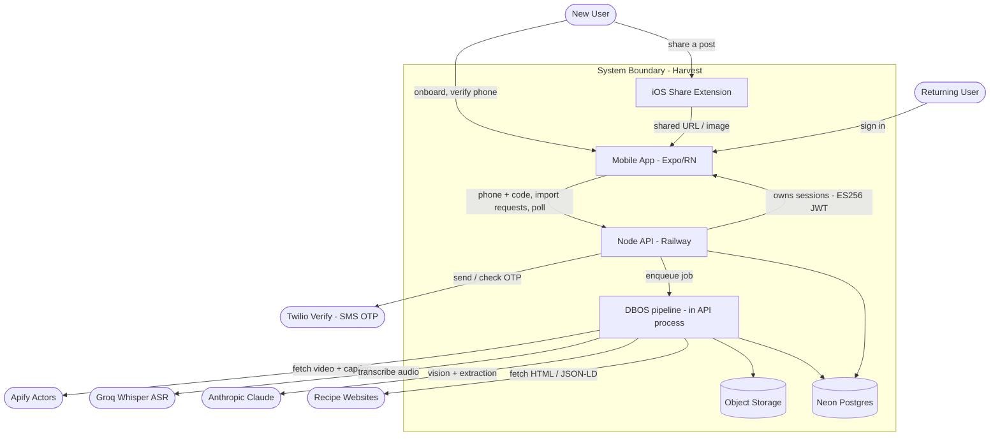

# Use Case Document: Harvest Core — Recipe Capture, Parsing & Phone Identity

---

## Reviews

| Reviewer | Status | Feedback |
|---|---|---|
| Jordan | not_started | |

---

## 1. Scope

This feature turns Harvest from a front-end prototype into a working product with three
capabilities: **(1)** a phone-verified account keyed by phone number, **(2)** recipe capture
from Instagram, Pinterest, TikTok, Facebook, arbitrary websites, and camera-roll photos, and
**(3)** a parsing pipeline that produces a structured recipe from *any* recipe video — even when
the caption carries no ingredients or steps.



> Inside the boundary is in scope. Twilio Verify, Apify, Groq, Claude, and the recipe websites are
> external dependencies this feature relies on but does not own. **The app holds no native auth SDK**
> — it only exchanges the phone number and OTP code with our API, which owns identity and sessions.

---

## 2. Actors

| Actor | Type | Description |
|---|---|---|
| New User | Human | Completing onboarding; wants an account and their first saved recipe. |
| Returning User | Human | Has verified before; wants to reach their cookbook on a new session/device. |
| Twilio Verify | System | Sends the SMS OTP and confirms whether a submitted code is approved. |
| Apify | System | Per-platform scrapers returning a post's video URL + caption + metadata. |
| Groq (Whisper) | System | Speech-to-text over the extracted audio track. |
| Anthropic Claude | System | Vision over sampled frames; structured recipe extraction. |
| Recipe Websites | System | Pages carrying `schema.org/Recipe` JSON-LD or plain recipe HTML. |

---

## 3. Use Case Index

| ID   | Level | Use Case | Primary Actor | Status |
|------|-------|----------|---------------|--------|
| G-01 | Goal  | Establish a stable phone-verified identity | — | Draft |
| G-02 | Goal  | Capture and structure a recipe from any source | — | Draft |
| F-01 | Flow  | Verify phone number during onboarding | New User | Not Started |
| F-02 | Flow  | Sign in on a new session | Returning User | Not Started |
| F-03 | Flow  | Import a recipe from a social post | New/Returning User | Not Started |
| F-04 | Flow  | Import a recipe from a website link | New/Returning User | Not Started |
| F-05 | Flow  | Import a recipe from a photo | New/Returning User | Not Started |
| F-06 | Flow  | Watch import progress and open the finished recipe | New/Returning User | Not Started |
| O-01 | Op    | Resolve import source | — | Not Started |
| O-02 | Op    | Fetch social asset via Apify | — | Not Started |
| O-03 | Op    | Fetch and parse website recipe | — | Not Started |
| O-04 | Op    | Transcribe video audio | — | Not Started |
| O-05 | Op    | Read on-screen text from video frames | — | Not Started |
| O-06 | Op    | Extract structured recipe | — | Not Started |
| O-07 | Op    | Verify OTP and resolve user | — | Not Started |
| O-08 | Op    | Run the import job | — | Not Started |
| O-09 | Op    | Map ingredient text to an icon | — | Not Started |

---

## 4. Use Cases

### G-01: Establish a stable phone-verified identity

**Business Outcome:**
Every account is tied to a verified phone number that stays constant across app reinstalls, new
devices, and database changes, so a user's saved recipes always resolve to the same account and no
account can be created without proving control of a phone number.

**Flows:**
- F-01: Verify phone number during onboarding
- F-02: Sign in on a new session

---

### G-02: Capture and structure a recipe from any source

**Business Outcome:**
Any recipe a user encounters — a Reel, a TikTok, a pin, a Facebook video, a website, or a photo —
can be saved to their cookbook as a complete structured recipe (title, ingredients, steps, servings,
time), including videos whose caption contains no recipe text.

**Flows:**
- F-03: Import a recipe from a social post
- F-04: Import a recipe from a website link
- F-05: Import a recipe from a photo
- F-06: Watch import progress and open the finished recipe

---

### F-01: Verify phone number during onboarding

```
Level:          Flow
Primary Actor:  New User
```

**Jobs to Be Done**

New User:
  When I finish the onboarding questions and I'm about to get my kitchen set up,
  I want to confirm my phone number quickly with a texted code,
  so my recipes are tied to me and I can get them back later without a password.

System:
  Ensure that no account is provisioned until phone ownership is proven, and that the same phone
  number always maps to the same account row regardless of primary-key churn.

**Preconditions**
- The user has reached the end of the questionnaire (the step after `age`, before `setting-up`).
- A Twilio Verify service is configured (see NFR-05).

**Success Guarantee**
- The phone number has been proven via an approved Twilio Verify check.
- A `users` row exists keyed by the E.164 phone number (BR-01), and the app holds a valid
  access + refresh token pair issued by our API.
- The app proceeds to the `setting-up` ("getting ready") screen.

**Main Success Scenario**

| Step | Actor/System | Action |
|------|--------------|--------|
| 1 | New User | Enters phone number and taps "Send code" |
| 2 | System | Calls `POST /v1/otps`; the API asks Twilio Verify to send an SMS to that number |
| 3 | Twilio | Texts a 6-digit code to the phone |
| 4 | New User | Enters the code |
| 5 | System | Calls the verify endpoint; the API checks the code with Twilio and resolves the user (see O-07) |
| 6 | System | Receives the access + refresh tokens, stores them, and navigates to `setting-up` |

**Extensions**

```
1a. Number is malformed / not a valid E.164 number:
    1. System disables "Send code" and shows an inline hint
    → Resume at step 1
    Example: "12" → "Enter a valid phone number" (button stays disabled)

2a. Twilio rejects the send (rate limit, unsupported region, carrier failure):
    1. System shows a non-blocking error with a "Try again" affordance
    2. API logs event OTP_REQUEST_FAILED with the Twilio reason
    → Resume at step 1
    Example: max send attempts reached → "Too many attempts. Try again in a few minutes."

4a. User did not receive the code:
    1. System offers "Resend code", disabled by a cooldown timer (see BR-06)
    → Resume at step 3 on resend
    Example: taps Resend after 30s → new SMS sent, cooldown restarts

5a. Entered code is wrong or expired (Twilio check ≠ approved):
    1. System shows "That code didn't work" and clears the field
    2. After N failures (BR-06) System forces a resend
    → Resume at step 4
    Example: "000000" → check status "pending"/"canceled" → inline error

5b. Verify succeeds but user provisioning fails (DB write error):
    1. API returns a 5xx; no tokens are issued and no partial account persists (O-07 is transactional)
    2. System shows a retry screen
    → Resume at step 5
    Example: Postgres write times out → transaction rolls back, retry offered

5c. Verified number already belongs to an account (returning user came in via "Get started"):
    1. O-07 finds the existing account and signs in — no duplicate (BR-01), no provisioning
    2. System discards the just-entered onboarding answers (existing account is not overwritten)
    → Go straight to the cookbook (skip `setting-up`)
    Example: existing user taps Get started, re-answers questions, verifies their known number → cookbook

*a. User backgrounds or loses connectivity mid-flow:
    1. System preserves the entered number and the "code sent" state locally
    → Resume at the code-entry step on return; no partial account is created
    Example: airplane mode after step 3 → returns to code entry with a "no connection" banner
```

**Constraints**
- NFR-05: Phone verification uses Twilio Verify; codes are never stored by us; sessions are our own ES256 JWTs.
- NFR-06: OTP request → code-entry screen transition within 1.5s p95 (excludes SMS delivery).
- BR-01: Phone number (E.164) is the unique account lookup key; the primary key is a separate surrogate id.
- BR-06: OTP resend cooldown and max-attempts policy.

**Open Questions**
- [x] Phone auth is **mandatory** — onboarding cannot complete without a verified phone; this flow gates
  the `setting-up` screen. No skip / anonymous path.
- [x] Users **cannot** change the phone number on an account in v1 — it is immutable (deferred; see BR-05).

---

### F-02: Sign in on a new session

```
Level:          Flow
Primary Actor:  Returning User
```

**Jobs to Be Done**

Returning User:
  When I open Harvest on a new phone or after reinstalling,
  I want to prove it's me with a texted code,
  so my saved cookbook comes back exactly as I left it.

System:
  Resolve the verified phone number to the existing account row and never create a duplicate account
  for a number that already exists.

**Preconditions**
- A `users` row already exists for this E.164 number (from a prior F-01).

**Success Guarantee**
- The user's existing account is loaded and their saved recipes are visible.
- No new `users` row was created; a fresh access + refresh token pair is issued.

**Main Success Scenario**

| Step | Actor/System | Action |
|------|--------------|--------|
| 1 | Returning User | Taps "Log in" and enters phone number |
| 2 | System | Runs the OTP send + code entry sequence (as F-01 steps 2–4) |
| 3 | System | Calls `POST /v1/users/sign_in` with `{auth:{otp:{phone_number,code}}}` |
| 4 | System | API checks the code, resolves the existing user by phone (see O-07), and returns tokens |
| 5 | System | Navigates to the cookbook |

**Extensions**

```
4a. No user row exists for this verified number (tapped Log in, but actually new):
    1. API creates the account (O-07), issues a session, and returns `isNew: true`
    2. App routes the user into the **onboarding questionnaire** (goals → … → age), **skipping the
       phone-auth screen** since the phone is already verified, then `setting-up` → cookbook
    → Resume in the onboarding flow (post-phone), NOT at step 5
    Example: brand-new number taps Log in → account created → onboarding → setting-up → cookbook

4b. A stored refresh token is still valid (silent re-auth on app launch):
    1. System calls sign_in with `{auth:{refresh_token}}` and skips OTP entirely
    → Resume at step 5 with no SMS sent
    Example: reopened app within 30 days → straight to cookbook

*a. Code check fails:
    → Handled identically to F-01 extension 5a
```

**Constraints**
- BR-01: Phone number is the unique lookup key.

**Open Questions**
- [x] **Two-door entry retained; phone-first rejected (conversion).** For NEW users, phone verification stays
  the **last** step of onboarding (after the questionnaire) — asking up front hurts conversion; once invested
  in onboarding, users convert on the phone ask. "Get started" → onboarding (phone last, F-01); "Log in" →
  phone immediately (returning users expect to authenticate). Wrong-door cases are handled: log-in-but-new →
  onboarding (F-02 4a); get-started-but-existing → detected at the phone step and signed in, not re-onboarded
  (F-01 5c).

---

### F-03: Import a recipe from a social post

```
Level:          Flow
Primary Actor:  New/Returning User
```

**Jobs to Be Done**

User:
  When I find a recipe Reel/TikTok/pin/Facebook video I want to keep,
  I want to send it to Harvest and get a clean ingredients-and-steps recipe,
  so I can actually cook it without scrubbing the video or reading the caption.

System:
  Produce a complete structured recipe from the post regardless of whether the caption contains the
  recipe, or return an explicit "no recipe found" result — never a fabricated recipe.

**Preconditions**
- The user has a verified session (G-01).
- The post is public and on a supported platform (Instagram, TikTok, Facebook, Pinterest).

**Success Guarantee**
- An import job exists and reaches a terminal state (`ready` or `failed`/`no_recipe`).
- On success, a structured recipe is persisted to the user's cookbook with provenance
  (source platform + original URL), and its hero image is a **re-hosted copy of the post thumbnail**
  stored in Harvest object storage (BR-07).

**Main Success Scenario**

| Step | Actor/System | Action |
|------|--------------|--------|
| 1 | User | Shares a post to Harvest (share sheet) or pastes its link in-app |
| 2 | System | Resolves the source and platform (see O-01) and creates an import job |
| 3 | System | Returns a `jobId`; the app opens the import-progress screen (F-06) |
| 4 | System | Worker fetches the caption first — free/official source if available, else Apify (see O-02) |
| 5 | System | Worker extracts from the caption; escalates to video (ASR + vision) only if incomplete (see O-08) |
| 6 | System | Worker persists the recipe and marks the job `ready` |
| 7 | User | Reviews the imported recipe and saves it to a cookbook |

**Extensions**

```
1a. Shared item is not a recognizable post URL (e.g. plain text, a profile link):
    1. System resolves it as unsupported (O-01)
    2. System shows "That doesn't look like a recipe post" with a paste-link retry
    → Flow ends without a job
    Example: shares an IG profile URL → unsupported message

2a. Platform is recognized but not yet supported:
    1. System records UNSUPPORTED_PLATFORM and offers the paste-website path
    → Flow ends; user may retry via F-04
    Example: a YouTube link when YouTube is out of scope → suggests website import

4a. Apify returns no downloadable video (private/removed post, expired media URL):
    1. Worker retries per BR-03; on exhaustion marks the job `failed` with reason MEDIA_UNAVAILABLE
    2. System shows "We couldn't open that post" with a retry
    → Flow ends in failure
    Example: private reel → after 2 retries, MEDIA_UNAVAILABLE

5a. Pipeline finds no recipe in caption, audio, or on-screen text:
    1. Worker marks the job `no_recipe`
    2. System shows "We couldn't find a recipe in this video"
    → Flow ends without a saved recipe
    Example: a travel vlog shared by mistake → no_recipe

5b. Pipeline detects multiple recipes in one post:
    1. Worker returns all of them with a primary (see O-06)
    2. System lets the user pick which to save
    → Resume at step 7
    Example: "3 lunch ideas" reel → user picks one of three

*a. User leaves the progress screen before completion:
    1. Job continues on the server; on completion System sends a push notification (NFR-04)
    → User resumes via F-06 from the notification or the cookbook's "importing" entry
    Example: user locks phone during a 30s parse → push "Your recipe is ready"
```

**Constraints**
- NFR-01: Short-circuit path ≤5s; typical social video 10–25s; 120s hard failure ceiling.
- NFR-02: A recipe is only saved when extraction confidence ≥ threshold (BR-04).
- BR-02: Every saved recipe records its source platform and original URL (provenance).
- BR-03: Media-fetch retry policy for time-limited CDN URLs.
- BR-04: "No recipe" is returned rather than a low-confidence guess.

**Open Questions**
- [ ] Do we store the source video/thumbnail, or only a reference URL? (Copyright + storage cost.)
- [ ] Pinterest video pins: confirm the actor returns a `video_url`; otherwise treat pins as image + outbound-link (route to F-04).

---

### F-04: Import a recipe from a website link

```
Level:          Flow
Primary Actor:  New/Returning User
```

**Jobs to Be Done**

User:
  When I find a recipe on a food blog or site,
  I want to paste the link and get just the recipe,
  so I skip the life-story preamble and ads.

System:
  Prefer the site's structured data; fall back to language-model extraction only when structured data
  is absent or incomplete.

**Preconditions**
- The user has a verified session (G-01).
- The URL is reachable over HTTP(S).

**Success Guarantee**
- A structured recipe is saved, or the job ends `no_recipe`.

**Main Success Scenario**

| Step | Actor/System | Action |
|------|--------------|--------|
| 1 | User | Pastes a website URL (or shares a web page to Harvest) |
| 2 | System | Creates an import job and opens the progress screen |
| 3 | System | Worker fetches the HTML and parses `schema.org/Recipe` JSON-LD (see O-03) |
| 4 | System | Worker normalizes fields and persists the recipe; marks the job `ready` |
| 5 | User | Reviews and saves the recipe |

**Extensions**

```
3a. Page has no JSON-LD Recipe block:
    1. Worker falls back to LLM extraction over the readable page text (O-03 → O-06)
    → Resume at step 4
    Example: an old blog with no structured data → LLM parses the printed recipe card

3b. URL is a Pinterest/social outbound link:
    1. Worker follows `link`/`domain` to the destination site and proceeds as a website import
    → Resume at step 3
    Example: pin → half-baked-harvest.com → parsed as a website

3c. Page is paywalled, 404, or times out:
    1. Worker marks the job `failed` (reason FETCH_FAILED)
    → Flow ends in failure
    Example: 403 from a members-only site → FETCH_FAILED

*a. Fetched page has no recipe content at all:
    → Handled as F-03 extension 5a (no_recipe)
```

**Constraints**
- NFR-03: Website imports with JSON-LD complete within 8s p95.
- BR-02: Provenance recorded (source = original site URL).

**Open Questions**
- [ ] Respect `robots.txt` / rate-limit per-domain fetches?

---

### F-05: Import a recipe from a photo

```
Level:          Flow
Primary Actor:  New/Returning User
```

**Jobs to Be Done**

User:
  When I have a photo of a recipe — a cookbook page, a handwritten card, a screenshot —
  I want to snap or pick it and have Harvest read it,
  so my offline recipes live alongside the ones I save online.

System:
  Read the recipe text from the image with a vision model and structure it, or return `no_recipe`.

**Preconditions**
- The user has a verified session (G-01).
- The user grants photo-library or camera access.

**Success Guarantee**
- A structured recipe is saved, or the job ends `no_recipe`.

**Main Success Scenario**

| Step | Actor/System | Action |
|------|--------------|--------|
| 1 | User | Picks a photo from the camera roll (or takes one) |
| 2 | System | Uploads the image and creates an import job |
| 3 | System | Worker sends the image to Claude vision and extracts a structured recipe (see O-06) |
| 4 | System | Worker persists the recipe; marks the job `ready` |
| 5 | User | Reviews and saves the recipe |

**Extensions**

```
1a. User denies photo/camera permission:
    1. System explains why access is needed and links to Settings
    → Flow ends without a job
    Example: denies access → "Allow photo access to import from your library"

3a. Image is blurry / text unreadable:
    1. Worker returns low confidence; System asks for a clearer photo (BR-04)
    → Resume at step 1
    Example: dark photo of a card → "We couldn't read that — try a clearer, well-lit photo"

3b. Image contains no recipe (a plated-food photo, a selfie):
    → Handled as F-03 extension 5a (no_recipe)
```

**Constraints**
- NFR-02: Save only above the confidence threshold (BR-04).
- BR-02: Provenance recorded (source = "Photo").

**Open Questions**
- [ ] Support multi-photo imports (a recipe spanning two cookbook pages)?

---

### F-06: Watch import progress and open the finished recipe

```
Level:          Flow
Primary Actor:  New/Returning User
```

**Jobs to Be Done**

User:
  When I've sent something to Harvest to import,
  I want to see that it's working and be taken to the result,
  so I trust it didn't silently fail and I don't have to wait staring at a spinner.

System:
  Report accurate job status and deliver the user to the finished recipe or a clear failure state,
  even if the app was backgrounded.

**Preconditions**
- An import job exists with a `jobId` (from F-03/F-04/F-05).

**Success Guarantee**
- The user reaches the finished recipe, a "no recipe" state, or a retryable failure state.

**Main Success Scenario**

| Step | Actor/System | Action |
|------|--------------|--------|
| 1 | System | Shows the golden-hour "Importing your recipe" loader |
| 2 | System | Polls `GET /imports/:id` every 1–2s for `{ status, progress }` (see O-08) |
| 3 | System | On `ready`, navigates to the recipe detail |
| 4 | User | Reviews and saves the recipe |

**Extensions**

```
2a. Status is `failed` / `no_recipe`:
    1. System shows the matching message with retry / dismiss
    → Flow ends
    Example: MEDIA_UNAVAILABLE → "We couldn't open that post. Try again?"

*a. Polling loses connectivity:
    1. System shows an offline banner and backs off; resumes polling on reconnect
    → Resume at step 2; the job is unaffected
    Example: subway dead zone → banner, then auto-resume

*b. Job exceeds the max duration (NFR-01 ceiling):
    1. Worker marks it `failed` (reason TIMEOUT); System offers retry
    → Flow ends
    Example: a stuck Apify run at 120s → TIMEOUT
```

**Constraints**
- NFR-04: On completion while backgrounded, send a push notification.
- NFR-07: Poll responses return in < 300ms p95.

**Open Questions**
- [ ] Show granular step labels ("reading the video…", "writing the recipe…") or a single indeterminate loader?

---

### O-01: Resolve import source

Receives a share-sheet payload, a pasted string, or a picked photo reference.

Classifies the input into a source type and, for URLs, a platform: `instagram`, `tiktok`,
`facebook`, `pinterest`, `website`, `photo`, or `unsupported`. Normalizes the URL (strips tracking
params, expands short links such as `fb.watch`).

Returns `{ sourceType, platform, normalizedUrl | imageRef }`.

Failure cases:
- If the string is not a URL and not an image, returns `unsupported`.
- If the URL host matches no known platform and is not a plain web page, returns `unsupported`.

Called by:
- F-03 at step 2
- F-04 at step 1 (website branch)
- F-05 at step 2 (photo branch)

---

### O-02: Fetch post content (tiered: official/free → Apify)

Receives a platform + normalized post URL, plus a flag for whether video media is required.

Fetches in ascending cost, **caption-first**:
- **Tier 0 (free/official):** TikTok → oEmbed (`title` = caption, `thumbnail_url`); Pinterest → its
  outbound link routed to O-03 (website). Returns `{ caption, thumbnailUrl }`, no video.
- **Tier 1 (Apify caption):** for Instagram/Facebook (no free caption exists) or when Tier 0 text was
  insufficient — runs the platform actor **without** the video-download add-on. Returns
  `{ caption, thumbnailUrl, author, durationSeconds }`. (`thumbnailUrl` is signed/expiring → re-hosted
  to object storage at persist time as the recipe hero image, BR-07.)
- **Tier 2 (Apify video):** only when a recipe still can't be completed — returns the **direct video URL**
  (no download add-on); the worker immediately ffmpeg-extracts audio + frames from it (Option B, faster).
  Falls back to the Apify download add-on if the signed URL is expired/unreachable.

Actors: Instagram `apify/instagram-reel-scraper`; TikTok `clockworks/tiktok-video-scraper`; Facebook
`apivault_labs/facebook-reels-video-scraper`; Pinterest `dltik/pinterest-scraper`.

Failure cases:
- If an actor run errors or yields no items, returns MEDIA_UNAVAILABLE after BR-03 retries.
- If only a time-limited URL is returned and the download add-on failed, the worker re-hosts the MP4
  immediately; if that also fails, returns MEDIA_UNAVAILABLE.
- If a Pinterest result is an image pin with an `outboundLink`, returns a redirect-to-website signal.

Called by:
- F-03 at step 4 (Tier 0/1 for caption; Tier 2 only on escalation)

---

### O-03: Fetch and parse website recipe

Receives a website URL.

Fetches the HTML server-side and parses `schema.org/Recipe` JSON-LD into the recipe schema. When no
JSON-LD Recipe block is present or it is incomplete, extracts the main readable text and passes it to
O-06 for LLM extraction.

Returns a structured recipe (or a `no_recipe` signal from O-06).

Failure cases:
- If the fetch returns non-2xx or times out, returns FETCH_FAILED.
- If JSON-LD is malformed, falls through to the LLM path rather than failing.

Called by:
- F-04 at step 3

---

### O-04: Transcribe video audio

Receives a video reference.

Extracts a 16 kHz mono audio track with ffmpeg (`-vn -ac 1 -ar 16000`), streamed **directly from the
source video URL** (no full download — Option B), and sends it to Groq `whisper-large-v3-turbo`,
requesting word-level timestamps.

Returns `{ transcript, segments[] }`, or an empty transcript when the track is silent/music-only.

Failure cases:
- If the video has no audio stream, returns an empty transcript (not an error) so the pipeline
  continues to on-screen text.
- If the ASR call fails after retry, returns an empty transcript and flags `asrDegraded` so extraction
  can still proceed from caption + frames.

Called by:
- O-08 (parse pipeline)

---

### O-05: Read on-screen text from video frames

Receives a video reference.

Samples frames using the union of ffmpeg scene-change detection and a 1-FPS floor, deduplicates with
a perceptual hash (drop when Hamming distance < ~8), caps at ~12 frames, and sends them as one batched
multi-image call to **Qwen-VL on Groq** (fallback: a hosted flash VLM if the Qwen-VL variant is not GA)
prompting for verbatim on-screen text.

Returns `{ onScreenText }` (may be empty).

Failure cases:
- If frame extraction fails, returns empty on-screen text and flags `visionDegraded`.
- If the vision call fails after retry, returns empty on-screen text; extraction proceeds from the
  other signals.

Called by:
- O-08 (parse pipeline)

---

### O-06: Extract structured recipe

Receives any non-empty subset of `{ caption, transcript, onScreenText, pageText, image }`.

Calls **Qwen on Groq** (JSON/structured output) with a schema that wraps the result as
`{ isRecipe, confidence, recipes: Recipe[], primaryIndex, reason }`. On low confidence (< BR-04) or invalid
structure it **escalates that import to a heavyweight** (Claude Sonnet / Gemini Pro) and re-extracts.
Ingredient quantities are kept as lossless free text plus an optional parsed `{ amount, unit }`; total time
is normalized to **integer minutes** (`total_minutes`). Fuses all provided signals; prefers the caption/JSON-LD
when it is already complete.

Returns the wrapper object. App code validates numeric ranges the schema cannot constrain.

Failure cases:
- If `isRecipe` is false or `confidence` < BR-04 threshold, the caller marks the job `no_recipe`.
- If the model output fails schema validation (rare with constrained decoding), the SDK repairs/retries
  once; a second failure marks the job `failed` (reason EXTRACTION_FAILED).

Called by:
- O-03 (website LLM fallback)
- O-08 (parse pipeline)
- F-05 at step 3 (photo)

---

### O-07: Verify OTP and resolve user

Receives an E.164 phone number and a submitted OTP code.

Checks the code with Twilio Verify (`verificationChecks` → `approved`). On approval, finds the `users`
row for that phone number, or creates one in a single transaction (generating the user's ECDSA keypair
and provisioning defaults) — keyed by phone number (BR-01). Then mints an ES256 access token (15m) and
refresh token (30d) signed with the user's private key and carrying the current nonces.

Returns `{ userId, isNew, access_token, refresh_token }`.

Failure cases:
- If Twilio reports the code is not approved, returns 400 INVALID_OTP.
- If account provisioning fails, the transaction rolls back and returns 500 (no partial account).
- On the refresh-token path (F-02 4b), if the token is invalid/expired or its nonce is stale, returns
  401 and the client falls back to OTP.

Called by:
- F-01 at step 5
- F-02 at step 4

---

### O-08: Run the import job

Receives a resolved source (from O-01) and the owning `userId`.

Orchestrates the pipeline as durable, retryable steps: fetch (O-02/O-03) → **short-circuit check** (if
caption/JSON-LD already yields ingredients + steps, go straight to O-06 on text alone) → else
O-04 (audio) and O-05 (frames) → O-06 (fuse + extract) → map icons (O-09) → persist. Updates job
`status`/`progress` at each step for polling (F-06).

Returns the terminal job record `{ status, recipeId?, reason? }`.

Failure cases:
- Propagates MEDIA_UNAVAILABLE, FETCH_FAILED, EXTRACTION_FAILED, TIMEOUT to the job record.
- If any single step exhausts retries, the job is `failed` with that step's reason.

Called by:
- F-03 at step 5, F-04 at step 2, F-05 at step 2 (as the job runner)

---

### O-09: Map ingredient text to an icon

Receives an ingredient's normalized name.

Matches it against the painterly ingredient-icon set (keyword/synonym lookup), returning the best icon
or a generic fallback icon when nothing matches. Keeps imported recipes visually consistent with the
seeded samples.

Returns an icon reference.

Failure cases:
- If no match, returns the generic ingredient icon (never fails the import).

Called by:
- O-08 (persist step)

---

## 5. Appendix A — Non-Functional Requirements

| ID | Category | Constraint |
|----|----------|------------|
| NFR-01 | Latency | Import shall reach a terminal job state within: ≤5s for the caption/pinned-comment or JSON-LD short-circuit path; 10–25s typical for a social video parse; 120s hard ceiling (failure cutoff, worst-case Facebook + retries — not a target). |
| NFR-02 | Correctness | The system shall save a recipe only when extraction confidence ≥ the BR-04 threshold; otherwise it returns `no_recipe`. |
| NFR-03 | Latency | When a website with JSON-LD is imported, the system shall complete within 8s p95. |
| NFR-04 | Availability | When an import completes while the app is backgrounded, the system shall deliver a push notification. |
| NFR-05 | Security | Phone verification shall use Twilio Verify; OTP codes are never persisted by Harvest. Sessions shall be our own ES256 JWTs (per-user keypair, nonce-revocable), verified on every authenticated request. |
| NFR-06 | Latency | The OTP request → code-entry transition shall complete within 1.5s p95 (excludes carrier SMS delivery). |
| NFR-07 | Latency | Import status polls shall respond within 300ms p95. |
| NFR-08 | Cost | Median per-import model + scrape cost shall stay under ~$0.10; the caption short-circuit shall be preferred whenever sufficient. |

---

## 6. Appendix B — Business Rules

| ID | Rule |
|----|------|
| BR-01 | An account's stable lookup key is its E.164 phone number (unique, not null); the database primary key is a separate surrogate id and is never used as the external identifier. |
| BR-02 | Every saved recipe records provenance: source type (instagram/tiktok/facebook/pinterest/website/photo) and the original URL or "Photo". |
| BR-03 | Scraped media URLs are time-limited and fetched immediately. For ASR/vision media the worker prefers **self-extraction of audio + frames from the direct URL** (Option B); if the URL is expired/unreachable it falls back to the actor's download add-on. Media fetch retries up to 2 times. |
| BR-04 | The pipeline returns `no_recipe` rather than a low-confidence recipe; confidence threshold is configurable and defaults conservatively. |
| BR-05 | A phone number maps to at most one account and is **immutable on that account in v1** — no self-service change or re-key flow. Number reassignment/porting takeover handling is deferred. |
| BR-06 | OTP resend is gated by a cooldown (≥30s) and sign-in is locked after a bounded number of failed code attempts. |
| BR-07 | Each recipe's hero image is a **re-hosted copy** of the source thumbnail (or website/JSON-LD image, or the imported photo) stored in Harvest object storage. Signed/expiring remote thumbnail and media URLs are never stored as the durable image reference. Source videos are not persisted beyond parsing. |

---

## 7. Appendix C — Data Dictionary

| Field | Type | Constraints | Notes |
|-------|------|-------------|-------|
| user.id | text (uuid) | PK, not null | Surrogate primary key; never exposed as the identity key. |
| user.phone | text | unique, not null, E.164 | The stable account lookup key (BR-01). |
| user.created_at | timestamptz | not null | |
| recipe.id | text (uuid) | PK, not null | |
| recipe.user_id | text | FK → user.id, not null | Owner. |
| recipe.title | text | not null | |
| recipe.source_type | text (enum) | not null | instagram / tiktok / facebook / pinterest / website / photo. |
| recipe.source_url | text | nullable | Original URL; null for photo imports. |
| recipe.servings | integer | nullable | |
| recipe.total_minutes | integer | nullable | Total time in **minutes** (normalized at extraction) — filterable/sortable; app formats for display. |
| recipe.image_url | text | nullable | Re-hosted post thumbnail in Harvest object storage = hero image; remote thumbnail URLs expire, so copied at persist (BR-07). Null → placeholder art. |
| ingredient.recipe_id | text | FK → recipe.id, not null | |
| ingredient.name | text | not null | Normalized name; drives icon mapping (O-09). |
| ingredient.quantity_text | text | nullable | Lossless original ("a pinch"). |
| ingredient.amount | real | nullable | Parsed amount when available. |
| ingredient.unit | text | nullable | Parsed unit when available. |
| step.recipe_id | text | FK → recipe.id, not null | |
| step.position | integer | not null | 1-based order. |
| step.text | text | not null | |
| import_job.id | text (uuid) | PK, not null | The `jobId` the app polls. |
| import_job.user_id | text | FK → user.id, not null | |
| import_job.status | text (enum) | not null | queued / running / ready / no_recipe / failed. |
| import_job.reason | text | nullable | Failure reason code when terminal-failed. |
| import_job.recipe_id | text | FK → recipe.id, nullable | Set when `ready`. |

---

## Appendix D — Changelog

| Date | Author | Change |
|------|--------|--------|
| 2026-08-02 | System Design | Initial draft |
| 2026-08-02 | System Design | Twilio Verify OTP (not Firebase); single Neon Postgres (amends req #4 libsql); DBOS durable execution; caption-first tiered fetch (official APIs → Apify); tightened latency NFR. |
| 2026-08-02 | System Design | Resolved: phone auth mandatory; phone number immutable (v1); re-host thumbnail as recipe hero (BR-07); **two-door entry retained, phone-first rejected — phone is the last onboarding step for new users (conversion)**; F-02 4a (log-in-but-new → onboarding), F-01 5c (get-started-but-existing → sign in). |
