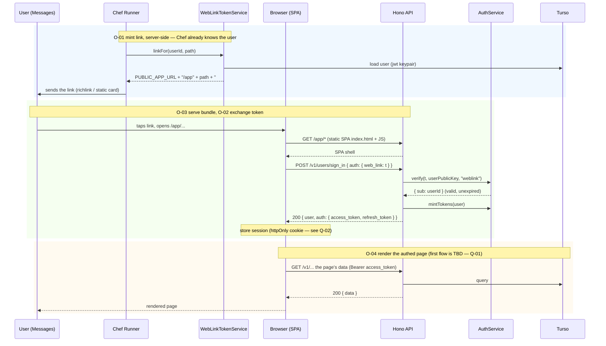
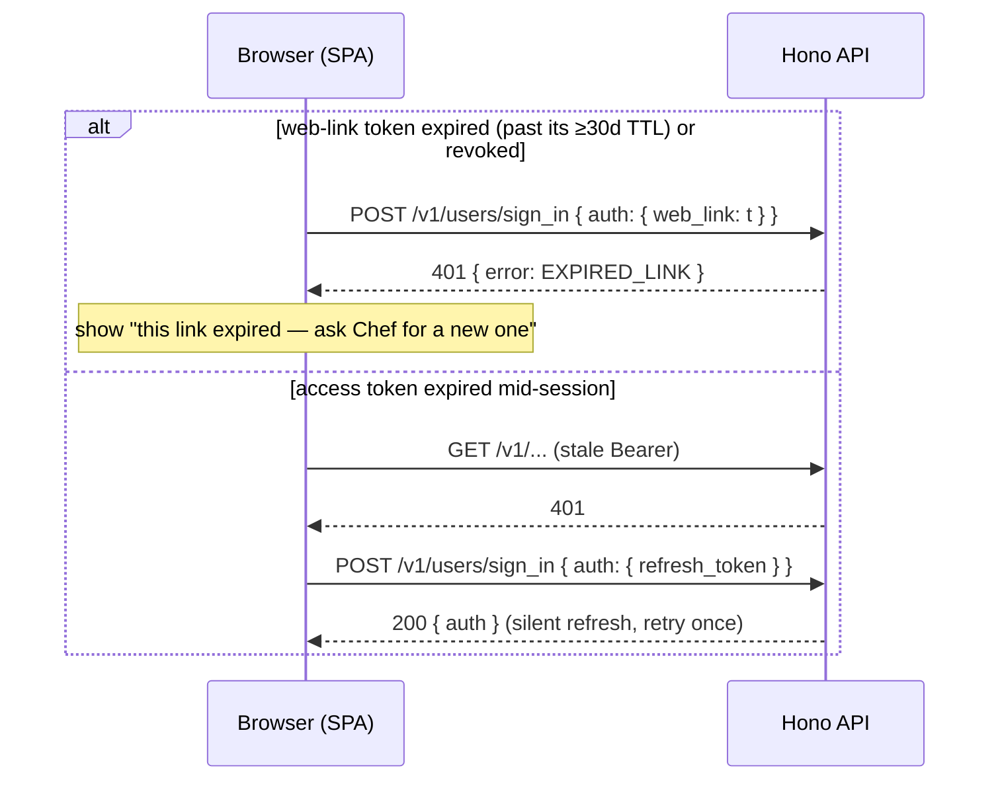
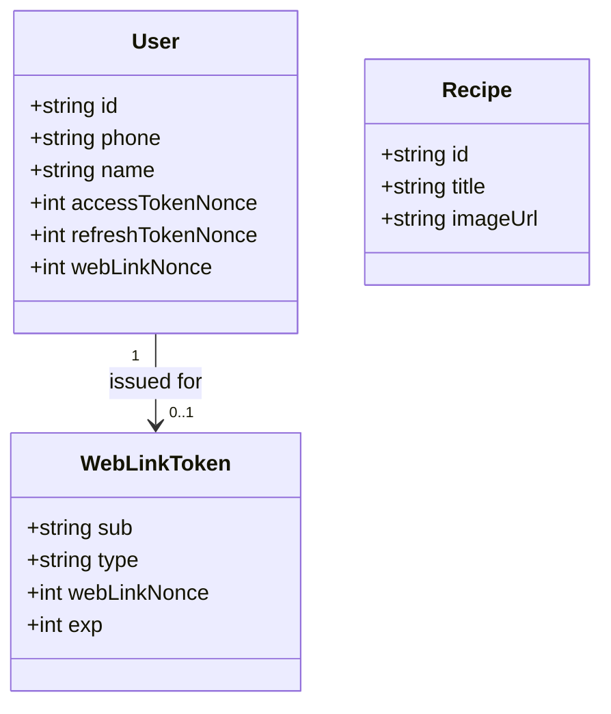
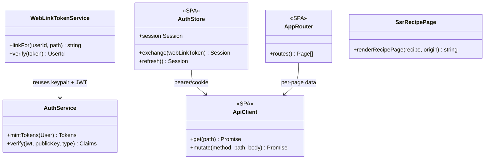
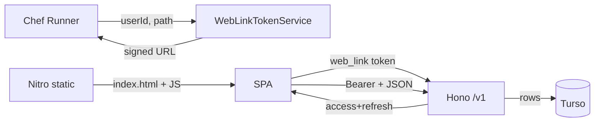

# Harvest Web — Design

Chef (the iMessage agent) is great at conversation but poor at anything spatial or list-heavy:
editing a recipe's steps, browsing a library, tuning preferences. This design adds
a **React web app, served by the existing Nitro server**, that Chef links to for those flows. The
user taps a link in Messages and lands in a signed-in web UI backed by the API the mobile app
already uses.

Scope of this document is the **foundation only** — serve a React app from the server, authenticate a
user who arrives from an iMessage link, and reuse the `/v1` API and design tokens. **No specific
interactive flow is specified yet**; the first one is **Q-01**. This document stands up the platform
those flows will plug into. The public SSR recipe page (`GET /r/:id`, already shipped) is the anchor
for link previews and is folded into this model.

---

# Reviews

| Reviewer | Status | Feedback |
|---|---|---|
| Jordan | not_started | |

---

# Use Cases Covered

This design has no separate use-case document yet; the Flows and Operations it implements are listed
here so every design element traces to one. The exact first feature set beyond the foundation is
**Q-01**.

| ID | Type | Name |
|---|---|---|
| F-01 | Flow | Open an authenticated web link from Chef (into the app shell) |
| F-04 | Flow | View a recipe (public, shareable) — *shipped* |
| O-01 | Operation | Mint a web-link token for a known user |
| O-02 | Operation | Exchange a web-link token for a session |
| O-03 | Operation | Serve the SPA bundle |
| O-04 | Operation | Authenticated API call from the SPA |

---

# Use Case Implementations

## Open an Authenticated Web Link — Implements F-01

**Extensions**

F-04 (view a recipe) is the shipped `GET /r/:id` SSR page; see the recipe-card design and
`server/src/recipe-page.tsx`. No new diagram.

---

# Entities

The web app introduces no new domain entities except the **WebLinkToken** (a signed credential, not
a stored row — see Tables). Everything else is the existing domain it reads and writes.

---

# Tables

No new tables. The web-link credential is a stateless signed JWT verified against the user's existing
keypair. It is **reusable until its TTL (≥30 days)** — the same link works every time the user taps
that message — with a nonce on the `users` row as the revocation lever (mirrors `access_token_nonce`
/ `refresh_token_nonce`).

## Changes to `users` (defined in the base schema, `server/src/schema.ts`)

| Column Name | Type | Constraints | Notes |
|---|---|---|---|
| web_link_nonce | int | not null, default 0 | A web-link token is valid only if its `webLinkNonce` claim matches this. Bumping it revokes every outstanding link for the user (e.g. on account changes) without a per-token store. |

The SPA build is static files, not data. See Deployment for where the bundle lives.

---

# Modules

**Split of responsibility**

- **Server (new):** `WebLinkTokenService` (mint/verify the magic-link grant); a `web_link` arm added
  to the `sign_in` handler; Nitro serves the built SPA under `/app/*`.
- **Server (reused):** the entire `/v1` API, `AuthService`, repositories.
- **SPA (new):** `ApiClient`, `AuthStore`, `AppRouter`, and the app shell. Feature pages arrive with
  the first flow (Q-01); this design ships the shell + auth, not a feature page. Built with Vite;
  output copied to `server/public/app`.

---

# APIs

Only the **new / changed** contract is specified — the auth handoff and serving the shell. Feature
pages will consume existing `/v1` endpoints unchanged once the first flow is chosen (Q-01); this
design changes no `/v1` endpoint. See the base API in `server/src/index.ts`.

## Exchange Web-Link Token `POST /v1/users/sign_in`

Extends the existing sign-in with a third grant. Exactly one of `otp`, `refresh_token`, `web_link`.

### Request

- Headers
    - content-type: `application/json`
- Body
    - auth: object
        - web_link: string  (the long-lived, ≥30-day ES256 `weblink` JWT from the link fragment)

### Success Response `200`

- Headers
    - content-type: `application/json`
    - set-cookie: `hv_session=<refresh>; HttpOnly; Secure; SameSite=Lax` *(if cookie session — Q-02)*
- Body
    - user: object
    - auth: object
        - access_token: string
        - refresh_token: string

### Expired or Used Link Response `401`

- Headers
    - content-type: `application/json`
- Body
    - error: object
        - code: string  (`EXPIRED_LINK`)
        - message: string

## Serve the SPA `GET /app/*`

Static: Nitro returns the built SPA `index.html` (and hashed JS/CSS assets) from `public/app`. Deep
links (any `/app/*` route) fall back to `index.html` so client routing resolves. No auth at this layer
— the shell is public; data behind it requires a session.

---

# Testing

## Test Coverage

| Use Case | Type | Unit | Integration | E2E |
|---|---|---|---|---|
| F-01 Open authed web link | Flow | | x | x |
| O-01 Mint web-link token | Op | x | | |
| O-02 Exchange token for session | Op | x | x | |
| O-03 Serve SPA bundle | Op | | x | |
| O-04 Authed API call | Op | | x | |

## Test Approach

### Unit Tests
- `WebLinkTokenService.linkFor`/`verify` in isolation against a generated keypair: valid token
  round-trips; wrong type, expired `exp`, and stale `webLinkNonce` each reject. Mirrors the existing
  `AuthService` unit tests; no DB.

### Integration Tests
- Extend `test/` (Vitest + migrated file DB, the existing harness): `POST /v1/users/sign_in` with a
  minted `web_link` returns a session; an expired/revoked token returns `401 EXPIRED_LINK`. Reuse the
  auth/user seeding already in `import-notify.test.ts`.
- `GET /app/` serves `index.html`; an arbitrary `GET /app/anything` falls back to it.

### End-to-End Tests
- One Playwright flow against `nitro dev`: hit `/app/#t=<token>` (token minted by a test helper),
  assert the shell loads **already authenticated** — the SPA exchanges the token and a subsequent
  `GET /v1/users/me` with the stored session returns the right user. This proves the iMessage→web
  handoff end-to-end without a feature page. Gated behind the same offline stubs the server e2e suite
  uses; no network.

## Test Infrastructure
- A `mintWebLink(user, path)` test helper (wraps `WebLinkTokenService`) so tests don't hand-roll JWTs.
- A Vite build step in CI before the Playwright run; skip if `public/app` is prebuilt.

---

# Deployment

## Migrations

| Order | Type | Description | Backwards-Compatible |
|---|---|---|---|
| 1 | schema | Add `users.web_link_nonce int not null default 0` | yes (additive; old code ignores it) |

## Deploy Sequence
1. Migrate (additive column).
2. Deploy server with the `web_link` grant + `WebLinkTokenService` + the built SPA under `public/app`.
3. Set `PUBLIC_APP_URL` to the deployed origin (already used by the recipe card).

The SPA build (`vite build`) runs in the server build and its output lands in `public/app`, shipping
in the same Nitro artifact — no second deployment. "Served by the server," as asked.

## Rollback Plan
Roll back the code; the additive column is inert without it. No data migration to reverse. During a
rollback the `web_link` grant disappears, so outstanding links fail closed (`401`) until the code
redeploys. Because links are long-lived (≥30d), that is a user-visible outage of the handoff for the
rollback window — the recipe card's plain rich-link fallback still works, and Chef can resend once
redeployed.

---

# Monitoring

## Metrics

| Name | Type | Use Case | Description |
|---|---|---|---|
| web_link_exchange_total | counter (by result) | F-01 | Link taps that became sessions vs. `EXPIRED_LINK` — the health of the iMessage→web handoff. |

A per-route page-view counter returns with the first feature flow (Q-01); with no feature pages yet,
there is nothing to measure beyond the exchange.

## Alerts

| Condition | Threshold | Severity |
|---|---|---|
| web_link exchange failure rate | > 25% over 15m | warn |

## Logging
- One structured line per exchange: `{ event: "web_link_exchange", user_id, result }` at info. Low
  cardinality; no token material logged.

---

# Decisions

## D1 — Build the interactive site as a Vite React SPA served by Nitro (not Next.js, not hand-rolled SSR)

**Framework:** Binstack.

Priorities (stack-ranked): (1) reuse the existing `/v1` API as-is; (2) one server / one deploy
("served by the server"); (3) rich client interactivity; (4) fast iteration.

| Option | (1) reuse API | (2) one deploy | (3) interactivity | (4) iteration |
|---|---|---|---|---|
| **Vite SPA on Nitro** | yes | yes | yes | yes |
| Next.js app | partial (re-proxies/duplicates) | no (second server) | yes | yes |
| Hydrate Nitro SSR pages | yes | yes | yes | no (hand-roll routing/data) |

**Choice:** Vite SPA on Nitro — the only option material on the top two priorities. Authed pages need
no SSR/SEO, so Next.js's server rendering earns nothing here while adding a second runtime; hydrating
bespoke SSR reinvents a router and data layer as pages multiply.

### Alternatives Considered
- **Next.js:** second deployment + would re-expose or proxy an API that already exists; SSR unneeded behind auth.
- **Hydrate the existing Nitro SSR pages:** fine for 1–2 pages, becomes a homemade framework at scale.

### Documentation
- Nitro static assets: https://nitro.build/guide/assets — `public/` is served at web root.
- Vite: https://vite.dev/guide/

## D2 — Authenticate via a Chef-minted magic link exchanged for the existing ES256 session

**Framework:** Direct criterion — least friction given Chef already knows who the user is.

Chef holds the thread→user identity, so the user should not re-authenticate. `WebLinkTokenService`
mints an ES256 token of type `weblink`, signed with the user's existing keypair; the SPA exchanges it
at `sign_in` for the normal 15m/30d access/refresh pair. This reuses `AuthService` end-to-end and adds
one grant arm — no new identity system.

**The link is long-lived — a TTL of at least 30 days** (per requirement): a user must be able to tap a
link Chef sent weeks earlier and still land signed in, and tapping the same message repeatedly must
keep working. That is a deliberate tradeoff: the link is a **bearer credential sitting in iMessage
history for ≥30 days**. We accept it because (a) it grants only that one user's own data, (b) the
transport is the user's private thread with Chef, and (c) `web_link_nonce` gives a revocation lever if
a link is ever compromised. If a shorter window is later wanted for sensitive actions, mint a
short-TTL token for those specific links rather than lowering the default.

### Alternatives Considered
- **Short-lived (~10m) link:** rejected — breaks "tap the old message and it still works," the stated requirement.
- **Phone + OTP on the web:** re-auth friction for a user Chef already identified; keep as a manual fallback.
- **No expiry at all:** rejected — an unrevocable forever-credential in chat history; the ≥30d TTL + nonce is the floor.

## D3 — Public recipe page stays SSR; the authed app is the SPA

**Framework:** Direct criterion — SSR earns its cost only where link previews/SEO matter.

`GET /r/:id` stays server-rendered (OG tags drive the iMessage card/preview, fast first paint). The
authed surface has no preview/SEO need, so it is client-rendered. The React recipe components can be
imported by both, so the SPA's in-app recipe view reuses the SSR components.

## D4 — Reuse the golden-hour design tokens; rebuild UI primitives for web

**Framework:** Direct criterion — tokens are portable, React Native components are not.

Share the `tailwind.config.js` theme (the sand ramp, brand, `ELEVATION`) with the web app's Tailwind
config so the site is on-brand. The mobile `components/ui` kit is NativeWind/RN and cannot render on
the web, so web primitives (Button, Card, Sheet) are rebuilt against the shared tokens.

---

# Open Questions

| ID | Question | Status | Resolution |
|---|---|---|---|
| Q-01 | **What is the first interactive flow?** Meal plan and groceries are both explicitly deferred (not on web now). Candidates: recipe browse/edit, preferences. This design ships only the shell + auth; the first flow is unblocked once chosen. | open | |
| Q-02 | Session storage in the browser: httpOnly `Secure` cookie (server-set, CSRF to consider) vs. `localStorage` (XSS exposure). Cookie preferred; confirm CSRF stance for the mutation endpoints. | open | |
| Q-03 | Web-link tokens single-use or reusable-until-expiry? | resolved | Reusable until expiry (TTL ≥30d) per requirement — tapping the same message must keep working. `web_link_nonce` is the revocation lever, not per-use. |
| Q-04 | Does the web app live in-repo (a `web/` workspace whose `vite build` feeds `server/public/app`) or a sibling package? Affects CI/build wiring. | open | |
| Q-05 | Design-system sharing: extract the Tailwind theme into a shared package, or copy the token values into the web config? | open | |

---

# Appendix A — Changelog

| Date | Author | Change |
|---|---|---|
| 2026-09-01 | Jordan (with Claude) | Initial draft |
| 2026-09-01 | Jordan (with Claude) | Drop F-02 (meal plan on web); web-link TTL ≥30d and reusable (Q-03 resolved); grocery list gains by-aisle / by-recipe sort like mobile. |
| 2026-09-01 | Jordan (with Claude) | Drop F-03 (grocery list on web) too. Doc is now foundation-only — shell + iMessage-link auth; the first interactive flow is TBD (Q-01). |
