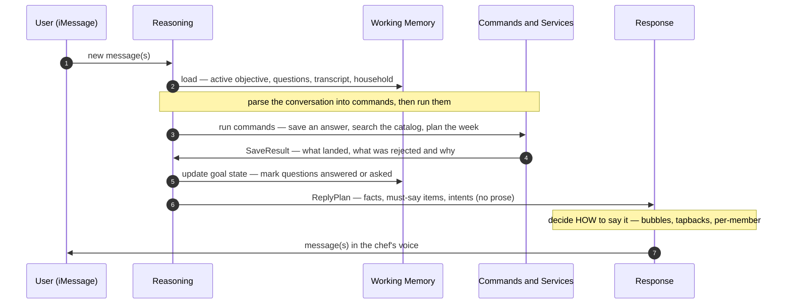
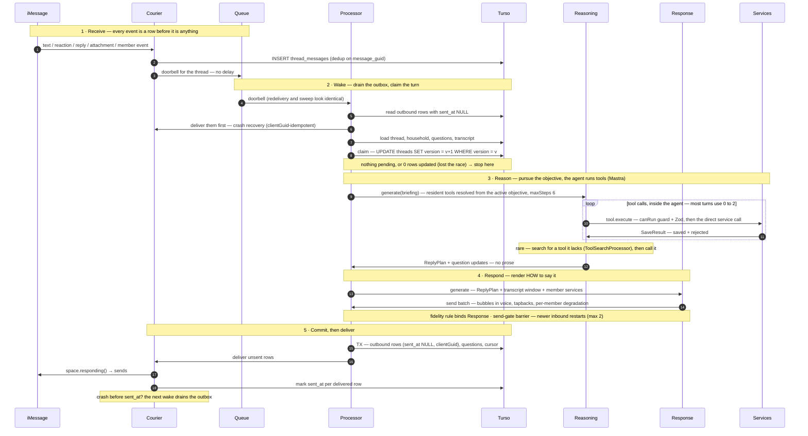
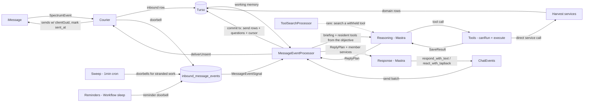

# The Chef Agent — Architecture

This is the first and most consequential document in the design. It specifies the agent that
lives behind the Harvest iMessage number: how it decides what to do, how it works toward a
goal across many messages and process restarts, and how it produces replies that feel like
texting a person. Everything else — onboarding, menu delivery, recipe drops — is a *program*
that runs on this machine, specified in the documents that follow
([`02-onboarding.md`](./02-onboarding.md) is the first). Prior-art studies of the two
closest shipped systems are in [`prior-art-poke-parlant.md`](./prior-art-poke-parlant.md).

# Reviews

| Reviewer | Status | Feedback |
|---|---|---|
| Jordan | in_progress | Requested this re-sequencing: components → interaction → response → reasoning → code |

---

# Part 1 — The Design

## Two components

The agent is two cooperating parts, run once per turn:

- The **reasoning component** decides *what needs to happen and what needs to be said*. It
  works toward the goal on the top of the stack by reading the conversation and changing the
  world through **commands** (validated writes to Harvest's data), judges which questions
  just got answered, and hands off a plan of *what to convey* — with no personality, no
  prose.
- The **response component** decides *how to say it*. It takes that plan plus the recent
  conversation and produces the actual bubbles — voice, rhythm, tapbacks, and per-recipient
  adaptation (an SMS member can't receive a tapback). It never touches Harvest's data and
  never decides *what* is true; it only renders.

Why split at all — three reasons, and they're the whole argument for this shape:

1. **Different jobs, different judges.** "Did it extract the right answer and take the right
   action" and "does this feel like a warm human texting you" are different axes. Fused into
   one prompt, they degrade each other — charm bleeds into the data extraction, and
   safety-critical precision gets softened for tone. Split, each is prompted and evaluated
   on its own axis.
2. **Different cost.** Reasoning needs the strong model and the tools. Response is small,
   tool-light rendering — a natural fit for a cheaper, faster model (Q-10). Most of the
   quality-critical thinking happens once; the voice pass is cheap.
3. **Precedent is unanimous.** Poke's execution agents are told *"you are not responsible
   for framing responses in a user-friendly way"* while its Interaction Agent owns voice;
   Parlant decides which rules apply and then a separate message generator composes; classic
   natural-language generation has always separated *content determination* from *surface
   realization*. (Details in [`prior-art-poke-parlant.md`](./prior-art-poke-parlant.md).)

Both components are the same kind of thing — an LLM loop with a scoped set of commands. They
differ only in what their commands do: the reasoning component's commands change *state*
(writes to Harvest's data), the response component's commands emit *messages* (bubbles,
tapbacks). A multi-bubble reply is just several message-emitting command calls in one turn.

## How they interact

Before the detail, the shape of one turn — conceptually, with the durable plumbing (queues,
outbox, crash recovery) deferred to Part 2 so the data flow is visible:



Reading the flow: the reasoning component loads **working memory** (step 2), turns the
conversation into **commands** and runs them (3–4), updates the goal state from what
actually happened (5), and emits a **ReplyPlan** — the interface between the two components
(6). The response component renders that plan into voice and sends it (7–8). It never
loops back into reasoning; a turn is one pass.

**The `ReplyPlan` is the contract between the components**, and it carries exactly what the
response side needs and nothing it could get wrong: the *facts* to convey, `must_say` items
(safety consequences that must appear — "peanuts never enter this kitchen"), and *intents*
(ask the cook-days question; acknowledge the store that didn't match). It carries **no
prose** — deciding the words is the response component's job — and the **fidelity rule**
binds that job: rephrase, split, and color freely, but never add, drop, or soften a fact,
and always surface every `must_say`. That rule can't be schema-enforced, so it's a prompt
contract checked by the eval rubric judge (Part 2, Testing).

## The response component

The simple half. It is an LLM loop whose tools *emit messages* rather than change state.
Following the memory-hierarchy discipline (`vertical-agent-design`), its system prompt is
tiered:

- **L1 — resident every turn:** the chef's voice and formatting rules (what makes a text
  thread feel warm and human — short bubbles, one thought each, no "As an AI"), the recent
  transcript window (for tone and to avoid repeating itself), the `ReplyPlan` to render,
  and the one common output command: **`respond_with_text`** — a single text bubble. Most
  turns are one or two of these.
- **L2 — the occasional richer response:** **`react_with_tapback`** (a 👍/❤️ on a user's
  message instead of a bubble) and threaded replies. Infrequent, so their instructions load
  only when the plan or context calls for them, keeping the common turn's prompt lean.

Two properties make this component safe to keep dumb:

- **Its commands build up `ChatEvents`; they do not touch the wire.** `respond_with_text`
  and `react_with_tapback` append to the turn's `ChatEvents` (the outbound half of the
  conversation, defined in Part 2), which the turn commits durably before anything is
  delivered (the outbox). Same command discipline as reasoning: the command is an intent,
  recorded first, delivered downstream, crash-safe.
- **Per-recipient rendering.** Each household member carries a `service` (`iMessage` / `SMS`
  / `RCS`). The response component reads it and adapts: an SMS member can't receive a tapback
  or a rich link, so it gets a titled URL and a plain "yes or no?" where an iMessage member
  gets 👍/👎. This is the one place that logic belongs, because it's a rendering decision.

That is the whole response component. Its simplicity is the point: all the hard thinking
happened upstream, and this half only has to sound good and adapt to the channel.

## The reasoning component

The complex half, and the heart of the design. Its job is to pursue a goal across a
multi-turn, multi-party conversation — and to do so durably, so a process crash mid-turn
loses nothing. That requirement is what forces every abstraction below.

### Working memory — why the abstractions exist

An LLM is **stateless between calls.** Each turn it wakes with no memory of the last one.
But onboarding a household takes twenty exchanges over an unpredictable span, with people
answering at different speeds, dropping in a recipe mid-flow, and correcting themselves. To
pursue a goal across all that — and across process restarts — the agent's memory must live
*outside* the model, in durable storage the turn loads at the start and commits at the end.

Two kinds of abstraction make up that externalized memory — the **state** (the remembered
nouns) and the **operations** on it (the verbs that read the conversation and mutate the
state):

| Role | Abstraction | Answers |
|---|---|---|
| **State** (working memory) | Objective + the stack | *What am I trying to do?* |
| | Questions | *What do I still need to know?* |
| | Domain tables + transcript | *What's true, and what was said?* |
| **Operations** (the command pattern) | Command | *A legal, validated change to the world* |
| | CommandParser (the LLM) | *This utterance means: run these commands* |
| | CommandRunner | *Validate, execute, and report what actually happened* |

The state is what persists between turns; the operations are what happen within one. The
rest of this section takes them in that order.

### Objectives and the stack (state: what am I doing)

An **objective** is a declared goal the agent is pursuing — "onboard this household,"
"review this week's menu." Each has a definition, registered in code, that names three
things: its **instructions** (what the goal is and what "done" means), the **information it
requires** (which become Questions), and the **commands it may use** while active. The
definition declares *what is needed*; it never scripts a conversational path — the model
self-orchestrates the dialogue inside it.

Objectives live on a **stack** on the thread, because goals nest. If Priya drops a TikTok
recipe link mid-onboarding, a `recipe_drop` objective is *pushed*; the chef handles it, it
*completes and pops*, and the next turn resumes onboarding from exactly where it paused —
the paused objective is still sitting underneath, and the turn's briefing says so. This is
why a digression doesn't derail the flow, and why every future goal (the after-first-night
check-in, weekly review, re-engagement) is a **new definition, not new code** — the stack
handles interleaving for free.

This shape is adopted from Rasa's **CALM** (flows own their required slots; the LLM
translates conversation into commands against declared logic; a dialogue stack handles
digressions), validated as still state-of-the-art by a dedicated research pass — see
*Lineage & validation* at the end of this Part.

### Questions (state: what I still need)

A **question** is one fact an objective requires — `household.cook_days_count`,
`member:<sam>.allergens`. Each carries a scope (household-wide, or a specific member), a
`required` flag, a status (`unasked → asked → answered`, or `defaulted` after two ignored
follow-ups), and its validated answer. Questions are the **scoreboard**: they make "are we
done?" a computable check (all required questions terminal ⇒ the objective completes and
pops) instead of the model re-reading a long transcript and guessing, and they tell the
agent *who it is still waiting on* — which is how Priya can race ahead while Sam stays
silent without either blocking the other.

**The agent judges answered-ness; code enforces one invariant.** Whether Priya's
"confident 💪" answers the skill question is a judgment about language, so it belongs to the
model: the reasoning component declares status changes in its output. The turn applies them
under exactly **one rule enforced in code — a value-bearing question can only become
`answered` if its value actually landed through a successful command.** The model can't
declare progress the database doesn't have. Beyond that, the scoreboard *records* what's
settled; it never *chooses* what to say next.

### Commands, the CommandParser, and CommandRunners (the operations)

This is the command pattern with a natural-language front-end — and it is *the* mechanism by
which the agent changes anything.

- A **Command** is a named, validated operation the agent can invoke: `save_member_profile`,
  `search_catalog`, `plan_week`. Each has a schema (its parameters, in Zod), a **precondition**
  (`canRun(state)` — the states it may execute in; some commands have none), and a receiver
  (a Harvest service). *(In the Mastra harness a Command is exposed to the model as a "tool";
  "command" is the honest name for what it is.)*
- The **CommandParser is the reasoning LLM itself.** Its job is to read the conversation —
  ambiguous natural language, corrections, proxy answers, banter — and emit **command
  invocations**. "Actually make that 5–6" becomes
  `save_household_profile({cook_days_count: 6})`; "his name is Sam and he's vegetarian too"
  (said by Priya) becomes two commands attributed to Sam. This translation *is* the parser's
  whole job, and it is the novel part versus the textbook pattern, where commands are
  constructed in code rather than parsed from dialogue.
- A **CommandRunner** is the deterministic executor behind each command: it validates the
  invocation against the schema, calls the receiver service in-process, and returns a
  **`SaveResult`** — a precise account of what landed and what was rejected. It is where
  every guardrail lives (an unconfirmed allergen is *refused* here), and it never lies about
  what it did.

**Why each is required** — the question Jordan asked directly:

- **Commands** exist so the model can never write to the database directly. Every change to
  the world goes through a typed, validated, logged chokepoint. That single constraint buys
  safety (allergens can't be written unconfirmed), correctness (only catalog-valid enums
  land), auditability (the committed rows are the command log), and testability (feed a
  command sequence to the runners and assert the resulting state — no LLM needed).
- **The parser as a distinct role** (the LLM) exists because parsing is fuzzy and execution
  must be exact. Separating them is what lets us swap the model without touching business
  logic, and test the logic without the model.
- **The runner as a distinct role** exists because someone must validate, normalize,
  dispatch, and *report back* — and reporting back is load-bearing: the model can't see the
  database, so the `SaveResult` is its only knowledge of what actually happened.

**In code, there is no bespoke command layer — each of these is a Mastra tool.** The
command pattern is the *mental model* (it explains why writes are chokepointed and how state
constrains what's callable); the *implementation* is just the reasoning agent's tools. A tool
**is** a command, its `execute` **is** the runner (defensive — it re-checks its own
precondition and returns `SaveResult.rejected` if ineligible), and Mastra's tool-calling
**is** the parser. Parser and runner are *roles*, not classes we build. Part 2 shows the
Mastra shape.

**Two separate questions: what is *legal* right now, and what is in *front* of the agent.**
It's tempting to answer both with one list — let the objective name the commands it may use,
and treat everything omitted as forbidden. That bundling fights itself: to make a command
reachable you must list it, and to keep it safe you must omit it, so one lever serves two
opposing needs and a mis-scoped objective either strands the agent or over-exposes it. The
two questions are split:

1. **Residency — focus.** The active objective resolves the agent's tool set for the turn
   (Mastra resolves `tools` as a function of runtime context). It keeps the objective's
   relevant tools *resident* — in the prompt — so the common turn stays lean and accurate
   (the Pipecat discipline: few tools in front of the model beats many). It is not a
   boundary.
2. **Discovery — the escape hatch.** The remaining eligible tools are *withheld from the
   prompt but kept searchable* (Mastra's `ToolSearchProcessor`); the agent is told to look
   one up when it needs a capability it doesn't have — a `list_tools`/search step. A withheld
   tool stays *reachable*, so the agent is never stranded when the resident set doesn't cover
   the need. It's a cache miss: rare by design (residency covers the ~80%), so the prompt
   stays lean in the common case while full capability stays one search away.
3. **Preconditions — legality.** Each tool owns `canRun(state)`. `plan_week` is discoverable,
   but its precondition rejects it before onboarding is complete; `save_member_profile` can't
   run before the member exists. This is where "declared state constrains the legal tool set"
   is enforced — *per tool, as a tested assertion,* not by omission (omission is fragile; a
   precondition is a positive, auditable guarantee, and it generalizes the allergen
   `confirmed:true` gate to every tool). `canRun` filters both the resolved tool set and what
   search returns, so discovery only ever surfaces tools runnable *now* — an action menu,
   never a dependency graph the agent plans its way around (the external-path-planning the
   research binding forbids).
4. **Schema & normalization — well-formedness.** Zod validates the arguments; the tool's
   `execute` normalizes values against the catalog and reports through `SaveResult`.

Ordering emerges from preconditions, never from a scripted step sequence — there is no step
cursor anywhere in the runtime, only the scoreboard and each command's `canRun`.

**`SaveResult` — the honest account.** A save never fails silently and never lies:

```ts
type SaveResult = {
  saved: Record<string, unknown>          // what actually landed, post-normalization
  rejected: Array<{
    input: string                          // what the model tried to save
    reason: string                         // "no catalog match" | "allergen not confirmed" | …
    closest?: string[]                     // nearest valid values, when they exist
  }>
}
```

`save_household_profile({grocery_stores: ["kroger", "piggly wiggly's little cousin"]})`
returns `{saved: {grocery_stores: ["kroger"]}, rejected: [{input: "piggly wiggly's little
cousin", reason: "no catalog match", closest: ["piggly_wiggly"]}]}` — from which the next
line writes itself ("Kroger's in. Closest I know is Piggly Wiggly proper — that it?").
Partial acceptance is deliberate: half-valid input is the *normal* case in conversation, not
an error. The result lives for one turn and is never persisted — rejects surface as logs and
a metric, which is all "a parse failed" needs.

### Lineage & validation — CALM concept → ours

| CALM (paper / Rasa Pro) | This design |
|---|---|
| Flow (declared business logic + `collect` steps) | `ObjectiveDefinition` + its `requirements` |
| Slot | `Question` (value written only via validated tools) |
| `SetSlot` command | A `save_*` tool write + the agent's `question_updates` |
| `StartFlow` command | Objective push — by event trigger (URL drop) or the agent's judgment |
| Dialogue stack | `threads.objectives` stack; complete → pop → resume |
| Command generator (LLM → DSL) | `chefAgent.generate` + typed tools (Mastra) — tool calls *are* the command language |
| Conversation repair patterns (coded) | **Not adopted** — corrections, digressions, and clarifications stay the model's judgment under L1 rules (D-10) |
| Rasa runtime / action server / tracker store | **Not adopted** — Python sidecar, HTTP bridges to our TS services, and a second dialog state store contradict R5/D-11; the free Developer Edition also caps at ~1k conversations/month |

The correspondence is close because the designs share a thesis: CALM's "the LLM translates
conversation into commands against declared logic" is D-10's "the model owns language, the
tools own truth" — with flows added, the declaration now covers *goals*, not just writes.

The one-sentence mental model: **this is the command pattern with a natural-language
front-end, where the declared state constrains the legal command set.** The LLM parses
conversation into commands (here: validated tool calls); the active objective defines
which commands are currently legal (its scoped tool set × Zod); a deterministic executor
runs them; the command log is the turn's committed rows. What the pattern doesn't cover —
saying something back — is exactly the Voice half (D-17).

### Is this still the state of the art? (deep-research pass, 2026-08-28)

A 22-source adversarially-verified research pass (findings summarized in D-16) answered:
**the shape is convergently validated, not superseded.** Production frameworks arrived at
the same architecture independently — [Parlant](https://github.com/emcie-co/parlant)'s
condition-gated Guidelines and Journeys with per-turn scoped tool activation are
structurally CALM's bet, rebuilt from scratch in 2025–26 — and the 2024–26 academic work
(ATOD-Eval, GODR, multi-party goal-tracking corpora) argues the hard cases we have
(multi-goal concurrency, digression/resumption, **multi-party attribution**) still require
explicit structure. The "bitter lesson" counter-case is real but narrow: one controlled
study ([arXiv:2604.27891](https://arxiv.org/pdf/2604.27891)) showed a frontier model
self-orchestrating in-context beats an external graph orchestrator (LangGraph) on call
efficiency, with each external routing decision "an additional point of failure" — but it
tested orchestration-of-*execution*, not goal/slot declaration, and its headline quality
gap partially evaporated under a non-self-preferring judge.

Two refinements the evidence buys, both now binding on this design:

1. **Objectives declare requirements and guidance — never conversational paths.** No step
   sequences, no transition graphs, no external routing of turns. The model
   self-orchestrates the conversation inside the objective (that is what 2604.27891
   actually demonstrates); the objective contributes *what is needed*, *what done means*,
   and *which tools exist*. If an objective definition ever grows a path graph, it has
   become the LangGraph anti-pattern.
2. **Instruction bodies are condition-gated, Parlant-style** — guidance activates on
   precise conditions ("an allergen was named without a severity"), not as one static
   block. Our L2 injection already works this way; the refinement is writing the
   definitions' guidance as explicit condition → guidance pairs.

Honest limits of the evidence: the supporting papers are recent preprints, not settled
consensus; the multi-party goal-tracking literature is one 29-conversation 2023 dataset;
and **no published system evaluates our exact combination** (group-chat multi-party +
declared objectives + validated-tool-gated writes + goal stack) — the golden-transcript
evals are our only real referee (Q-12).

### The one-sentence model

**The agent is the command pattern with a natural-language front-end, where the declared
goal state constrains the legal command set — plus a separate rendering pass to say
something back.** The reasoning LLM parses conversation into commands; the active objective
defines which commands are legal right now; the runners execute them and report honestly;
the response component turns the resulting plan into voice. State (objectives, questions)
persists between turns; commands are the only way it changes; the command log *is* the
committed rows.

---

# Part 2 — The Implementation

Everything Part 1 described, as the concrete code, tables, and durable turn needed to build
it. Modules live under `server/src/chef/`.

## The objective definition

Registered in code, one per goal, in `server/src/chef/objectives/`:

```ts
type ObjectiveDefinition = {
  id: "onboarding" | "menu_review" | "recipe_drop" | "first_night_checkin" | …
  instructions: string        // what the goal is + what "done" means (condition-gated)
  requirements: QuestionDef[] // the information this objective needs (→ Questions)
  tools: ToolName[]            // the RESIDENT set — resolved into the agent's prompt for focus.
                               // NOT a boundary: the rest stay searchable (ToolSearchProcessor),
                               // and each tool's canRun(state) enforces legality (Part 1, Commands)
  trigger: "message" | "event" | "reminder"   // how an instance gets pushed onto the stack
}
```

An **instance** lives on `threads.objectives`, a JSON stack:

```jsonc
[
  { "definition": "onboarding", "status": "suspended",
    "questions": { "household.cook_days_count": {"status": "answered", …}, … } },
  { "definition": "recipe_drop", "status": "active",       // top of stack
    "context": { "jobId": "…" }, "questions": {} }
]
```

An objective completes when its required questions are all terminal and its definition's
completion condition holds; the turn marks it `complete`, pops it, and the next briefing
resumes whatever is underneath.

## The tools (= the commands, in code)

Each is a Mastra `createTool`: a Zod `inputSchema` (the same schema the HTTP layer uses), a
`canRun(state)` precondition, and an `execute` that runs the receiver service in-process (no
HTTP, no tokens — the agent holds no credentials), scoped to the thread's household, and
returns a `SaveResult`. `canRun` is both the legality gate and the filter on what the tool
search surfaces; increment tags show which document turns each tool on:

| Tool | Args | `canRun(state)` | Receiver (direct service call) |
|---|---|---|---|
| `save_household_profile` | `{patch}` ⊂ household_preferences fields | always | `PreferenceService` — household rows, read-merge-write |
| `save_member_profile` | `{member_user_id, patch}`; allergen entries require `confirmed: true` | member exists in the household | `PreferenceService` — that member's per-user rows |
| `search_catalog` | `{kind: taste\|store\|equipment\|diet\|allergen, query}` | always | `TasteOptionsService` + enum tables |
| `set_reminder` | `{fire_at, about, payload}` | always | `Reminders` — Workflow sleep → a doorbell |
| `list_candidate_recipes` *(02)* | `{meal_type, limit?, exclude?}` | required prefs present (post-onboarding) | `RecipeService.candidates` |
| `plan_week` *(02)* | `{entries: [{date, meal, recipe_id}]}` | required prefs present | `MealPlanService.add` per slot |
| `swap_entry` *(02)* | `{meal_plan_entry_id, replacement_recipe_id}` | the entry exists on a current plan | `MealPlanService.remove` + `add` |
| `record_recipe_feedback` *(02)* | `{recipe_id, sentiment, reason_text?, parsed_facets?}` | always | `RecipeFeedbackService` |
| `import_recipe` *(03)* | `{url? \| image_ref?, note?}` | always | `ImportService.create` (existing pipeline) |

The discovery escape hatch (`list_tools`) is *not* a hand-written tool — it's Mastra's
`ToolSearchProcessor`, which withholds the non-resident tools from the prompt and lets the
agent search for one when it needs a capability it doesn't have (below).

Each tool's `execute` opens with its `canRun` check, so a tool is defensive even if it's
surfaced by search or wrongly resolved into the set:

```ts
// server/src/chef/tools/save-member-profile.ts
export const save_member_profile = createTool({
  id: "save_member_profile",
  description: "Save a member's allergens, diets, tastes, or skill level.",
  inputSchema: MemberPatchSchema,                          // same Zod as the HTTP layer
  canRun: (state) => state.household?.hasMember(state.args?.member_user_id) ?? false,
  execute: async ({ member_user_id, patch }, { state }) => {
    if (!save_member_profile.canRun(state))                // defensive — never trust the set
      return reject("member does not exist yet");
    return preferenceService.saveMember(member_user_id, patch, state.household);  // → SaveResult
  },
});
```

**Guardrails** live in these `execute` bodies as `canRun` plus in-line checks: allergen
writes are two-phase (severity asked → `confirmed: true` → else `SaveResult.rejected`);
enum-or-nothing writes; and `list_candidate_recipes` pre-filters by the household composition
view server-side, so an unsafe recipe can't be *offered* even on a bad model turn. `canRun`
is a pure function of state — unit-tested per tool in isolation, which is where the legality
guarantee lives (rather than in the correctness of every objective's resident list).

## The reasoning component (code)

The harness is **Mastra** (D-15) — its `Agent` gives us the tool loop, Zod validation, model
routing, and conversation memory (on our own Turso via `@mastra/libsql`), so we build only
the domain. Two Mastra features carry the focus/discovery design directly: **`tools` resolved
as a function of runtime context** (the active objective picks the resident set per turn), and
the **`ToolSearchProcessor`** (the rest stay searchable rather than resident):

```ts
// server/src/chef/reasoning-agent.ts — decides WHAT to do and say (was "ChefAgent")
import { Agent } from "@mastra/core/agent";
import { Memory } from "@mastra/memory";
import { LibSQLStore } from "@mastra/libsql";
import { ToolSearchProcessor } from "@mastra/core/processors";

export const reasoningAgent = new Agent({
  name: "harvest-chef-reasoning",
  instructions: CONDUCT_AND_SAFETY,         // no persona — judged on substance (D-17);
                                            // "search for a tool when you need one you don't have"
  model: REASONING_MODEL,                   // the strong model (Q-10)
  // resident set = the active objective's tools, filtered to canRun(state) — per turn:
  tools: async ({ requestContext }) => residentTools(requestContext.get("chefState")),
  // the rest of the eligible tools are withheld from the prompt but searchable (list_tools):
  inputProcessors: [new ToolSearchProcessor({ tools: allEligibleTools, includeResolvedTools: true })],
  memory: new Memory({
    storage: new LibSQLStore({ url: env.TURSO_CONNECTION_URL }),   // same database
    options: { lastMessages: 30 },          // the transcript window
  }),
});
```

`chefState` (the active objective, household, and question scoreboard) rides in on the
request context the processor sets before `generate`; `residentTools` and `allEligibleTools`
both filter by each tool's `canRun`, so nothing ineligible is ever resident *or* discoverable.

The reasoning component's structured output — the `ReplyPlan`, the interface it hands to
the response component — never prose:

```ts
type ReplyPlan = {
  intents: Array<                    // the things to convey this turn, in order
    | { kind: "ask"; question: QuestionKey }              // ask an unanswered question
    | { kind: "confirm"; fact: string }                   // restate a value that landed
    | { kind: "acknowledge"; note: string }               // e.g. a store that didn't match
    | { kind: "hand_off"; note: string }                  // "give me a bit — cooking up your week"
  >
  must_say: string[]                 // safety consequences that MUST appear, verbatim in meaning
                                     //   e.g. "peanuts never enter this kitchen"
  address?: MemberUserId             // when a turn is directed at one member ("Sam, …")
}
// question_updates travels alongside (applied by the turn, not the response component):
type QuestionUpdate = { key: QuestionKey; status: QuestionStatus }
```

## The response component (code)

Symmetric with reasoning: an `Agent` whose commands emit **`ChatEvents`** — the outbound
half of the conversation — rather than change state. `ChatEvents` is the same shape the
`thread_messages` outbox stores (Part 2, Working-memory tables), before the rows exist:

```ts
type ChatEvent =
  | { kind: "text";    text: string }                               // a bubble
  | { kind: "tapback"; emoji: Tapback; target: MessageGuid }        // a reaction on a message
  | { kind: "reply";   text: string;  target: MessageGuid }         // a threaded reply
type ChatEvents = ChatEvent[]        // one turn's outbound events, in send order
```

The two response commands, with their input schemas — each appends a `ChatEvent` and returns
nothing (the send is downstream, via the outbox):

```ts
// server/src/chef/response-commands/respond-with-text.ts   (L1 — the common output)
respond_with_text = createTool({
  id: "respond_with_text",
  description: "Send one text bubble to the thread. Call once per bubble; short is better.",
  inputSchema: z.object({ text: z.string().min(1).max(1000) }),
  execute: ({ text }, ctx) => ctx.chatEvents.push({ kind: "text", text }),
})

// server/src/chef/response-commands/react-with-tapback.ts   (L2 — the occasional reaction)
react_with_tapback = createTool({
  id: "react_with_tapback",
  description: "React to a specific user message with a tapback, instead of a text bubble. " +
               "iMessage recipients only — never emit for an SMS/RCS member.",
  inputSchema: z.object({
    target: z.string(),                                   // the MessageGuid being reacted to
    emoji: z.enum(["love", "like", "dislike", "laugh", "emphasize", "question"]),
  }),
  execute: (args, ctx) => ctx.chatEvents.push({ kind: "tapback", ...args }),
})
```

```ts
// server/src/chef/response-agent.ts — decides HOW to say it (was "Voice", D-17)
export const responseAgent = new Agent({
  name: "harvest-chef-response",
  instructions: CHEF_PERSONA,               // L1: voice, formatting, what makes texting feel great
  model: RESPONSE_MODEL,                    // small/cheap — it renders, it doesn't reason (Q-10)
  tools: { respond_with_text, react_with_tapback },
});
// each call: responseAgent.generate(renderPrompt(replyPlan, window, members), { maxSteps: 4 })
// → the turn's ChatEvents; the fidelity rule binds it (rephrase freely; never add/drop/soften; must_say appears)
```

The `renderPrompt` inputs are exactly what the component needs and nothing more: the
`ReplyPlan` to render, the recent transcript `window` for tone, and the `members` list with
each member's `service` (so `react_with_tapback` and rich links are suppressed for
SMS/RCS members).

## Working-memory tables

**`threads`** — one per iMessage space; the durable home of the goal stack:

| Column | Type | Constraints | Notes |
|---|---|---|---|
| id | text (UUID) | pk | |
| chat_guid | text | not null, unique | Spectrum space id |
| household_id | text | fk households.id, nullable | set when the household is created |
| objectives | text (JSON) | not null | the goal stack — per objective: definition id, status (`active` \| `suspended` \| `complete`), context, and its questions (key, scope, required, status `unasked` \| `asked` \| `answered` \| `defaulted`, validated answer, follow-ups sent, follow-up timer id) |
| last_inbound_id | text | nullable | concurrency fence — the cursor into `thread_messages` |
| version | integer | not null, default 0 | optimistic lock (the claim, below) |
| created_at / updated_at | timestamp | not null | |

**`thread_messages`** — the append-only transcript *and* the outbox:

| Column | Type | Constraints | Notes |
|---|---|---|---|
| id | text (UUID) | pk | |
| thread_id | text | not null, fk threads.id, cascade | index |
| direction | text enum | not null | `inbound` \| `outbound` \| `timer` |
| kind | text enum | not null | `text` \| `reaction` \| `reply` \| `attachment` \| `member_event` \| `link_card` \| `timer` |
| sender_handle | text | | inbound: `sender.address` |
| member_user_id | text | fk users.id | resolved by matching sender_handle to the household's members |
| body | text | | text / emoji / event payload |
| message_guid | text | unique index | iMessage GUID; dedup + `clientGuid` for outbound |
| reply_to_guid | text | | threaded-reply target |
| meta | text (JSON) | | e.g. `{mealPlanEntryId}` on link cards |
| sent_at | timestamp | | **outbound only — the outbox marker:** NULL = committed but not yet delivered; every turn drains NULL rows first |
| created_at | timestamp | not null | |

The domain tables the commands write to (`households`, `household_members`,
`household_preferences`, `users.imessage_handle`, and the existing per-user preference
tables) are specified where they're first used, in
[`02-onboarding.md`](./02-onboarding.md#tables).

## The durable turn

Now the runtime plumbing deferred from Part 1 — how a turn actually runs so a crash anywhere
loses nothing. The full operation (`O-01`), 18 steps:



### The turn, step by step

1. **Photon delivers the raw event to the Courier** over the long-lived gRPC stream — maybe
   more than once (it redelivers on reconnect), so nothing downstream assumes exactly-once.
2. **The Courier inserts it as a `thread_messages` row.** Inbound idempotency is enforced
   *here, by our database*: the unique index on `message_guid` makes a duplicate insert a
   no-op. The Courier does nothing else — no parsing, no thinking.
3. **The Courier rings a doorbell** — enqueues `{thread_id}`. The doorbell is a *hint* that
   work may exist, never the work itself: a lost one is re-rung by the sweep within a minute;
   a duplicate is harmless because steps 5–8 make extra wakes no-ops.
4. **The queue invokes `MessageEventProcessor.process`** with at-least-once delivery. A
   crashed invocation is redelivered — which is fine, because every step below is idempotent
   or guarded.
5. **The processor reads outbound rows with `sent_at NULL`** — replies a prior invocation
   committed but never delivered. This is the outbox: durable intent to send, found by every
   wake regardless of why it woke.
6. **Those rows go to the Courier for delivery first, before any new thinking.** Outbound
   idempotency is layered: *ours* — a row is only handed over while `sent_at` is NULL, so
   once step 18 stamps it, it can't re-send; *Photon's* — each row carries a `clientGuid`
   fixed at commit time (step 15), so a crash between "Photon accepted" and "we stamped"
   redelivers the same `clientGuid` and Photon drops the duplicate (their recovery guidance;
   confirming the exact semantics is Q-11, fallback = stamp-before-send).
7. **The processor loads working memory** — the thread (cursor, version), the household and
   its members, the objective stack with its questions, and the recent transcript. An inbound
   row's `sender_handle` matched against the members is how an answer binds to a person. If
   nothing is past the cursor, it stops — the doorbell was for handled work.
8. **The claim** — one conditional `UPDATE threads SET version = v+1 WHERE version = v`.
   Single-flight is enforced *by SQLite's atomic update*: of two processors that both loaded
   version `v`, exactly one affects a row; the other sees `rowsAffected: 0` and stops, having
   done nothing but the harmless drain in step 6.
9. **The reasoning component runs** — `reasoningAgent.generate(briefing)`. `prepareBriefing`
   assembled the context (active objective + its unmet questions, the household, the framed
   trigger) and exposed *only the active objective's commands*. Mastra owns the command loop
   internally (up to `maxSteps: 6`); the processor is not inside it.
10. **A command runner executes** — validated by Mastra against the command's Zod schema,
    then the direct in-process service call. Every *write* runner opens with the staleness
    guard: newer inbound rows than the briefing abort the generation (interruption, below).
11. **The runner returns its `SaveResult`** — saved values post-normalization, rejects with
    reasons and closest matches. Turn-scoped; never persisted.
12. **`generate` returns `{replyPlan, question_updates}`, not prose** — facts and `must_say`
    items to convey, plus the reasoning component's judgment of which questions were answered.
13. **The response component renders it** — `responseAgent.generate(...)`, a small, cheap,
    tool-light call: the plan, a short transcript window for tone, and each member's `service`.
    Its `respond_with_text` / `react_with_tapback` calls build the send batch.
14. **The fidelity rule binds it** — rephrase freely, never add/drop/soften facts, every
    `must_say` appears. Prompt-contracted, rubric-judged (it can't be schema-enforced).
15. **The send-gate barrier, then the commit.** One last check for newer inbound rows — a hit
    discards plan and render and restarts (max 2, then sends anyway). Otherwise it applies
    `question_updates` under the invariant (`answered` requires a successful write) and
    commits *one transaction*: outbound rows (`sent_at NULL`, deterministic `clientGuid`),
    question updates, cursor advance, version bump.
16. **Unsent rows go to the Courier** — the identical drain as step 6, now for this turn.
17. **The Courier sends through Spectrum** inside `space.responding()` (the typing indicator),
    presenting each `clientGuid` to Photon.
18. **After Photon accepts each message, the Courier stamps `sent_at`.** The window between
    17 and 18 is the only at-risk span — exactly what layer two of step 6 covers.

**Interruption (D-13).** The turn starts the moment the first event lands — no debounce,
because a debounce is a minimum-latency floor on every reply. Mid-turn arrivals are handled
the way production chat systems handle barge-in: cancel the in-flight generation and restart
against the fuller conversation (OpenAI Realtime's `response.cancel`, the chat apps'
new-message-cancels-generation). iMessage makes it cheap — nothing streamed, so an aborted
turn was never visible. Two barriers, distinct owners: every *write* runner opens with a
staleness guard (a write must not act on a stale room), and the processor re-checks at the
send gate. Restarts are bounded at 2. The burst case ("1 and 5" then "3 for me") costs
discarded tokens, not user latency; the single-message case pays nothing.

### The processor and the claim, in code

```ts
// server/src/chef/message-event-processor.ts — consumer for "inbound_message_events"
export class MessageEventProcessor {
  async process({ threadId }: MessageEventSignal) {
    const thread = await threadStore.load(threadId);

    // 1. Drain the outbox — crash recovery is the first act of every wake
    await courier.deliverUnsent(thread);        // sent_at NULL rows, clientGuid-idempotent

    // 2. Anything to do? The doorbell is a hint; the rows are the work
    let pending = await threadStore.eventsSince(thread.lastInboundId);
    if (pending.length === 0) return;

    // 3. Claim — exactly one processor per thread wins
    if (!(await threadStore.claim(thread))) return;

    // 4. Reason, then respond, with interruption barriers
    for (let attempt = 0; attempt <= MAX_RESTARTS; attempt++) {
      const briefing = prepareBriefing(thread, pending);
      const { replyPlan, questionUpdates } = await reasoningAgent.generate(briefing.messages, {
        memory: { thread: thread.id, resource: thread.householdId ?? thread.id },
        maxSteps: 6,
        context: briefing.context,              // householdId + member map → command runners
      });
      // write-runner barrier lives inside the runners via the execution context's abortSignal
      const sends = await responseAgent.render(replyPlan, briefing.window, thread.members);
      if ((await threadStore.hasNewerInbound(thread)) && attempt < MAX_RESTARTS) {
        pending = await threadStore.eventsSince(thread.lastInboundId);   // restart, fuller room
        continue;
      }
      // 5. Commit send rows (sent_at NULL) + question updates + cursor in one TX
      await threadStore.commitTurn(thread, questionUpdates, sends, pending);
      break;
    }

    // 6. Deliver — same drain as step 1; a crash anywhere above loses nothing
    await courier.deliverUnsent(thread);
  }
}
```

```ts
// server/src/chef/thread-store.ts — the atomic check-and-set behind claim()
async claim(t: Thread): Promise<boolean> {
  const res = await db
    .update(threads)
    .set({ version: t.version + 1, updatedAt: sql`(unixepoch())` })
    .where(and(eq(threads.id, t.id), eq(threads.version, t.version)));
  return res.rowsAffected === 1;   // 0 ⇒ a concurrent processor already claimed — stop
}
```

Two turns can both *load* version 7, but only one `UPDATE … WHERE version = 7` affects a row;
the loser returns having done nothing but the harmless drain. No lock server, no lease to
tune — a crashed winner holds nothing, because the next doorbell or sweep just runs the
processor again against committed state.

## Modules

Named for what they do, laid out to scream it:

```
server/src/chef/
  courier.ts                    — carries messages between iMessage and Harvest; no thinking
  message-event-processor.ts    — the durable turn: outbox, claim, barriers, commit
  reasoning-agent.ts            — decides WHAT to do and say: model, dynamic tools, memory (D-15)
  response-agent.ts             — decides HOW to say it: voice, per-member rendering (D-17)
  briefing.ts                   — prepareBriefing(): active objective, household, framed trigger
  objectives/                   — one ObjectiveDefinition per goal (each names its resident tools)
  tools/                        — one createTool() per tool, wrapping a service → SaveResult
  reminders.ts                  — setReminder(): follow-ups, menu day, import checks
  thread-store.ts               — threads + thread_messages: load, claim, commit, outbox
```



The deployables: the **Courier** (the one long-lived process — Photon needs a gRPC stream;
it does no thinking), the **MessageEventProcessor** (a stateless queue consumer, same Nitro
`vercel.queues.triggers` mechanism as the existing import pipeline), **Reminders** (Workflow
sleeps terminating in doorbells), and the **Sweep** (a one-minute cron re-ringing doorbells
for threads with unprocessed inbound or unsent outbound — the liveness backstop).

## The briefing — L1/L2/L3

`prepareBriefing` builds what the reasoning component knows before it acts, per turn, by
code — the model never assembles its own context. Tiered per `vertical-agent-design`:

- **L1 — resident every turn (~1.5k tokens), the ~80% turn with zero discovery:** conduct +
  safety rules; **the active objective** (instructions, completion criteria, unmet
  questions) plus a one-line inventory of suspended objectives; the household's members
  (name, handle, `service`, active); the transcript window (Mastra Memory, `lastMessages:
  30`); **the active objective's resident tools** (not all tools — the rest are one tool
  search away, `ToolSearchProcessor`); the framed trigger.
- **L2 — objective instruction bodies, injected while their objective is active
  (~300–600 tokens):** e.g. onboarding's tastes drill-down + catalog slice, the allergy
  ladder, the review routing. These live on the `ObjectiveDefinition`, condition-gated (one
  concept, not a separate "phase spec" layer).
- **L3 — grounding and discovery over the full substrate:** `search_catalog` (the full taste
  catalog, all store/equipment/diet enums) and `list_candidate_recipes` ground *data*; the
  **tool search** (`ToolSearchProcessor`) grounds *capability* — the runnable-now tools
  beyond the resident set, so a rare turn that needs an unlisted tool reaches it in one step
  rather than being stranded. Hard L1 rule: **a value the tools didn't return does not get
  written** — off-catalog answers degrade to acknowledged-and-dropped, never a guess.

---

# Decisions this document depends on

Full text (alternatives, research addenda) is in
[`DESIGN.md`](./DESIGN.md#decisions); the load-bearing ones here:

- **D-10** — the model owns language, the commands own truth.
- **D-13** — turns start immediately; mid-turn arrivals cancel and restart (no debounce).
- **D-14** — `thread_messages` is the transactional outbox on both sides; the queue is a
  doorbell.
- **D-15** — the harness is Mastra, not hand-rolled.
- **D-16** — goal orientation is CALM's architecture on our stack (lineage & validation above).
- **D-17** — the reasoning/response split; the reasoning side emits a `ReplyPlan`, the
  response side renders it under the fidelity rule. *(This document models the response side
  as an agent with message-emitting commands, not a single render call — see The response
  component.)*

# Open questions this document depends on

| ID | Question | Status |
|---|---|---|
| Q-08 | Where the Courier process lives (Fly/Railway/EC2 — the only non-serverless piece) | open |
| Q-10 | Model per component — strong for reasoning, cheap for response; decided by eval scores | open |
| Q-11 | Verify Photon's `clientGuid` server-side dedup; fallback = stamp-before-send | open |

# Changelog

| Date | Author | Change |
|---|---|---|
| 2026-08-28 | Claude (w/ Jordan) | Authored as the new increment-01 document — re-sequenced around the reasoning/response framing; extracts the runtime, agent tables, commands, and briefing into Part 2 |
| 2026-08-28 | Claude (w/ Jordan) | Decoupled command focus from legality (Jordan's design): the objective's tool set is a resident *hint*, not a boundary; discovery escape hatch for the rest; legality moves to per-tool `canRun(state)` preconditions (tested in isolation), generalizing the allergen gate; discovery returns only runnable tools so it's an action menu, never path-planning |
| 2026-08-29 | Claude (w/ Jordan) | Modeled the whole thing on native Mastra rather than a bespoke command layer (Jordan): the reasoning agent is a Mastra `Agent` with `tools` resolved per-request from the active objective + `canRun`, and `ToolSearchProcessor` as the discovery hatch (its "search when you need a capability you don't have" *is* `list_tools`, and it keeps withheld tools reachable). Command/CommandParser/CommandRunner kept as the Part 1 mental model; Part 2 is plain Mastra tools |
| 2026-08-29 | Claude (w/ Jordan) | Updated the turn + dataflow diagrams to the Mastra model — the reasoning agent calls tools directly (SaveResult returns to the agent, not routed through the processor), tools carry `canRun`, and `ToolSearchProcessor` shows as the rare discovery path; response side shows its message-emitting tools → ChatEvents |
