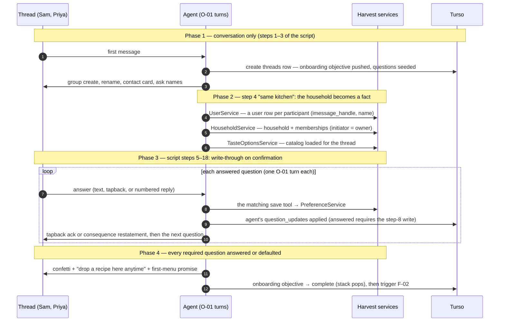

# Onboarding — Design Document

The first objective the chef agent runs — and the most demanding, because it must gather a
household's whole cooking profile through natural group conversation. This document assumes
the agent machine specified in [`01-agent-architecture.md`](./01-agent-architecture.md)
(the reasoning/response components, objectives, commands, the durable turn) and specifies
onboarding as a program on it: the objective definition, the flow, the reference script, the
group-conversation mechanics, and the household data it writes.

# Reviews

| Reviewer | Status | Feedback |
|---|---|---|
| Jordan | not_started | Extracted from DESIGN.md R13; adds the onboarding ObjectiveDefinition and the concurrency & proxy semantics |

---


---

# Onboarding — the first objective

The concrete `ObjectiveDefinition` this document specifies (registered in
`server/src/chef/objectives/onboarding.ts`):

```ts
export const onboarding: ObjectiveDefinition = {
  id: "onboarding",
  trigger: "message",                       // first inbound message on a new thread
  tools: ["save_household_profile", "save_member_profile",
          "search_catalog", "set_reminder"],
  requirements: [
    // household-scoped                        // member-scoped (one per member)
    q("household.same_household", req),        mq("name", req),
    q("household.goals"),                      mq("allergens", req),   // + severity, confirmed
    q("household.grocery_stores", req),        mq("diets"),            // + strictness
    q("household.grocery_shopping_day"),       mq("likes"),
    q("household.weekly_budget_cents"),        mq("dislikes"),
    q("household.household_size", req),        mq("skill_level"),
    q("household.weekly_meals", req),
    q("household.cook_days_count", req),
    q("household.time_by_meal"),
    q("household.eats_leftovers"),
    q("household.owned_equipment"),
  ],
  instructions: CONDITION_GATED_GUIDANCE,     // R11 binding: condition → guidance pairs,
                                              // e.g. "an allergen was named without a
                                              // severity → ask mild/moderate/severe and
                                              // write only with confirmed:true"
}
```

Completion = every required question `answered` or `defaulted` → confetti, the
drop-a-recipe invitation, the first-menu promise, and the objective pops (F-01 step 12).


---


---

# F-01 — Onboarding, implemented




### F-01, step by step

1. **The first inbound message reaches the agent** as an O-01 turn (every arrow into or out
   of "Agent" here is shorthand for a full O-01 pass). There is no thread row yet, so this
   turn creates one.
2. **The processor creates the `threads` row** — the onboarding objective pushed onto the
   goal stack with its questions seeded as `unasked` (the objective framework — [01](./01-agent-architecture.md)), cursor at the first
   message. From here the conversation is resumable from the database alone.
3. **The chef makes the room**: creates the group via Spectrum, renames it "Harvest Kitchen
   🍳", shares its contact card, and asks for names. Name answers become answered questions
   on the thread; they are conversational state only until step 5 gives them a home.
4. **On "same kitchen" (script step 4), identity becomes real — user rows first.**
   `UserService` writes one `users` row per participant keyed by `imessage_handle`. No OTP
   and no tokens: possession of the handle is proven by the inbound message itself (D-12),
   and the agent needs no credentials because its tools are in-process (R5).
5. **`HouseholdService` creates the household and memberships** — initiator as `owner`,
   each participant's `display_name` from step 3 — and the household id is stamped onto the
   thread row. This ordering (users, then household, then memberships) exists because
   memberships reference both.
6. **The taste catalog is loaded for the thread** — the candidate set the Likes/Dislikes
   parsing will be grounded in. A read, not a write; cached for the conversation.
7. **Each subsequent answer arrives as its own O-01 turn.** Attribution is by sender
   handle; the model interprets the answer in context (corrections and proxy answers
   included — there are no binding heuristics to specify).
8. **The matching save tool writes through immediately** — `save_household_profile` for
   household-scoped questions (goals, stores, budget, cook days, meals, times, leftovers,
   equipment), `save_member_profile` for person-scoped ones (allergies, diets, tastes,
   skill), each a validated read-merge-write against `PreferenceService`. Allergen entries
   are refused by the tool without `confirmed: true` (§Guardrails) — the refusal returns as
   `SaveResult.rejected` and steers the severity question.
9. **The agent declares the question `answered`** in its `question_updates` — its own
   reading of the transcript — and the processor applies it in the turn transaction,
   permitting `answered` only because step 8's tool write succeeded (the invariant).
   Because the write already happened, a crash after this point loses nothing — there is
   no end-of-flow flush to lose (D-11).
10. **The chef acks and moves on** — a tapback for low-stakes answers, an explicit
    consequence restatement for safety answers, then the next question. Unanswered
    required questions get one reworded follow-up via a reminder (O-02), then a stated
    default.
11. **When every required question is answered or defaulted** — computable from the
    question list alone — the chef sends the confetti close, the drop-a-recipe invitation,
    and the first-menu promise.
12. **The onboarding objective completes and pops off the stack** (the objective framework — [01](./01-agent-architecture.md)) — its
    required questions are all terminal, so the processor marks it `complete`. F-02
    triggers immediately for the first menu; the recurring cadence (evening before
    `grocery_shopping_day`) is scheduled as a reminder.

A correction at any point ("actually make that 5–6") is just another O-01 turn: the model
resolves the target from the transcript and the question list and re-calls the same tool;
the read-merge-write makes it idempotent.

---

# Appendix C — The Conversation (functional spec)

## Voice

Warm private chef; declarative, human copy; **never explain the algorithm, the plan, or
the preference model**; short bubbles, one thought each; acks are tapbacks, not "Got it"
bubbles; questions carry their answer format by example. Lives verbatim in the agent's L1.

## Reference script (rendered fully in the artifact)

Steps and their slots — the artifact carries the full bubble-level copy:

1–2 join → group create + rename + contact card · 3 names · 4 same household? ·
5 goals (numbered multi) · 6 transition · 7 store · 7b shopping day · 7c budget
("$150ish") · 8 adults/kids · 9 meals per week ("0 / 2 / 5") · 10 cook days (numbered;
**the correction**: "actually make that 5–6") · 11 time per meal (only meals with
count > 0) · 12 leftovers (👍/👎) · 13 allergies per person (severity follow-up;
"peanuts… severe" → "Then peanuts never enter this kitchen") · 14 diets (+ strictness) ·
15 likes (**the drill-down**: "anything with chicken" → fajitas / creamy pasta /
stir-fry?) · 16 dislikes · 17 confidence (**the follow-up**: Priya silent → her question
stays open → one reworded threaded-reply follow-up) · 18 equipment (oven/stove/microwave assumed) →
confetti → "drop a recipe here anytime" → first-menu promise · 19 menu delivery + review
(**the reply-with-reason**: 👎 + "the kiddo won't touch fish") · recipe drop
(TikTok link → "Ooh — saving that one" → cookbook + card).

## Group mechanics

- **Addressing**: household questions to the room; per-person questions by name; one
  question per bubble.
- **Attribution**: by `sender.address` (= `imessage_handle`), never by content; proxy
  answers bind to the named member and stay correctable.
- **SMS/RCS degradation, per member**: `sender.service` marks each member; for a
  non-iMessage member the agent offers "yes or no?" instead of tapbacks, restates quoted
  context in words, and sends menus as titled URLs. iMessage members in the same thread
  keep the full treatment.
- **Corrections**: resolved by the model from the transcript and the question list — no
  binding heuristics; the specified part is the write path (validated tool call, confirmed
  in passing, idempotent re-`PUT`).
- **Follow-ups**: a required question left unanswered → durable timer → one reworded,
  threaded-reply follow-up → stated default after the second silence. Never the same
  sentence twice.
- **Conflicts**: named out loud, the room settles it, last confirmed answer wins.
- **Joins/leaves**: F-04. Leaver's allergens honored until the room says otherwise.
- **Safety asymmetry**: tapback acks for low stakes; explicit consequence restatement +
  confirmed write for allergies/diets.

---

## Field map — conversation step → write

| # | Step | Lands on | Via |
|---|---|---|---|
| 3 | Names | `household_members.display_name` (+ initiator `user.name`) | MessageEventProcessor (F-01 identity block) |
| 4 | Same household? | `households` row | MessageEventProcessor |
| 5 | Goals | `users.goals` (initiator) | `save_household_profile` (goals patch writes through) |
| 7 | Store | `household_preferences.grocery_stores` (56-slug enum) | `save_household_profile` |
| 7b | Shopping day | `…grocery_shopping_day` (weekday, nullable) | `save_household_profile` |
| 7c | Budget | `…weekly_budget_cents` ("$150ish" → 15000) | `save_household_profile` |
| 8 | Household size | `…household_adults ≥ 1`, `…household_kids ≥ 0` | `save_household_profile` |
| 9 | Meals/week | `…weekly_meals` | `save_household_profile` |
| 10 | Cook days | `…cook_days_count` (2/4/6/7) | `save_household_profile` |
| 11 | Time/meal | `…time_by_meal` (only meals with count > 0 asked) | `save_household_profile` |
| 12 | Leftovers | `…eats_leftovers` | `save_household_profile` |
| 13 | Allergies | member's `user_allergens` (9 `MAJOR_ALLERGENS`; non-major → dislike) | `save_member_profile` (confirmed) |
| 14 | Diets | member's `user_diets` | `save_member_profile` |
| 15/16 | Likes/dislikes | member's `user_food_prefs` `{facet, value}` | `save_member_profile` + `search_catalog` |
| 17 | Confidence | member's `user_preferences.skill_level` | `save_member_profile` |
| 18 | Equipment | `…owned_equipment` + `equipment_reviewed` | `save_household_profile` |
| 19 | First menu | `meal_plan_entries` (household-scoped) | `plan_week` / `swap_entry` |
| — | Recipe drop | `recipes` + household cookbook | `import_recipe` → pipeline → `CookbookService` |

Not asked: ranking `weights` (server-owned, never user-facing).

---

# Concurrency & Proxy Semantics

The mechanics that make a *group* onboarding work at different speeds. These fall out of
the framework — none of them is special-cased code — but they deserve to be stated as
behavior the evals assert.

## What the agent can do at each moment

Focus and legality are separate (see [01, Commands](./01-agent-architecture.md)):

- **Focus** — onboarding keeps its handful of commands *resident* as a hint; the rest stay
  one tool search away (Mastra's `ToolSearchProcessor`), so a turn is never stranded.
- **Legality** — each command's `canRun(state)` decides whether it may run: `plan_week` is
  discoverable but its precondition rejects it until onboarding's required prefs exist;
  `save_member_profile` can't run before that member exists. That rejection *steers the
  agent's sequencing* — ordering is enforced by preconditions, never by a scripted step
  sequence; there is no step cursor anywhere in the runtime, only the question scoreboard.
- **Well-formedness** — Zod validates arguments; the runner normalizes and reports via
  `SaveResult`.

The command set is **per turn, not per person**: one conversation, one resident hint. What
differs per member is their slice of the scoreboard and which arguments are currently
writable for them (a member write is not legal until that member exists).

## No mid-flow synchronization — one soft gate at the end

Members onboard at different speeds and never block each other. If Priya has answered her
name and Sam hasn't: the household can exist as soon as "same kitchen" is answered
(`users.name` is nullable — even Sam's user row can exist, keyed by handle); **memberships
are created per member as names arrive**, not as an atomic batch; every household-scoped
answer and everything about Priya writes through immediately. Sam's silence blocks exactly
two things: his own membership row (`display_name` is NOT NULL) and writes about him.

The single true synchronization point is **objective completion**, and it is the domain's,
not the architecture's: the first menu cannot safely compose while a member's allergens
are unknown. Even that gate is soft — Sam's open required questions run the follow-up
machinery (one reworded nudge → stated default, applied with the safety asymmetry in
voice: "I'll plan as if Sam has no allergies until he tells me otherwise"), after which
the objective completes without him. His later "actually, shellfish" is an ordinary
correction turn, and the next composition respects it.

## Proxy answers

"His name is Sam and he's vegetarian too" (spoken by Priya) exercises the whole stack:

- **Utterance attribution is mechanical** (`sender_handle` = Priya's) and never changes;
  **fact attribution is the model's judgment** (these are facts about the *named* member).
  No sender-keyed rule could do this — it is exactly what D-10 delegates to language.
- **The name lands immediately**: a proxy name is domain-valid (display_name is what the
  chef calls him), creating Sam's membership mid-turn — which unblocks member writes.
- **The diet cannot land yet** for a schema reason, not a trust reason: a diet entry
  requires `strictness`, which Priya didn't give. The fact holds in the transcript, the
  question moves to `asked`, and the reply carries the one follow-up ("firm, or flexible
  when the occasion calls?") — answerable by anyone, including Priya again.
- **Proxies are accepted but not authoritative**: the subject speaking about themselves
  later wins as an ordinary correction. And the safety asymmetry has a proxy edition —
  proxy-*adding* a restriction is accepted readily (the allergen tool still demands the
  severity exchange and `confirmed: true`); proxy-*removing* one gets confirmed with the
  member directly, same instinct as the retained-allergen rule on departure.


---


---


---

# Tables

## New tables

**`households`**

| Column | Type | Constraints | Notes |
|---|---|---|---|
| id | text (UUID) | pk | |
| name | text | | nullable |
| created_at | timestamp | not null, default now() | |

**`household_members`**

| Column | Type | Constraints | Notes |
|---|---|---|---|
| household_id | text | pk (composite), fk households.id, cascade | |
| user_id | text | pk (composite), fk users.id | unique index — one household per user (v1) |
| imessage_handle | text | not null | denormalized from users so loading the household's members is one query |
| display_name | text | not null | what the chef calls them |
| service | text enum | not null, default `iMessage` | `iMessage` \| `SMS` \| `RCS` \| `unknown` — set at membership creation from the member's first inbound event; refreshed by the Courier whenever a later event's `sender.service` differs. This is how the briefing knows a *quiet* member is on SMS |
| role | text enum | not null, default `member` | `owner` \| `member` |
| active | boolean | not null, default true | soft-deactivate on leave |
| joined_at | timestamp | not null, default now() | |

**`household_preferences`** — 1:1 with `households`; mirrors the `user_preferences`
pattern: `grocery_stores` (JSON), `grocery_shopping_day` (enum `monday…sunday`, nullable),
`weekly_budget_cents` (int, nullable), `weekly_meals` (JSON), `time_by_meal` (JSON) +
`time_budget_minutes`, `cook_days_count`, `eats_leftovers`, `owned_equipment` (JSON) +
`equipment_reviewed`, `household_adults`, `household_kids`, `updated_at`.

## Changes to existing tables

| Table | Change | Compatibility |
|---|---|---|
| `users` | + `imessage_handle` text, nullable, unique (third identity key beside `phone`, `device_key` — D-12) | additive |

## Data migration

Backfill one single-member household per existing user (that user = owner); copy the
household-scoped values out of `user_preferences` into `household_preferences`; stamp
`meal_plan_entries.household_id` from the owner's household. Online, additive, idempotent.
The legacy household-scoped columns on `user_preferences` stay in place behind the compat
façade (§APIs) until the app migrates.

---

---

# Service Contracts (HTTP = the app's migration surface, deferred)

The agent calls services in-process; these contracts pin the semantics and become the
app's endpoints when it adopts households.

## Create household `POST /v1/households`

### Request
- Headers: authorization: `Bearer <jwt>`
- Body: household: object — name?: string

### Success Response `201`
- Body: household: `{id, name}`; caller becomes `owner`

## Add member `POST /v1/households/:id/members`

### Request
- Headers: authorization: `Bearer <jwt>` (owner)
- Body: member: object — imessage_handle: string (E.164 **or** email, verbatim from
  Spectrum `sender.address`), display_name: string

### Success Response `201`
- Body: member: `{user_id, imessage_handle, display_name, role, active}`
- Creates a `users` row keyed by handle if none exists (no tokens — claimed later by
  verifying the matching phone/email, Q-04)

### Conflict Response `409` — handle already belongs to another household (v1 limit)

## Remove member `DELETE /v1/households/:id/members/:userId`

Owner auth. Soft-deactivate (`active: false`). Success `204`.

## Household preferences `GET | PUT /v1/households/:id/preferences`

Member auth. Body: preferences: the `household_preferences` shape (§Tables). `PUT` is a
full replace; the tool layer performs read-merge-write on top. Success `200`.

## Member preferences `PUT /v1/households/:id/members/:userId/preferences`

Owner-or-self auth. Body: preferences: `{allergens[], diets[], likes[], dislikes[],
skill_level}` — writes that member's existing per-user rows. Success `200`.
Validation error `422` with the offending values named (feeds `SaveResult.rejected`).

---

# Testing

| Use Case | Type | Unit | Integration | E2E |
|---|---|---|---|---|
| O-01 turn loop | Op | x | | |
| F-01 onboarding | Flow | | x (evals) | x (manual) |
| F-04 join/leave | Flow | | x (evals) | |
| Tool layer / composition view | Op | x | | |
| Household model / migration | Op | | x | |

- **Unit**: tool normalization tables ("instant pot"→`pressure_cooker`, "shrimp"→
  `crustacean_shellfish`, "$150ish"→15000; unconfirmed allergen refused); composition
  rules (max-severity, strict-wins, dislike-beats-like, min-skill, inactive-member
  retention); `MessageEventProcessor` mechanics with fake queue + fake Chef (outbox drain on wake, interruption barriers — a burst
  arrival cancels and restarts the turn, bounded at 2; CAS single-flight; `clientGuid`
  idempotency; tool-round cap).
- **Integration / evals**: the **golden-transcript harness** — the one piece of test
  infrastructure worth building properly. Scenario files (the Appendix C script,
  correction variants, proxy answers, an SMS member, a conflict, a mid-flow join, a drop,
  reply-with-reason) replay against the real prompt + real tools + a seeded test server;
  assertions are on **tool-call sequences and final DB state**, never exact wording; a
  rubric judge samples transcripts for voice. Also: `/r/:id` OG correctness; household
  API round-trips; façade compat; backfill migration on a seeded legacy user.
- **E2E (manual)**: the reference script on real devices — one iOS 26, one older iOS, one
  SMS participant — against a dedicated Photon line.

---

# Deployment

## Migrations

| Order | Type | Description | Backwards-compatible |
|---|---|---|---|
| 1 | schema | `households`, `household_members`, `household_preferences` | yes (new tables) |
| 2 | schema | `users.imessage_handle` | yes (nullable add) |
| 3 | schema | `threads`, `thread_messages` | yes (new tables) |
| 4 | data | Backfill single-member households; copy prefs; stamp meal-plan household ids | yes (online, idempotent) |

## Deploy sequence

1. Migrations (all additive — old code runs unchanged against the new schema).
2. Server: household endpoints + `/v1/preferences` façade + `/r/:id` + `GET /v1/recipes`
   + feedback endpoint + `inbound_message_events` consumer (dormant until events arrive).
3. Courier process (Q-08) with the dedicated-line credentials — traffic begins.
4. Mobile app migrates to household endpoints on its own schedule (façade holds).

## Rollback

Code rolls back independently of migrations (schema is additive; façade writes stay
consistent because it writes through the household). Stopping the Courier stops intake
without loss — inbound iMessages queue at Photon; `thread_messages` + the question list
mean a restarted system resumes mid-conversation. Timers are durable in WDK and survive deploys.

---

# Monitoring

## Metrics

| Name | Type | Use Case | Description |
|---|---|---|---|
| `chef_onboarding_completed_total` / `chef_onboarding_started_total` | counter | F-01 | Completion rate — the product metric |
| `chef_turn_duration_seconds` | histogram | O-01 | Ingest-row → send-acked; the "does it feel like texting a person" number |
| `chef_turn_failures_total{stage}` | counter | O-01 | claim / llm / tool / send failures |
| `chef_tool_rejects_total{tool}` | counter | O-01 | `SaveResult.rejected` entries — a spike = prompt or catalog drift |
| `chef_turn_restarts_total` | counter | O-01 | Turns cancelled for mid-turn arrivals (D-13) — a spike = chatty rooms outpacing turn latency |
| `chef_queue_lag_seconds` | gauge | O-01 | Age of oldest `inbound_message_events` message |
| `chef_courier_connected` | gauge | all | The Courier's gRPC stream health |
| `chef_outbox_oldest_unsent_seconds` | gauge | O-01 | Age of the oldest `sent_at NULL` row — the D-14 outbox draining as designed |

## Alerts

| Condition | Threshold | Severity |
|---|---|---|
| `chef_courier_connected == 0` | 2 min | page |
| Outbox oldest unsent | >120s for 10 min | warn |
| Turn failure rate | >5% over 15 min | page |
| Queue lag | >120s for 10 min | warn |
| Menu delivery missed window | any | warn |

## Logging

Structured, per turn: `thread_id`, `turn_id`, trigger kind, tool calls (names + reject
reasons, never raw user text at info level), rounds used, send count, duration. Transcript
content stays in `thread_messages`, not logs.

---

# Decisions (owned by this document)

**D-16** (the objective framework — CALM's architecture on our stack) and the onboarding
requirement set above. The full decision text, alternatives, and research addendum remain
in [`DESIGN.md`](./DESIGN.md#decisions) alongside D-10 (model owns language / tools own
truth), D-13 (interruption), and D-17 (the Voice split) — all of which this document's
behavior depends on.

# Open Questions (owned by this document)

| ID | Question | Status |
|---|---|---|
| Q-02 | "Separate households" at step 4 — fork to DMs, or two interleaved sessions? | open |
| Q-07 | Kid (non-texting) member profiles vs. recording their facts on a parent | open |
| Q-12 | Is onboarding complex enough to need the full goal stack? The evals referee | open |

# Changelog

| Date | Author | Change |
|---|---|---|
| 2026-08-28 | Claude (w/ Jordan) | Extracted from DESIGN.md (R13): objective framework, onboarding definition, F-01, reference script + group mechanics, field map; new — the onboarding `ObjectiveDefinition` sketch and the Concurrency & Proxy Semantics section (no-sync-barrier, per-member membership creation, three-layer command narrowing, proxy rules) |
