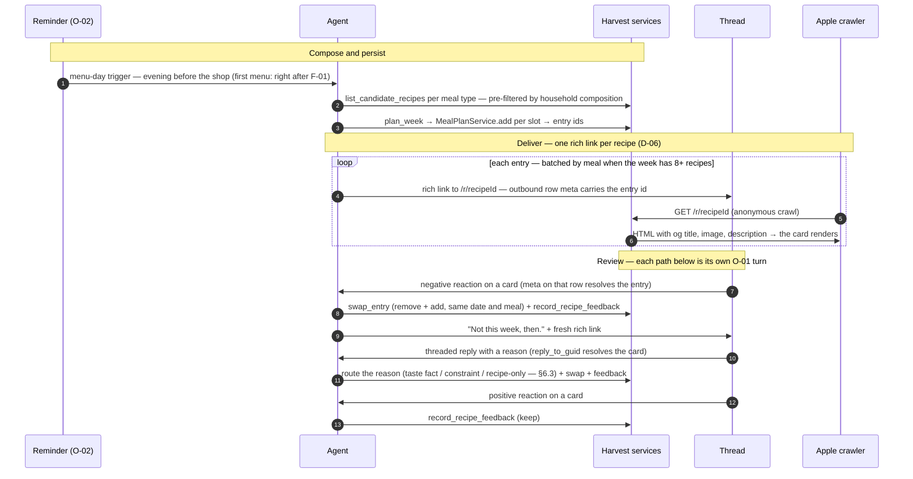
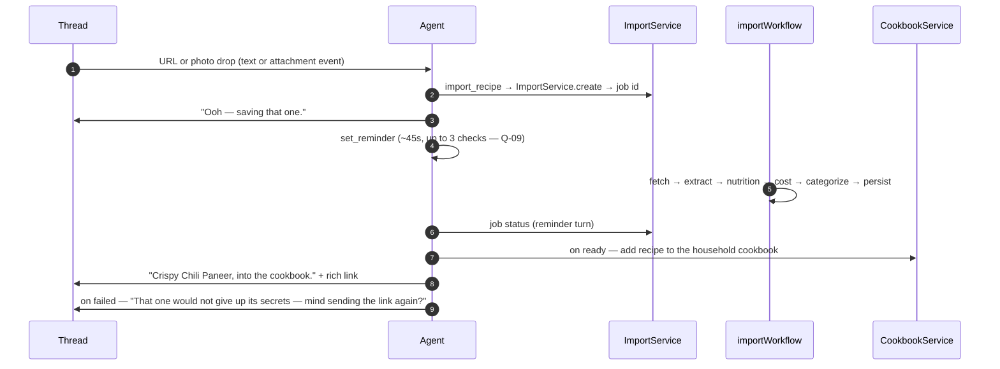
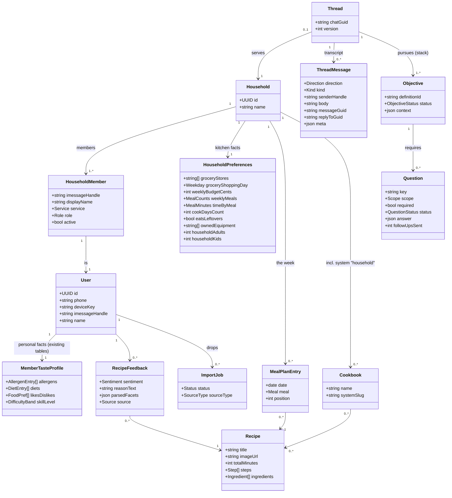

# Harvest Chef Agent over iMessage — Design Document

An **agentic conversation service** — an LLM turn loop with typed tools over the existing
Harvest server — reached through the Photon Spectrum TS iMessage provider. Talking to it
feels like texting a private chef. Onboarding is the first workload; menu delivery, review,
and drop-a-recipe run on the same loop. This pass ships no code; the companion artifact
renders the scripted conversation.

# Reviews

| Reviewer | Status | Feedback |
|---|---|---|
| Jordan | changes_requested → re-review | R12: **the Voice split (D-17)** — decider emits a `ReplyPlan` (facts/intents/must-say + question updates, no prose), Voice renders it (personality, per-member degradation) under the fidelity rule; conversational flow-sub-agents argued out and recorded as rejected |

**Document map** — the design is a sequence of increments:
[`01-agent-architecture.md`](./01-agent-architecture.md) (the agent machine — reasoning &
response components, working memory, commands, the durable turn) · [`02-onboarding.md`](./02-onboarding.md)
(the first objective, built on 01) · **this file** (later increments — menu delivery &
review, recipe drops — plus the shared decision ledger, entities, and APIs) ·
[`prior-art-poke-parlant.md`](./prior-art-poke-parlant.md) (Poke & Parlant studies).

---

# Moved out of this document

The **agent machine** (reasoning & response components, objectives/commands, working-memory
tables, the durable turn, modules) is [`01-agent-architecture.md`](./01-agent-architecture.md).
**Onboarding** (the first objective, its script, group mechanics, household tables, field
map, concurrency/proxy semantics) is [`02-onboarding.md`](./02-onboarding.md). This document
retains the later increments (F-02–F-04), the entities/APIs they add, and the shared
decision ledger.

---

# Use Cases

| ID | Flow | Goal |
|---|---|---|
| F-01 | Onboard a household | A group thread answers ~19 questions; every answer lands on the right server row; the thread ends with a first menu promised |
| F-02 | Deliver & review a menu | The week arrives as rich links; tapbacks and replies keep/swap recipes and capture the why |
| F-03 | Drop a recipe | Any URL/photo dropped in the thread becomes a cookbook recipe via the existing import pipeline |
| F-04 | Member joins/leaves mid-flow | Membership changes without corrupting anyone's data; safety facts outlive membership |
| O-01 | Process a message event | The reusable operation every flow is made of: receive → drain outbox → claim → brief the chef agent → tool loop → commit → deliver |
| O-02 | A reminder fires | Follow-ups, import checks, and menu-day delivery wake the chef without any in-process timer |

The conversational spec these flows implement — the chef voice, the 19-step reference
script (with the correction, the re-prompt, the chicken drill-down, the budget question,
and the cookbook drop), and the group mechanics (attribution by sender, LLM-resolved
corrections, per-member SMS/RCS degradation, conflicts, joins) — is **Appendix C**, and is
rendered end-to-end in the artifact. The messaging-substrate capability table (what Photon
supports, what needs iOS 26, and each fallback) is **Appendix D**. Constraints that bind
everything: dedicated Photon line required for groups; 50 new conversations/line/day;
polls/backgrounds excluded (iOS 26); rich-link cards are built by Apple crawling the target
page's Open Graph tags.

---

# Use Case Implementations

## O-01 — Process a message event

Moved to [`02-onboarding.md`](./02-onboarding.md) — the full
18-step turn, the interruption model, and the `MessageEventProcessor`/`claim()` code.

## F-01 — Onboard a household

Moved to [`02-onboarding.md`](./02-onboarding.md) — the full
sequence diagram, 12-step narrative, and identity/write-through mechanics.

## F-02 — Deliver & review a menu

### F-02, step by step

1. **The reminder fires** — the evening before `grocery_shopping_day` (Sunday evening when
   null); the first menu skips the wait and triggers straight from F-01. The trigger is a
   `timer` row plus doorbell, so it re-runs safely if the invocation crashes.
2. **The agent pulls candidates per meal type.** `RecipeService.candidates` ranks by
   preference weights and hard-filters by the household composition view (union of active
   members' severe allergens and strict diets) — safety filtering happens at this single
   server-side chokepoint, so nothing unsafe can even be *offered* to the model.
3. **`plan_week` persists the chosen week** — one `MealPlanService.add` per slot, returning
   entry ids. The plan is household-scoped rows; the agent composed it, the server owns it.
4. **One rich link per recipe goes to the thread** — its own message, so a later reaction
   binds to exactly one dish (D-06). The outbound row's `meta` stores `mealPlanEntryId`;
   that mapping is how step 7 will resolve a 👎 to a plan entry. Weeks of 8+ recipes
   deliver in per-meal beats (breakfasts / lunches / dinners), each with its own review
   window.
5. **Apple's crawler fetches the recipe page anonymously.** This is why `/r/:recipeId` must
   be public, server-rendered, and JS-free (D-05) — the crawler runs no scripts and sends
   no cookies.
6. **The page returns OG meta and content**, and the card renders in the thread with photo,
   title, and site name. SMS/RCS members see a titled URL instead — same information, no
   card.
7. **A negative reaction arrives** as a reaction event; the reacted-to message's `meta`
   resolves which plan entry is being vetoed. Sentiment is read in context (any negative
   emoji), not matched against a fixed list.
8. **The swap executes**: `MealPlanService.remove` + `add` on the same date and meal with a
   fresh candidate, plus a `recipe_feedback` row (`swap`). Swaps are unlimited and
   unceremonious.
9. **The chef replaces the card** — one line, one fresh rich link, no re-pitch of the week.
10. **A threaded reply carries a why.** `reply_to_guid` resolves the card, and the reason
    routes by what it actually is (§6.3): a taste fact writes the relevant member's
    profile, a constraint fact writes the household's, a recipe-only reason becomes
    feedback and steers this swap alone. The acknowledgment states the consequence in
    voice, never the routing.
11. **The routed writes execute** through the same validated tools as onboarding — a
    review-time correction is mechanically identical to an onboarding answer.
12. **A positive reaction** needs no reply at all —
13. **it lands as a `recipe_feedback` row (`keep`)**, quietly accumulating the signal the
    after-first-night check-in and future ranking will use.

## F-03 — Drop a recipe → household cookbook

### F-03, step by step

1. **A URL or photo lands in the thread** as an ordinary inbound event (an O-01 turn). The
   model recognizes it as a recipe drop from context — a TikTok link, an Instagram share, a
   photo of a cookbook page.
2. **`import_recipe` calls the existing `ImportService.create`** with `{url}` or
   `{image_ref}` — the same entry point the app's share extension uses — which enqueues the
   job on the existing `import-intake` queue and returns a job id. Nothing about the import
   pipeline changes.
3. **The chef acks immediately in voice.** The user's part is done; everything else is
   background.
4. **A reminder is set (~45 seconds)** to check the job — polling through the existing
   `GET`-job-status path rather than modifying the pipeline to push events (that push is
   the recorded upgrade, Q-09). Up to three checks before the chef reports a delay.
5. **The existing durable `importWorkflow` runs unchanged** — fetch, extract (LLM),
   nutrition, cost, allergens, categorize, persist — writing the recipe with
   `user_id = importer`. Its durability is WDK's, not ours.
6. **The reminder turn reads the job status.** A `queued`/`running` job schedules one more
   check; `ready` and `failed` proceed to steps 7–9.
7. **On `ready`, the recipe joins the household cookbook** — `CookbookService` membership
   into the `system_slug: "household"` cookbook (the one created with the household,
   §6.4). It is now also in the candidate pool for future weeks.
8. **The chef announces it with a rich link** to the recipe's own page — the payoff bubble
   that teaches the household the drop habit.
9. **On `failed`, the chef says so honestly and lightly**, and asks for the link again.
   Import failures are already classified by the pipeline (`error_code`); the copy stays
   human regardless of cause.

## F-04 — Member joins / leaves mid-flow

`addMember` → the Courier writes a `member_event` row → an O-01 turn greets, asks a name,
and calls `POST /v1/households/:id/members` immediately (membership is identity, and
cheap). Household slots are not re-asked; the joiner's per-person slots are appended to
the question list and woven in at the next pause. `removeMember`/`leaveSpace` → soft-deactivate
(`active: false`); the member's rows remain; composition skips inactive members **except
allergens**, which stay honored until the room answers *"should I still cook around
[name]'s peanut allergy?"* No sequence diagram — it is two service calls inside O-01.

---

# Entities

`MemberTasteProfile` is a view name, not a table — it is the existing `user_allergens`,
`user_diets`, `user_food_prefs`, `user_preferences.skill_level` rows, unchanged, now with
true owners. The **household composition view** (allergens: union + max severity; diets:
union + strict-wins; dislikes: union; likes: union minus collisions; skill: min across
active members) is a server-side read over this model at the `GET /v1/recipes` chokepoint.

---

---

# Runtime, Tables & Modules — moved

The runtime (the durable turn, Courier / MessageEventProcessor / reasoning & response
components, outbox), the module layout, and the working-memory tables (threads,
thread_messages) live in [`01-agent-architecture.md`](./01-agent-architecture.md); the
household tables (households, household_members, household_preferences,
`users.imessage_handle`) live in [`02-onboarding.md`](./02-onboarding.md). This document
keeps only what later increments add.

## Tables — increment 02 additions (menu delivery & review, drops)

**`recipe_feedback`** — append-only event log:

| Column | Type | Constraints | Notes |
|---|---|---|---|
| id | text (UUID) | pk | |
| user_id | text | not null, fk users.id, cascade | who said it |
| recipe_id | text | not null, fk recipes.id | |
| sentiment | text enum | not null | `keep` \| `swap` |
| reason_text | text | | verbatim utterance — lowest granularity kept |
| parsed_facets | text (JSON) | | parser output, for audit/re-parse |
| source | text enum | not null | `imessage` \| `swipe` \| `app` |
| created_at | timestamp | not null | non-unique index `(user_id, recipe_id)` |

Changes to existing tables: `meal_plan_entries` + `household_id` (fk, nullable during
migration; `user_id` remains author) · `cookbooks` + `household_id` (nullable fk; unique
`(household_id, name)`; the `system_slug: "household"` cookbook created with the household).
Migrations are additive; they ship with increment 02.

---

# APIs

**The agent consumes none of these.** It runs in the server codebase and calls the
services directly (§Modules) — HTTP contracts exist for *clients*. Two tiers:

- **Required now:** `GET /r/:recipeId` — its client is Apple's link crawler.
- **The app's migration surface — ship when the app adopts households:** the household and
  member-preference endpoints below (they also pin down the service semantics the agent's
  tools use), `GET /v1/recipes` (also wanted by the swipe deck), and the feedback endpoint.
  Until then the app's existing `GET/PUT /v1/preferences` becomes a **compat façade**: the
  server resolves the caller's household and reads/writes through, so mobile migrates on
  its own schedule.

Reused unchanged (by the app and the import pipeline): `POST /v1/imports`,
`GET /v1/imports/:id`, `PUT /v1/recipes/:id/cookbooks`, `GET /v1/taste-options`,
`POST /v1/meal-plan`, `DELETE /v1/meal-plan/:id`. New contracts:

## Plan candidates `GET /v1/recipes`

Bearer auth. Query: `meal_type` (`breakfast|lunch|dinner`), `limit` (default 20),
`exclude` (comma-separated ids).

### Success Response `200`
- Body: recipes: `[{id, title, image_url, total_minutes, servings}]` — ranked by
  preference weights, **hard-filtered by the household composition view** (severe
  allergens + strict diets) at this single chokepoint. Shared with the swipe-deck feed.

## Recipe feedback `POST /v1/recipes/:id/feedback`

Bearer auth. Body: feedback: `{sentiment: "keep"|"swap", reason_text?, parsed_facets?,
source: "imessage"|"swipe"|"app"}`. Success `201`.

## Recipe page `GET /r/:recipeId`

Public (capability URL — D-05), no auth, no client JS.

### Success Response `200`
- Headers: content-type: `text/html`, x-robots-tag: `noindex`
- Body: SSR HTML — `og:title`, `og:image` (= `recipes.image_url`), `og:description`
  ("35 min · serves 4"), `og:site_name`; ingredients + `recipe_steps.text`. Styled from
  the design-system tokens compiled to static CSS (no RN component reuse — D-09).

### Not Found Response `404` — plain HTML

## Field map

Moved to [`02-onboarding.md`](./02-onboarding.md) — every
conversation step → the row and tool it lands on.

---

---

---

# Testing, Deployment & Monitoring — split by increment

Increment 01's testing (golden-transcript harness, tool/turn units, household integration,
live-thread E2E), migrations, deploy sequence, rollback, and core turn metrics moved to
[`02-onboarding.md`](./02-onboarding.md). Increment 02 adds:
recipe-page OG integration tests, composition-view units (max-severity, strict-wins,
dislike-beats-like, min-skill, inactive-member retention), F-02/F-03 eval scenarios, the
`recipe_feedback`/meal-plan/cookbook migrations, and the menu metrics
(`chef_menu_delivered_total{on_time}`, `chef_import_drop_outcome_total{status}`).

---

# Decisions

**D-08 — Household is a first-class entity** *(supersedes D-01's one-merged-account
design).* Founder decision; the domain agrees. Per-person facts on members' own rows;
household facts on the household; merges become composition-time reads at the server
chokepoint. Owner manages member profiles until claimed. *(Rejected: merged account —
lossy, unattributable safety data; household-as-tag — preferences left homeless.)*

**D-10 — Agentic system, not a scripted state machine** *(supersedes R1's parser/binding
rules).* The LLM owns language (corrections, proxy answers, banter); deterministic code
owns the question list, validation, safety, delivery. The model owns language, the tools own
truth. *(Rejected: intent-classifier + state machine — every correction style becomes a
new rule; unmediated LLM writes — unvalidatable.)*

**D-11 — Durable thread state in Turso; write-through on confirmation** *(supersedes
"session in memory" and the end-of-flow flush).* Every event is a row before it is an
action; confirmed slots write through their tools immediately (idempotent read-merge-write);
turns are CAS-single-flight; sends are `clientGuid`-idempotent. A crashed process loses
nothing and resumes mid-conversation. *(Rejected: Cloudflare Durable Objects — the cleaner
actor model, but a second platform whose two headline properties, single-flight and
durable timers, one integer column and the existing WDK already provide; the Spectrum
Courier must be a Node process regardless. The thread-keyed boundary keeps a later DO port
mechanical if turn concurrency or timer scale ever hurts.)*

**D-17 — What-to-say and how-to-say-it are separate stages (the Voice split).** The
decider (`ChefAgent`, Mastra) pursues the objective and emits a `ReplyPlan` — facts,
intents, `must_say` safety items, question updates — with zero personality instructions;
**Voice** renders it in the chef's voice with per-member degradation, bound by the
fidelity rule (rephrase freely, never add/drop/soften facts — prompt-contracted,
rubric-judged). Precedent is unanimous: Poke's executors are told "you are not responsible
for framing" while its Interaction Agent owns voice; Parlant's pipeline decides what
applies and a separate MessageGenerator composes; classic NLG separates content
determination from surface realization. Costs, accepted knowingly: one extra LLM call per
turn (Voice is small, tool-less, and a cheap-model candidate — Q-10), and fidelity cannot
be schema-enforced. *(Rejected: conversational flow-sub-agents — the full argument is
recorded in the R12 review exchange: relay loss on every nuance, Poke's economics without
Poke's async justification, fragmented dialogue state, a router that must track
cross-flow state in group chat, and the measured routing-as-failure-point result;
single-prompt persona+logic — the R4–R11 design — where charm and enum-extraction degrade
each other and voice can't be iterated or judged independently.)*

**D-16 — Goal orientation is CALM's architecture, implemented on our stack.** Adopted
from [Task-Oriented Dialogue with In-Context Learning](https://arxiv.org/abs/2402.12234)
(the CALM paper): declared objectives own their required information; the model translates
conversation into structured commands against those declarations; a stack handles
digressions and resumption; the active objective scopes the exposed tool set (per Pipecat
Flows). *(Rejected: adopting Rasa Pro itself — a Python runtime + action server + tracker
store contradicting R5/D-11, with a ~1k-conversations/month free-tier ceiling; **adopting
Parlant's runtime** — Apache-2.0 and cap-free, so licensing is fine, but the engine is a
Python server with its own session state and HTTP tool services (the TypeScript SDK is a
client to it), colliding with R5, D-11, D-15, and our outbox/claim/barrier mechanics —
Parlant is this design's reference implementation to study, not a dependency; a flat
question list with a `phase` enum — the R4–R9 design — which handled one goal but had no
answer for goal #2 or for digressions.)* **Research addendum (2026-08-28):** a deep-research
pass (22 sources, 3-vote adversarial verification) confirmed the shape is convergently
validated in 2026 (Parlant's Guidelines/Journeys; ATOD-Eval and GODR arguing explicit
structure for exactly our hard cases) and added two bindings: objectives never declare
conversational paths (external turn-routing is the measured anti-pattern — arXiv:2604.27891),
and instruction bodies are condition-gated. The bitter-lesson objection is unsupported for
goal/slot *tracking*; it holds only for execution orchestration, which we already leave to
the model (D-10).

**D-15 — The agent harness is Mastra, not hand-rolled.** Founder call, and the build-vs-buy
math agrees: the tool loop, Zod tool schemas (`createTool` — the same schemas our HTTP layer
uses), model routing, retries, conversation memory, and observability are commodity harness
— Mastra provides all of it, and its default storage (`@mastra/libsql`) speaks our Turso
database natively. What stays ours is exactly the domain: the Courier (the iMessage
channel), the `MessageEventProcessor` shell (outbox, claim, interruption barriers, commit),
`thread_messages` as channel truth (guids, attribution, outbox — Mastra's Memory holds the
*agent's* conversational view in the same database), Questions, `SaveResult` inside each
tool's `execute`, and WDK reminders. *(Rejected: hand-rolled harness — reinvents maxSteps,
tool validation, memory windowing; adopting Mastra's workflows too — WDK already runs the
import pipeline, no reason to migrate it.)*

**D-14 — `thread_messages` is the transactional outbox, on both sides; the queue is only
a doorbell.** The failure Jordan named: a crash between "record the event" and "process
it," or between "commit the reply" and "send it," strands work. The remedy is outbox
semantics without a new table, because the transcript already is one. **Inbound:** the
row is the work and `threads.last_inbound_id` is the cursor — `MessageEventProcessor` processes *all*
rows past the cursor, never just the event that woke it, so doorbells are hints:
duplicated, redelivered, or lost ones are all harmless. **Outbound:** replies commit as
rows with `sent_at NULL` in the same transaction as the cursor and question updates;
delivery marks `sent_at`; every `MessageEventProcessor` drains NULL rows *before* doing anything else,
and Photon dedups on `clientGuid`. **Liveness backstop:** a one-minute sweep (Nitro cron)
enqueues a doorbell for any thread with unprocessed inbound or unsent outbound — so a
lost doorbell delays work by at most a minute instead of stranding it. *(Rejected: a
separate outbox table — duplicates the transcript; per-event queue payloads — makes
ordering and replay the queue's problem instead of the cursor's.)*

**D-13 — Turns start immediately; mid-turn arrivals cancel and restart the turn.**
How production chat systems handle interruption: voice agents cancel the in-flight
response on barge-in (OpenAI Realtime `response.cancel`/`conversation.item.truncate`);
chat UIs abort generation when a new message lands and regenerate against the fuller
conversation. Ours is the text-channel version with a free advantage — nothing streams
into iMessage, so a cancelled turn was never visible. Barriers before any write tool and
at the send gate; max 2 restarts, then reply to what was current. *(Rejected: fixed
debounce — a minimum-latency floor on every reply to optimize the rarer burst case.)*

**D-12 — Members are identified by `imessage_handle`, not phone.** Spectrum's
`sender.address` may be an Apple ID email. Third nullable-unique identity key on `users`,
following the existing pattern (`phone`, `device_key`).

**D-09 — The recipe page does not reuse the app's RN components.** Investigated:
`react-native-web` not installed; `expo-image`/`expo-haptics` native-only across the
recipe UI; no SSR/static web output in this Expo Router config — and OG crawlers require
server HTML. The page reuses the **design system** (golden-hour tokens, elevation → static
CSS). *(Rejected: react-native-web refactor; a Next.js site for one page.)*

**Standing:** D-02 *dissolved in R5* — direct service access removed the token and payload
constraints that pinned identity to step 5; identity is now created at step 4, the moment
the household becomes a fact, and the handle is channel-verified (no OTP — possession is
proven by the inbound message) · D-03 no polls — numbered replies + tapbacks
(iOS 26) · D-04 tapback acks; text confirmations reserved for safety consequences · D-05
recipe pages are public capability URLs, `noindex` — an authenticated page can never
unfurl · D-06 one rich link per message so reactions bind per-recipe (card `meta` →
`mealPlanEntryId`) · D-07 the agent composes, the server persists (`plan_week`/`swap_entry`
over the existing entry API).

---

# Open Questions

| ID | Question | Status | Resolution |
|---|---|---|---|
| Q-01 | Do polls/backgrounds degrade or fail on pre-iOS-26 recipients? (Moot for v1.) | open | |
| Q-02 | "Separate households" at step 4 — fork to DMs, or two interleaved sessions? | open | |
| Q-03 | Photon uplift past 50 new conversations/line/day before launch? | open | |
| Q-04 | Claim flow when an `imessage_handle` matches an existing app account — merge semantics? | open | |
| Q-05 | Ranked-candidates endpoint | resolved | Specified as `GET /v1/recipes`; shared with the swipe deck |
| Q-06 | Domain for recipe pages (`og:site_name`, card rendering) | open | |
| Q-07 | Kid (non-texting) member profiles vs. recording their facts on a parent (v1: parent's profile; composition unions anyway) | open | |
| Q-08 | Where the Courier process lives (Fly/Railway/EC2) — the only non-serverless piece | open | |
| Q-09 | Import completion: timer-polling (`GET /v1/imports/:id`) ships v1; job-ready event from `importWorkflow` onto `inbound_message_events` is the upgrade | open | |
| Q-10 | Turn-loop model: `gpt-5.6-luna` (existing infra) vs. Claude — decide by golden-transcript eval scores | open | |
| Q-12 | Is household onboarding complex enough to need the full goal stack, or would condition-gated guidance alone suffice (GODR self-scopes away from "simple guided processes")? The stack is one JSON array — cheap to keep — but the golden-transcript evals should watch for stack machinery ever *causing* a failure a flat design wouldn't have | open | |
| Q-11 | Verify Photon's server-side dedup semantics for `clientGuid` (their recovery guidance implies it; the docs don't state the guarantee). If weaker than implied, flip the outbox to stamp `sent_at` before sending — rare loss instead of rare duplication | open | |

---

# Appendix A — Changelog

| Date | Author | Change |
|---|---|---|
| 2026-08-27 | Claude (w/ Jordan) | R1: capability table, field map, script, group mechanics, in-memory session; first-plan delivery; household first-class |
| 2026-08-27 | Claude (w/ Jordan) | R2: agentic system core (runtime, durable state, L1/L2/L3, tools, guardrails); corrections LLM-driven; `imessage_handle`; budget step; recipe drops; D-09 |
| 2026-08-28 | Claude (w/ Jordan) | **R13:** decomposed — objective framework + onboarding (script, mechanics, F-01, field map, concurrency/proxy semantics) extracted to `02-onboarding.md`; this doc is now the runtime/platform half |
| 2026-08-28 | Claude (w/ Jordan) | **R12:** what/how split adopted (D-17) — `ChefAgent.generate → ReplyPlan` (no prose, no persona), new `Voice` layer renders sends (bubble rhythm, tapbacks, SMS/RCS degradation) under the fidelity rule with `must_say` safety items; O-01 redrawn (18 steps) with Voice as a participant; persona moved out of the decider's L1 into Voice; rejected alternative (flow-sub-agents) recorded with the six-argument case |
| 2026-08-28 | Claude (w/ Jordan) | **R11:** deep-research pass (104 sonnet agents, 22 sources, 92 claims → 25 verified → 16 confirmed) on "is CALM still SOTA": convergently validated, not superseded; [Objectives](./02-onboarding.md) gains the verdict + two bindings (no conversational paths in definitions; condition-gated guidance); D-16 research addendum; Q-12 (is the stack over-machinery for onboarding — evals referee) |
| 2026-08-28 | Claude (w/ Jordan) | **R10:** [Objectives](./02-onboarding.md) added — CALM's architecture stolen, runtime rejected (D-16): `ObjectiveDefinition` (instructions, requirements, scoped tools, trigger) registered in code; `threads.objectives` goal stack replaces `phase` + flat `questions`; digressions = push/complete/pop (F-03 becomes an objective, not a special case); briefing leads with the active objective and exposes only its tools; CALM→ours mapping table; paper linked (arXiv:2402.12234); placed first in the document as the foundational abstraction |
| 2026-08-28 | Claude (w/ Jordan) | **R9b:** question-status ownership resolved per Jordan — the **agent** judges answered-ness from the transcript (`ChefReply.question_updates`); the processor applies updates enforcing one invariant: `answered` requires the value to have landed via a successful tool write. Removes the runner-updates-status-from-tool-results framing |
| 2026-08-28 | Claude (w/ Jordan) | **R9:** O-01 redrawn truthfully for the Mastra harness — the agent executes tools itself inside `generate` (validation = Mastra against each tool's Zod `inputSchema`); barrier ownership split precisely: staleness guard in every write tool's `execute` (aborts the generation), send-gate re-check in the Processor; narrative renumbered to 16 steps. "Roster" concept deleted — it duplicated `HouseholdMember`; the briefing loads the household (entity + preferences + members) |
| 2026-08-28 | Claude (w/ Jordan) | **R8b:** roster defined precisely (`RosterEntry` type in §Briefing; O-01 step 7 narrative) — surfaced a gap: `sender.service` had no storage, so quiet members' SMS/RCS status was unknowable → new `service` column on `household_members`, set at membership creation, refreshed by the Courier on change |
| 2026-08-28 | Claude (w/ Jordan) | **R8:** every sequence diagram now `autonumber`ed with a step-by-step narrative (2–3 sentences per step) naming the actor and the enforcement point — inbound dedup = our unique index on `message_guid`; single-flight = SQLite's atomic conditional UPDATE; outbound idempotency = our `sent_at` gate (layer 1) + Photon's `clientGuid` dedup for the accept-to-stamp window (layer 2, verification = Q-11); F-01/F-02/F-03 diagrams flattened to portable syntax (no rect/alt nesting) |
| 2026-08-28 | Claude (w/ Jordan) | **R7:** queue topic renamed `inbound_message_events`; consumer renamed `MessageEventProcessor` (class, `process()`); **agent harness = Mastra (D-15)** — `chef-agent.ts` is a Mastra `Agent` (persona instructions, model routing, `createTool` tools sharing the HTTP Zod schemas, `Memory` on `@mastra/libsql` against the same Turso, `lastMessages: 30` replacing the hand-rolled window, `maxSteps: 6` replacing the hand-rolled tool-round cap); O-01 diagram + implementation code re-drawn; module layout updated |
| 2026-08-28 | Claude (w/ Jordan) | **R6:** screaming-architecture pass — components renamed for intent (`Courier`, `MessageEventProcessor`, `Briefing`/`prepareBriefing`, `Chef`/`ChefReply`, `Reminders`/`set_reminder`) with a `server/src/chef/` layout that screams the domain; `MessageEventProcessor` implementation + the atomic CAS `claim()` shown as code; **D-14 transactional outbox** — `thread_messages` is the outbox on both sides (inbound: rows + cursor, doorbells are hints; outbound: `sent_at NULL` rows drained at every wake), one-minute sweep as liveness backstop; fixes the crash-between-commit-and-send gap Jordan identified |
| 2026-08-27 | Claude (w/ Jordan) | **R5:** the agent is in-process — tools call services directly (no HTTP, no tokens); `SaveResult` documented as turn-scoped return value, never persisted (rejects → structured logs + `chef_tool_rejects_total`); identity creation moves to step 4 with channel-verified handles (D-02 dissolved); F-01/F-02/F-03 diagrams re-drawn service-first; APIs section re-tiered (required now: `/r/:id`; household endpoints = app migration surface) |
| 2026-08-27 | Claude (w/ Jordan) | **R4:** turn trigger redesigned — no debounce; immediate start + interruption barriers (write-tool + send-gate) with bounded cancel-and-restart (D-13), grounded in Realtime-API barge-in / chat-app regenerate patterns; `SaveResult {saved, rejected[{input, reason, closest}]}` replaces "consequence report" (screaming-architecture pass); checklist/slots renamed **Questions** (`unasked \| asked \| answered \| defaulted`, required flag, follow-ups) — the agent asks questions and follows up when required ones go unanswered; D-11 gains the Durable Objects rejection |
| 2026-08-27 | Claude (w/ Jordan) | **R3: restructured per /writing-design-documents** — use cases + sequence diagrams (F-01..F-04, O-01), entity diagram, modules + dataflow diagrams, API contracts, deployment plan, monitoring; **end-of-flow flush replaced by write-through-on-confirmation** (D-11) — the flush model contradicted the tool design; script/mechanics → Appendix C, capability table → Appendix D |

# Appendix B — Sources

**Prior-art study**: [`prior-art-poke-parlant.md`](./prior-art-poke-parlant.md) — how Poke
(leaked prompts + OpenPoke reconstruction) and Parlant (source-level read, file:line) are
designed: sequence + dataflow diagrams, memory models, cost accounting, and the comparison
table mapping both onto this design's decisions.

- Photon Spectrum TS docs (crawled 2026-08-27): provider overview, connection-and-routing,
  12 messaging-feature guides, core content/reaction/space pages, recovery best practices.
- App: `app/(onboarding)/flow.tsx`, `lib/onboarding.ts`, `components/onboarding/*`,
  `app/recipe/[id].tsx`, `components/recime/*`, `app.json`, `package.json`.
- Server: `server/src/index.ts`, `schemas.ts`, `preferences-dto.ts`, `schema.ts`,
  `import-service.ts`, `workflows/import-workflow.ts`, `parse/extractor.ts`,
  `services/cookbook-service.ts`, `nitro.config.ts`, `queue.ts`, `db.ts`.
- Method: `/writing-design-documents` (structure), `vertical-agent-design` (context
  tiers, tools that report what changed and what was rejected).

# Appendix C — The Conversation (functional spec)

Moved to [`02-onboarding.md`](./02-onboarding.md) (voice, the
19-step reference script, group mechanics).

# Appendix D — Messaging substrate (Photon Spectrum TS)

Photon's docs state **no iOS version gates**; the floors below are Apple-client knowledge.

| Primitive | API | Apple floor | Used? |
|---|---|---|---|
| Text | `space.send("…")` | any | Yes — backbone |
| Typing indicator | `space.responding(fn)` | DMs any; groups iOS 26 | Yes (harmless degrade) |
| Streaming text | `text(asyncIterable)` | edits ≈iOS 16; SMS waits for completion | Selective (long bubbles) |
| Tapbacks send (classic 6) | `message.react(Emoji.like)` | any | Yes — acks |
| Tapbacks receive (any emoji) | `appliedReactions` | custom-emoji send needs iOS 18; receive any | Yes — events, read in context |
| Threaded replies | `message.reply(…)` | iOS 14 | Yes — nudges, review reasons |
| Rich links | `richlink(url)` | any (Apple crawls target OG) | Yes — menus, drops |
| Effects | `effect(…, confetti)` | iOS 10 | Once |
| Edit / unsend | `message.edit()/.unsend()` | iOS 16 | No |
| **Polls** | `poll(…)` | **iOS 26** | **No** — numbered replies |
| **Chat backgrounds** | `background(…)` | **iOS 26** | **No** |
| iMessage App cards | `customizedMiniApp` | needs our shipped Messages extension installed | No (static preview = a rich link, free) |
| Read receipts | `content.type === "read"` | best-effort | Never gates logic |
| Groups / membership / events / rename | `im.space.create`, `addMember`… | **dedicated line (Business)** | Yes — required |
| Contact card | `shareContactCard()` | any | Yes — first message |
| Attachments | `message.content`, `getAttachment` | any | Yes — photo drops |
| Sender identity | `sender: {address, country, service}` | n/a | Yes — handle + degradation |

Widget fallbacks: chip grid → numbered list; pills → numbered list; slider → number by
example; stepper → counts in one line; toggle → 👍/👎 or text; taste search → free text
grounded by `search_catalog`; severity dropdown → one follow-up when triggered.
