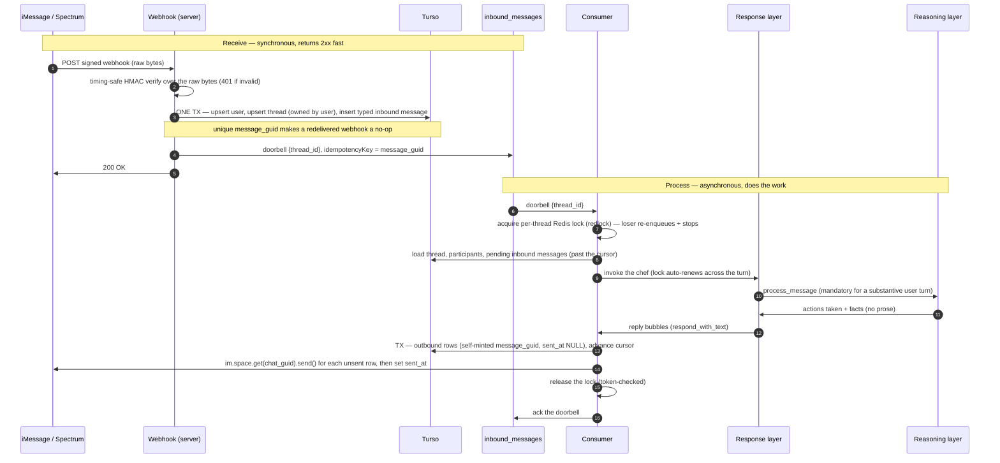

# Onboard Users via iMessage — Increment 1: Substrate & Response

**The program.** Let a household onboard to Harvest by texting our iMessage number, talking
to a warm "private chef."

**This increment's deliverable — process the first inbound message.** A person texts the
number for the first time; we record them and their thread, run the chef, and reply. When it
ships you can text the number and get one coherent, in-character reply, delivered durably and
without duplicates. It does **not** onboard anyone yet: no objectives, no questions, no
preferences written. The point is to make the whole pipe walk — including the
response→reasoning seam — so increment 2 fills the reasoning layer with onboarding logic
without touching the plumbing. The same pipe handles later messages; the first message is
just the deliverable we prove it on.

## Scope

| In scope (increment 1) | Deferred |
|---|---|
| Spectrum: webhook receive + send + HMAC verification | Objectives, questions, the goal stack → increment 2 |
| Persist user + thread + inbound message (one transaction) | Household as a first-class entity; preferences → increment 2 |
| Doorbell → queue → consumer | Interruption / cancel-and-restart |
| The chef: response layer (outer) → `process_message` → reasoning layer (inner) | Per-member rendering, tapbacks, SMS/RCS degradation |
| Compose and **send** a reply, durably and idempotently | The DB single-flight lease / commit-CAS (see Concurrency) |
| Message-guid dedup + per-thread Redis lock + idempotent send | Reminders, menus, recipe drops |

Objectives and the objective stack are **increment 2**; the design for them lives in
[`01-agent-architecture.md`](./01-agent-architecture.md) and
[`02-onboarding.md`](./02-onboarding.md).

---

# Spectrum integration

The pieces this increment stands up on the Spectrum side (all verified against the docs):

- **Webhook registration.** Register our endpoint URL with Spectrum and store the returned
  **signing secret**. Spectrum POSTs message events to that URL (webhook mode — no long-lived
  process; runs as an ordinary serverless route).
- **Signature verification.** Each delivery is HMAC-signed over the raw body bytes. Verify
  with the signing secret using a **constant-time comparison** (`crypto.timingSafeEqual` or
  Spectrum's provided verifier) to avoid a timing side-channel. Prefer Spectrum's verifier if
  it exists — it already handles the raw-bytes + timing-safe details.
- **Sending.** The consumer sends the reply via `im.space.get(chat_guid)` then `.send(...)` —
  **no webhook `space` object and no long-lived connection are required, only the configured
  line credentials + the thread's `chat_guid`** (docs: "No webhook handler or space object
  from an event is required — only the chat GUID"). Each send passes the outbound row's
  `message_guid` as the idempotency key.
- **Line credentials / token.** Use **automatic discovery** — pass `projectId` +
  `projectSecret` to the `Spectrum()` call and omit explicit client tokens. The SDK then
  obtains and renews line tokens ("renewed at 80% of their TTL"); in serverless each cold
  start re-discovers a valid token, so there's nothing to manage. (Explicit `clients: [{
  address, token, phone }]` tokens are *not* SDK-renewed — avoid unless we have a reason.)

---

# Exactly what happens when a message is received

Two functions. The **webhook endpoint** is synchronous and fast — it only records the message
and rings a doorbell. The **consumer** does all the work asynchronously. The split exists
because the webhook has a hard 30s timeout, retries on timeout, and no dead-letter queue, so
running the LLM inline would risk duplicate turns and dropped events.

## A. Webhook endpoint — `POST /spectrum/webhook`

Serverless route. In order:

1. **Read the raw request body bytes.** Do not parse first — the HMAC is computed over the
   exact bytes on the wire, and re-serializing breaks verification.
2. **Verify the HMAC** over those raw bytes with the signing secret, using a **timing-safe
   comparison**. Invalid → `401`, stop.
3. **Parse the event and read its type** (text, reaction, reply, attachment, …). Increment 1
   *processes* only `text`; other types are still recorded (step 4) but the consumer treats
   them as non-substantive for now.
4. **One transaction** (so state is never half-created):
   - upsert the **user** by `imessage_handle` (the sender's address),
   - upsert the **thread** by `chat_guid` (the Spectrum space id), owned by that user
     (`owner_user_id`) since no household exists yet,
   - insert the **inbound message** into `thread_messages` (`type`, `message_guid`, `body`,
     `sender_user_id`).
   The **unique index on `message_guid`** makes a redelivered webhook a no-op insert — this is
   *inbound* dedup (Spectrum delivers at-least-once). Commit.
5. **Enqueue the doorbell** `{thread_id}` on `inbound_messages` with `idempotencyKey =
   message_guid` — this dedups only a redelivered *same* webhook, not later messages on the
   thread (see Idempotency & concurrency #2). Per-thread serialization is the consumer's Redis
   lock (#3), not the doorbell key.
6. **Return `2xx`.** No LLM work happened here, so this is well within the 30s timeout.

The transaction (4) commits **before** the doorbell (5), so the consumer never wakes to a
missing row.

## B. Consumer — queue trigger on `inbound_messages`

7. **Receive `{thread_id}`.** The message is in-flight under the visibility-timeout lease, so
   no other consumer processes this thread concurrently (see Concurrency).
8. **Load working context:** the thread; its **participants** (the users who belong to /
   have messaged on the thread — one for a 1:1, more for a group; for the first message, just
   the sender); and the **pending** inbound messages — those newer than the thread's cursor
   `last_processed_id`. If there are no pending *substantive* (text) messages → **ack and
   stop** (a duplicate or already-handled doorbell). For the first message, the cursor is null
   and pending is that one message.
9. **Invoke the chef** with that context (section C).
10. **Commit the turn in one transaction:** write the chef's reply as outbound
    `thread_messages` rows (`type=text`, `sent_at=NULL`, `message_guid` = a UUID we generate
    now), and advance the cursor to the newest processed inbound message.
11. **Deliver:** for each `sent_at=NULL` outbound row, `im.space.get(chat_guid).send(...)`,
    passing its `message_guid` as the send-idempotency key; on accept, set `sent_at`.
12. **Ack the doorbell.** If the consumer crashed before the ack, the doorbell redelivers; the
    next run delivers any `sent_at=NULL` rows first, then re-checks pending — so a crash yields
    neither a duplicate reply nor lost work.

## C. The chef

13. **Response layer** (outer — a Mastra `Agent`). Owns the persona and the user-facing
    conversation. Tools: `process_message` (delegate to reasoning) and `respond_with_text`
    (emit a reply bubble). **Rule: for any substantive user message it must call
    `process_message` before responding** — so the personality layer can never silently
    handle something that belongs to reasoning (e.g. ack a fact without persisting it). This
    is the Poke topology: the personality agent orchestrates and calls the "doing" as a
    capability.
14. **`process_message` tool → reasoning layer** (inner — a Mastra `Agent`). Pulls the
    current objective, the conversation history, and the participants (and household, once one
    exists); invokes its tools; and returns a structured summary of *what it did* (actions +
    facts), **not prose**. In increment 1 the objective is a single default "be a helpful
    chef" objective and there are **no domain tools yet**, so it returns "no actions —
    converse." Increment 2 replaces this with the objective stack and real commands; the seam
    is unchanged.
15. **Response layer composes the reply** from what reasoning returned, the persona, and the
    transcript, and emits it via `respond_with_text`. Those bubbles become the outbound rows
    committed in step 10.

---

# Tables (increment 1)

**`users`** — reuse the existing table; add one identity key:

| Column | Type | Notes |
|---|---|---|
| id | text (UUID) | pk |
| imessage_handle | text | nullable, **unique** — the Spectrum `sender.address` |
| name | text | nullable |

**`threads`** — one per iMessage space:

| Column | Type | Notes |
|---|---|---|
| id | text (UUID) | pk |
| chat_guid | text | not null, **unique** — the Spectrum space id |
| owner_user_id | text | not null, fk users.id — the thread's owner while no household exists |
| household_id | text | nullable — set in increment 2; takes precedence over owner when present |
| last_processed_id | text | cursor — the newest inbound message already handled |
| created_at / updated_at | timestamp | not null |

**`thread_messages`** — the transcript and the outbox:

| Column | Type | Notes |
|---|---|---|
| id | text (UUID) | pk |
| thread_id | text | not null, fk threads.id, index |
| direction | text enum | `inbound` \| `outbound` |
| type | text enum | `text` \| `reaction` \| `reply` \| `attachment` \| … (increment 1 processes `text`) |
| sender_user_id | text | fk users.id — the sender (inbound) |
| body | text | message text / payload |
| message_guid | text | **unique index** — inbound: Apple's id (dedup); outbound: our UUID (send-idempotency key) |
| sent_at | timestamp | outbound only — NULL until delivered |
| created_at | timestamp | not null |

---

# Idempotency & concurrency

The webhook and the queue are both **at-least-once**, and a thread can have more than one
message in flight — so four mechanisms, each doing one job:

1. **Inbound dedup** — the unique index on `message_guid`. A redelivered webhook re-inserts
   the same Apple guid, a no-op, so one inbound message = one row.

2. **Doorbell keyed by `message_guid`** — the enqueue passes `idempotencyKey = message_guid`.
   This is **not** a per-thread coalescer. Vercel Queue's idempotency is produce-time dedup
   over a fixed **retention window (24h default)**, *not* an in-flight lock that releases at ack
   (Q-3 — the earlier assumption was wrong, and confirmed wrong live: a second message deduped
   against the first thread doorbell minutes later, across a server restart). Keying on the
   message guid dedups only a genuinely redelivered *same* webhook; two *distinct* messages —
   even on one thread — each wake the consumer, which drains all pending past the cursor.
   Keying on `thread_id` would silently swallow every later message on a thread for 24h.

3. **Per-thread turn lock (Redis, via a well-implemented library)** — the real serializer.
   Processing a message **mutates the database mid-turn** (increment 2's command runners save
   preferences, advance objectives, create memberships), so guarding only the outbound send is
   insufficient — two concurrent turns would double-apply those writes. Even in increment 1
   (stub reasoning, no mid-turn writes) two concurrent turns would double-*reply*. So the
   consumer takes a **distributed lock keyed by `thread_id`** and holds it for the whole turn
   (reason → write → send); at most one processor works a thread at a time, different threads
   run in parallel. The critical section spans a multi-second LLM call in stateless serverless,
   so no held DB/advisory lock fits (a txn can't span the call; the queue has no ordering key to
   lean on) — it must be a lock with **TTL + auto-renewal + safe token release**, which is why
   we use **`redlock`'s auto-extending `using()`, never a hand-rolled lock**. The loser does
   **not** silently drop the message: it re-enqueues its doorbell (or the holder re-drains
   pending before releasing), so nothing is stranded — the failure mode that the `thread_id`
   dedup created. The exact library is pinned to the Redis we provision via the Vercel
   marketplace; `redlock` is the default.

   **Accepted ceiling — no fencing.** `redlock` issues no fencing token, so it's an
   *efficiency* lock, not a provably-safe one: a process pause (GC / VM suspend) past the lock
   TTL can let a second holder start while the first is still live, and both write. The safe fix
   is a **store-enforced monotonic fence token** (checked on every write) — deliberately **not**
   built. This race is rare and explicitly tolerated for now (Jordan, 2026-08-30); it isn't
   scheduled. If it ever bites, the fence goes in the DB, not the lock service.

4. **Idempotent send (`sent_at` gate)** — outbound rows carry a self-minted UUID `message_guid`
   (row identity) and `sent_at`. Only `sent_at IS NULL` rows are sent, and `sent_at` is stamped
   immediately after the send resolves, so a redelivered turn re-sends nothing on the common
   path. The SDK has **no send-idempotency key** (verified — `send()`/`text()` take none), so
   the `sent_at` gate, under the per-thread lock, is the outbound guard; the sole residual is a
   crash between the send accepting and the `sent_at` write.

---

# Decisions

**D1 — Response layer is the outer loop; reasoning is a tool.** The personality layer owns the
conversation and calls reasoning via `process_message` (Poke topology), rather than a
reasoning→response pipeline. Guard: `process_message` is **mandatory** for a substantive user
turn, so the personality layer can never silently skip persistence.

**D2 — One `message_guid` column.** No separate `client_guid`: inbound rows store Apple's guid
(the dedup index + the doorbell idempotency key); outbound rows store a UUID we mint at commit
time (row identity). Both share the unique index. Note: the outbound guid is *not* a Spectrum
send key — the SDK has none; the `sent_at` gate is the send guard.

**D3 — Durable outbound is in increment 1.** Outbound rows carry `message_guid` + `sent_at`
and are sent from the consumer, not inline in the webhook. Rationale: at-least-once delivery
would otherwise make the very first increment visibly double-reply on redelivery.

**D4 — Objective machinery is deferred to increment 2.** The response→reasoning seam is built
now; the reasoning layer has a single default objective and no domain tools. The seam does not
change when increment 2 adds objectives/commands.

**D5 — Serialization via a per-thread Redis lock (well-implemented lib), held across the whole
turn.** Coalescing-by-`thread_id` was struck: it was produce-dedup, not a lock, and it swallowed
every later message on a thread for 24h (Q-3). Because a turn mutates the DB mid-flight (inc-2)
and can double-reply (inc-1), only a real held lock is correct. It can't be a DB/advisory lock
(can't span the LLM call on serverless) or the queue (no per-thread ordering key), so it lives
in Redis via `redlock`'s auto-extending `using()`. **Fencing: deliberately omitted for now.**
`redlock` has no fencing token, so a process pause past the TTL can let two turns write
concurrently — an *efficiency* lock, not a provably-safe one. We accept this rare race for now
(Jordan, 2026-08-30) rather than build store-enforced fencing; the fix, if it ever bites, is a
DB-enforced monotonic fence token checked per write (not scheduled). Interruption
(cancel-and-restart) stays deferred to increment 2.

---

# Testing

Three layers, following `server/CLAUDE.md` (Vitest; unit for service methods, integration for
routes; **as few tests as cover the paths**; never test a third-party guarantee, a stub, or an
obvious Zod parse). DeepSeek and Spectrum are stubbed in automated tests and real only in the
manual round-trip.

## Unit

- **HMAC verification** — a valid signature passes; a tampered body, wrong secret, or missing
  header → `401`. The one security-critical branch, and it's pure. (The timing-safe compare is
  a property of the primitive; we don't assert timing.)
- **Consumer idempotency logic** — pending = inbound rows past the cursor; a redelivered
  doorbell whose cursor already advanced → no-op (ack, no send); an outbound row with `sent_at`
  set is never re-sent. Pure functions over fixture rows — no DB, no network.

Mock the chef (DeepSeek) and Spectrum; don't unit-test the model's output or Spectrum's
delivery.

## Integration

Wire the real webhook route and the real consumer to a `file:` test db, an in-memory queue, a
stub Spectrum sender, and a stub chef (fixed reply). Assert the paths, few enough to cover
them (runs under `vitest --config vitest.e2e.config.ts`):

1. **Happy path** — a signed webhook inserts user + thread + message in one transaction and
   enqueues one doorbell; the consumer writes one outbound row, calls the stub sender once, and
   advances the cursor.
2. **Duplicate inbound** — the same `message_guid` re-POSTed is a no-op insert (still one row),
   and coalescing produces no second doorbell.
3. **Redelivered doorbell** — running the consumer twice sends **once** (the `sent_at` gate +
   idempotent `message_guid`), not twice.
4. **Bad signature** — `401`, nothing persisted, no doorbell.

## Manual end-to-end — the acceptance test for increment 1

The real round-trip over live iMessage, with real Photon (project-id/secret **automatic
discovery**) and real DeepSeek:

1. Run the server locally (`npm run dev`) and expose it with a public tunnel
   (`ngrok http $PORT`).
2. Register the tunnel URL as the Spectrum webhook; store the returned signing secret in env.
3. **Jordan texts the Harvest number.**
4. **Confirm inbound received** — the server log shows the delivery, a passing HMAC check, and
   the inserted inbound `thread_messages` row (plus the doorbell). This is the "I received your
   message" confirmation.
5. **Jordan confirms the reply** — a chef-voiced text arrives back on his phone.

This human-in-the-loop test is increment 1's **definition of done**: a real text in, a real
reply out. The automated tests cover the branches; the manual test proves the live
Spectrum + DeepSeek integration that stubs can't.

---

# Integration facts (verified) & the one deferred knob

| ID | Question | Status |
|---|---|---|
| Q-1 | Send outbound outside a webhook request scope | **Resolved** — `im.space.get(chat_guid).send(...)`; no webhook space or persistent connection, only the line creds + `chat_guid` |
| Q-2 | Line token renewal without a persistent process | **Resolved** — use automatic discovery (`projectId` + `projectSecret`); the SDK renews, and each serverless cold start re-discovers |
| Q-3 | Doorbell dedup window releases at ack (not TTL) | **Resolved — NO (assumption was wrong).** Vercel Queue `idempotencyKey` dedup is a fixed ~24h retention window, not ack-scoped; confirmed live (a 2nd message deduped against the 1st thread doorbell minutes later, across a restart). So the doorbell is keyed by `message_guid`, and serialization is the Redis lock (#3), not the queue. |
| Q-4 | Visibility timeout vs. turn length | **Deferred** — the Redis lock's TTL + auto-renewal (`redlock` `using()`) spans the turn; the queue visibility timeout is just retry backing, no longer load-bearing for serialization |
| Q-5 | Redis provider + `redlock` compatibility (TCP client vs Upstash HTTP) | **Open** — pin at provisioning via the Vercel marketplace |

---

# What increment 2 adds

The reasoning layer gains the objective stack, the questions scoreboard, and the onboarding
`ObjectiveDefinition` with real commands; the household becomes first-class (a thread's
`household_id` supersedes its `owner_user_id`); the response layer gains per-member rendering
and tapbacks; and the DB lease + interruption harden concurrency. The substrate and the
response→reasoning seam built here do not change.

# Changelog

| Date | Author | Change |
|---|---|---|
| 2026-08-29 | Claude (w/ Jordan) | Written from Jordan's skeleton as the precise increment-1 build spec — response-outer-loop topology; the outbound send and the Spectrum-integration section |
| 2026-08-29 | Claude (w/ Jordan) | Review fixes: single transaction for user+thread+message; timing-safe HMAC; scope = process the first inbound message; thread owned by a user pre-household (`owner_user_id`); `thread_messages.type`; dropped `client_guid` (outbound uses a self-minted `message_guid`); clarified "participants" and the cursor/pending definition |
| 2026-08-29 | Claude (w/ Jordan) | Re-applied after an accidental editor overwrite; resolved Q-1 (`im.space.get` send outside the webhook), Q-2 (automatic-discovery tokens), Q-3 (dedup releases at ack) against the Spectrum/Vercel docs; Q-4 parked as a tuning knob |
| 2026-08-30 | Claude (w/ Jordan) | **Concurrency correction (live-verified).** Q-3 was WRONG: Vercel Queue `idempotencyKey` is ~24h produce-dedup, not ack-scoped — `thread_id` coalescing swallowed later messages on a thread. Struck coalescing; doorbell now keyed by `message_guid`. Serialization is a **per-thread Redis lock via `redlock`** (held across the turn — a DB/advisory lock can't span the LLM call on serverless, the queue has no ordering key), because processing mutates the DB mid-turn so guarding only the send is insufficient. Rewrote Idempotency & concurrency (#2–4), D2, D5, step 5, the diagram, Q-3/Q-4; added Q-5 (Redis provider). Fencing deferred to inc-2 (when mid-turn writes exist). |
