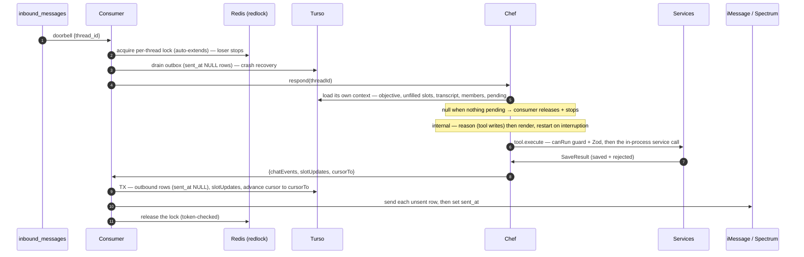
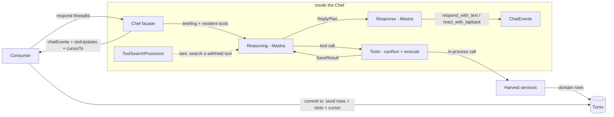

# Onboard Users via iMessage — Increment 2: Reasoning & Onboarding

**The program.** Let a household onboard to Harvest by texting our iMessage number, talking to
a warm "private chef."

**This increment's deliverable — onboard a household through conversation.** Increment 1 made
the pipe walk: a text arrives, we verify it, persist it, run a stub chef, and reply. Increment 2
replaces the stub with the real reasoning layer — objectives, a slot scoreboard, and
validated command runners — and adds the household as a first-class entity. When it ships, a
household can text the number and get guided through its whole cooking profile (names, stores,
budget, cook days, allergies, diets, tastes, skill), each answer written through to Harvest's
data, and end in the confetti close and the first-menu promise.

It builds directly on increment 1 and does **not** change the substrate. The webhook, the
`message_guid` doorbell, the per-thread Redlock lock, the `sent_at` outbox gate, and
`ThreadRepository` stay as they are. The response→reasoning seam built in increment 1 is the
socket this increment plugs the real reasoning layer into.

The broad agent design lives in [`01-agent-architecture.md`](./01-agent-architecture.md) and
the onboarding program in [`02-onboarding.md`](./02-onboarding.md). This document is the
sequenced, buildable increment, and it **reconciles those two with the decisions increment 1
locked in** (see Decisions): webhook mode replaces the long-lived Courier, the `sent_at` gate
replaces `clientGuid`, the Redlock lock replaces the `version` CAS claim, and Mastra now lands.

## Scope

| In scope (increment 2) | Deferred |
|---|---|
| Reasoning layer: the real Mastra agent (replaces the inc-1 stub) | Menu review + `plan_week` / `swap_entry` → F-02 |
| Objectives + the goal stack; the slot scoreboard | Recipe drop + `import_recipe` → increment 3 |
| Command runners (Mastra tools): `save_household_profile`, `save_member_profile`, `search_catalog` | Join / leave (`F-04`) |
| The onboarding `ObjectiveDefinition` + condition-gated guidance | HTTP household endpoints + the app-migration façade |
| Household first-class: `households`, `household_members`, `household_preferences` | The `version` fence (only needed for a non-idempotent command) |
| Response layer: `ReplyPlan` → `ChatEvents` (bubbles + tapbacks) | Reminders + sweep cron — see Open Questions Q-2-3 |
| Interruption: cancel-and-restart at the send-gate barrier | Kid (non-texting) member profiles (Q-07) |
| The golden-transcript eval harness | SMS/RCS per-member rendering (all iMessage for now) |

---

# What increment 2 changes

Increment 1 shipped a stub chef behind a `Chef` seam the consumer already calls. Increment 2
fills that seam with the real implementation on the Mastra harness — and tightens the boundary so
the consumer sees only the `Chef`, never what's inside it.

- **`Chef.respond(threadId)` is the whole seam.** The consumer passes a thread id and gets back a
  `ChefReply` — and knows nothing of reasoning, response, the `ReplyPlan`, the briefing, or even
  the objective and transcript. Increment 1's `chef.respond()` keeps its name; its return grows
  from a string to `{ chatEvents, slotUpdates, cursorTo }`.
- **Reasoning and response move behind the Chef.** Internally the Chef loads its own context, runs
  the reasoning half (parse conversation → validated tool writes → a plan + slot updates), then
  the response half (render the plan → `ChatEvents`); the briefing and the interruption restart
  hide inside too. None of it leaks to the consumer.
- **The consumer keeps only the durable turn.** It holds the lock, drains the outbox, calls the
  Chef, commits the reply (outbound rows from `chatEvents` + slot updates + cursor) in one
  transaction, and sends — unchanged from increment 1 except the Chef now loads its own context
  and returns slot updates + the cursor alongside the bubbles.

Because the `Chef` seam is stable, increment 1's substrate tests keep passing; the new surface is
the Chef's internals, the objective/slot state, and the household tables.


---

# The Chef — the consumer's whole view of the agent

The consumer hands the Chef **one thing — the thread id** — and gets back what to persist and
send. The agent's context window (the objective, the slots, the transcript, the members) is the
Chef's own business: it loads that itself, reasons, renders, and returns the result. Reasoning,
response, the plan, the briefing, and the interruption restart are all hidden.

```ts
interface Chef {
  // Load the thread's context, reason (validated tool writes), render the reply, and return
  // what the consumer must commit and send. null when nothing is pending to answer.
  respond(threadId: string): Promise<ChefReply | null>;
}

type ChefReply = {
  chatEvents: ChatEvent[];   // bubbles/tapbacks → outbound rows to commit + send
  slotUpdates: SlotUpdate[]; // slot status changes to apply in the commit tx
  cursorTo: string;          // advance the thread's last_processed_id to here
};
```

`selectChef(db)` returns the real Chef (with the data access it needs to build its own context)
when the model keys are present, else a `StubChef` (fixed reply, no network) — the same
env-select pattern as the sender and lock. **The consumer imports `Chef` + `selectChef()` and
nothing else from the agent.** It passes a thread id and commits a `ChefReply`; it never
assembles a briefing, sees the objective or the transcript, or references the reasoning/response
agents or the `ReplyPlan`. Those live inside the Chef, next.

# Inside the Chef — the two components

The Chef is two cooperating LLM loops, run once per turn (the argument for the split is in
[`01`](./01-agent-architecture.md#two-components)):

- **The reasoning component** decides *what needs to happen and what needs to be said*. It
  pursues the objective on top of the stack, changes the world only through **commands**
  (validated tool calls), judges which slots just got filled, and hands off a `ReplyPlan`
  — no persona, no prose.
- **The response component** decides *how to say it*. It renders the plan into bubbles and
  tapbacks. It never touches Harvest's data.

**The `ReplyPlan` is the contract between them** — internal to the Chef, never seen by the
consumer. It carries the *intents* to convey (in order), the `must_say` safety lines, and an
optional `address` when the turn speaks to one member. No prose — choosing the words is the
response half's job.

```ts
type ReplyPlan = {
  intents: Array<
    | { kind: "ask"; slot: SlotKey }        // ask an unfilled slot
    | { kind: "confirm"; fact: string }     // restate a value that just landed
    | { kind: "acknowledge"; note: string } // e.g. a store that didn't match the catalog
    | { kind: "hand_off"; note: string }    // "give me a sec — cooking up your week"
  >;
  must_say: string[];                       // safety consequences, verbatim in meaning
                                            //   e.g. "peanuts never enter this kitchen"
  address?: UserId;                         // when the turn is directed at one member
};
```

The **fidelity rule** binds the response side: rephrase and split freely, but never add, drop, or
soften a fact, and always surface every `must_say`. The schema can't enforce that rule, so it is
a prompt contract the eval rubric judge checks (Testing).

---

# State — what the agent remembers between turns

An LLM is stateless between calls, so the agent's memory lives in durable storage that the turn
loads at the start and commits at the end.

## Objectives and the stack

An **objective** is a declared goal — "onboard this household." Its definition, registered in
code, names three things: **instructions** (the goal and what "done" means), the **slots** it
must fill (the information to collect), and the **tools** it may use. The definition declares
*what is needed*; it never scripts a conversational path — the model self-orchestrates the
dialogue inside it.

Objectives live on a **stack** on the thread, because goals nest: a mid-onboarding recipe drop
pushes a `recipe_drop` objective, which completes and pops, and the next turn resumes onboarding
from underneath. In increment 2 the stack holds one objective (onboarding); we build the stack
machinery now so a second objective is a new definition, not new plumbing (see Q-2-4 on whether
to defer the stack).

## Slots — the scoreboard

A **slot** is one fact an objective must fill — `household.cook_days_count`,
`member:<sam>.allergens`. Each carries a scope (household-wide or a specific member), a
`required` flag, a status (`unasked → asked → filled`, or `defaulted` after two ignored
follow-ups), and its validated value. The scoreboard makes "are we done?" a computable check
(all required slots terminal ⇒ the objective completes and pops) and tells the agent whom it is
still waiting on, so one member can race ahead while another stays silent. A slot is filled by a
user's answer (onboarding) or, in a later objective, by a tool's result — the shape is the same.

**The agent judges filled-ness; code enforces one invariant.** The reasoning component declares
status changes in its output. The turn applies them under one rule enforced in code: a
value-bearing slot becomes `filled` only if its value actually landed through a successful
command. The model can't claim progress the database doesn't have.

## The persisted shape — two tables, reloaded every turn

Goal state lives in **two Turso tables — `objectives` and `slots` — not a JSON blob on the
thread** (columns in Tables below). Definitions (instructions, tools, slot specs) live in code;
only the *instance* is persisted. The stack is the thread's `objectives` rows: the active
objective is the row with `status = 'active'` (at most one per thread); digressions and
scheduled goals sit `suspended`, and when the active one completes the turn activates the next.

Two properties this buys, both load-bearing (the reason for tables over a blob):

1. **Lock-free push.** Pushing an objective is an `INSERT`, not a read-modify-write of a shared
   blob — so another process (a fired reminder, a scheduled goal) can add one without taking the
   thread lock or racing the in-flight turn. A blob would force every push to serialize behind
   the turn.
2. **Aggressive context management.** The briefing loads only the *unfilled* slots
   (`WHERE objective_id = ? AND status != 'filled'`), so the prompt carries what's left to do,
   not the whole scoreboard. "Are we done?" stays a cheap `COUNT` of required, non-terminal
   slots; filled values already live in the domain tables.

## Durable across machines — the turn holds nothing in memory

We guarantee one function runs at a time per thread (the Redlock lock), but **not** that
consecutive turns run on the *same* machine — serverless places each doorbell on whatever
instance is free. So **no state survives in process memory between turns.** Everything the next
turn needs is in Turso, and whichever machine wins the lock loads it fresh:

| State | Home (Turso) |
|---|---|
| Objectives stack | the `objectives` table (rows per thread) |
| Slots (the scoreboard) | the `slots` table |
| Cursor (what's processed) | `threads.last_processed_id` |
| Transcript | `thread_messages` |
| Household, preferences, per-member data | the domain tables |

Each turn **loads this at step 4 and commits it at step 6** (the objectives stack, slot updates,
and cursor in one transaction with the outbound rows). A turn that crashes, or whose next message
lands on a different machine, simply re-loads and continues — the machine is fungible, the row is
the truth. The briefing's transcript comes from `thread_messages` (our durable table), so the
Chef keeps **no memory of its own**; if Mastra's conversation Memory is used at all, it must be
its Turso-backed store, never in-process.

---

# Operations — how the agent changes the world

## Commands = Mastra tools

Every change goes through a named, validated tool — the model never writes to the database
directly. Each tool has a Zod `inputSchema` (the same schema the HTTP layer uses), a
`canRun(state)` precondition, and an `execute` that calls a Harvest service in-process (no HTTP,
no tokens) scoped to the thread's household, and returns a `SaveResult`.

The reasoning LLM **is** the parser: it reads ambiguous conversation, corrections, and proxy
answers, and emits tool calls. "Actually make that 5–6" becomes
`save_household_profile({cook_days_count: 6})`; "his name is Sam and he's vegetarian too" (said
by Priya) becomes two calls attributed to Sam. Parser and runner are roles, not classes —
Mastra's tool-calling is the parser, each tool's `execute` is the runner.

Increment 2's tools:

| Tool | Args | `canRun(state)` | Receiver |
|---|---|---|---|
| `save_household_profile` | `{patch}` ⊂ household_preferences fields | always | `PreferenceService` — household rows, read-merge-write |
| `save_member_profile` | `{member_user_id, patch}`; allergen entries require `confirmed: true` | member exists in the household | `PreferenceService` — that member's per-user rows |
| `search_catalog` | `{kind: taste\|store\|equipment\|diet\|allergen, query}` | always | `TasteOptionsService` + enum tables |

**Focus and legality are separate levers.** The active objective resolves the agent's *resident*
tool set for focus (Mastra resolves `tools` from runtime context); the rest stay searchable through
`ToolSearchProcessor`, so the agent is never stranded. Legality is per-tool `canRun(state)`,
checked both as the search filter and defensively inside each `execute`. Ordering emerges from
preconditions, never from a scripted step sequence.

## `SaveResult` — the honest account

```ts
type SaveResult = {
  saved: Record<string, unknown>          // what landed, post-normalization
  rejected: Array<{
    input: string                          // what the model tried to save
    reason: string                         // "no catalog match" | "allergen not confirmed" | …
    closest?: string[]                     // nearest valid values, when they exist
  }>
}
```

Partial acceptance is deliberate — half-valid input is the normal case in conversation. The
result lives one turn and is never persisted; rejects surface as logs and a metric. The
`SaveResult` is the model's only knowledge of what happened, since it can't see the database.

**All command runners are idempotent read-merge-writes** — a design invariant this increment
relies on for concurrency safety (see Idempotency & concurrency). Re-running a save converges
(last-writer-wins on a scalar, set-union on allergens) rather than corrupting.

---

# The onboarding objective

Registered in `server/src/chef/objectives/onboarding.ts`:

```ts
export const onboarding: ObjectiveDefinition = {
  id: "onboarding",
  trigger: "message",                       // first inbound message on a new thread
  tools: ["save_household_profile", "save_member_profile", "search_catalog"],
  slots: [
    // household-scoped                            // member-scoped (one per member)
    slot("household.same_household", req),         mslot("name", req),
    slot("household.goals"),                       mslot("allergens", req),  // + severity, confirmed
    slot("household.grocery_stores", req),         mslot("diets"),           // + strictness
    slot("household.grocery_shopping_day"),        mslot("likes"),
    slot("household.weekly_budget_cents"),         mslot("dislikes"),
    slot("household.household_size", req),         mslot("skill_level"),
    slot("household.weekly_meals", req),
    slot("household.cook_days_count", req),
    slot("household.time_by_meal"),
    slot("household.eats_leftovers"),
    slot("household.owned_equipment"),
  ],
  instructions: CONDITION_GATED_GUIDANCE,     // condition → guidance pairs, e.g. "an allergen
                                              // was named without a severity → ask
                                              // mild/moderate/severe, write only confirmed:true"
}
```

Completion = every required slot `filled` or `defaulted` → the confetti close, the
drop-a-recipe invitation, and the first-menu promise; the objective pops.

[`02-onboarding.md`](./02-onboarding.md) specifies the full reference script, the group mechanics
(addressing, attribution by `sender.address`, corrections, follow-ups, conflicts, safety
asymmetry), and the field map (conversation step → write); this reconciliation leaves them
unchanged. (`02`'s SMS/RCS degradation is deferred — everything is iMessage for now.)

---

# The turn

The runtime is increment 1's substrate with the Chef filled in. The webhook (verify → persist →
doorbell) stays unchanged; the work happens in the consumer, which calls the Chef as one opaque
step.



## The consumer's turn, step by step

The consumer owns only the durable plumbing — it never names reasoning, response, or the agent's
context.

1. **The doorbell wakes the consumer** (`message_guid`-keyed, from increment 1).
2. **Acquire the per-thread Redlock lock**, held across the whole turn and auto-extended across
   the LLM call. A lock loser stops; the holder re-drains pending messages before releasing, so
   nothing is stranded (increment 1).
3. **Load the thread and drain the outbox** — the consumer reads only the thread row (for its
   `chat_guid`), delivers any `sent_at NULL` rows a prior invocation committed but never sent
   (crash recovery), and sets `sent_at`.
4. **Call the Chef** — `chef.respond(threadId)`, wrapped in `sender.responding()` (the typing
   indicator up while it works). The Chef loads its own context and returns a `ChefReply`, or
   `null` if nothing is pending (⇒ release and stop). Everything inside is invisible here (next
   subsection).
5. **Commit one transaction** — outbound rows from `chatEvents` (`sent_at NULL`), the
   `slotUpdates` (under the invariant: `filled` requires a landed write), and the cursor advance
   to `cursorTo`.
6. **Send and stamp** — deliver each unsent row via Spectrum, then set `sent_at`.
7. **Release the lock.** The winner-re-drains loop re-checks for messages that arrived mid-turn
   before it releases.

## Inside `chef.respond` (the consumer never sees this)

1. **Load context** — the thread's active objective, its *unfilled* slots (`status != 'filled'`),
   the recent transcript from `thread_messages`, the members, and the pending inbound past the
   cursor. Nothing pending ⇒ return `null`.
2. **`prepareBriefing`** assembles the L1/L2/L3 context (below) and resolves the active
   objective's resident tools.
3. **The reasoning agent runs** — `reasoningAgent.generate(briefing)`, `maxSteps: 6`. Mastra owns
   the tool loop; each `execute` runs its `canRun` guard, then the in-process service call, and
   returns a `SaveResult`. It yields a `ReplyPlan` + slot updates — no prose.
4. **The response agent renders** — `responseAgent.render(...)`, a small cheap call over the plan
   and the transcript window, producing the `ChatEvents`.
5. **The interruption barrier** — before returning, the Chef re-checks for newer inbound; a hit
   discards the plan and render and restarts against the fuller conversation (max 2, then returns
   anyway). This is D-13, owned entirely by the Chef.
6. **Return `{ chatEvents, slotUpdates, cursorTo }`** — or `null`.

## The briefing — L1/L2/L3

`prepareBriefing` builds what the reasoning component knows before it acts, per the memory
hierarchy (`vertical-agent-design`):

- **L1 — resident every turn:** conduct + safety rules; the active objective (instructions,
  completion criteria, unfilled slots) plus a one-line inventory of suspended objectives; the
  household's members (name, handle); the transcript window; the active
  objective's resident tools; the framed trigger.
- **L2 — objective instruction bodies, condition-gated:** onboarding's tastes drill-down, the
  allergy ladder — injected while onboarding is active.
- **L3 — grounding and discovery:** `search_catalog` grounds *data* (the full taste catalog,
  store/equipment/diet enums); `ToolSearchProcessor` grounds *capability* (tools beyond the
  resident set). Hard L1 rule: **never write a value the tools didn't return** — off-catalog
  answers degrade to acknowledged-and-dropped, never a guess.

---

# Household as a first-class entity

Increment 1 owned a thread by a single user (`threads.owner_user_id`). Increment 2 makes the
household first-class: when the room answers "same kitchen," the turn creates one `users` row
per participant (keyed by `imessage_handle`, name filled as it's given — possession of the handle
is proven by the inbound message, no OTP), then a `households` row (the initiator recorded as
`households.owner_user_id`) and a `household_members` link per member, and stamps `households.id`
onto the thread. **`threads.household_id` supersedes `owner_user_id` once set** — the thread's
owner column remains the pre-household fallback.

Memberships are created per member as they're identified, never as an atomic batch: a
household-scoped answer and everything about a member who has spoken write through immediately,
while a member who hasn't been identified yet blocks only their own membership and the writes
about them (the no-mid-flow-sync rule,
[`02`](./02-onboarding.md#no-mid-flow-synchronization-one-soft-gate-at-the-end)).

---

# Tables

## `threads` (from increment 1) — unchanged

`chat_guid`, `owner_user_id`, `household_id`, `last_processed_id` already exist and don't change.
The goal state moves to its own tables (below), not a column here. (No `version` column — see
Idempotency & concurrency.)

## New — `objectives`

The objective stack, one row per instance on a thread.

| Column | Type | Constraints | Notes |
|---|---|---|---|
| id | text (UUID) | pk | |
| thread_id | text | not null, fk threads.id, cascade, index | |
| definition | text | not null | the definition id (`onboarding`, `recipe_drop`, …) → resolves to code |
| status | text enum | not null | `active`\|`suspended`\|`complete` |
| stack_position | integer | not null | **the order** — higher is nearer the top; the active row is the max |
| context | text (JSON) | nullable | per-instance data (e.g. a `recipe_drop` jobId) |
| created_at | timestamp | not null | |
| completed_at | timestamp | nullable | set when it pops |

Partial unique index `objectives_one_active_per_thread` on `(thread_id) WHERE status = 'active'`
— at most one active objective per thread.

**Stack order.** `stack_position` is the order, not `created_at` — the active objective is the
highest position, and on a pop the next active is the highest-position `suspended` row. A
**digression** pushed during a turn takes `MAX(stack_position) + 1` (computed while the turn holds
the lock, so it's race-free) and becomes active, suspending the one beneath it. A **lock-free
background push** (a scheduled goal) inserts at the bottom, `MIN(stack_position) − 1`, `suspended`
— it waits under the current work rather than interrupting it; background goals are rare and
mutually unordered, so a position tie among them is immaterial (broken by `id`). For increment 2
there is only `onboarding`, so the stack is a single row; the ordering is exercised once increment
3 adds digressions.

## New — `slots`

One row per slot of an objective instance — the scoreboard, queryable by status so the briefing
loads only what's unfilled.

| Column | Type | Constraints | Notes |
|---|---|---|---|
| id | text (UUID) | pk | |
| objective_id | text | not null, fk objectives.id, cascade, index | |
| key | text | not null | e.g. `household.cook_days_count`, `member.allergens` |
| scope | text enum | not null | `household`\|`member` |
| member_user_id | text | fk users.id, nullable | set when `scope = member` |
| required | boolean | not null | |
| status | text enum | not null, default `unasked` | `unasked`\|`asked`\|`filled`\|`defaulted` |
| value | text (JSON) | nullable | validated value, mirrored from the domain write |
| follow_ups_sent | integer | not null, default 0 | |
| follow_up_timer_id | text | nullable | durable reminder id, if a follow-up is pending |

Unique index on `(objective_id, key, member_user_id)`. Index on `(objective_id, status)` for the
unfilled-slot query.

## New — `households`

| Column | Type | Constraints | Notes |
|---|---|---|---|
| id | text (UUID) | pk | |
| name | text | nullable | |
| owner_user_id | text | not null, fk users.id | the initiator; a pointer here replaces a per-member `role` enum |
| created_at | timestamp | not null | |

## New — `household_members`

A pure membership link — a person's name and handle live on `users`, not here, so this table
never duplicates them (v1 is one household per user, so nothing varies by membership).

| Column | Type | Constraints | Notes |
|---|---|---|---|
| id | text (UUID) | pk | uuid pk (house rule — every table) |
| household_id | text | not null, fk households.id, cascade | |
| user_id | text | not null, fk users.id, unique | one household per user (v1) |

What used to sit here now lives where it belongs: **name** → `users.name`; **imessage_handle** →
`users.imessage_handle` (join, don't denormalize); **owner** → `households.owner_user_id`;
**active** (soft-delete on leave) → added with join/leave (F-04). The briefing loads members with
one `households ⋈ household_members ⋈ users` join. (No channel column — everything is iMessage for
now; SMS/RCS is deferred.)

## New — `household_preferences`

1:1 with `households`, mirroring the `user_preferences` pattern: `grocery_stores` (JSON),
`grocery_shopping_day` (enum, nullable), `weekly_budget_cents` (int, nullable), `weekly_meals`
(JSON), `time_by_meal` (JSON) + `time_budget_minutes`, `cook_days_count`, `eats_leftovers`,
`owned_equipment` (JSON) + `equipment_reviewed`, `household_adults`, `household_kids`,
`updated_at`.

## `thread_messages` (from increment 1)

Increment 1's columns (`direction`, `type`, `sender_user_id`, `body`, `message_guid`, `sent_at`)
cover the transcript and the outbox. Increment 2 adds `member_user_id` (resolve `sender_user_id`
against the household's members) and `meta` (JSON) only if a command needs them; the outbound
`ChatEvents` map onto existing `direction=outbound` rows. `type` already carries the enum
(`text`/`reaction`/`reply`/`attachment`).

## Data migration

Backfill one single-member household per existing user (that user = owner); copy the
household-scoped values from `user_preferences` into `household_preferences`; stamp
`meal_plan_entries.household_id` from the owner's household. Online, additive, idempotent. The
legacy household-scoped columns on `user_preferences` stay behind the compat façade until the
app migrates.

---

# Idempotency & concurrency

Increment 1's four mechanisms carry forward unchanged: inbound dedup (`message_guid` unique
index), the `message_guid`-keyed doorbell, the per-thread Redlock lock held across the turn, and
the `sent_at` outbound gate.

**Mid-turn writes and the fence — the increment-2 question.** Increment 1 accepted the Redlock
no-fence ceiling because it had no mid-turn writes. Increment 2's command runners write mid-turn,
which reopens the question: `redlock` issues no fencing token, so a process pause past the lock
TTL can let two turns run concurrently and both write. This stays acceptable **without the
fence**, because **every command runner is an idempotent read-merge-write** (the invariant
above). Under the rare double-run, idempotent and commutative writes converge — last-writer-wins
on a scalar, set-union on allergens — rather than corrupt. A correction ("actually 5–6") is the
same idempotent re-write.

The store-enforced fence (a monotonic `version` token on the thread, checked on every write) is
the upgrade, and it becomes necessary the moment a **non-idempotent** command is introduced —
e.g. `plan_week` appending meal-plan entries, which is F-02 and deferred. Until then the fence
is deliberately out of scope (see Decisions).

**Interruption (D-13).** A turn starts the moment the first event lands — no debounce.
Cancel-and-restart handles mid-turn arrivals: the send-gate barrier re-checks for newer inbound
and, on a hit, discards the plan and render and restarts against the fuller conversation
(bounded at 2). iMessage makes this cheap — nothing is streamed, so an aborted turn was never
visible.

---

# Modules

`chef.ts` is the facade the consumer imports; everything else under `server/src/chef/` is behind
it:

```
server/src/chef/
  chef.ts                — the Chef abstraction: respond(threadId); selectChef(db) (real | StubChef)
  reasoning-agent.ts     — INTERNAL — decides WHAT: Mastra Agent, dynamic tools, memory
  response-agent.ts      — INTERNAL — decides HOW: voice, bubbles + tapbacks
  briefing.ts            — INTERNAL — prepareBriefing(): active objective, household, L1/L2/L3
  objectives/            — one ObjectiveDefinition per goal (onboarding.ts)
  tools/                 — one createTool() per command, wrapping a service → SaveResult
  objective-store.ts     — the `objectives` + `slots` tables: load active + unfilled, push, apply, pop
```

`src/imessage/consumer.ts` imports **only `Chef` + `selectChef()`** and calls
`chef.respond(threadId)`; it never references `reasoning-agent`, `response-agent`, `briefing`,
or the `ReplyPlan`. `src/imessage/sender.ts`, `webhook-verify.ts`, `doorbell.ts`, `lock.ts`, and
`ThreadRepository` stay unchanged.



---

# Testing

Following `server/CLAUDE.md` (Vitest; unit for pure logic, integration for boundaries; as few
tests as cover the paths; never test a third-party guarantee). Automated tests stub the
reasoning/response models; they run real only in the golden-transcript evals and the manual run.

## Unit

- **Tool normalization** — "instant pot" → `pressure_cooker`, "shrimp" →
  `crustacean_shellfish`, "$150ish" → 15000; an unconfirmed allergen is refused
  (`SaveResult.rejected`).
- **`canRun` per tool** — pure functions of state, tested in isolation (this is where the
  legality guarantee lives).
- **Slot scoreboard** — pending/filled/defaulted transitions; the invariant (a value-bearing
  slot can't become `filled` without a landed write); completion is computable from the slot
  list.
- **Objective stack** — push, complete, pop, resume from underneath.

## Integration — the golden-transcript harness

The one piece of test infrastructure worth building properly. Scenario files (the reference
script, correction variants, proxy answers, a conflict) replay against the real prompt + real
tools + a seeded `file:` test db, with a stub Spectrum sender and a scripted model. Assertions
cover **tool-call sequences and final DB state**, never exact wording; a rubric judge samples
transcripts for voice and the fidelity rule. Also: the household model + migration on a seeded
legacy user, and that the substrate paths from increment 1 still pass.

## Manual end-to-end — the acceptance test

The reference script on real iMessage devices against a **dedicated** Photon line (read receipts
and typing surface only on a dedicated line; a shared line accepts `read()`/typing but never
emits them). Definition of done: a household onboarded end to end, every required slot written
through, the confetti close delivered.

---

# Deployment

| Order | Type | Description | Backwards-compatible |
|---|---|---|---|
| 1 | schema | `households`, `household_members`, `household_preferences` | yes (new tables) |
| 2 | schema | `objectives`, `slots` | yes (new tables) |
| 3 | data | Backfill single-member households; copy prefs; stamp meal-plan household ids | yes (online, idempotent) |

Migrations are additive (old code runs unchanged). Deploy sequence: migrations, then the
reasoning/response code (dormant until a thread reaches "same kitchen"), then the app migrates
to household endpoints on its own schedule behind the façade. Rollback: code rolls back
independently of the additive schema; the goal stack + slots on the thread let a restarted
system resume mid-conversation.

---

# Decisions

Increment 2 adopts the [`01`](./01-agent-architecture.md) / [`02`](./02-onboarding.md) design and
**reconciles it with the increment-1 substrate**. The reconciliations are the load-bearing new
decisions.

**D2-1 — Runtime is the webhook substrate, not a long-lived Courier.** `01` assumed a gRPC
streaming Courier; increment 1 established webhook mode (verified serverless-viable). The webhook
route + Vercel Queue consumer + `SpectrumSender` replace the Courier. Only reminders (Workflow
sleep → doorbell) and the sweep cron remain candidates from the Courier design — deferred
pending Q-2-3.

**D2-2 — Outbound idempotency is the `sent_at` gate, not `clientGuid`.** The SDK exposes no
send-idempotency key (verified in increment 1). `01`'s `clientGuid` layer and Q-11 are dropped;
the `sent_at` gate under the per-thread lock is the guard.

**D2-3 — Concurrency is the Redlock lock + the idempotent-write invariant; the fence is
deferred.** Increment 1's Redlock lock supersedes `01`'s `version` CAS `claim()`. Because all
increment-2 command runners are idempotent read-merge-writes, the lock's lack of fencing is an
accepted, bounded ceiling — a rare double-run converges rather than corrupts. Store-enforced
fencing (a `version` token per write) is the upgrade, required only when a non-idempotent command
is introduced (`plan_week`, F-02).

**D2-4 — Mastra lands now.** Increment 1 built the chef as plain layers and deferred Mastra
(D6). Increment 2 needs dynamic per-objective tools + `ToolSearchProcessor`, which justify the
dependency; the reasoning and response layers become Mastra `Agent`s. The seam stays unchanged.

**D2-5 — `household_id` supersedes `owner_user_id`.** The thread's owner (increment 1's
pre-household fallback) yields to the household once "same kitchen" creates it; the owner column
stays as the fallback for a thread that never forms a household.

**D2-6 — Objectives and slots are tables, not a JSON blob on the thread.** `01` sketched the
stack as `threads.objectives` JSON. Increment 2 splits it into the `objectives` and `slots`
tables for two reasons: (1) **lock-free push** — adding an objective is an `INSERT`, so a
reminder or scheduled goal can push one without taking the thread lock or racing the in-flight
turn, where a blob would force every push into a lock-held read-modify-write; and (2) **tighter
context** — the briefing loads only unfilled slots (`WHERE status != 'filled'`), and completion
is a `COUNT`, instead of loading the whole scoreboard. Slot updates and objective pops still
commit in the turn's one transaction.

**D2-7 — The consumer talks only to `Chef.respond(threadId)`.** Reasoning, response, the briefing,
the interruption restart, *and the agent's context assembly* are hidden behind the Chef: the
consumer passes a thread id and commits a `ChefReply`, importing `Chef` + `selectChef()` and
nothing else. It never builds or sees the agent's context window. The name `respond` carries over
from increment 1; its return grows from a string to `{ chatEvents, slotUpdates, cursorTo }`.

Carried, unchanged, from the design docs: D-10 (the model owns language, the tools own truth),
D-13 (interruption), D-16 (objectives = CALM on our stack), D-17 (the reasoning/response split).

---

# Open Questions

| ID | Question | Status | Resolution |
|---|---|---|---|
| Q-2-1 | Model per component — strong for reasoning, cheap for response | open | Decided by eval scores; DeepSeek is the default reasoning model from increment 1 |
| Q-2-2 | Multi-party goal-tracking has no published eval for our exact combination | open | The golden-transcript evals are the referee |
| Q-2-3 | Reminders + sweep cron — in increment 2 or deferred? | open | Onboarding needs the follow-up timer (reminder) for unfilled required slots; the sweep is a liveness backstop. Lean: include the reminder, defer the sweep |
| Q-2-4 | Is the full goal stack needed for onboarding alone, or deferred until a 2nd objective? | open | Build the stack now (a single-entry stack is cheap and keeps the recipe-drop digression a definition, not a rewrite) — pending confirmation ([`02`](./02-onboarding.md) Q-12) |
| Q-07 | Kid (non-texting) member profiles vs. recording facts on a parent | open | Carried from `02` |
| Q-02 | "Separate households" at step 4 — fork to DMs, or two interleaved sessions? | open | Carried from `02` |

---

# Changelog

| Date | Author | Change |
|---|---|---|
| 2026-08-30 | Claude (w/ Jordan) | Authored the increment-2 buildable spec — synthesized `01-agent-architecture.md` + `02-onboarding.md` onto the increment-1 substrate; reconciled runtime (webhook, not Courier), outbound idempotency (`sent_at`, not `clientGuid`), concurrency (Redlock + idempotent-write invariant, fence deferred), and Mastra landing (D2-1..D2-5); scoped onboarding in, F-02/03/F-04 out |
| 2026-08-30 | Claude (w/ Jordan) | Renamed the framework abstraction `Question → Slot` (a slot of information to fill; a todolist would imply the rejected step-ordering); simplified `household_members` to a pure link with a uuid pk (name→`users.name`, handle→`users.imessage_handle`, owner→`households.owner_user_id`, `active` deferred to F-04) — uuid PKs are the house rule |
| 2026-08-30 | Claude (w/ Jordan) | Chef review: kept `Chef.respond`, but it now takes only a `threadId` and loads its own context (the agent's context window is not the consumer's business) — returns `{ chatEvents, slotUpdates, cursorTo }` (D2-7); added the `ReplyPlan` type; made the objective stack order explicit via `stack_position` (digression = MAX+1 under the lock; background push = MIN−1, lock-free) answering "how is order tracked"; dropped `users.service` + SMS/RCS rendering — all iMessage for now |
| 2026-08-30 | Claude (w/ Jordan) | Hid reasoning/response behind the `Chef` abstraction — the consumer calls only `chef.respond(threadId)` and imports nothing else from the agent (D2-7); reasoning, response, briefing, and interruption are Chef-internal (updated the turn diagram/steps + Modules). Added a "durable across machines" section: no in-memory carryover between turns, every turn reloads all state from Turso, so a fungible serverless machine can pick up the next turn |
| 2026-08-30 | Claude (w/ Jordan) | Split goal state from a `threads.objectives` JSON blob into the `objectives` + `slots` tables (D2-6): lock-free push (INSERT, no lock-held read-modify-write) and unfilled-only slot loading for tighter context. Added both table definitions + partial-unique/status indexes; migrations updated |
