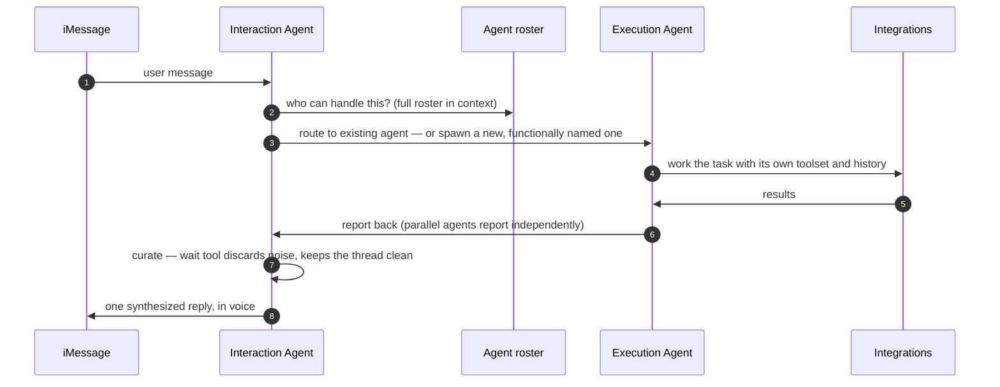
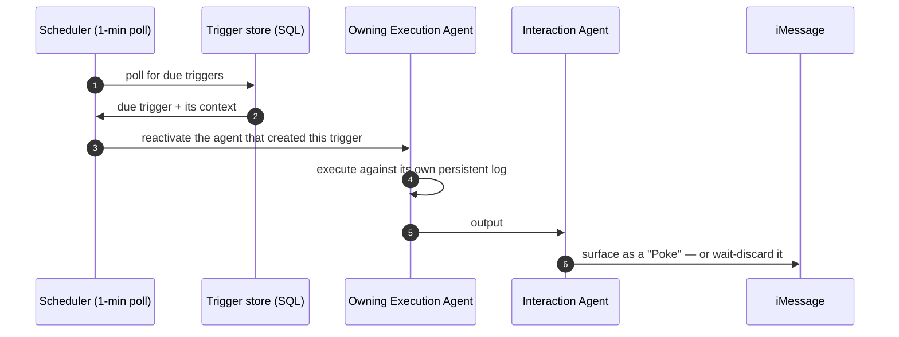
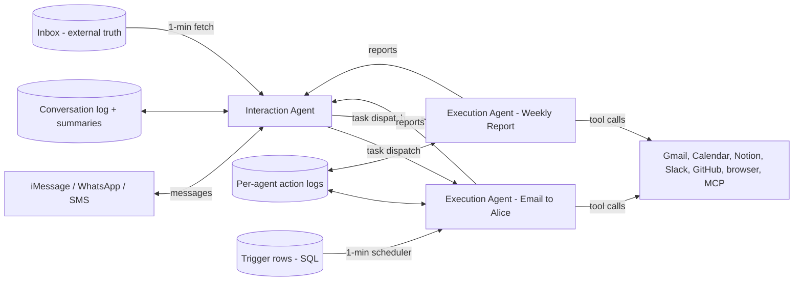
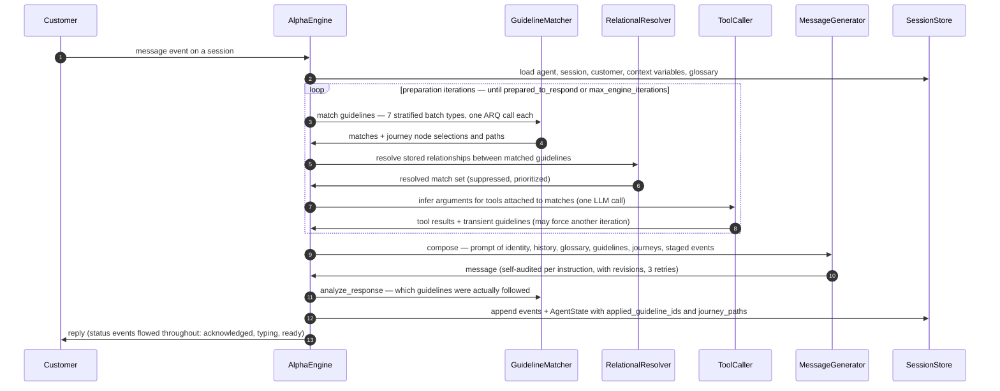
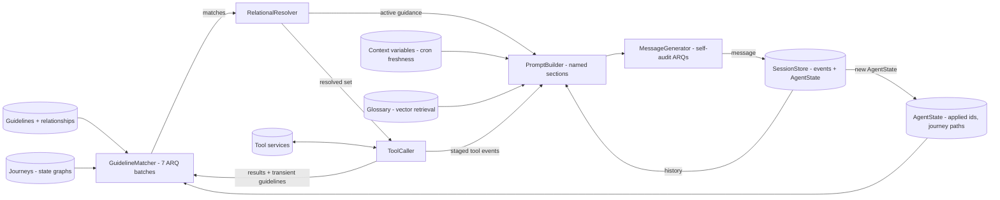

# Prior Art Study — Poke & Parlant

How the two most relevant shipped systems are actually built. **Poke** (The Interaction
Company, now part of Cognition) is the closest product to the Harvest chef — an agent that
lives in iMessage and feels like a person. **Parlant** (Emcie, Apache-2.0) is the closest
architecture to our Objectives layer — declared, condition-gated business logic driving an
LLM. Companion to `DESIGN.md` (D-16 records why we adopt their *shapes* and neither
*runtime*).

**Evidence basis — read this first.** The Parlant sections are from the **actual source**
(shallow clone of `emcie-co/parlant`, read 2026-08-28; file:line references throughout).
The Poke sections are **reconstruction**: Poke's leaked system prompts (Sept 2025) plus
the OpenPoke recreation and its write-up — Interaction has published no official
architecture, so treat Poke details as well-evidenced inference, not vendor documentation.

---

# Part 1 — Poke

## What it is

A personal assistant reached through iMessage/WhatsApp/SMS: email triage and drafting,
reminders, automations, browsing — with a heavily engineered personality. Its design bet:
**one agent talks, many agents work, and the user must never see the seam.**

## Component model

- **Interaction Agent** — the only component that ever speaks. Owns personality and UX,
  holds the full conversation history (summarization pass every ~100 messages), and
  receives the entire roster of execution agents with every request. Has a `draft` tool
  (content shown verbatim) and a `wait` tool (silently discard background output).
- **Execution Agents** — "pure task machines with zero personality instructions."
  Functionally named ("Email to Alice", "Weekly Report"), each with its own system
  prompt, history, and toolset. **Persistent, not ephemeral** — a follow-up days later
  routes to the same agent, which still holds its thread of work.
- **Trigger scheduler** — automations live as SQL rows; a background scheduler polls
  every minute; each trigger is owned by the execution agent that created it and
  reactivates that agent when it fires.
- **Email monitor** — a worker fetches new mail every minute; the inbox is treated as a
  passively accumulating archive of the user's life ("email as external truth").
- **Channel layer** — iMessage/WhatsApp/SMS; implementation undisclosed. In 2026 Apple
  granted Poke a sanctioned iMessage lane — the first for a third-party agent.

## P-1 — A user message, end to end

### P-1, step by step

1. **The message arrives at the Interaction Agent** — the single user-facing brain. It
   holds the whole conversation (with progressive summarization beyond ~100 messages), so
   context questions never leave this layer.
2. **It consults its roster.** Every request includes the list of live execution agents —
   after days of use, potentially hundreds. This is the documented scaling weakness: the
   roster itself competes for the model's attention.
3. **Route or spawn.** If an existing agent owns this thread of work ("Email to Alice"),
   the task routes there; otherwise a new agent is spawned with a functional name and a
   task-specific system prompt. Complicated requests are split into concurrent dispatches.
4. **The execution agent works** with its own history and tools — email, calendar,
   browser, MCP servers. It carries zero personality instructions; it is pure task
   machinery, and it logs every action and result to its own persistent memory.
5. **Results return to the agent**, not to the user — an execution agent can never speak.
6. **Reports flow up to the Interaction Agent**, possibly from several agents at once.
7. **Curation is a real step**: the `wait` tool lets the Interaction Agent silently drop
   an intermediate or uninteresting report instead of relaying it. This is where the
   single-entity illusion is enforced — sub-agents are referred to internally as
   "actions" and never disclosed.
8. **One reply goes out, in voice.** Parallel work is synthesized into a single message;
   drafts render verbatim so the user sees exactly what would be sent.

## How spawning actually works (source-level)

The leaked prompt confirms the real Poke's interface: the Interaction Agent has a
**`sendmessageto_agent`** tool and is instructed to reach agents *only* through it ("when
you want to communicate with an agent, you do it via the `sendmessageto_agent` tool …
never mention your agents"). The mechanics behind that tool, from the OpenPoke source
(`server/agents/interaction_agent/tools.py`, `execution_agent/agent.py`,
`services/execution/roster.py`):

1. **Naming is spawning — there is no separate "create agent" call.** The tool takes
   `{agent_name, instructions}` and its own description says it all: *"Creates a new
   agent if the name doesn't exist in the roster, or reuses an existing one."* The model
   invents a human-readable functional name ("Email to Sharanjeet"); dispatching to an
   unknown name brings the agent into existence (`tools.py:112–125`: `is_new = agent_name
   not in roster` → `roster.add_agent`).
2. **The roster is a JSON file of names** (`roster.py` — flock + retry around
   `roster.json`), injected into the Interaction Agent's context each turn so it can
   choose reuse-vs-spawn.
3. **An "agent" is a name plus a durable log, not a resident process.** Each dispatch
   constructs a fresh `ExecutionAgentRuntime(agent_name)`; the agent's identity is its
   persisted transcript, which `build_system_prompt_with_history()` loads and embeds in
   the system prompt (with a conversation cap) — persistence by transcript replay
   (`agent.py:62–82`). A new agent is simply an empty transcript.
4. **Execution is async with a timeout, and results are batch-buffered** — a batch
   manager registers the pending execution, runs the runtime under `asyncio.wait_for`,
   and buffers completions so parallel agents report back to the Interaction Agent
   together (`batch_manager.py:47–67`), feeding the curation step (P-1 step 7).

**And there are no agent *types*.** Every execution agent runs the same system prompt —
the real leaked one opens "You are the assistant of Poke … the 'execution engine' of
Poke" — parameterized only by `{agent_name}` and `{agent_purpose}`, with one shared
toolset (email, triggers; in real Poke also calendar, browser, integrations, MCC/MCP).
`get_tool_registry(agent_name=…)` scopes tools to the *name* purely for ownership (a
trigger belongs to its agent), not to vary capabilities. Specialization is **emergent**
from three inputs: the functional name (which scopes a thread of work), the dispatch
instructions, and the transcript the name accumulates. The Interaction Agent "knows what
to spawn" only in the sense that its own prompt describes the capability envelope ("by
using agents, you can accomplish search, email, calendar, other tasks with integrations,
and any active browser-use tasks") and it decomposes tasks in-context. The only typed
variation in public evidence is **model routing** — e.g. trigger creation on a smaller
model. Two more disciplines visible in the execution prompt: drafts are never executed
without explicit confirmation (their version of our `confirmed: true` allergen gate), and
the prompt explicitly tolerates transcript gaps ("the only assumption you can make is
that Poke's latest message is the most recent one").

The structural rhyme with Harvest is worth noting: *name + durable transcript, runtime
constructed per invocation* is exactly our thread model (stateless processor +
`thread_messages`). The divergence is who mints identities and what constrains them:
Poke's model invents untyped agent names free-form against a uniform capability set —
which is precisely where its roster-overload failure mode comes from — while Harvest's
objectives (and Parlant's flows) are a closed, declared set with per-goal tool scoping.

## P-2 — A trigger fires (most Poke messages start here)

### P-2, step by step

1. **A scheduler polls the SQL trigger store every minute.** Durability is the row, not a
   process timer — structurally the same choice as Harvest's reminders + sweep.
2. **A due trigger returns with its stored context** ("summarize my emails every night at
   9pm").
3. **The trigger reactivates the execution agent that created it** — ownership prevents
   cross-contamination between automations, and the agent's persistent log gives the
   firing its history.
4. **The agent executes** as in P-1 step 4.
5. **Output flows to the Interaction Agent**, never directly to the user.
6. **The Interaction Agent decides: surface or wait.** What survives becomes a "Poke" —
   and in practice *most messages in a Poke conversation are these proactive firings*,
   not replies. The product is reverse-polarity: it starts conversations.

## Dataflow

## Memory model

| Layer | Holder | Timescale | Purpose |
|---|---|---|---|
| Conversation log + summaries | Interaction Agent | Session → compressed decay curve | Voice continuity; what was said |
| Per-agent action logs | Each Execution Agent | Indefinite | Operational memory; outlives conversation compression |
| Email as external truth | Inbox (fetched every minute) | Years | Passive life-context accumulation, no manual briefing |

## Lessons and failure modes

**Lessons** (their own, validated by the leak): separate personality from execution;
embrace asynchrony; layer memory by timescale; personality *is* product. **Failure
modes**: roster overload (hundreds of persistent agents competing for attention — exactly
what Harvest's *declared, bounded* Objectives avoid); economics (~10–15 LLM calls per
message in the recreation; the leaked prompt references ~$50/user/month); personality
requires exhaustive prompt engineering. **What Poke does not have** (per all public
evidence): any goal/slot layer — no declared objectives, no required-information
tracking, no resumption contract. It is reactive-plus-triggers, which is why it
complements rather than answers our Objectives design.

---

# Part 2 — Parlant

## What it is

An Apache-2.0 "interaction control harness" for compliance-critical customer-facing
agents: behavior is declared as **Guidelines** (condition → action) and **Journeys**
(state graphs), an engine matches what applies *this turn*, and every response is
traceable to the rules that shaped it. What follows is from the source.

## Component model (file:line from `emcie-co/parlant`)

- **`AlphaEngine`** (`core/engines/alpha/engine.py:190`) — `process()` runs the turn: load
  context → preparation loop → message generation → state persistence.
- **`EngineContext` / `ResponseState`** (`engine_context.py:138–200`) — the object that
  accumulates matches, tool results, glossary, and iteration state across the turn.
- **`GuidelineMatcher`** (`guideline_matching/guideline_matcher.py:197`) — stratifies
  guidelines into **seven batch types** (observational, previously-applied actionable,
  previously-applied customer-dependent, actionable, low-criticality, disambiguation,
  journey-node-selection), each batch = one LLM call with an ARQ-style JSON schema: per
  guideline `{condition, rationale, applies}`.
- **`RelationalResolver`** (`engine.py:1332`) — after matching, applies *stored*
  guideline relationships (dependencies, priorities, suppression) deterministically.
- **`ToolCaller` + `ToolEventGenerator`** (`tool_calling/tool_caller.py:160`,
  `tool_event_generator.py:64`) — one LLM call infers arguments for tools attached to
  matched guidelines or journey nodes; results can inject **transient guidelines**
  (synthetic matches) that trigger re-evaluation.
- **Journeys** (`engine.py:1443–1492, 2143–2229`) — current position per journey lives in
  `session.agent_states[-1].journey_paths`; advancement and backtracking are their own
  matching batches; only the top-k(=1) semantically relevant journeys are evaluated per
  turn.
- **`MessageGenerator` / `CannedResponseGenerator`** (`message_generator.py:132`,
  routed by `agent.composition_mode` at `engine.py:1104`) — the final composition call;
  its `MessageSchema` ARQs include *evaluation-for-each-instruction* and *revisions* —
  the model must audit itself against every active guideline before the reply counts.
- **`SessionStore`** (`sessions.py:114–261`) — append-only events (MESSAGE / TOOL /
  STATUS / CUSTOM) plus one `AgentState` per turn: `applied_guideline_ids` and
  `journey_paths` — the durable dialogue state.
- **Context variables with freshness rules** (`engine.py:2233–2284`) — tool-backed
  variables carry a cron expression; stale values are re-fetched before use.

## Q-1 — One engine turn

### Q-1, step by step

1. **A customer message lands on a session** (`AlphaEngine.process()`, `engine.py:190`).
   Status events (`acknowledged → processing → typing → ready`) stream to the client
   throughout the turn.
2. **Context loads** (`engine.py:198, 500–515`): agent config, session with its
   `agent_states` history, customer, context variables (freshness-cron re-fetch if
   stale), glossary and capabilities by semantic retrieval.
3. **Guideline matching, stratified** (`guideline_matcher.py:197`;
   `generic_guideline_matching_strategy.py:84+`): guidelines split by kind into up to
   seven batches, one LLM call each. Each call's ARQ schema forces per-guideline
   structured judgment — `{guideline_id, condition, rationale, applies}` — instead of one
   free-form verdict. Previously-applied tracking (`agent_states[-1].applied_guideline_ids`)
   routes already-fired guidelines into their own batches so the model reasons about
   *re*-application explicitly.
4. **Matches return, including journey position** — journey-node selection is its own
   batch; the engine extracts each journey's new path and prunes root nodes
   (`engine.py:2143–2229`). Only the top-1 semantically relevant journey is evaluated
   unless a trigger activates another (`engine.py:1646–1763`).
5. **Deterministic resolution** (`RelationalResolver`, `engine.py:1332`): stored
   relationships — dependencies, priorities, entailments — suppress or promote matches.
   No LLM involved; this is declared logic executing.
6. **The resolved set is what this turn is allowed to act on** — matched guidelines carry
   their attached tools (`guideline_tool_associations`, journey-node associations,
   `engine.py:1598–1644`).
7. **Tool inference is one LLM call** (`tool_caller.py:160`): arguments inferred from
   matches + context, then executed. Missing/invalid data becomes `ToolInsights` rather
   than silent failure.
8. **Tool results feed back** — including **transient guidelines** a tool can return
   (`engine.py:2012–2054`), injected as synthetic matches. If insights flag guidelines
   needing re-evaluation, the loop runs another preparation iteration (bounded by
   `max_engine_iterations`) — this is how "a tool result changed what applies" is
   handled declaratively.
9. **Message composition** (`message_generator.py:211–300`): one call whose prompt is
   built in named sections (identity, history, context variables, glossary, guidelines,
   staged events, journeys) and whose `MessageSchema` forces the model to evaluate its
   draft **against each active instruction and revise** before the reply is accepted;
   three retry attempts at varied temperatures. Canned-response modes (STRICT /
   COMPOSITED / FLUID) swap in a template-constrained generator for compliance-critical
   deployments.
10. **The reply returns under `latched_shield`** (`engine.py:350–401`) — cancellation is
    *suppressed* during generation so a turn always finishes its message. The exact
    opposite of Harvest's D-13 barge-in cancel; defensible when a turn costs 9–21 LLM
    calls, wrong for a group chat where a stale reply is worse than a discarded one.
11. **Response analysis** (`engine.py:2110–2121`): one more LLM call determines which
    guidelines the reply actually followed.
12. **State persists** (`engine.py:2087–2141`): events append; a new `AgentState` stores
    `applied_guideline_ids` and `journey_paths` — the whole dialogue state, durable,
    readable, auditable.
13. **The customer sees the reply**, with the status-event trail explaining the wait.

**Cost accounting** (from the source): initial iteration ≈ 7–12 matching calls + 1 tool
inference + 1 composition; plus response analysis; additional iterations add 3–7 more —
**roughly 9–21 LLM calls per turn**. Parlant buys auditability and instruction-adherence
(their ARQ paper reports 90.2% vs 86.1% CoT on their suite) by decomposing judgment into
many small structured calls.

## Dataflow

---

# Part 3 — Comparison, and what Harvest takes

| Dimension | Poke | Parlant | Harvest (DESIGN.md) |
|---|---|---|---|
| Primary job | Open-world personal assistant | Compliance-bound customer service | Goal-completing household chef |
| Who drives conversation | One personality agent over a swarm | Engine pipeline, LLM at each judgment point | Decider + Voice pipeline (D-17) inside a deterministic shell |
| Business logic | None declared — emergent from prompts | Declared guidelines + journeys, matched per turn | Declared objectives owning questions (D-16) |
| Dialogue state | Conversation log + agent logs | `AgentState`: applied ids + journey paths | `threads.objectives` stack + questions |
| Proactivity | Trigger rows, 1-min scheduler, agent-owned | Not a focus (session-reactive) | Reminders (WDK sleeps) + 1-min sweep |
| Interruption | Unknown | **Suppressed** (`latched_shield`) — always finish | **Cancel-and-restart** at barriers (D-13) |
| Cost/turn | ~10–15 calls (recreation) | ~9–21 calls (source-derived) | decide + render (2 calls) + 0–2 tool rounds (D-17) |
| Multi-party | No (1:1 threads) | No (customer/agent pairs) | Yes — the novel part |
| Validated writes | No gate visible | Tools validated; message ≠ write-gated | `answered` ⇒ successful tool write (invariant) |

**What Harvest takes from Poke**: personality strictly separated from execution; layered
memory by timescale; trigger rows owned by their creator + polling sweep (convergent with
D-14/O-02); curate-before-send; the cost warning that pushed our L1-lean, scoped-tools
design.

**What Harvest takes from Parlant**: condition-gated activation as the *shape* of
objective instruction bodies (R11 binding #2); per-guideline structured judgment (its ARQ
schemas are the pattern behind our `SaveResult`/`question_updates` discipline);
`applied_guideline_ids` as prior art for answered-question tracking; **response analysis
as an eval idea** — an LLM pass asserting which declared rules a reply honored maps
directly onto our golden-transcript rubric judge.

**What neither has**: multi-party attribution, channel-truth durability (outbox/claim —
Parlant's sessions are server-state, Poke's is unknown), or a completion-oriented goal
stack. The escalation path Parlant proves out: if our single-generate turn fails
guideline-adherence in evals, decomposing judgment into small ARQ-style calls is the
known, measured fix — at ~10× the per-turn LLM cost.

---

# Sources

- **Parlant**: source clone of [emcie-co/parlant](https://github.com/emcie-co/parlant)
  (read 2026-08-28) — `core/engines/alpha/engine.py`, `guideline_matching/*`,
  `tool_calling/tool_caller.py`, `message_generator.py`, `sessions.py`;
  [ARQ paper](https://arxiv.org/abs/2503.03669) (Attentive Reasoning Queries);
  [agentic design docs](https://www.parlant.io/docs/production/agentic-design/).
- **Poke**: [leaked system prompts, Sept 2025](https://github.com/EliFuzz/awesome-system-prompts/blob/main/leaks/poke/2025-09-15_prompt_guidelines.md)
  (+ [integration policies](https://github.com/EliFuzz/awesome-system-prompts/blob/main/leaks/poke/2025-09-15_prompt_integration-policies.md));
  [OpenPoke write-up — Shlok Khemani](https://www.shloked.com/writing/openpoke) and the
  [OpenPoke source](https://github.com/shlokkhemani/OpenPoke) — notably the
  [interaction-agent prompt](https://github.com/shlokkhemani/OpenPoke/blob/main/server/agents/interaction_agent/system_prompt.md),
  the [execution-agent prompt](https://github.com/shlokkhemani/OpenPoke/blob/main/server/agents/execution_agent/system_prompt.md),
  and the [dispatch tool](https://github.com/shlokkhemani/OpenPoke/blob/main/server/agents/interaction_agent/tools.py);
  [Composio's OpenPoke](https://composio.dev/content/open-poke) (a shallower, single-agent recreation — not used as evidence);
  [Apple's iMessage lane](https://getaibook.com/news/imessage-supports-first-third-party-ai-agent-with-poke-appro).

# Changelog

| Date | Author | Change |
|---|---|---|
| 2026-08-28 | Claude (w/ Jordan) | Initial study — Poke from leaked prompts + OpenPoke reconstruction; Parlant from source (file:line); P-1/P-2/Q-1 sequence diagrams with step narratives, dataflow diagrams, comparison + Harvest takeaways |
