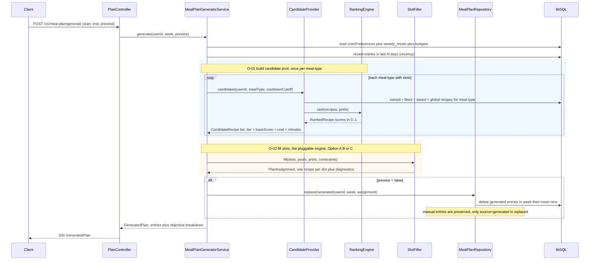
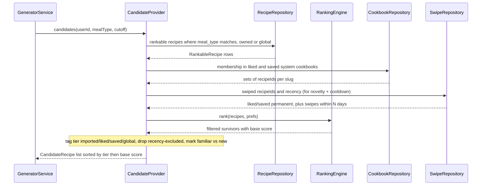
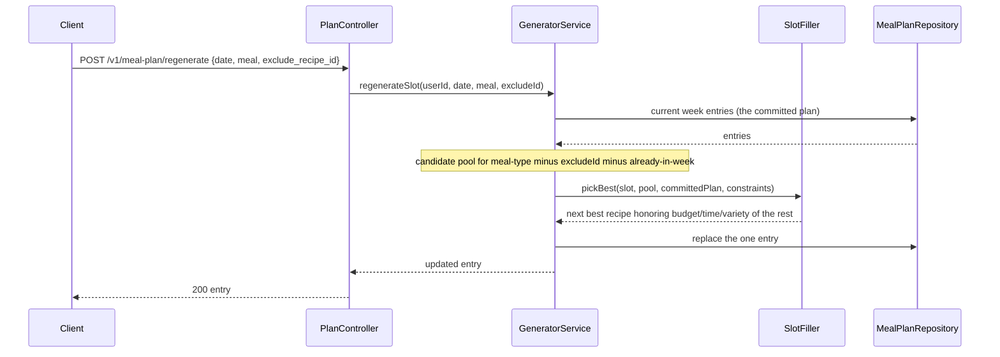
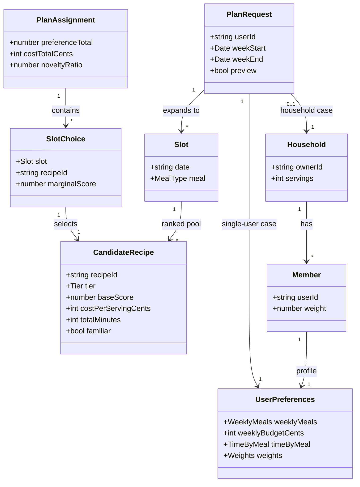
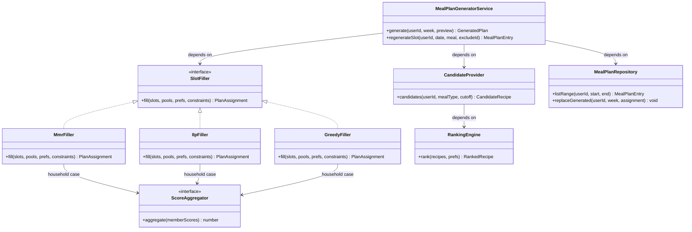
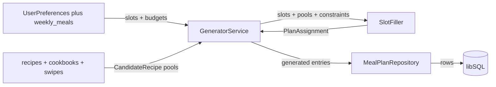

# Meal-Planning Engine

This document designs the **engine** that fills a user's planned weekly meal slots automatically —
the "generate my week" step that sits on top of the already-shipped meal-plan calendar
(`meal_plan_entries`, `GET/POST/DELETE /v1/meal-plan`). It does **not** redesign the calendar UI or
the manual add-a-recipe flow; those are covered in `docs/sprint-meal-planning/DESIGN.md`.

The engine is framed as **multi-objective optimization**: choose one recipe per slot to maximize the
user's preference for what they cook while balancing repetition, novelty, cost, and time. This document
presents **three genuinely different engine designs** (a greedy heuristic, a two-stage MMR/portfolio
hybrid, and a formal ILP) and recommends one, with a path to the others.

> **Scope note — research, not build.** This is a design + research artifact. No engine code is written
> here. The Decisions section (D-01) analyzes the three options against a stack-ranked priority list;
> the recommendation is **Option B (two-stage candidate-generation + MMR + local-search repair)**.

---

# Reviews

| Reviewer | Status | Feedback |
|---|---|---|
| Architect | not_started | |
| Founder | not_started | |

---

# Context

## What already exists (build-on, don't rebuild)

The engine is almost entirely an **orchestration** of primitives that already ship on `main` (6f421f6):

| Primitive | Where | What the engine reuses |
|---|---|---|
| Filter-then-rank engine | `server/src/ranking/*` | Per-(user, recipe) preference score in [0,1] and the allergen/diet/equipment hard filters — the engine's base affinity signal |
| Recipe corpus | `recipes` (global `user_id IS NULL` + user-owned) | The candidate universe |
| Liked / Saved cookbooks | `cookbooks.system_slug ∈ {liked, saved}` + `cookbook_recipes` | Preference **tiering** (liked, saved) |
| Imported recipes | `recipes.user_id = caller` | Top preference tier (imported > liked) |
| Swipe history + cooldown | `recipe_swipes`, `SWIPE_COOLDOWN_DAYS = 7` | Novelty ("seen" vs "unseen") and the recency-exclusion pattern |
| Slot intake | `user_preferences.weekly_meals` `{breakfast, lunch, dinner, snack, kids}` | How many slots of each meal-type to fill |
| Cost signal | `recipes.cost_per_serving_cents` (+ `weekly_budget_cents`) | The budget objective |
| Time signal | `recipes.total_minutes` (+ `time_budget_minutes`, per-meal `time_by_meal` — see Q-01) | The time objective |
| Calendar store | `meal_plan_entries` (`date`, `meal`, `recipe_id`, `position`) | Where generated plans are written, and the cross-week recency history |

The **only new scoring idea** the engine introduces beyond the ranking engine is a **source/ownership
tier bonus** (imported > liked > saved > global). Everything else is a re-composition of shipped signals.

## The problem, stated precisely

Given a user `u`, a target week (a set of dates), and `weekly_meals` slot counts, produce a set of
`meal_plan_entries` — one recipe per slot — that jointly optimizes:

- **P1 Preference (maximize).** Prefer recipes the user owns or has endorsed:
  **imported ≻ liked ≻ saved ≻ well-ranked global**. Within a tier, higher ranking-engine score wins.
- **P2 Anti-repetition (constrain / penalize).** Don't serve the same recipe twice in the week, and
  down-weight recipes cooked in the last *N* days (cross-week recency).
- **P3 Novelty balance (target).** Neither all-repeats nor all-new — hit a familiar:new ratio.
- **P4 Budget (soft constraint).** `Σ slot cost ≤ weekly_budget_cents`, cost scaled by household size.
- **P5 Time (soft, per slot).** Each slot's `total_minutes ≤ time_by_meal[meal]` (fallback:
  `time_budget_minutes`), reinforced by the ranking engine's existing time signal.
- **P6 Household extensibility.** The same machinery must extend from one user to a household of *M*
  members with distinct preferences (group / multi-stakeholder recommendation).

## Research grounding

Menu / diet planning has been modeled as a linear program since the **Stigler diet problem (1945)** and
as menu-selection LP since **Balintfy (1964)**; the modern literature treats it as **multi-objective**
(nutrition, cost, consumption, environment) and solves it with **integer / goal programming**. Diversity
and novelty in recommenders are handled by **Maximal Marginal Relevance (Carbonell & Goldstein, 1998)**
and portfolio/novelty-budget methods. The household case is **group / multi-stakeholder recommendation**,
whose standard aggregation strategies are *majority* (plurality), *consensus* (average,
average-without-misery), and *borderline* (**least misery**, most pleasure), plus *fairness* (round-robin).
Full citations in **Appendix B**; each option below states which findings it leans on.

---

# Use Case Implementations

Use case IDs this engine implements (behavior specs live in `docs/sprint-meal-planning/` and the
use-case backlog; summarized here for traceability):

- **F-01 — Generate weekly plan (single user):** the actor asks the app to fill the week; the system
  writes one recipe per empty slot.
- **F-02 — Regenerate a slot or day:** the actor rejects a suggestion; the system swaps in the next-best
  recipe that respects the already-committed plan.
- **F-03 — Generate a household plan (multi-user):** the plan must satisfy several members. *(Extension —
  ships after single-user; the engine is designed so it drops in behind the same interface.)*
- **O-01 — Build candidate pool:** filter-then-rank the corpus for one meal-type, tag tiers, drop
  cooldown recipes. *(Shared by all flows and all three engine options.)*
- **O-02 — Fill slots:** select recipes from the pools to satisfy P1–P5. *(This is the pluggable core the
  three options differ on.)*
- **O-03 — Aggregate household scores:** collapse *M* members' per-recipe scores into one slot score.

## Generate Weekly Plan — Implements F-01



## Build Candidate Pool — Implements O-01

Shared by every option. This is the single chokepoint where the corpus becomes rankable, tiered, and
recency-cleaned — so no downstream option re-implements filtering (house principle: *fix at the single
chokepoint*).



## Regenerate a Slot — Implements F-02



---

# Entities

Domain concepts the engine reasons about. These are engine-level abstractions layered over the existing
persisted entities (`recipes`, `user_preferences`, `meal_plan_entries`, `cookbooks`, `recipe_swipes`) —
only `TimeByMeal` implies a schema change (Q-01).



- **Tier** is an enum `imported | liked | saved | global`, ordered by preference; it carries the P1 bonus.
- **`familiar`** marks a recipe the user has cooked before or swiped *like* (drives P3 novelty balance).
- **Household / Member** are dormant in the single-user flow (a household of one). They exist so F-03
  drops in without reshaping the model — a new use case fits the existing entities (design-doc principle).

---

# Tables

The engine reuses existing tables almost entirely. Reads: `recipes`, `recipe_categories` (for
`meal_type` and MMR similarity), `cookbooks` + `cookbook_recipes`, `recipe_swipes`, `user_preferences`.
Writes: `meal_plan_entries`. Full column definitions live in `server/src/schema.ts` and
`docs/sprint-meal-planning/DESIGN.md` — referenced, not duplicated.

## Change: `meal_plan_entries` — add `source`

To let the generator replace only its own suggestions without clobbering recipes the user placed by hand
(F-01 "replace generated, preserve manual"):

| Column | Type | Constraints | Notes |
|---|---|---|---|
| `source` | text enum | not null, default `'manual'` | `'manual'` (user-placed) or `'generated'` (engine-placed). `replaceGenerated` deletes only `source='generated'` rows in the week. |

Backwards-compatible: existing rows default to `'manual'`, so nothing already placed is ever auto-deleted.

## Change: `user_preferences` — add `time_by_meal` (Q-01)

The task premise references a per-meal time budget from PR #44, but on `main` only the single
`time_budget_minutes` exists (the onboarding "per-meal time sliders" from commit `ca6cf59` are not yet
persisted per-meal). The engine wants per-meal budgets for P5; it degrades to `time_budget_minutes` when
absent.

| Column | Type | Constraints | Notes |
|---|---|---|---|
| `time_by_meal` | text (JSON) | nullable | `{breakfast, lunch, dinner, snack}` minutes. NULL → engine uses `time_budget_minutes` for every slot. Mirrors the `weekly_meals` JSON shape. |

## No new engine tables

Cross-week recency comes from querying `meal_plan_entries` history (no separate log). Novelty comes from
`recipe_swipes` + planned history. Per house style, **no infra is built before something uses it** — a
`meal_plan_generation` audit table is deliberately *not* added (see D-03).

## Indices

- Reuse `meal_plan_entries_user_date_idx` on `(user_id, date)` for both the recency read and the
  replace-week delete.
- Candidate generation filters recipes by `meal_type` — reuse `recipe_categories_value_idx` on
  `(facet, value)`.

---

# Modules

Where the sequence diagrams show *what happens*, this shows *how the code is organized*. The key design
move: **`SlotFiller` is an interface with three implementations** (the three options), so the engine
choice is a single swap at the composition root — the controller, service, and candidate provider never
change.





- **`ScoreAggregator`** is the household seam: `SingleUser` (identity) in v1, swappable for
  `LeastMisery` / `Average` / `Fairness` for F-03. `CandidateProvider` calls it to fold *M* members'
  ranking scores into one `baseScore` before any filler runs — so **all three fillers get household
  support for free** once the aggregator exists.

---

# APIs

## Generate Plan `POST /v1/meal-plan/generate`

Fills the week's empty slots and (unless `preview`) persists them as `source='generated'` entries.

### Request

- Headers
    - content-type: `application/json`
    - authorization: `Bearer <jwt>`
- Body
    - start: string (`YYYY-MM-DD`, week start)
    - end: string (`YYYY-MM-DD`, inclusive; ≤ 31 days after start, mirrors `GET /v1/meal-plan`)
    - preview: boolean (default false — true returns the plan without writing)

### Success Response `200`

- Headers
    - content-type: `application/json`
- Body
    - plan: object
        - entries: array of objects
            - id: string (null when preview)
            - date: string
            - meal: string
            - recipe: object (id, title, image_url, total_minutes, cost_per_serving_cents)
            - tier: string (imported | liked | saved | global)
        - summary: object
            - preference_total: number
            - cost_total_cents: int
            - weekly_budget_cents: int
            - novelty_ratio: number (fraction of new/unseen recipes)
            - unfilled_slots: int (slots with no eligible candidate — see below)

### Partially Filled Response `200`

Same shape; `summary.unfilled_slots > 0` when a meal-type's pool was exhausted (e.g. a strict diet leaves
too few recipes). The engine **never invents** a recipe and **never leaves the response empty** — it fills
what it can and reports the gap (house principle: *data transforms must be safe — never destroy good data,
prefer a reported gap over a bad fill*).

### Unprocessable Response `422`

- Body: error `{ code, message }` — e.g. `weekly_meals` is all zeroes (nothing to plan) or the date range
  exceeds 31 days.

## Regenerate Slot `POST /v1/meal-plan/regenerate`

Swaps one slot's recipe for the next-best that respects the rest of the committed week.

### Request

- Body
    - date: string
    - meal: string
    - exclude_recipe_id: string (the rejected recipe)

### Success Response `200`

- Body: entry object (same shape as a `plan.entries` element).

### No Candidate Response `409`

- Body: error `{ code, message }` — the pool is exhausted after exclusions; the slot is left as-is.

---

# Testing

## Test Coverage

| Use Case | Type | Unit | Integration | E2E |
|---|---|---|---|---|
| F-01 Generate weekly plan | Flow | | x | x |
| F-02 Regenerate a slot | Flow | | x | |
| F-03 Household plan | Flow | x | x | |
| O-01 Build candidate pool | Op | x | | |
| O-02 Fill slots (chosen filler) | Op | x | | |
| O-03 Aggregate household scores | Op | x | | |

## Test Approach

### Unit Tests

The engine is **pure and deterministic** by design — `SlotFiller.fill` takes candidate pools + constraints
and returns an assignment with **no I/O**. That makes it the highest-value unit-test target and needs no
mocks:

- **O-02 filler** — seed hand-built pools and assert the invariants that matter, not the exact pick:
  no recipe twice in the week; tier ordering respected when scores tie (imported chosen over an
  equal-scored global); budget respected or the overrun reported; novelty ratio within the target band;
  a pool of size < slot count yields `unfilled_slots` rather than a duplicate or a throw.
- **O-01 candidate provider** — tiering (a recipe both imported and liked lands in `imported`), cooldown
  exclusion (a recipe served 3 days ago is dropped, one served 10 days ago is kept), and that the ranking
  engine's filters are honored (an allergen-excluded recipe never appears).
- **O-03 aggregator** — least-misery returns the min member score, average the mean, fairness rotates the
  owning member across slots. Table-driven; no network (server testing convention).

Determinism check: same inputs → same plan (stable tie-breakers, seeded any randomness). This is the
`demo()`-equivalent guard the house style asks for on non-trivial logic.

### Integration Tests

Cross the controller → service → repository → libSQL boundary against the migrated test DB
(`tests/helpers/global-setup.ts`, offline stubs only — tests never hit the network):

- `POST /v1/meal-plan/generate` round-trip: seed a user with `weekly_meals`, a budget, a few
  imported/liked/global recipes; assert entries are written with `source='generated'`, one per slot,
  and that a pre-existing `source='manual'` entry **survives** a regenerate.
- Auth: 401 without a bearer; cross-user isolation (can't generate into another user's calendar).
- `422` when `weekly_meals` is empty; `409` when a slot's pool is exhausted on regenerate.

### End-to-End Tests

One manual demo per house convention: drive the app, tap "generate my week," confirm the calendar fills
with tier-appropriate recipes, budget summary shows, and a manually added dinner is untouched. Verified
against the running sim with the real DB (house principle: *verify against live reality*), not a unit
mock. Because generation is a single request (not an animation), a screenshot suffices — no video capture
needed.

## Test Infrastructure

A `candidatePool(...)` factory (builds `CandidateRecipe[]` with tier/score/cost/minutes knobs) is the one
new helper — it removes the boilerplate of hand-shaping pools across O-02 unit tests. No stub server, no
new fixtures beyond seed recipes.

---

# Deployment

## Migrations

| Order | Type | Description | Backwards-Compatible |
|---|---|---|---|
| 1 | schema | Add `meal_plan_entries.source` (default `'manual'`) | yes |
| 2 | schema | Add `user_preferences.time_by_meal` (nullable JSON) | yes |

Both are additive. Per the house principle *stage destructive-plus-additive changes so codegen stays
non-interactive*, these are **adds-only** on their tables (no drop+add in one migration), so
`drizzle-kit generate` runs without a TTY prompt. Migrations can run **before** the code deploys — old
code ignores both columns.

## Deploy Sequence

Single service. Migrate first, then deploy the engine code. No ordering constraint beyond migrate-before-code.

## Rollback Plan

The engine is **purely additive** — a new endpoint plus two nullable/defaulted columns. Roll back the code
and the columns are simply unused; no data migration to reverse. Generated entries left in
`meal_plan_entries` remain valid manual-looking rows (they carry real `recipe_id`s), so a rollback never
corrupts a user's calendar. The feature ships behind a client feature flag (the "generate" button); killing
the flag hides the entry point without a redeploy.

---

# Monitoring

## Metrics

Every metric ties to a Flow; nothing speculative (house rule: a metric must answer "is this Flow working?").

| Name | Type | Use Case | Description |
|---|---|---|---|
| `mealplan_generate_total` | counter | F-01 | Generations requested (tag: preview true/false) |
| `mealplan_generate_latency_ms` | histogram | F-01 | Wall-clock per generation — the load-bearing SLO for the chosen engine |
| `mealplan_unfilled_slots` | histogram | F-01 | Slots the engine couldn't fill — rises when pools are too thin (diet/budget too tight, or the corpus is small) |
| `mealplan_budget_overrun_ratio` | histogram | F-01 | `cost_total / weekly_budget` — how well P4 is met in practice |
| `mealplan_novelty_ratio` | histogram | F-01 | Fraction of new recipes — validates the P3 target band against real catalogs |
| `mealplan_regenerate_total` | counter | F-02 | Slot rejections (tag: had_candidate) — high values suggest weak suggestions |

## Alerts

| Condition | Threshold | Severity |
|---|---|---|
| `mealplan_generate_latency_ms` p95 | > 2000 ms | warn |
| `mealplan_unfilled_slots` p50 | > 0 for a week | warn (corpus/diet too thin, or a filler bug) |
| `mealplan_generate` error rate | > 2% over 15 min | page |

## Logging

One structured line per generation (server convention, low cardinality): `userId`, `slots`, `filled`,
`unfilled`, `cost_total`, `budget`, `novelty_ratio`, `latency_ms`, `engine` (which filler ran). Level
`info`. This mirrors the cost/nutrition pipeline's one-line-per-recipe logging and makes an engine swap
(A→B→C) observable in the same field.

---

# Decisions

## D-01 — Which engine fills the slots (the three options)

This is the central decision. All three share **O-01** (the candidate provider) and the `SlotFiller`
interface; they differ only in **O-02**. Each is analyzed against the same framework below.

### The shared formulation

Let `x[s,r] ∈ {0,1}` select recipe `r` for slot `s` (one recipe per slot). The per-(slot, recipe) value is:

```
base[s,r] = tierBonus(tier(r)) + rankingScore(r, prefs)
```

- `tierBonus`: `imported = +Ti`, `liked = +Tl`, `saved = +Ts`, `global = 0`, with `Ti > Tl > Ts > 0`.
  This is the one new scoring rule; it encodes P1 (imported ≻ liked ≻ saved ≻ global).
- `rankingScore ∈ [0,1]` is the existing weighted-average of cost/difficulty/nutrition/affinity/time/
  mealPrep signals — **reused verbatim**, no reimplementation.

Slot cost `= cost_per_serving_cents(r) × householdServings`; slot time `= total_minutes(r)`. The three
options optimize the same objective (maximize Σ `base`) under P2–P5 — they differ in **how hard they
optimize** and **what they guarantee**.

---

### Option A — Greedy weighted-heuristic planner

**Formulation.** No global objective. A per-slot **marginal** score with online penalties:

```
marginal(r | planSoFar) = base[s,r]
    − λ_rep · repeatPenalty(r, planSoFar, history)   // in-week dup or served < N days ago
    − λ_cost · budgetPressure(planSoFar, r)          // running overrun vs pro-rata budget
    − λ_time · timeOverrun(r, meal)                  // over time_by_meal[meal]
    − λ_div · maxSim(r, planSoFar)                    // similarity to already-picked (light diversity)
```

**Hard vs soft.** Hard: allergen/diet/equipment (from O-01's filter) and in-week uniqueness. Everything
else (budget, time, novelty, diversity) is a soft penalty.

**Algorithm.** Order slots (scarcest meal-type first, to avoid painting into a corner), then for each slot
pick `argmax marginal` from that meal-type's ranked pool, commit, update running budget and chosen set.
One pass, `O(S · C)`. Novelty via a **novelty budget counter**: reserve `k` slots that must draw from the
`familiar=false` sub-pool; the rest prefer familiar.

**Reuse.** `base` = ranking engine; recency reuses the `SWIPE_COOLDOWN_DAYS` pattern on
`meal_plan_entries`; diversity uses `recipe_categories` overlap.

**Build effort (this stack).** *Lowest.* One `GreedyFiller` class (~120 lines), no dependency.

**Latency / cost.** Sub-millisecond to low-ms. Trivial.

**Quality.** Decent but **myopic** — greedy commits early and can't undo, so the last slots can be forced
over budget or into a repeat when early picks spent the budget. No backtracking.

**Household (F-03).** `base` becomes the aggregated member score (via `ScoreAggregator`); the greedy loop
is unchanged. Cheap, but the myopia compounds across members.

---

### Option B — Two-stage candidate-generation + MMR + local-search repair *(recommended)*

**Formulation.** Bi-level. **Stage 1** = O-01 produces a ranked, tiered, recency-clean pool per meal-type.
**Stage 2** = greedy **Maximal Marginal Relevance** selection to fill slots, then a **bounded local-search
repair** to satisfy budget/time/novelty.

```
MMR pick:  argmax_r [ (1 − λ) · base[s,r] − λ · max_{r' ∈ chosen} sim(r, r') ]
```

`sim` = Jaccard overlap on `recipe_categories` facets (cuisine / dish_type / primary_ingredient) — the
diversity control users *feel* (no three pasta dinners). **Novelty** is a **portfolio target**: choose a
familiar:new ratio (e.g. 70:30) and let MMR draw from both the familiar and new sub-pools to hit it — later
tunable by a bandit on accept/cook feedback (D-02).

**Local-search repair.** After the greedy MMR fill, if the plan is over budget or a slot is over its time
budget, run bounded swaps: replace the worst-value offending slot with the cheapest/fastest candidate that
least reduces `base`. A few hundred deterministic swaps — enough to fix budget without a solver.

**Hard vs soft.** Hard: O-01 filters + in-week uniqueness. Soft, but **actively repaired** (not just
penalized): budget and time. Novelty: targeted, not constrained.

**Reuse.** Ranking engine (Stage 1), `recipe_categories` for `sim` and novelty, `SWIPE_COOLDOWN` for
recency, cost/time signals for the repair objective. **No new dependency** — MMR + local search are ~150 lines.

**Build effort.** *Medium.* One `MmrFiller` + a small repair routine. No infra.

**Latency / cost.** Low tens of ms for a week (dozens of slots, pools in the hundreds).

**Quality.** **Near-ILP on the dimensions users notice** (variety, novelty, tier-preference). Budget is
best-effort-then-repaired — not provably optimal, but reliably *within* budget in practice, and it
**degrades gracefully** (repair improves or leaves the plan; never infeasible, never empty).

**Household (F-03).** `base` = aggregated member score; MMR runs on the aggregate. **Fairness** aggregation
(members take turns "owning" a slot) is a natural fit — round-robin ownership across the week. No solver.

---

### Option C — Formal ILP / Mixed-Integer Goal Program

**Formulation.** A real optimization model solved to optimality:

```
maximize   Σ_{s,r} base[s,r] · x[s,r]   −   penalties on deviation vars
subject to
  Σ_r x[s,r] = 1                       ∀ slot s               (assignment)
  Σ_{s,r} cost[r] · x[s,r] ≤ Budget + slack_b                (budget, soft via slack)
  Σ_{r in meal(s)} minutes[r] · x[s,r] ≤ Time[meal] + slack_t ∀ s   (per-slot time, soft)
  Σ_s x[s,r] ≤ 1                       ∀ recipe r             (no in-week repeat)
  L ≤ Σ_{s, r: new(r)} x[s,r] ≤ U                            (novelty budget as a range)
  x[s,r] = 0 for r served within N days (pre-filtered, not a row)
```

Soft objectives use **goal-programming** deviation variables (Mixed-Integer Goal Programming — the
standard for "hit these targets, report the miss"): budget/time/nutrition targets become goals with
penalized slack, so the solver never returns *infeasible* for a tight budget — it returns the plan that
misses least and tells you by how much.

**Hard vs soft.** Hard: assignment, in-week uniqueness, filters. Soft (goal): budget, time, nutrition,
novelty band.

**Solver (this stack).** A JS/WASM MIP solver — **`highs-js`** (WASM build of HiGHS, a
high-performance open-source MIP solver) or **`glpk.js`** (WASM GLPK). For our size (≤ ~28 slots,
≤ ~200 candidates/meal) a **pure-JS** solver (**YALPS** / `javascript-lp-solver`) may suffice and adds no
WASM. **This is the one option that introduces a new dependency** (D-01 materiality: house rule
*installed ≠ wired* — a WASM solver is real integration + bundle weight).

**Reuse.** `base` = tier + ranking score become objective coefficients; cost/time become constraint
coefficients/RHS. Candidate generation unchanged.

**Build effort.** *Highest.* Model builder, coefficient marshalling, infeasibility/relaxation handling,
solver wiring + the *installed ≠ wired* verification. Tuning goal weights is its own calibration loop.

**Latency / cost.** Tens to low-hundreds of ms typical at this size; **variance is the risk** — a tight or
near-infeasible instance can spike, and a WASM solver adds cold-start + bundle weight.

**Quality.** **Optimal with respect to the model** — best possible budget adherence and global variety. The
ceiling of the three.

**Household (F-03).** Households are C's **killer feature**: add per-member **fairness constraints** (each
member's satisfied-slot count ≥ a floor) or maximize the **minimum** member utility (a **least-misery**
max-min epigraph variable) — guarantees no member is starved, which A and B can only approximate. If
households with hard fairness guarantees become a core requirement, C is the right engine.

---

### Decision framework — Binstack

The decision hinges on strategic fit, not a single cost number, so **Binstack**: check each option against
stack-ranked priorities using binary materiality (does it *materially* move the needle — yes/no?).

**Priority stack (highest first):**

1. **Reuse the shipped ranking engine + corpus** (don't rebuild what works).
2. **No heavy infra / no risky new dependency** (house: ponytail, *installed ≠ wired*).
3. **Repetition + novelty quality** (the dimensions users actually feel).
4. **Graceful degradation** (never infeasible, never empty — *data transforms must be safe*).
5. **Extends to households.**
6. **Budget / time optimality.**

| Priority | A Greedy | B Hybrid (MMR + repair) | C ILP |
|---|:--:|:--:|:--:|
| 1 Reuse ranking engine | ✅ | ✅ | ✅ |
| 2 No new dependency / infra | ✅ | ✅ | ❌ (WASM/JS solver) |
| 3 Repetition + novelty quality | ⚠️ light | ✅ (MMR + portfolio) | ✅ |
| 4 Graceful degradation | ✅ | ✅ (repair) | ⚠️ (goal-prog needed to avoid infeasible) |
| 5 Households | ⚠️ myopic | ✅ (aggregator + fairness rounds) | ✅ (fairness constraints) |
| 6 Budget/time optimality | ❌ (myopic) | ⚠️ (best-effort + repair) | ✅ (optimal) |

**Choice: Option B.** It is the only option material on the **top five** priorities. It wins P1–P2 by
adding **zero dependencies**, wins P3 with MMR + a novelty portfolio (the quality users notice), and wins
P4 by repairing rather than penalizing. It concedes only P6 (provable budget optimality) — the lowest
priority — and even there its repair keeps plans within budget in practice.

A loses P3/P6 to greedy myopia — a weekly plan that runs out of budget on Saturday is exactly the failure a
user sees. C wins P6 and P5-for-households, but pays priority **2** (a WASM MIP solver: bundle weight,
cold-start, infeasibility UX, *installed ≠ wired* verification) for optimality the single-user v1 doesn't
need. **Binstack ranks B first: material on the priorities that matter, immaterial only on the one that
doesn't.**

### Alternatives Considered
- **Option A (Greedy):** rejected as the primary — myopic budget/variety handling is the visible failure
  mode; kept as the trivial fallback filler behind the same interface if B ever needs a cheap path.
- **Option C (ILP):** rejected for v1 — optimality isn't worth a new solver dependency and infeasibility UX
  for single-user planning. **Explicitly retained as the drop-in upgrade** (D-04): it implements the same
  `SlotFiller` interface, so when household fairness *guarantees* become a hard requirement, swap
  `MmrFiller` → `IlpFiller` with no change to the controller, service, or candidate provider.

### Documentation
- HiGHS solver: https://highs.dev — WASM build `highs-js`: https://github.com/lovasoa/highs-js
- GLPK.js: https://github.com/jvail/glpk.js — YALPS (pure JS): https://github.com/Ivordir/YALPS
- MMR (Carbonell & Goldstein 1998): https://dl.acm.org/doi/10.1145/290941.291025

## D-02 — Novelty as a fixed portfolio target, not a learned bandit (for v1)

**Framework:** Direct criterion — *ship the simplest thing that produces a felt result; add learning only
when data exists to learn from*.

**Choice:** v1 uses a **fixed familiar:new ratio** (a constant, tuned from the first real catalogs). A
contextual bandit that learns each user's ideal novelty from accept/cook feedback is the documented upgrade
(P3), but there is **no feedback signal until the feature ships** — building the bandit first violates
*don't build infra before something uses it*. The `MmrFiller` exposes the ratio as a parameter so the
bandit slots in without touching selection logic.

### Alternatives Considered
- **Bandit from day one:** rejected — no data to train on pre-launch; speculative infra.

## D-03 — No `meal_plan_generation` audit table

**Framework:** Direct criterion — YAGNI.

**Choice:** Don't persist a per-generation audit row. The one structured log line (Monitoring) answers
"did it work?"; cross-week recency is already derivable from `meal_plan_entries`. A dedicated table is infra
before a consumer needs it. Add it only if a future feature (e.g. "why did you suggest this?") reads it.

## D-04 — Household support ships as a `ScoreAggregator`, engine-agnostic

**Framework:** Binstack — the priority is *the multi-user extension must not force an engine rewrite*.

**Choice:** Multi-stakeholder aggregation lives in **one interface** (`ScoreAggregator`) that the candidate
provider calls **before** any filler runs. So `LeastMisery` / `Average` / `Fairness` (the standard group
strategies — Appendix B) apply to **all three** fillers uniformly. v1 wires `SingleUser` (identity).
Default when F-03 ships: **least misery** for heterogeneous households (best when one member has strong
dislikes — the literature's finding) with **fairness** (round-robin slot ownership) as the alternative when
members' tastes diverge too far to average.

### Alternatives Considered
- **Bake aggregation into each filler:** rejected — would triple the household work and couple it to the
  engine choice.

---

# Open Questions

| ID | Question | Status | Resolution |
|---|---|---|---|
| Q-01 | `time_by_meal` per-meal time budgets: the task cites PR #44, but `main` (6f421f6) has only a single `time_budget_minutes` (onboarding "per-meal time sliders" from `ca6cf59` aren't persisted per-meal). Ship the `time_by_meal` column, or use `time_budget_minutes` for all meals? | open | **Assumption (proceed):** design against `time_by_meal` (Tables) and **degrade to `time_budget_minutes`** when NULL. Confirm whether PR #44 lands the column or the engine owns the migration. |
| Q-02 | Tier bonuses `Ti > Tl > Ts`: what magnitudes vs the [0,1] ranking score? Large bonuses make tier dominate score (always cook imported even if poorly-ranked); small bonuses make tier a tie-breaker only. | open | Propose tier as the **primary** sort with ranking score secondary within a tier (equivalent to `Ti` ≫ score range), matching "PRIORITIZE liked/imported." Validate against real corpora — a user with 2 imported recipes still needs 19 varied slots. |
| Q-03 | Recency window for cross-week repetition: reuse `SWIPE_COOLDOWN_DAYS = 7`, or a longer meal-plan-specific window (e.g. 14–21 days)? | open | Default to a **new `MEAL_COOLDOWN_DAYS` (propose 14)** — a served dinner should rest longer than a swiped card. Tune from real usage. |
| Q-04 | Servings scaling for cost/budget: use `household_adults + household_kids` from `user_preferences`, or the recipe's own `servings`? | open | Propose household headcount × per-serving cost for the budget sum; recipes that yield leftovers (`eats_leftovers`, `meal_prep_fit`) could cover multiple slots — a later optimization, out of v1 scope. |
| Q-05 | Does "fill the week" replace existing generated entries, append, or only fill empty slots? | open | Design assumes **replace `source='generated'`, preserve `source='manual'`** (Tables + F-01). Confirm the product intent (regenerate-whole-week vs fill-the-gaps). |
| Q-06 | Household member preferences: `user_preferences` stores only household **counts** (`adults`, `kids`), not per-member preference profiles. F-03 needs distinct profiles. | open | Out of v1 scope; F-03 requires a `household_members` model (each with its own preferences). The `ScoreAggregator` seam (D-04) is designed so this is additive. |

---

# Appendix A — Changelog

| Date | Author | Change |
|---|---|---|
| 2026-08-20 | Feature Lead (meal-planning) | Initial draft — three engine options, recommendation of Option B (two-stage MMR + repair) |

---

# Appendix B — Research references

Grounding for the formulations and the household extension. Findings are folded into D-01 (options) and
D-04 (aggregation).

**Menu / diet planning as optimization**
- Stigler, G. (1945). *The Cost of Subsistence* — the original diet LP.
- Balintfy, J. (1964). Menu planning by computer — menu selection as an LP; sustained interest since.
- "Improving school lunch menus with multi-objective optimisation: nutrition, cost, consumption and
  environmental impacts," PMC10410403 — menu planning as multi-objective (the framing this doc adopts).
- "Designing sustainable diet plans by solving triobjective integer programs," *Math. Methods Oper. Res.*
  (Springer, 2024) — ILP for competing diet objectives.
- "Mixed Integer Goal Programming for Personalized Meal Optimization with User-Defined Serving
  Granularity," arXiv 2605.13849 — goal-programming with integer servings + transparent deviation
  reporting (Option C's soft-constraint approach).

**Diversity & novelty in recommenders**
- Carbonell, J. & Goldstein, J. (1998). "The use of MMR, diversity-based reranking for reordering
  documents and producing summaries," SIGIR — **Maximal Marginal Relevance** (Option B's Stage 2).
- Novelty/serendipity and portfolio selection in recommender systems — the familiar:new budget (P3, D-02).

**Group / multi-stakeholder recommendation (households, P6 / F-03)**
- Masthoff, J. "Group Recommender Systems: Beyond Preference Aggregation," in *Recommender Systems
  Handbook* — aggregation strategies: majority (plurality), consensus (average, average-without-misery),
  borderline (**least misery**, most pleasure), fairness.
- Burke, R. et al. "Multi-Stakeholder Recommendation: Applications and Challenges," arXiv 1707.08913.
- "A Multi-Objective Optimization Framework for Multi-Stakeholder Fairness-Aware Recommendation" —
  Pareto-stationary solutions selected by least-misery (Option C's household constraints).
- Empirical finding folded into D-04: **least misery** is preferred in heterogeneous groups where at least
  one member has strong dislikes; **average** wins when preferences are similar.

**JavaScript / TypeScript solvers (Option C dependency analysis)**
- HiGHS (https://highs.dev) via `highs-js` (https://github.com/lovasoa/highs-js) — WASM, high-performance MIP.
- `glpk.js` (https://github.com/jvail/glpk.js) — WASM GLPK, JSON MILP interface.
- YALPS (https://github.com/Ivordir/YALPS) / `javascript-lp-solver` — pure-JS, geared to small problems
  (hundreds of variables) — plausibly sufficient at our size, no WASM.
