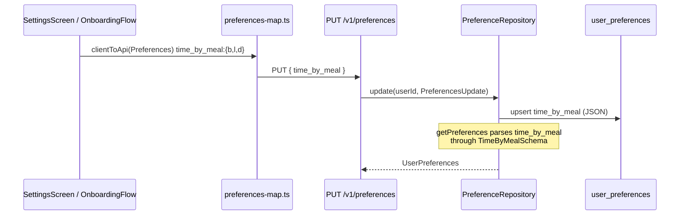
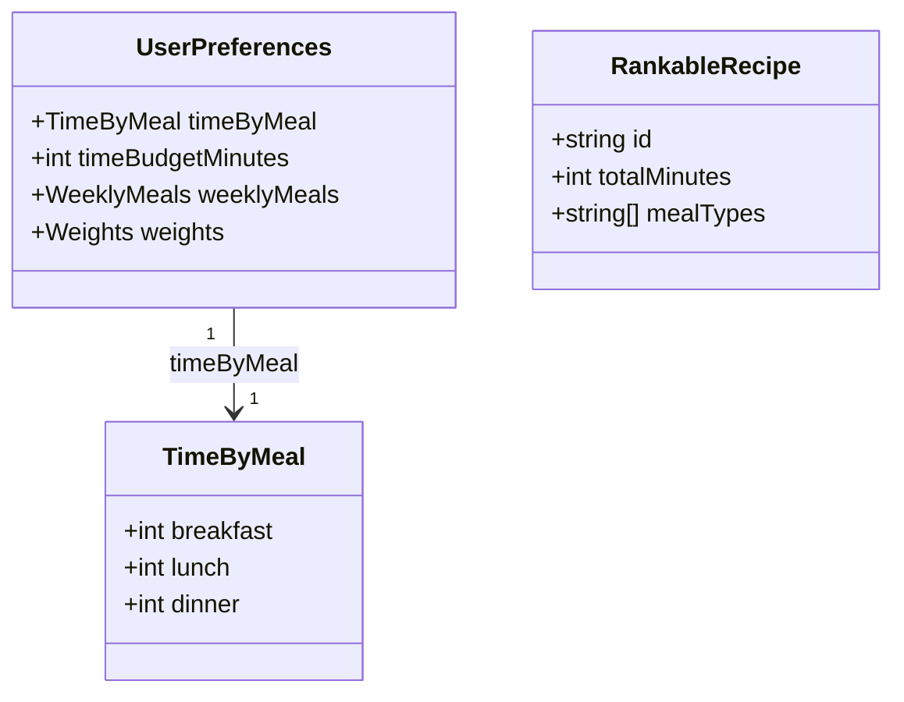
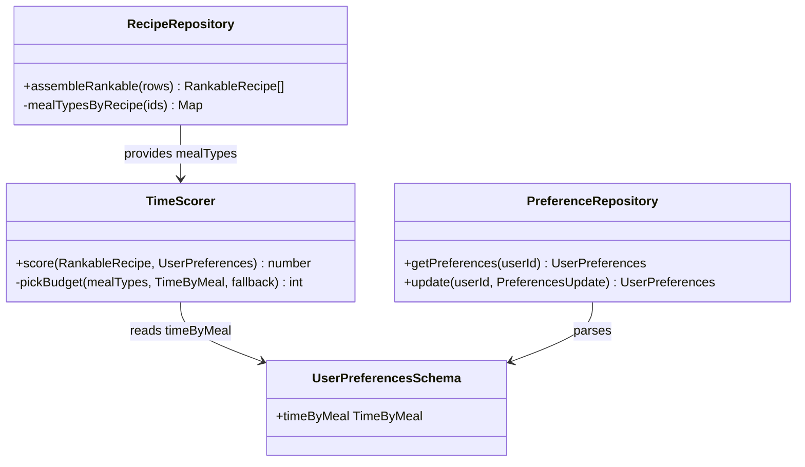
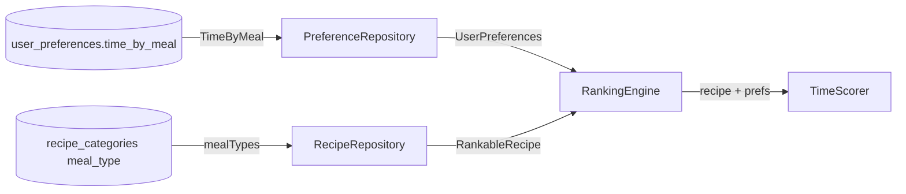

# Per-Meal Time-Budget Ranking

Onboarding now asks how much time the user spends on breakfast, lunch, and dinner
(three sliders — `app/(onboarding)/flow.tsx:68`, `MealTimeSliders`). The shipped
onboarding PR collapses those three values into one scalar
(`timeBudgetMin = max(breakfast, lunch, dinner)` — `flow.tsx:176`) as a placeholder.
This document designs the real per-meal system: the `TimeScorer` scores a recipe
against the budget for **its** meal type instead of one global budget.

The whole change is small. The scorer already computes `(2*T - minutes)/T`
(`server/src/ranking/scorers.ts:76`); all that changes is *which* `T`. The work is:
carry the recipe's `meal_type` into the ranker (it is dropped today), store three
budgets instead of one, and pick the right budget per recipe.

---

# Reviews

| Reviewer | Status | Feedback |
|---|---|---|
| Architect | not_started | |
| Founder | not_started | |

---

# Use Case Implementations

The system already has one Flow this touches — **F-RANK: Rank the caller's recipes**
(deck / ranked list). No new endpoint or actor-visible flow is introduced; the change
is internal to how the time signal scores. The two implementations below show the
scoring mechanics before and after, and the preferences write that feeds it.

## Per-Meal Time Scoring — Implements F-RANK (time signal, revised)

The ranker scores a flat list of `RankableRecipe`. Today it has no per-recipe
meal-type context. The change adds `mealTypes` to `RankableRecipe` and has the
`TimeScorer` pick the budget for the recipe's meal type.

```mermaid
sequenceDiagram
    participant Svc as RecipeService.deck/ranked
    participant Repo as RecipeRepository
    participant Eng as RankingEngine
    participant TS as TimeScorer

    Svc->>Repo: listDeckCandidates(userId, mealTypes)
    note over Repo: assembleRankable now also buckets<br/>meal_type into recipe.mealTypes
    Repo-->>Svc: RankableRecipe[] (each carries mealTypes)
    Svc->>Eng: rank(recipes, prefs)
    loop each recipe
        Eng->>TS: score(recipe, prefs)
        note over TS: budget = pickBudget(recipe.mealTypes, prefs.timeByMeal)<br/>most-generous applicable; global fallback
        TS-->>Eng: clamp01((2*budget - totalMinutes)/budget)
    end
    Eng-->>Svc: RankedRecipe[]
```

## Save Per-Meal Time Budgets — Implements O-PREFS-WRITE (revised)

Settings/onboarding sends three time values. The preferences repo persists them as a
JSON column and parses them back through the domain model.



---

# Entities

The domain gains one value object on `UserPreferences`: a per-meal time budget map,
shaped like the existing `WeeklyMeals`. `RankableRecipe` gains its meal-type set,
which today it discards.



`TimeByMeal` holds only breakfast/lunch/dinner (the three sliders). Snack and kids
get no budget — see Decisions ("Snack and kids get no time budget").

---

# Tables

## user_preferences (change)

Add one column. Full definition: `server/src/schema.ts:463`.

| Column Name | Type | Constraints | Notes |
|---|---|---|---|
| time_by_meal | text (json) | nullable | `{ breakfast, lunch, dinner }` minutes. Mirrors `weekly_meals`. Null → fall back to `time_budget_minutes`, then to no signal. |

`time_budget_minutes` (int, existing, `schema.ts:472`) is **retained** as a derived
convenience value = `max(breakfast, lunch, dinner)`, so any caller not yet meal-aware
(and the cold-start default path) still has a scalar. It is written on every save
alongside `time_by_meal`; the ranker reads `time_by_meal` first. See Decisions.

No index change — `user_preferences` is keyed by `user_id` (pk) and read one row at a
time.

---

# Modules

The touched modules: the domain model, the preferences repo (read/write), the recipe
repo (populate `mealTypes`), and the `TimeScorer`.





### `pickBudget` — the one piece of new logic

`TimeScorer.score` (`scorers.ts:79`) replaces `const t = prefs.timeBudgetMinutes`
with `const t = pickBudget(recipe.mealTypes, prefs.timeByMeal, prefs.timeBudgetMinutes)`:

```
pickBudget(mealTypes, timeByMeal, fallback):
  if timeByMeal is null: return fallback          // legacy / not-yet-migrated user
  applicable = mealTypes
    .map(mt => SLOT_FOR_MEAL_TYPE[mt])            // brunch→breakfast, others 1:1
    .filter(slot => slot != null)
    .map(slot => timeByMeal[slot])
  if applicable is empty: return max(timeByMeal)   // no/other meal_type → most generous
  return max(applicable)                            // multi-meal recipe → most generous applicable
```

`SLOT_FOR_MEAL_TYPE`: `breakfast→breakfast`, `brunch→breakfast`, `lunch→lunch`,
`dinner→dinner`; `snack` maps to nothing (excluded). The "most generous" rule
(`max`) is deliberate — see Decisions.

### Populating `mealTypes` (RecipeRepository)

`assembleRankable` (`recipe-repository.ts:456`) currently drops `meal_type`
(`affinityCategoriesByRecipe:527` — "ignore meal_type — not an affinity facet").
Rather than widen the affinity map, add a small sibling batch `mealTypesByRecipe(ids)`
that selects `recipe_categories` rows with `facet = 'meal_type'` and returns
`Map<recipeId, string[]>`, then set `mealTypes` on each `RankableRecipe`. This keeps
the affinity map's contract unchanged (it stays the three affinity facets) and adds
meal_type as its own concern — one job per function (`server/CLAUDE.md`).

---

# APIs

## Get Preferences `GET /v1/preferences`

Returns the caller's preference model. Body gains `time_by_meal`.

### Success Response `200`

- Body
    - preferences: object
        - … (unchanged fields)
        - time_budget_minutes: int | null  *(retained; = max of the three)*
        - time_by_meal: object | null
            - breakfast: int
            - lunch: int
            - dinner: int

## Update Preferences `PUT /v1/preferences`

Upserts the user-editable subset. Body gains `time_by_meal`; the client stops sending
`time_budget_minutes` (the server derives it).

### Request

- Body
    - … (unchanged fields)
    - time_by_meal: object
        - breakfast: int  *(10–120, the slider range)*
        - lunch: int
        - dinner: int

### Success Response `200`

Same body as `GET`.

### Validation Error Response `422`

- Body
    - error: object
        - code: int
        - message: string

`TimeByMealSchema` validates each value as a positive int; out-of-range values 422 at
the boundary (repo `parse`), consistent with the existing weight-range enforcement in
`user-preferences.ts`.

---

# Testing

## Test Coverage

| Use Case | Type | Unit | Integration | E2E |
|---|---|---|---|---|
| F-RANK: per-meal time scoring | Flow | x (TimeScorer) | x (deck) | |
| O-PREFS-WRITE: save 3 budgets | Op | x (schema) | x (PUT/GET) | |

## Test Approach

### Unit Tests

`TimeScorer.pickBudget` / `score` — the core logic, in isolation with hand-built
`RankableRecipe` + `UserPreferences`:

- single meal_type (`['dinner']`) → uses `timeByMeal.dinner`.
- multi meal_type (`['breakfast','lunch']`) → uses `max` of the two applicable.
- `brunch` → resolves to the `breakfast` budget.
- no meal_type (`[]`) → most-generous overall budget (never null when `timeByMeal` set).
- `timeByMeal === null` (legacy user) → falls back to `timeBudgetMinutes`; both null → `null`.
- boundary: `totalMinutes === null` → `null` (unchanged).

These extend the existing scorer unit tests (same file/pattern as the current
`TimeScorer` test). Keep the count minimal — one case per branch of `pickBudget`.

### Integration Tests

`RecipeRepository.assembleRankable` populates `mealTypes` — assert a seeded recipe
with a `meal_type` category surfaces it on the `RankableRecipe` (against the local
migrated Postgres, per `server/CLAUDE.md`). One deck integration test: two recipes,
one breakfast (fast) and one dinner (slow), with `timeByMeal` favoring quick breakfasts
— assert the breakfast ranks above the dinner where the global-budget ranker would tie
them. This is the "deck and time signal agree" guarantee.

`PreferenceRepository` round-trip: `update` with `time_by_meal` then `getPreferences`
returns it parsed, and `time_budget_minutes` equals the max.

### End-to-End Tests

None required. No new user-facing flow; the sliders already exist and the mapping is
covered by the client-mapping change (a lightweight `preferences-map` unit assertion
that `time_by_meal` round-trips is enough).

## Test Infrastructure

None new. Reuse the recipe/preferences seed helpers the existing ranking + deck tests
use.

---

# Deployment

## Migrations

| Order | Type | Description | Backwards-Compatible |
|---|---|---|---|
| 1 | schema | Add nullable `time_by_meal` json column to `user_preferences` (`drizzle-kit generate` → `migrate`). Adds-only on the table — no drop — so codegen stays non-interactive (`harvest-principles.md`, staged-migration rule). | yes |
| 2 | data | Backfill `time_by_meal = { breakfast: t, lunch: t, dinner: t }` where `t = time_budget_minutes` and `time_by_meal IS NULL`. Runs once; online (single UPDATE, tiny table). | yes |

`time_budget_minutes` is **not** dropped — retiring it would be a drop+add on the same
table in a later migration, and it stays useful as the derived scalar. Keeping it also
means old code (reading only the scalar) keeps working against the new schema.

## Deploy Sequence

1. Migration 1 (add column) — safe before code; new column is nullable and ignored by
   old code.
2. Migration 2 (backfill) — after column exists; before or after code deploy, since the
   ranker falls back to `time_budget_minutes` when `time_by_meal` is null anyway.
3. Server code (populate `mealTypes`, `pickBudget`, write `time_by_meal`).
4. Client (send `time_by_meal`; stop collapsing the three sliders in `flow.tsx:176`).

Steps 3 and 4 are independent: the server reads `time_by_meal` if present and falls
back otherwise, so a client that hasn't shipped yet just keeps writing the scalar and
gets the (correct) backfilled equal-budget behavior.

## Rollback Plan

Code rolls back independently of the schema. If the server code is reverted, the extra
`time_by_meal` column is simply unread (the old `TimeScorer` reads `timeBudgetMinutes`,
still populated). No need to reverse the migration. The backfill is idempotent and
harmless to leave.

---

# Monitoring

## Metrics

No new metric. The time signal already contributes to the deck score breakdown
(`RankedCard.breakdown.time`), which is the existing observability surface for ranking.
Per the skill's rule (every metric ties to a Flow and earns its ingest cost), a
dedicated per-meal-time metric would not answer "is F-RANK working?" any better than
the breakdown already does.

## Logging

None added. `pickBudget` is pure and deterministic; a fallback-to-global is expected
for un-migrated users, not an error worth logging.

## Dashboards

None.

---

# Decisions

## Store three budgets as a JSON column, keep the scalar as a derived value

**Framework:** Direct criterion — mirror the existing, proven pattern.

`weekly_meals` is already a `{breakfast,lunch,dinner,snack,kids}` JSON column on the
same table (`schema.ts:474`), validated by `WeeklyMealsSchema`. A per-meal *time* map
is the identical shape and lifecycle. Reusing the pattern (a `TimeByMealSchema`
alongside `WeeklyMealsSchema`) is the lazy, consistent choice — no new table, no join,
no N+1.

**Choice:** `time_by_meal` json column + `TimeByMeal` value object. Retain
`time_budget_minutes` as the derived `max`, written on every save, so non-meal-aware
callers and cold-start keep a scalar and old code stays compatible.

### Alternatives Considered
- **Three int columns** (`time_breakfast_minutes`, …): three migrations of ceremony
  for what one JSON column does; diverges from the `weekly_meals` precedent.
- **Retire `time_budget_minutes` entirely:** forces a drop+add on the table (non-TTY
  codegen hazard) and loses a cheap, back-compatible scalar for callers that don't
  care about meal type. Not worth it.
- **Separate `user_time_budgets` table:** a one-row-per-user child table is strictly
  more join for zero benefit over a JSON column on the row that's always loaded.

## Pick the most-generous applicable budget for multi/no meal-type recipes

**Framework:** Binstack — priorities: (1) never wrongly penalize a valid recipe,
(2) deck and time-signal agree, (3) simplicity.

A recipe can carry multiple `meal_type` facets (`vocab.ts:15` — a dish can be
`breakfast` **and** `brunch`, or `lunch` **and** `dinner`). The budget must be a single
`T`.

- **Most-generous applicable (`max`)** — materially moves (1): a recipe valid for both
  lunch and dinner is judged against whichever budget is kinder, so a legit dinner
  recipe surfacing in a lunch-heavy deck isn't buried for being slow. Satisfies (2):
  the deck filter already admits a recipe if it matches *any* selected meal type
  (`recipe-service.ts:434`, `inArray(value, categories)` — OR semantics); scoring it
  against the *most generous* of those same types keeps filter and score consistent.
  Simple (3): one `max`.

**Choice:** `max` of the applicable per-meal budgets; if none apply (recipe has no
meal_type, or only `snack`), `max` of all three budgets — the recipe still gets scored
rather than dropping the signal. Only when `time_by_meal` itself is unset does the
signal fall back to the scalar / null.

### Alternatives Considered
- **Budget for the deck's current meal-type filter:** the ranker scores a flat list and
  doesn't know the filter; threading filter context into every scorer is more plumbing,
  and the deck can span multiple meal types (multiple chips selected) so there isn't a
  single filter budget anyway.
- **Most-restrictive (`min`):** penalizes a recipe for being eligible at a
  tight-budget meal it also fits elsewhere — violates priority (1).
- **Average of applicable:** muddies the signal and matches no user intent ("I have 20
  min for lunch OR 45 for dinner", not "32.5 for this dish").

## Snack and kids get no time budget

**Framework:** Direct criterion — no signal exists to capture.

Onboarding has three sliders (breakfast/lunch/dinner). There is no snack- or
kids-time slider, so there is no user-supplied budget to score against. Snack-only
recipes fall through to the most-generous overall budget (they still get *a* time
score, just not a snack-specific one). `kids` isn't a `meal_type` facet at all
(`vocab.ts:15`), so it never reaches the scorer.

**Choice:** `TimeByMeal` holds only breakfast/lunch/dinner. `snack` meal_type maps to
no slot in `SLOT_FOR_MEAL_TYPE` and thus to the generous fallback.

### Alternatives Considered
- **Derive a snack budget** (e.g. `min` of the three, or a constant): invents data the
  user never gave; adds a knob to justify later. YAGNI until a snack slider exists.

---

# Open Questions

| ID | Question | Status | Resolution |
|---|---|---|---|
| Q-01 | Should the three sliders' range/step change from the current 10–120 by 5 (`flow.tsx:77`) now that each meal is independent (e.g. breakfast rarely 120 min)? Design assumes the range is unchanged. | open | |
| Q-02 | `EQUIPMENT_TYPES` is duplicated in `models/user-preferences.ts:12` and referenced from `schema.ts`. Adding `TimeByMealSchema` should follow the same "model validates independently of the table" convention — confirm we're not expected to also de-duplicate that const as part of this change (out of scope here; flagging since the prompt noted it). | open | [ASSUMPTION: out of scope — this doc only adds `TimeByMealSchema`, mirroring `WeeklyMealsSchema`, and does not touch the equipment duplication.] |
| Q-03 | When the deck spans multiple meal types (several Discover chips), is "most-generous applicable per recipe" the ranking the founder wants, or should a lunch-filtered view score everything strictly against the lunch budget? Design chose per-recipe most-generous for filter/score agreement. | open | |
| Q-04 | Cold-start (never-onboarded) users have `time_by_meal = null` and `time_budget_minutes = null` → the time signal drops (returns null), same as today. Confirm that's the desired cold-start behavior (it matches the "no data → no filter/signal" stance elsewhere). | open | |

---

# Appendix A — Changelog

| Date | Author | Change |
|---|---|---|
| 2026-08-20 | Feature Lead (design) | Initial draft |
