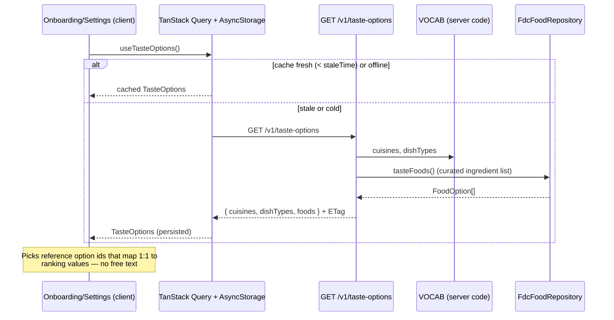
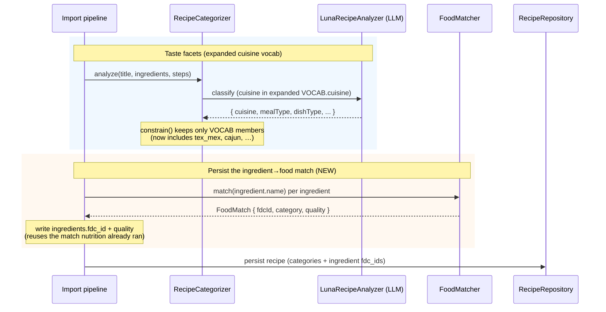
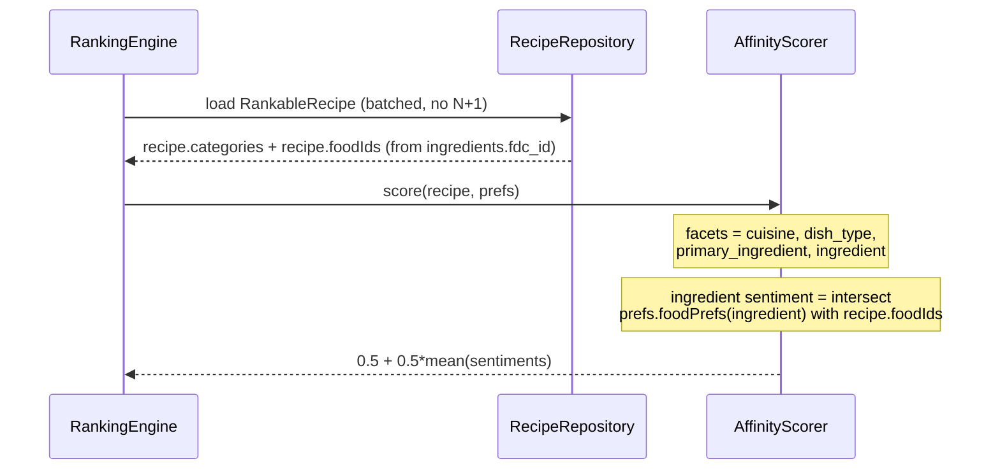
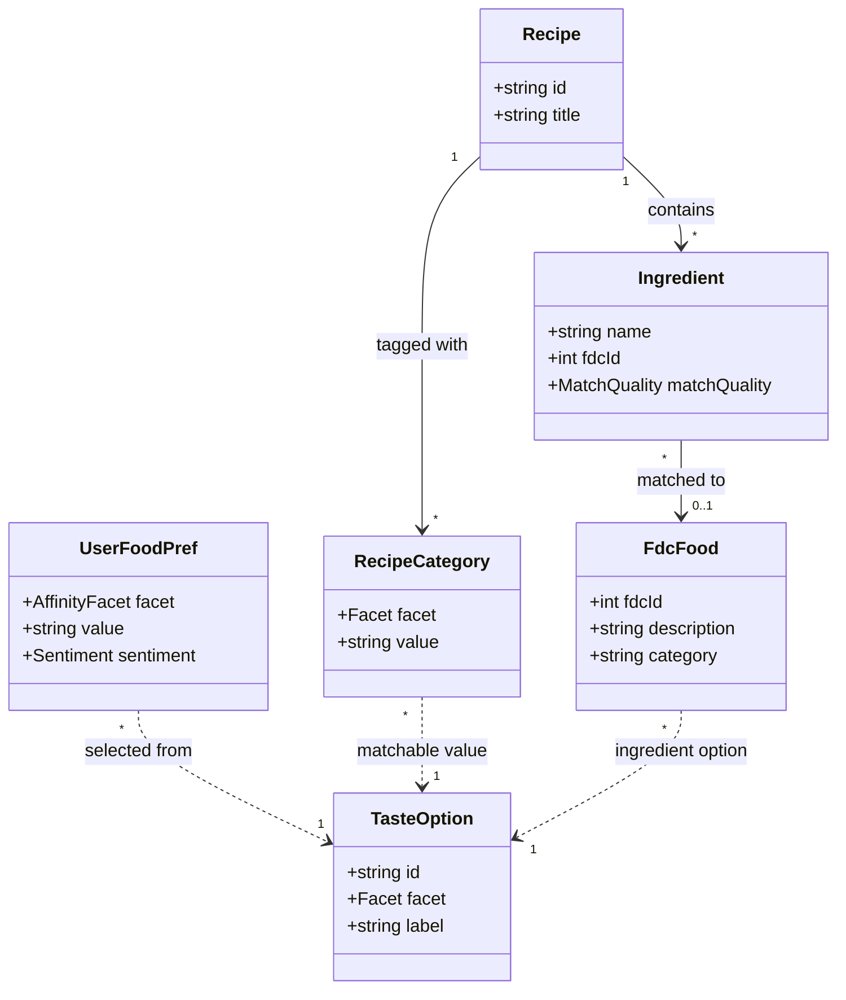
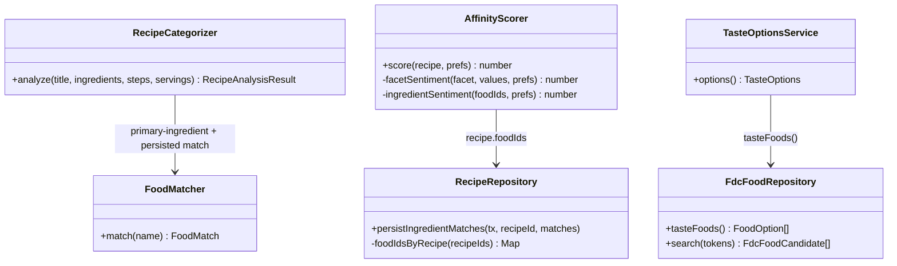
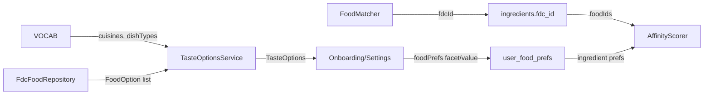

# Taste Classification & Affinity Overhaul

The onboarding taste picker lets a user say *what they like to eat* and *what to avoid*. Today those
picks silently fail to reach ranking. This document reworks recipe **classification** and the
**affinity** signal so every cuisine (tex-mex, cajun, baja, creole, …) and every one of the ~5,000
seeded foods (okra, miso, blue cheese, …) actually moves recommendations, and specifies the
serve-once `GET /v1/taste-options` catalog that feeds the picker.

## The gap, stated precisely

A taste pick influences ranking only when it maps to something a recipe carries. Two chokepoints
decide that:

1. **Classification.** `RecipeCategorizer.analyze()` tags each recipe against a 19-cuisine allow-list
   (`server/src/categorize/vocab.ts:8`), and `constrain()` **drops any value not in `VOCAB`**
   (`server/src/categorize/taste-classifier.ts:130`). A recipe is never tagged `tex-mex` — the value
   cannot survive the filter.
2. **Affinity.** `AffinityScorer.facetSentiment()` scores a recipe by intersecting
   `prefs.foodPrefs` `{facet, value}` with `recipe.categories` on three facets — cuisine, dish_type,
   primary_ingredient (`server/src/ranking/scorers.ts:57`). Ingredient-level food likes have **no
   facet to land on**: a recipe carries at most 12 coarse `primary_ingredient` classes
   (`server/src/categorize/vocab.ts:23`), never "okra". An "okra" dislike intersects nothing and
   scores 0.

The client already offers the richer vocabulary the server cannot honor: `ALL_CUISINES` includes
`"Tex-Mex"`, `"Cajun"`, `"Soul food"` (`components/onboarding/primitives.tsx:238`) and
`ALL_INGREDIENTS` includes `"Okra"`, `"Miso"`, `"Kimchi"`
(`components/onboarding/primitives.tsx:239`). These are hardcoded, duplicate the server vocab, and
map to `{cuisine | dish_type | ingredient}` in `tasteFacet()`
(`components/onboarding/primitives.tsx:360`) — but `ingredient` is not an affinity facet the server
scores, and `"Tex-Mex"` is not a cuisine the server recognizes. The picks are accepted by
`PUT /v1/preferences` and stored; they simply never match a recipe.

This overhaul closes both chokepoints and makes the client read the server's vocabulary instead of
carrying its own.

---

# Reviews

| Reviewer | Status | Feedback |
|---|---|---|
| Architect | not_started | |
| Founder | not_started | |

---

# Use Case Implementations

The feature spans three flows: serving the catalog, classifying a recipe against the expanded
vocabulary, and scoring affinity against the new ingredient facet.

## Serve Taste Options — Implements F-TO-1: Load the taste-picker catalog

The picker fetches the full option catalog **once** at app start and caches it. It is not a
per-keystroke search: latency and offline use rule that out, and every option must map to a ranking
value, so free text is not selectable.

## Classify Recipe — Implements F-CL-1: Tag a recipe's taste at import

One LLM call tags cuisine / meal_type / dish_type against the **expanded** cuisine vocabulary;
primary_ingredient stays FDC-grounded; and — new here — the ingredient→food match the nutrition
pipeline already computes is **persisted** so ingredient-level affinity has something to match.

## Score Affinity — Implements F-AF-1: Rank a recipe against food likes/dislikes

`AffinityScorer` gains a fourth facet, `ingredient`, matched against the recipe's persisted food
ids. An "okra" dislike now penalizes any recipe whose ingredients matched the okra food.

---

# Entities

`TasteOption` is a **view** over VOCAB (cuisines, dish types) and the curated base-ingredient set
(`taste_ingredients`), not a stored table — it is assembled by the endpoint. `UserFoodPref.facet` now
admits `ingredient`, whose `value` is a `base_ingredient_id` (the curated cluster, resolves Q-03).

---

# Tables

## ingredients — changed

Adds the persisted ingredient→food match (already computed by the nutrition pipeline, discarded
today — the match in `NutritionEstimator.aggregate()` is transient,
`server/src/nutrition/nutrition-estimator.ts:102`). Full definition:
`server/src/schema.ts:204`.

| Column Name | Type | Constraints | Notes |
|---|---|---|---|
| fdc_id | integer | null, fk → fdc_foods.fdc_id | The matched FDC food; null when no match cleared the reject floor |
| match_quality | text | null, enum(high, medium, low) | The `FoodMatch.quality` tier (`server/src/nutrition/food-matcher.ts:5`) |

Index: `ingredients_fdc_idx` on `(fdc_id)` — the affinity join reads "recipes whose ingredients
matched food X."

## recipe_categories — unchanged

No schema change. `value` is a free string validated in app code, not a DB enum
(`server/src/schema.ts:246`), so expanding the cuisine vocabulary needs **no migration** — only a
`VOCAB` edit plus re-classification. This is the design's key affordance.

## user_food_prefs — unchanged schema, widened enum

`facet` is `AFFINITY_FACETS` (`server/src/schema.ts:529`). `AFFINITY_FACETS` gains `ingredient`
(`server/src/schema.ts:636`), an app-level tuple change, not a DB migration — the column is
`text`. `value` for an `ingredient` pref is a `base_ingredient_id` — the curated cluster the pick
rolls up to, **not** a raw `fdc_id` (resolves Q-03).

## fdc_foods / fdc_foods_fts — changed

Adds three columns so foods can be clustered into a base-ingredient picker. The current real seed has
5,432 `fdc_foods` rows with `category` populated (172 distinct, 0 nulls) but carries only the FDC
`fdc_id` (e.g. `2705383`), **not** the FNDDS `food_code` — hence the re-seed
(`server/src/schema.ts:406`, FTS mirror `server/drizzle/0002_fdc_fts.sql`).

| Column Name | Type | Constraints | Notes |
|---|---|---|---|
| food_code | integer | null | 8-digit FNDDS code, from the FDC Survey JSON `foodCode`; the hierarchical key that drives clustering |
| wweia_category_code | integer | null | 4-digit `wweiaFoodCategory.wweiaFoodCategoryCode`; the existing `category` description stays |
| base_ingredient_id | text | null, fk → taste_ingredients.id | The curated cluster this food rolls up to; the affinity join target |

## taste_ingredients — new

The picker options — a few-hundred curated base ingredients the ~5,432 foods collapse into. Populated
by the curation pass (see *Ingredient Curation*). The affinity join is
`ingredients.fdc_id → fdc_foods.base_ingredient_id`, and a user ingredient pref's `value` is a
`base_ingredient_id`.

| Column Name | Type | Constraints | Notes |
|---|---|---|---|
| id | text | pk | Slug (the `base_ingredient_id` foods point to) |
| label | text | not null | Canonical consumer name (e.g. `Chicken`, `Bell pepper`) |
| section | text | not null | One of the 9 FNDDS groups, or a ~13 grocery-aisle remap — the picker's section header |
| food_group | integer | not null | FNDDS major group, 1–9 (= `food_code[0]`) |

---

# Modules

`RankableRecipe` (`server/src/ranking/types.ts:4`) gains `foodIds: number[]`, batched into
`assembleRankable()` alongside categories/diets/equipment
(`server/src/repositories/recipe-repository.ts:461`) — no N+1.

---

# Ingredient Curation (fdc_foods → base ingredients)

The 5,432 foods are too many and too qualified to be picker chips — a raw FNDDS description carries
form, prep, part, and survey `NS`/`NFS` tokens ("Chicken breast, grilled, skin not eaten"). Curation
collapses them ~42:1 into a **few hundred** base ingredients, grouped into sections, keyed by the
FNDDS food code.

**Derived keys.** The 8-digit `food_code` is hierarchical, so two slices give the structure for free:
- `food_group = food_code[0]` — 9 FNDDS majors: 1 Dairy, 2 Meat/Protein, 3 Eggs,
  4 Legumes/Nuts/Seeds, 5 Grains, 6 Fruits, 7 Vegetables, 8 Fats/Oils, 9 Sugars/Sweets/Beverages.
- `subgroup = food_code[:4]` — ~280 coherent families. The subgroup is what keeps clustering honest:
  coconut milk and dairy milk share the word "milk" but live in different subgroups, so they never
  merge.

**Pipeline.**
1. **Exclude non-ingredients.** Drop foods whose WWEIA category rolls to Mixed Dishes (those are
   `dish_type`, not ingredients), plus Baby Foods, Water, and Other. Decide once whether Beverages +
   Alcohol get their own section or are excluded.
2. **De-qualify to a base name.** FNDDS descriptions are comma-delimited, head-first: take the first
   segment as head noun, then strip a qualifier lexicon from every segment — cooking methods
   (grilled/fried/baked/boiled/raw/cooked/steamed), forms (fresh/frozen/canned/dried/from
   concentrate), fat-percent (`low fat`, `(1%)`, `reduced fat`, `NS as to percent lean`), part/prep
   (`skin not eaten`, `without sauce`), and the survey `NS`/`NFS` tokens + parentheticals. Normalize:
   lowercase, singularize, trim.
3. **Cluster by `(subgroup, base_name)`.** The code subgroup prevents lexical false-merges; the name
   gives the label.
4. **Granularity knobs.** A small hand-authored config of merge rules ("chicken breast/thigh" →
   Chicken) and keep-split rules ("bell pepper" ≠ "pepper"). This config is the calibration surface —
   the tuning knob the physical corpus needs — not per-food labeling.
5. **Label.** Title-case the base name; borrow a USDA Foundation Foods commodity label where one
   matches by normalized name; else an overrides map for the residual ugly names.
6. **Section.** The 9 FNDDS group label (or a ~13 grocery-aisle remap).
7. **Emit + QA.** Set `fdc_foods.base_ingredient_id`, insert `taste_ingredients`. Assert the cluster
   count lands in a sane band (~200–500), that 100% of non-excluded foods map, and eyeball a sample
   per section.

**Target.** A few hundred base ingredients, sectioned — not a flat 5K list. We **rejected** keying
against FoodOn / Open Food Facts / LanguaL (their terminology, unit, and granularity mismatches are
non-trivial to reconcile for little payoff) and **rejected** Foundation Foods as the source (too
sparse, ~73 foods) — but we borrow its labels where they match.

---

# APIs

## Taste Options `GET /v1/taste-options`

Returns the full taste-picker catalog: cuisines, dish types, and the curated ingredient foods.
Served once, cached client-side. Authenticated (same `guard` as siblings,
`server/src/index.ts:156`).

### Request

- Headers
    - authorization: `Bearer <jwt>`
    - if-none-match: `<etag>` (optional; the cache revalidates cheaply)

### Success Response `200`

- Headers
    - content-type: `application/json`
    - etag: `<hash of VOCAB + food-catalog version>`
    - cache-control: `private, max-age=86400`
- Body
    - taste_options: object
        - cuisines: array of `{ value: string, label: string }`
        - dish_types: array of `{ value: string, label: string }`
        - foods: array of `{ value: string (fdc_id), label: string, group: string }`

`value` is the exact string a pick stores in `user_food_prefs.value`; the client no longer invents
labels. `group` is the food's `category`, so the picker can section the list.

### Not Modified Response `304`

- Headers
    - etag: `<etag>`
- Body: empty. The client keeps its cached catalog.

## Preferences `PUT /v1/preferences` — extended

Unchanged shape (`server/src/index.ts:186`); `foodPrefs` now accepts `facet: "ingredient"` with a
`value` that is an `fdc_id` string. The body validator adds `ingredient` to the allowed facet enum.

### Ingredient Facet Rejected Response `422`

- Body
    - error: object
        - code: int
        - message: string ("food value must be a known fdc_id")

Returned when an `ingredient` pref's `value` is not a real `fdc_id` — a trust-boundary check, since
the value indexes ranking.

---

# Testing

## Test Coverage

| Use Case | Type | Unit | Integration | E2E |
|---|---|---|---|---|
| F-TO-1: Serve taste options | Flow | | x | |
| F-CL-1: Classify recipe (expanded vocab + match persist) | Flow | x | x | |
| F-AF-1: Score affinity (ingredient facet) | Flow | x | x | |
| O-CL-1: `constrain()` keeps expanded cuisines | Op | x | | |
| O-AF-1: `ingredientSentiment()` intersection | Op | x | | |

## Test Approach

### Unit Tests

- **`AffinityScorer.ingredientSentiment`** — a recipe with `foodIds` `[168409]` and a `dislike`
  pref `{facet: "ingredient", value: "168409"}` scores -1 on that facet; a `like` scores +1; no
  overlap scores 0. Assert the four-facet mean centers on 0.5. Real scorer, hand-built
  `RankableRecipe` and `UserPreferences`.
- **`constrain()` / `valid()`** — an expanded `VOCAB.cuisine` (e.g. `tex_mex`) survives; a bogus
  value is dropped. Guards the exact chokepoint that silently swallowed richer picks today.
- **`FdcFoodRepository.tasteFoods`** — returns the curated subset with stable `value`/`label`/`group`,
  against the local `file:` fixture db (tests already pass one,
  `server/src/nutrition/fdc-food-repository.ts:46`). Never hits the network.

### Integration Tests

- **`GET /v1/taste-options`** — Hono app over the migrated local Postgres
  (`server/tests/helpers/global-setup.ts`); assert the three sections and that every `foods[].value`
  is a real `fdc_id`. Assert `304` on a matching `if-none-match`.
- **Classify → persist → affinity, end to end offline** — import a fixture recipe with an okra
  ingredient, assert `ingredients.fdc_id` is written, set an okra `dislike`, rank, assert the recipe's
  affinity breakdown is penalized. The `StubRecipeAnalyzer` runs when no key is set
  (`server/src/categorize/taste-classifier.ts:148`), so classification is deterministic offline; seed
  the cuisine tag directly to test the expanded-vocab path without the LLM.

### End-to-End Tests

Not required beyond the integration flow — the classification LLM call is the only networked step and
is stubbed offline per `server/CLAUDE.md` ("tests never hit the network").

## Test Infrastructure

The fixture FDC db needs a curated-taste-food row set and an okra food so the affinity join has a
target. Extend the existing WI-1 nutrition fixture rather than adding a new one.

---

# Deployment

## Migrations

| Order | Type | Description | Backwards-Compatible |
|---|---|---|---|
| 1 | schema | `ingredients.fdc_id`, `ingredients.match_quality`, `ingredients_fdc_idx`; `fdc_foods.{food_code, wweia_category_code, base_ingredient_id}`; `taste_ingredients` table (adds only) | yes |
| 2 | code | Expand `VOCAB.cuisine`; add `ingredient` to `AFFINITY_FACETS` | yes |
| 3 | data | Re-seed recipes + foods (reproducible seed): re-classify against expanded vocab, capture `food_code`/`wweia_category_code`, run curation to fill `base_ingredient_id` + `taste_ingredients`, and backfill `ingredients.fdc_id` | n/a (rebuild) |

Migration 1 adds only — never a drop-plus-add on one table — so `drizzle-kit generate` stays
non-interactive (`docs/harvest-principles.md`, "stage destructive-plus-additive schema changes").
Old code ignores the new nullable columns; the new column is null until backfilled, and
`AffinityScorer` treats an empty `foodIds` facet as "no signal" (returns null, contributes nothing),
so the feature is dark until data lands.

## Data migration — re-seed, not a backfill LLM pass

The recipe seed is **reproducible** (per memory: "the recipe seed is reproducible"). Re-running it
re-classifies every recipe against the expanded `VOCAB` and populates `ingredients.fdc_id` from the
same match the nutrition step runs — no separate, costly LLM backfill over the live corpus. The
re-seed also captures `food_code` + `wweia_category_code` on each `fdc_food` and runs the curation
pass (see *Ingredient Curation*) to populate `base_ingredient_id` and insert `taste_ingredients`. See
the Decisions section.

## Deploy Sequence

1. Schema migration 1 (nullable adds) — deployable ahead of code.
2. Code (expanded vocab + ingredient facet + endpoint) — old rows still rank; new facet stays null.
3. Re-seed off-hours; the deck refreshes on next fetch (client cache invalidates on the
   preferences/recipes keys per `docs/client-caching.md`).

## Rollback Plan

Roll back code independently — the new columns are nullable and unread by old code. If re-seed is
mid-flight, the affinity ingredient facet simply contributes null for un-backfilled recipes; nothing
breaks. No destructive migration to reverse.

---

# Monitoring

## Metrics

| Name | Type | Use Case | Description |
|---|---|---|---|
| taste_options_served | counter | F-TO-1 | Catalog fetches (vs 304s) — confirms the serve-once cache holds |
| recipe_ingredient_match_rate | gauge | F-CL-1 | Fraction of ingredients that matched an fdc food at import — the ceiling on ingredient affinity |
| affinity_ingredient_hit_rate | gauge | F-AF-1 | Fraction of ranked recipes where an ingredient pref actually intersected — proves picks now bite |

## Alerts

| Condition | Threshold | Severity |
|---|---|---|
| recipe_ingredient_match_rate drops after a seed | < 0.5 | warn |

## Logging

Log at `info`, low-cardinality: `unmatched_cuisine_from_llm` (an LLM cuisine that failed `inVocab`
after expansion) — surfaces vocabulary gaps to fold into the next `VOCAB` revision. No verbose
per-recipe logging in the import hot path.

---

# Decisions

## Persist the ingredient→food match rather than mapping foods to coarse classes

**Framework:** Binstack. Priorities (ranked): (1) a pick actually moves ranking, (2) reuse work
already done, (3) no new LLM cost, (4) small diff.

- **Persist `ingredients.fdc_id`** — materially moves (1): "okra" penalizes okra recipes at food
  granularity. Moves (2)/(3): the match is already computed in `NutritionEstimator.aggregate()`
  (`server/src/nutrition/nutrition-estimator.ts:102`) and thrown away; persisting it adds a column
  write, no new call. Moves (4): two nullable columns + one scorer facet.
- **Map foods → the 12 `primary_ingredient` classes** — fails (1): "okra" and "spinach" both collapse
  to `vegetable`; the pick can't distinguish them. No new work, but the signal is too coarse to be the
  feature.
- **Curated ingredient sub-vocab (a hand-picked ~200 foods)** — partially moves (1) but caps the
  catalog below the stated "all ~5,000 foods" goal and adds ongoing curation.

**Choice:** Persist the match. It is the only option that materially satisfies the top priority
(the pick bites at food granularity) *and* reuses computation already paid for.

### Alternatives Considered
- **Coarse primary-ingredient mapping:** too lossy — can't separate two vegetables.
- **Curated sub-vocab:** doesn't meet the all-foods goal; adds curation debt.
- **New recipe_foods join table:** redundant — the match is per-ingredient and `ingredients` already
  is that grain; a join table would denormalize what one nullable column expresses.

## Two-level cuisine hierarchy with parent fallback, re-seed to re-classify

**Framework:** Fermi ROI.

- **Impact:** high — unlocks tex-mex/cajun/creole/baja end to end; these are common and currently
  silently unmatched.
- **Effort:** low. Expanding `VOCAB.cuisine` is a code edit; because `recipe_categories.value` is a
  free string (`server/src/schema.ts:246`), **no migration**. Re-classification rides the reproducible
  re-seed — near-zero marginal effort vs. a bespoke backfill.
- **A backfill LLM pass over the live corpus** is higher effort (a new batch job, rate-limit handling
  per `docs/harvest-principles.md` tiered-escalation) for the same end state.

**Choice:** `VOCAB.cuisine` is a two-level parent→child hierarchy — ~40–70 entries, authored from
Wikipedia's *List of cuisines* and *List of American regional and fusion cuisines* (geographic tree
only; we drop the religious/style/historical axes). A child that a recipe rarely hits **falls back to
its parent** for ranking, so a sparse leaf still scores. The tree is a display/fallback grouping the
picker computes from the flat list — not a second stored value. Cajun and Creole are modeled as
**siblings** under Southern (they are distinct culinary practices), not nested one under the other.
Re-seed to re-classify. Highest ROI — biggest unlock for a code-edit-plus-reseed.

Over-granular leaves fragment recipe density and hurt LLM classification accuracy, so the hierarchy
stays shallow (two levels) and parent-fallback covers the thin leaves.

**Proposed `VOCAB.cuisine` (parent → children):**

| Parent | Children |
|---|---|
| American | Southern (→ Cajun, Creole, Soul food, Lowcountry), Southwestern (→ Tex-Mex), New England, Midwestern, Californian, Hawaiian, Floribbean |
| Mexican | Baja, Oaxacan, Yucatecan |
| Caribbean | — |
| Peruvian | — |
| Brazilian | — |
| Argentine | — |
| Italian | — |
| French | — |
| Spanish | — |
| Greek | — |
| Mediterranean | *(cross-cutting; no parent)* |
| German | — |
| British | — |
| Eastern European | — |
| Nordic | — |
| Middle Eastern | Lebanese, Turkish, Persian |
| North African | Moroccan |
| Ethiopian | — |
| West African | — |
| Indian | North Indian, South Indian, Punjabi |
| Thai | — |
| Vietnamese | — |
| Chinese | Sichuan, Cantonese, Hunan |
| Japanese | — |
| Korean | — |
| Filipino | — |
| Indonesian | — |
| Malaysian | — |

Southern nests one level deeper (Cajun/Creole/Soul food/Lowcountry) and Southwestern → Tex-Mex; those
sit under American. Total stays in the ~40–70 band.

### Alternatives Considered
- **Flat list, no hierarchy:** loses the parent-fallback that keeps sparse leaves (baja, lowcountry)
  scoring; the picker also can't section without a tree.
- **Hierarchy stored as parent+child rows:** doubles the affinity match surface and complicates the
  scorer for a grouping the picker can compute client-side from the flat list.
- **Backfill LLM pass:** same result, higher cost and operational risk than re-seeding a reproducible
  corpus.

### Documentation
- Hono routing: `server/src/index.ts`
- Client caching pattern: `docs/client-caching.md`

## Serve the catalog once, not per-keystroke free-text search

**Framework:** Direct criterion — the founder set the delivery mechanism, and picks **must** map to a
ranking value (free text cannot). Serve-once also wins on latency and offline. Cache via the existing
TanStack Query + AsyncStorage model (`docs/client-caching.md`), keyed and revalidated by ETag.

---

# Open Questions

| ID | Question | Status | Resolution |
|---|---|---|---|
| Q-01 | Which foods are "taste-selectable"? All ~5,000 fdc_foods is a large payload; do we curate to the ingredient-like subset (exclude prepared dishes, beverages) and section by `category`? | resolved | Re-seed to capture the FNDDS `food_code`, then cluster to a few-hundred base-ingredient picker — see *Ingredient Curation*. The picker options live in `taste_ingredients`, sectioned by FNDDS group. |
| Q-02 | Exact expanded cuisine list — which of tex-mex, baja, cajun, creole, soul_food, etc. does the founder want, and their parent-fallback map? | resolved | Two-level parent→child hierarchy, ~40–70 entries from Wikipedia's cuisine lists — see the proposed `VOCAB.cuisine` table in *Decisions*. Cajun/Creole are siblings under Southern. |
| Q-03 | Does an `ingredient` affinity pref match on the exact `fdc_id`, or also on the food's WWEIA `category` (so "no shellfish" catches every shellfish food)? | resolved | Match on `base_ingredient_id` — the curated cluster: coarser than a raw `fdc_id`, finer than the WWEIA `category`. A pick stores a `base_ingredient_id`; the join is `ingredients.fdc_id → fdc_foods.base_ingredient_id`. |
| Q-04 | ~5K-food payload size and shape — is one `GET` acceptable, or do we need gzip/field-trimming/pagination? | open | [ASSUMPTION: a curated subset (Q-01) gzips small enough for one cached response; measure before adding pagination — don't build it speculatively.] |
| Q-05 | Should the client fully drop its hardcoded corpora now, or read `GET /v1/taste-options` behind a fallback for one release? | open | [ASSUMPTION: read the endpoint as the single source of truth; keep the hardcoded list only as an offline-first render seed, deleted once the cache proves reliable.] |
| Q-06 | Per-cuisine recipe density in the current corpus — how many seeded recipes land on each leaf? This is empirical and sets how granular the cuisine leaves can safely go before parent-fallback has to carry them. No external source answers it; measure against the seeded recipes. | open | [Measure after the first re-seed classifies against the expanded vocab; thin leaves either merge upward or lean on parent-fallback.] |

---

# Appendix A — Changelog

| Date | Author | Change |
|---|---|---|
| 2026-08-20 | Feature Lead (design agent) | Initial draft |
| (this revision) | Feature Lead (design agent) | Fold in research: resolve Q-01/Q-02/Q-03. Add the *Ingredient Curation* algorithm (fdc_foods → few-hundred base ingredients via the FNDDS food code), `taste_ingredients` table, and `fdc_foods` code columns. Author the two-level cuisine hierarchy (~40–70 entries). Add Q-06 (empirical per-cuisine density) and Appendix B (research + sources). |

---

# Appendix B — Research

The design rests on the USDA FNDDS food-code structure and the absence of any standard cuisine
vocabulary. Verified findings:

- **Raw FNDDS descriptions make poor chips.** They carry form/prep/part qualifiers and survey
  `NS`/`NFS` tokens ("Chicken breast, grilled, skin not eaten"), so they must be de-qualified before
  they read as ingredient names.
- **The 8-digit food code is a hierarchical key.** The 1st digit is one of 9 food groups; digits 2–4
  give ~280 subgroups. This is what lets clustering group by `(subgroup, base_name)` without lexical
  false-merges, and gives sections for free.
- **WWEIA is "as-consumed", 172 categories rolling to ~15 groups.** A good *sectioning* axis, but its
  categories are dish-level, not ingredient labels — so it sections, it doesn't name.
- **The catalog collapses ~42:1** — 5,432 foods into a few-hundred base ingredients.
- **schema.org has no cuisine enum** (`recipeCuisine` is free text), so the cuisine vocabulary is
  authored from Wikipedia's geographic cuisine tree rather than a standard.

Sources:
- USDA FNDDS 2021–2023 Documentation — https://www.ars.usda.gov/ARSUserFiles/80400530/pdf/fndds/2021_2023_FNDDS_Doc.pdf
- WWEIA Food Categories (USDA ARS FSRG) — https://www.ars.usda.gov/northeast-area/beltsville-md-bhnrc/beltsville-human-nutrition-research-center/food-surveys-research-group/docs/dmr-food-categories/
- USDA Foundation Foods Documentation — https://fdc.nal.usda.gov/Foundation_Foods_Documentation/
- schema.org/recipeCuisine (no controlled vocab; free text) — https://schema.org/recipeCuisine
- Wikipedia "List of cuisines" — https://en.wikipedia.org/wiki/List_of_cuisines
- Wikipedia "List of American regional and fusion cuisines" — https://en.wikipedia.org/wiki/List_of_American_regional_and_fusion_cuisines
