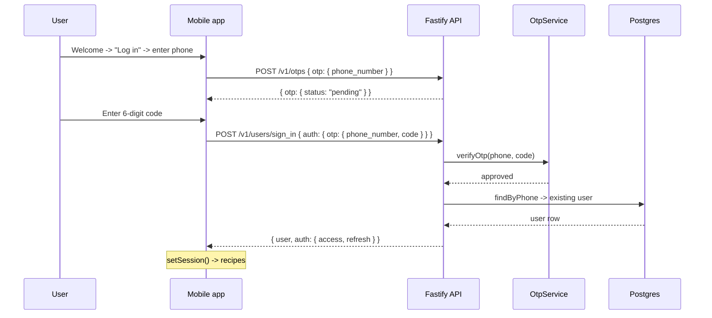
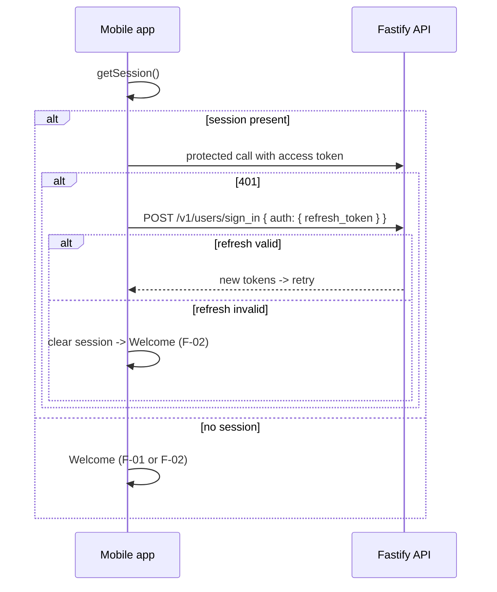
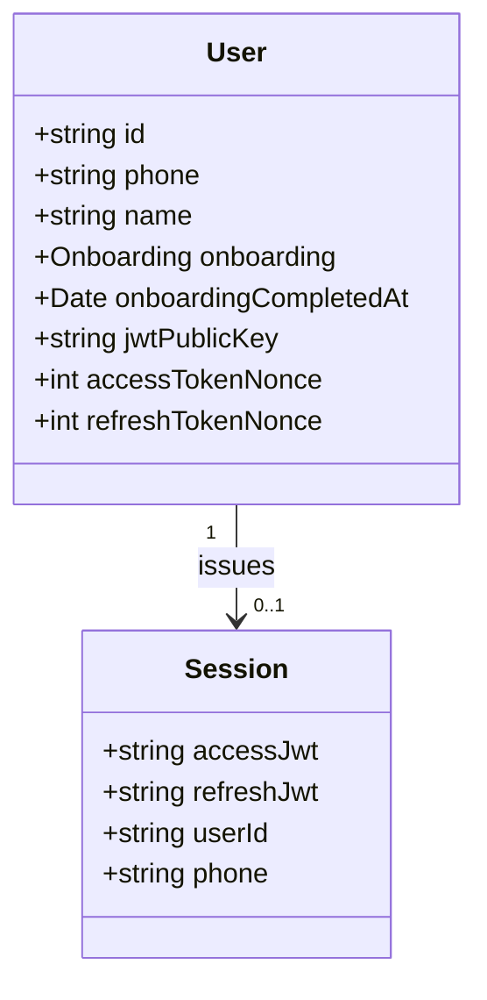
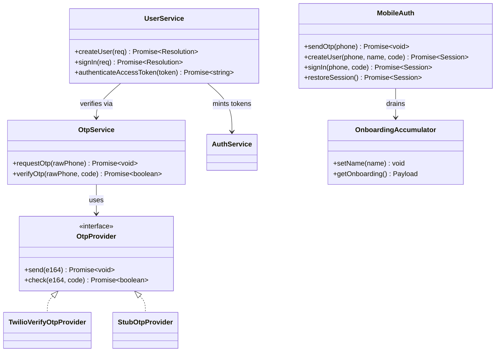
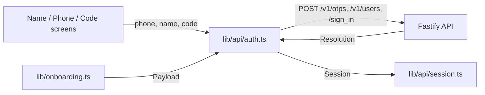

# Overview

Harvest signs the user in with a real phone number verified over SMS, gathered as the last step of
onboarding, and uses that verified phone to create the account. This replaces the random
`+1555555xxxx` phone the mobile client posts today. The same OTP mechanism also signs a returning
user back in on a new device or after logout.

**Cleanup already shipped the entire server-side OTP stack** (`POST /v1/otps`, `/v1/otps/verify`,
`/v1/users`, `/v1/users/sign_in`; Twilio Verify provider + an offline stub). Two gaps remain, and
both are this task:

1. **The server does not yet enforce verification.** `POST /v1/users` trusts the client's phone and
   creates an account without a code. Per founder decision #4, account creation must require a
   verified code — Phone Auth owns creation.
2. **The mobile client has no phone-auth UI.** It posts a random phone and never calls the OTP
   endpoints. This task adds the name, phone-entry, and code-entry screens and the sign-in flow.

This task also owns the new `users.name` column and the name-entry screen (founder decisions #4, #6).

## Scope this task owns

- Server: fold OTP verification into account creation (`POST /v1/users` requires + checks a code).
- Server: add the `users.name` column (migration 0009) and persist it at signup.
- Mobile: name-entry, phone-entry, and code-entry onboarding screens (signup, the last step).
- Mobile: returning-user sign-in from the Welcome screen (reuses the same phone/code screens).
- Mobile: rewrite `lib/api/auth.ts` — remove the random phone and the auto-provision fallback.
- A live Twilio smoke path the agent can run end-to-end (reads the code via the Twilio API), plus
  the exact Twilio console steps the founder must do (see **Founder action needed**).

## Out of scope (consumed or owned elsewhere)

- **Profile** consumes `users.name`; it owns logout (local session clear → Welcome) and delete-data.
- **Instrumentation** consumes the signup moment for `identify()` + people-properties.
- Rate-limiting / abuse controls beyond what Twilio Verify enforces (noted as a risk, not built).

---

# Use Cases

- **F-01 — Sign up (new user).** At the end of onboarding the user enters their name, then their
  phone, receives an SMS code, enters it, and lands in the app with an account carrying their name +
  onboarding answers.
- **F-02 — Sign in (returning user).** From Welcome → "Log in", the user enters their phone, receives
  a code, enters it, and lands in the app on their existing account.
- **F-03 — Restore session on cold start.** A returning user with a stored refresh token resumes
  without re-verifying; an expired/revoked token routes them to F-02.
- **O-01 — Send code.** `POST /v1/otps` → Twilio Verify (or stub) sends an SMS.
- **O-02 — Verify + create.** `POST /v1/users` verifies the code once, then provisions or resolves.
- **O-03 — Verify + resolve.** `POST /v1/users/sign_in` (OTP) verifies once, then resolves.

---

# Use Case Implementations

## Sign up — Implements F-01

```mermaid
sequenceDiagram
    participant U as User
    participant App as Mobile app
    participant API as Fastify API
    participant Otp as OtpService
    participant TV as Twilio Verify
    participant DB as Postgres

    rect rgb(240, 248, 255)
    note over U,App: Name + phone (last onboarding step)
    U->>App: Enter name
    note over App: onboarding.setName(name)
    U->>App: Enter phone (E.164, +1 default)
    App->>API: POST /v1/otps { otp: { phone_number } }
    API->>Otp: requestOtp(phone)
    Otp->>TV: verifications.create(to, sms)
    TV-->>Otp: pending
    API-->>App: { otp: { status: "pending" } }
    end

    rect rgb(255, 248, 240)
    note over U,DB: Code entry — the single verify + create call
    U->>App: Enter 6-digit code
    App->>API: POST /v1/users { user: { phone_number, name, onboarding, code } }
    API->>Otp: verifyOtp(phone, code)
    Otp->>TV: verificationChecks.create(to, code)
    TV-->>Otp: approved
    note over API: code wrong -> 400 INVALID_OTP, no user created
    API->>DB: findByPhone -> none -> insert(user, name, onboarding, keypair)
    DB-->>API: user row
    API-->>App: { user, auth: { access, refresh } }
    note over App: setSession(); resetOnboarding()
    App->>U: Loader (setting-up) -> recipes
    end
```

## Sign in — Implements F-02



## Restore session — Implements F-03



Note the extension that differs from today: on a failed refresh the client **routes to Welcome**, it
does **not** auto-provision a new random account (that path is deleted — see Decisions).

---

# Entities



`name` is the only new attribute. Everything else exists post-Cleanup. `Session` is the mobile-side
persisted token bundle (`lib/api/session.ts`), unchanged apart from carrying the real phone.

---

# Tables

## users (changed)

Only the added column is listed; see `docs/sprint-cleanup/DESIGN.md` for the full definition.

| Column Name | Type | Constraints | Notes |
|---|---|---|---|
| name | text | nullable | The user's display name, collected at signup. |

`name` is nullable so the migration is backwards-compatible with existing rows and so a returning
user provisioned through an edge path (see Q-02) is still a valid row. The mobile signup flow always
supplies it.

No new tables, enums, or indices. Migration **0009** (main is at 0008) adds this one column.

---

# Modules



The **server change is one method**: `UserService.createUser` gains a `code` and verifies it (via the
`OtpService` it already holds) before provisioning. `signIn` already verifies. `OtpService`,
`AuthService`, and the providers are untouched.

The **mobile change** rewrites `lib/api/auth.ts` (`MobileAuth` above) and adds `setName` to
`lib/onboarding.ts`.



---

# APIs

## Send code `POST /v1/otps`

Sends an SMS verification code. Public. **Unchanged** — documented for completeness.

### Request
- Body
    - otp: object
        - phone_number: string (any format; server normalizes to E.164)

### Success Response `200`
- Body
    - otp: object
        - status: string (`"pending"`)

### Invalid Phone Response `400`
- Body — error: `{ code: "INVALID_PHONE", message: string }` (message names `phone_number`)

### Provider Failure Response `502`
- Body — error: `{ code: "OTP_REQUEST_FAILED", message: string }`

## Create user `POST /v1/users` (changed)

Verifies the code, then creates or resolves the user and returns a session. Public. **Change:** now
requires `code` and verifies it before provisioning (server-enforced verification).

### Request
- Body
    - user: object
        - phone_number: string
        - code: string  ← **new, required**
        - name: string  ← **new, required**
        - onboarding: object (optional; the typed enum payload)

### Success Response `200`
- Body
    - user: object — { id: string, phone: string }
    - auth: object — { access_token: { jwt, expires_at }, refresh_token: { jwt, expires_at } }

### Invalid Code Response `400`
- Body — error: `{ code: "INVALID_OTP", message: string }` (no user is created)

### Invalid Phone Response `400`
- Body — error: `{ code: "INVALID_PHONE", message: string }`

## Sign in `POST /v1/users/sign_in`

Exchanges an OTP **or** a refresh token for a session. Public. **Unchanged** (the OTP path already
verifies server-side). Exactly one of `otp` / `refresh_token`.

### Request
- Body — auth: object with either
    - otp: { phone_number: string, code: string }, or
    - refresh_token: string

### Success Response `200` — same session body as create.
### Invalid Code Response `400` — error `INVALID_OTP`.
### Invalid Refresh Response `401` — error `REFRESH_INVALID`.

> `POST /v1/otps/verify` (standalone check) stays in the API for tests but is **not** on the mobile
> happy path: Twilio Verify consumes the code on the first approved check, so the client must verify
> exactly once — at create / sign_in, not before. See Decisions.

---

# Mobile screens & flows

Three new onboarding screens, all under `app/(onboarding)/`, all built to the design system: canvas
`bg-cream` via `<Backdrop>`, input rows/tiles `bg-card` (never `bg-white`), Lora wordmark / Karla
body, and motion from `lib/motion.ts` (slide via the existing stack `animation`, honor Reduce Motion,
opens slower than closes). They reuse the existing `OnboardingScreen` chrome + `Button` primitive.

**Placement.** Today `age.tsx` (progress 0.78) → `setting-up.tsx` (loader that provisions). The new
order is:

`age → name → phone → verify-code → setting-up (loader only) → recipes`

- **`name.tsx`** — "What should we call you?" single text input. On Continue: `onboarding.setName(name)`
  → `phone`. Progress ~0.82.
- **`phone.tsx`** — phone input, `+1` prefilled and shown, with a country-code picker (US default;
  minimal set). On Continue: `auth.sendOtp(phone)` → `verify-code`. Progress ~0.88.
- **`verify-code.tsx`** — 6-digit code input; auto-submits on the 6th digit; a resend control with a
  ~30s cooldown timer. On submit: `auth.createUser(phone, name, code)`. Success → `setting-up`.
  `INVALID_OTP` → inline error, clear the field, allow retry. Progress ~0.94.
- **`setting-up.tsx`** — **loses its provisioning role**; the account already exists. It becomes the
  decorative loader it appears to be, then routes to `/(app)/recipes`.

**Sign-in reuses the same two screens.** Welcome's existing "Log in" affordance currently jumps
straight into the app; it now routes into `phone` → `verify-code` in a **sign-in mode** (a route
param). In sign-in mode the code screen calls `auth.signIn(phone, code)` (→ `/v1/users/sign_in`)
instead of `createUser`, and there is no name step. One set of components, two entry points.

**`lib/api/auth.ts` rewrite:**
- Delete `generatePhone()` and the random-phone `provisionUser()`.
- `sendOtp(phone)` → `POST /v1/otps`.
- `createUser(phone, name, code)` → `POST /v1/users` with `{ user: { phone_number, name, code,
  onboarding } }`; on success `setSession()` + `resetOnboarding()`.
- `signIn(phone, code)` → `POST /v1/users/sign_in`; on success `setSession()`.
- `restoreSession()` returns the stored session or `null` — it **no longer auto-provisions**.
- `lib/api/client.ts`: on a failed refresh, **clear the session and surface a re-auth signal**
  (route to Welcome) instead of `provisionUser()`.

---

# Cross-task interfaces

| Interface | Direction | Contract |
|---|---|---|
| `users.name` column | **own** → Profile, Instrumentation | Nullable `text`; populated at signup. Profile reads it for display; Instrumentation sends it as a people-property. |
| Signup completion (session persisted) | **own** → Instrumentation | After `createUser`/`signIn` persist the `Session` (`userId`, `phone`), Instrumentation calls `identify(userId)` and sets people-props. Seam: the stored `Session` + the resolved user; no extra API. |
| Sign-in entry point | **own** → Profile | Profile's logout clears the session → Welcome; Welcome's "Log in" (this task) is how the user returns. |
| `restoreSession()` contract change | **own** → whole app | Returns `null` instead of provisioning. Callers (`app/_layout.tsx`, `lib/api/client.ts`) must route to Welcome on `null`/failed refresh. |

No inbound consumption from other Wave-2 tasks. `GET /v1/recipes` and the grocery catalog are
unrelated to this task.

---

# Testing

All automated tests run **offline** against `StubOtpProvider` (fixed code `123456`), per
`server/CLAUDE.md` (tests never hit the network). The stub is selected automatically whenever the
`TWILIO_*` env vars are unset — which is every test and every local/sim run.

## Test Coverage

| Use Case | Type | Unit | Integration | E2E |
|---|---|---|---|---|
| F-01 Sign up | Flow | | x | x (sim, stub) |
| F-02 Sign in | Flow | | x | x (sim, stub) |
| F-03 Restore session | Flow | x | x | |
| O-02 Verify + create | Op | x | x | |
| O-03 Verify + resolve | Op | | x | |

## Unit Tests
- `UserService.createUser`: good code → provisions with `name` + onboarding; bad code → throws
  `InvalidOtpError`, **no insert** (assert repo not called). Mock `OtpService` + repo; `AuthService`
  stays real (cheap, deterministic key gen is already covered).
- Mobile `auth.ts`: `createUser`/`signIn` post the right shapes and persist the session; a `400`
  surfaces as a typed error the code screen can render. Mock `fetch`.

## Integration Tests
Extend `server/tests/integration/phone-auth.test.ts` (real DB, `app.inject`, StubOtpProvider):
- create with `123456` → 200, user row has `name` + onboarding enums + `onboarding_completed_at`.
- create with `000000` → 400 `INVALID_OTP`, **users table still empty**.
- create then sign_in-by-OTP for the same phone → resolves the same user id (`isNew` false).
- sign_in refresh-token round-trip still works.

## End-to-End (sim, offline)
The Expo app on the booted simulator runs against the local server with no Twilio env → the stub
accepts `123456`, so **the full signup and sign-in flows are testable on the sim without a human and
without Twilio**. This is the primary agent-facing e2e.

## Live Twilio smoke (opt-in, gated on env — the "real number" requirement)
One script (not part of the offline suite; skipped unless `TWILIO_*` + `TWILIO_TEST_NUMBER` are set):
send an OTP to the provisioned Twilio number, then **read the delivered code via the Twilio Messages
API** (`client.messages.list({ to: TWILIO_TEST_NUMBER })`, regex the 6 digits), then drive
create/sign_in. This proves a real SMS round-trip once; it is not in CI. See **Founder action
needed** and Risks R-02.

## Test Infrastructure
No new harness — `StubOtpProvider` and the existing integration setup cover everything. Only the live
smoke script is new, and it is deliberately outside the offline suite.

---

# Deployment

## Migrations

| Order | Type | Description | Backwards-Compatible |
|---|---|---|---|
| 1 | schema | `0009` — add nullable `users.name` (text) | yes |

`name` is nullable, so old code runs against the new schema and the migration can deploy before the
code. **Migration number collision is expected** across the parallel Wave-2 branches; the coordinator
reconciles order at integration (this migration only adds one column to `users`, so it is trivially
re-orderable).

## Deploy Sequence
Migration first (backwards-compatible), then server, then the mobile build. The server change is
also backwards-compatible in one direction only: **once the server requires `code` on
`POST /v1/users`, the old mobile build (which sends a random phone and no code) can no longer create
accounts.** That old build is pre-release, so this is acceptable; noted so no one is surprised.

## Rollback Plan
Revert the server + mobile commits. The `users.name` column can stay (nullable, unused by old code) —
no data migration to unwind. If it must go, a follow-up drop-column migration; no backfill exists to
lose.

---

# Monitoring

Client-side analytics are **Instrumentation's** task, not this one; this section lists only what this
feature would want, for their taxonomy.

## Metrics (via Instrumentation's Mixpanel taxonomy)
| Name | Type | Use Case | Description |
|---|---|---|---|
| Onboarding Step Completed (name/phone/code) | counter | F-01 | Drop-off through the auth steps. |
| Sign In (Button Tapped → outcome) | counter | F-02 | Returning-user sign-in volume + failures. |

Server-side, OTP send/verify failures surface as normal API error responses (`OTP_REQUEST_FAILED`,
`INVALID_OTP`) in existing request logs; no new server metric is justified for v1.

## Alerts / Dashboards / Logging
None new for v1. A spike in `OTP_REQUEST_FAILED` would indicate a Twilio outage or misconfig; worth a
dashboard panel later, but not built this wave.

---

# Founder action needed (Twilio)

The server code is ready; live SMS needs a Twilio account. Exact steps:

1. **Create / log into Twilio** and note the **Account SID** and **Auth Token** (Console home).
2. **Create a Verify Service** (Verify → Services → Create). Note its **Service SID**
   (`VAxxxx…`). Default settings; SMS channel enabled.
3. **Buy one SMS-capable phone number** to act as the **agent test number** — the destination the
   live-smoke script sends to and reads the code from. It must support **inbound** SMS so the Messages
   API can read the delivered code.
4. **Set env vars** (server): `TWILIO_ACCOUNT_SID`, `TWILIO_AUTH_TOKEN`, `TWILIO_VERIFY_SERVICE_SID`,
   and (for the live smoke only) `TWILIO_TEST_NUMBER` = the number from step 3, in E.164.
5. **US A2P 10DLC caveat:** sending app-to-person SMS to US numbers requires 10DLC registration,
   which can take days–weeks; unregistered traffic may be filtered. To avoid blocking the wave, either
   use a **toll-free** number (lighter verification) or accept that live SMS is a later one-time smoke —
   **all automated testing uses the offline stub and needs none of this.**

Once these are set the app auto-selects the Twilio provider (`selectOtpProvider()`); unset, it stays
on the stub.

---

# Decisions

## Fold verification into account creation rather than trust a prior client-side verify

**Framework:** Direct criterion — the security invariant "an unverified phone must not create an
account," combined with a hard Twilio constraint.

**Choice:** `POST /v1/users` takes the `code` and verifies it **once**, immediately before
provisioning. Twilio Verify consumes a code on the first `approved` check, so a client that called
`/v1/otps/verify` first and then `/v1/users` would fail the second check. Verifying exactly once, at
the create call, is both the secure design (server enforces it) and the only one compatible with
Verify's single-use semantics.

### Alternatives Considered
- **Keep `/v1/otps/verify` then `/v1/users` (two calls):** breaks on Verify's single-use code, and
  leaves creation trusting the client. Rejected.
- **Route creation through `sign_in`-by-OTP:** that path already verifies, but carries no
  `name`/onboarding and returns a bare user; extending it duplicates create. Rejected — `createUser`
  is already the one place onboarding is persisted, so the gate belongs there.

## Delete the auto-provision fallback

**Framework:** Direct criterion — correctness. You cannot create an account without a verified phone,
so "provision a random user on cold start / failed refresh" is no longer possible. `restoreSession()`
returns `null` and the app routes to Welcome. Alternative (keep a random fallback) contradicts the
whole feature. Rejected.

## Twilio Verify as the provider

**Framework:** Direct criterion — least code. It is already implemented, tested, and abstracted behind
`OtpProvider` with an offline stub. No alternative provider clears the bar of "already built and
tested here." Documentation: https://www.twilio.com/docs/verify/api

---

# Open Questions

| ID | Question | Status | Resolution |
|---|---|---|---|
| Q-01 | Country-code scope for the phone screen — US-only (+1) vs a full international picker? | open | Recommend: US default (+1 prefilled) with a small country picker; `normalizeE164` requires full E.164 regardless. |
| Q-02 | Should `sign_in`-by-OTP for a phone with **no** account error ("no account — sign up") or keep today's provision-on-first (creates a nameless user)? | open | Recommend: keep provision-on-first for now (server behavior unchanged; low-risk edge), revisit if it produces nameless rows in practice. |
| Q-03 | Does the founder want the live Twilio smoke wired as a runnable script this wave, or is the offline stub sufficient for sign-off with Twilio deferred? | open | Recommend: build the script but keep it opt-in/gated; sign-off rides on the offline sim e2e. |

---

# Appendix A — Changelog

| Date | Author | Change |
|---|---|---|
| 2026-08-07 | Phone Auth Feature Lead | Initial draft (DESIGN gate). |
