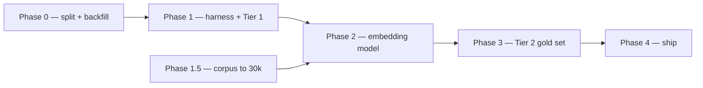

# Recommender Rebuild — Roadmap

*The sequencing plan for replacing the recommender core with the embedding model. It coordinates three docs: the [course/form split spec](../specs/split-course-facet/spec.md) (a blocker), the [eval harness proposal](../proposals/recommender-eval-harness.md) (how we measure), and the [embedding model proposal](../proposals/embedding-recipe-similarity.md) (the model under test). Terminology lives in the [evaluation glossary](./recommender-eval-glossary.md).*

**Dependency spine:** the facet split unblocks Tier 1 → coverage backfill makes it rich → the harness + Tier 1 give a daily loop → the embedding model is built against that loop → Tier 2 anchors trust → ship. Corpus sourcing runs alongside and gates the embedding build.

## Phase 0 — Foundations (unblocks everything)

1. **Ship the course/form split** — add the `course` facet, reduce `dish_type` to forms, migrate existing rows, simplify `course.ts`.
2. **Audit and backfill coverage** — measure `cuisine` / `dish_type` coverage, then re-run the categorizer over the gaps (post-split, so it writes clean facets).

→ *Exit:* `course` and `dish_type` are clean and orthogonal; coverage of both is measured and maximized.

## Phase 1 — Harness + Tier 1 (the daily loop)

3. **Build the harness** — the `rank(recipeId)` interface, today's IDF similarity wrapped behind it, and the random + popularity baselines.
4. **Build Tier 1** — generate triplets from cuisine + dish form; add the triplet-accuracy scorer, the rare-ingredient probe, and the known-answer probes.

→ *Exit (harness self-test):* `random < popularity < IDF` holds — the metric is trustworthy, and the 30-second loop is live.

## Phase 1.5 — Corpus sourcing (founder-gated; blocks Phase 2)

The embedding model needs co-occurrence density: PMI estimates only converge to the true distribution with enough well-spread data, and the rare tail converges slowest. Three steps, human in the loop:

5. **Measure** — the per-ingredient / per-pair distribution; report the gap to the density rule (the ~200th-most-common ingredient still appears in 30+ recipes).
6. **Source to ~30k** — founder-directed, from vetted sources; coverage across cuisines beats raw count.
7. **QA together** — before new recipes enter the corpus, jointly confirm the spread, that ingredients parse, and that facets categorize.

→ *Exit:* the density rule holds on a quality-checked corpus, with explicit sign-off.

## Phase 2 — The model under test

8. **Build the embedding model** (PMI → SVD → SIF pooling) behind the same interface, and iterate it against Tier 1 daily.

→ *Exit:* embeddings beat IDF on Tier 1 and the rare-ingredient probe drops well below IDF's.

## Phase 3 — Tier 2 (the trust anchor)

9. **Mine** the max-disagreement IDF-vs-embedding pairs and **LLM-draft** each label.
10. **Build the review portal;** a human corrects the drafts into the checked-in gold set.
11. **Score and validate** — Precision@10 / nDCG@10 on the gold set, then the Tier 1↔Tier 2 Spearman check.

→ *Exit:* high ρ — Tier 1 is a validated daily proxy (or the proxy is fixed before we lean on it).

## Phase 4 — Ship

12. With embeddings winning on both tiers and the regression probe fixed, **swap the recommender core.** Leave the Tier 3 behavioral slot for post-launch.

## Who does what

The split, harness, Tier 1, embedding code, Tier 2 tooling, and portal are mine to build. **Corpus sourcing and quality sign-off (Phase 1.5) are founder-gated** — sourcing direction and the QA pass are yours. Phase 1.5 is the long pole, so it starts alongside Phase 0/1; nothing in 0/1 waits on it.
