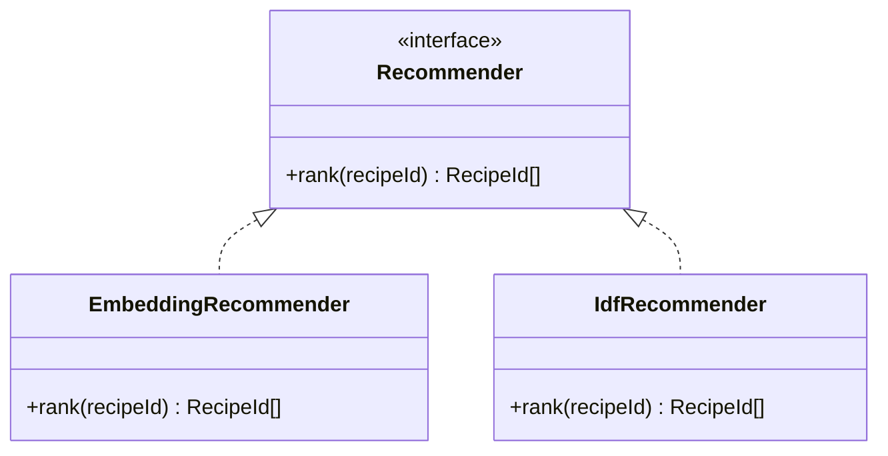

**Proposal in one line:** represent recipes by ingredient vectors learned from *co-occurrence* — which ingredients keep company — instead of weighting ingredients by how rare they are.

## Motivation

**Situation.** We recommend recipes by ingredient similarity. Today's engine builds a bag-of-ingredients vector per recipe and weights each ingredient by IDF (rarer counts for more).

**Complication.** IDF overweights rare ingredients, so the engine surfaces strange recipes — one obscure ingredient drags an otherwise-unrelated dish to the top. Five variants all failed the same way: a midpoint weighting that rewards mid-frequency ingredients, a hand-built semantic matrix for near-synonyms, SIF over the frequency space, SVD over the IDF matrix, and expert flavor-base models.

**Why they all failed — one root cause.** Four of the five bet that an ingredient's importance is some function of its corpus frequency. It is not. Saffron is rare and defining; xanthan gum is rare and irrelevant; salt is everywhere and sometimes the whole point. Every variant tuned `f(frequency)` while the answer isn't a function of frequency at all. IDF, midpoint, SIF-on-frequency, and SVD-on-IDF are all information-retrieval tools, and they inherit the same broken assumption. That branch is exhausted.

**Question.** How do we represent recipes so that similarity matches how people actually group dishes?

**Answer.** Measure an ingredient by the company it keeps, not its rarity. A dish is defined by which ingredients appear *together*, and that co-occurrence structure — which IDF discards by treating every ingredient as an independent axis — is the signal. Learn a vector per ingredient from co-occurrence, pool those into a recipe vector, and recommend by nearest neighbor.

## Design

### Pipeline


### 1. Ingredient embeddings via PMI + SVD

Build an ingredient-by-ingredient matrix whose cell `(a, b)` is the **positive pointwise mutual information** of the pair:

```
PMI(a, b) = log( P(a, b) / (P(a) * P(b)) )
```

PMI measures how much more two ingredients co-occur than chance would predict. It divides out each ingredient's marginal frequency, so ubiquitous ingredients (salt) stop faking associations and genuine pairings (saffron–rice) survive. This is the exact quantity IDF cannot see: IDF reads only the marginal `P(a)`; PMI reads the joint.

Factor the matrix with SVD and keep ~100 dimensions. The compression is the point: it forces near-synonyms that share contexts (parsley, cilantro) onto nearly the same vector, which dissolves the near-synonym problem the hand-built matrix tried to solve — for free.

We choose PMI + SVD over neural word2vec deliberately: skip-gram provably factors the same PMI matrix (Levy & Goldberg, 2014), so the result is equivalent, but PMI + SVD is deterministic, a few lines of numpy, needs no training loop or GPU, and is more stable on a small corpus. See [Decisions](#decisions).

### 2. Recipe vectors via SIF pooling

A recipe is a set of ingredients, so pool its ingredient vectors into one recipe vector. Use SIF, not a plain average: a plain average lets salt, water, and oil blur every recipe toward the same mush. SIF (a) weights each ingredient by `a / (a + freq)` so distinctive ingredients steer the vector, and (b) subtracts the top principal component shared across all recipe vectors — the "this is food" background — leaving what makes each recipe different, which is what we compare on.

### 3. Metadata as pseudo-tokens

We hold three signals beyond ingredients: cuisine, meal course, and flavor base. Fold cuisine and base into the *same* machinery by appending them as pseudo-tokens to each recipe before building the matrix:

```
[coconut milk, fish sauce, lemongrass, chili, CUISINE:thai, BASE:curry_paste]
```

The tag then co-occurs with its ingredients, earns its own vector, and pulls same-cuisine recipes together — so two Thai curries sharing few exact ingredients still land near each other. No new model. A tunable knob: repeating a tag (or up-weighting it in pooling) increases how strongly cuisine dominates over raw ingredients.

**Course is a filter, not a feature.** We do not want "similar taste" to cross a dessert and a main. Course constrains retrieval (return nearest neighbors, then keep the same meal role) rather than entering the vector, where it would only muddy the taste signal.

### Data requirements

Quality depends on how often each ingredient and pair is *observed*, not on raw recipe count. A ~10-ingredient recipe yields ~45 pairs; the matrix has a few tens of thousands of possible pairs.

| Recipes | Verdict |
|---|---|
| ~1k | Too sparse — noise |
| ~5–10k | Floor: common core works, rare ingredients noisy |
| ~30–50k | Comfortable |
| 100k+ | Diminishing returns at this vocabulary size |

Two levers matter more than raw count:

- **Prune the vocabulary.** Drop any ingredient in fewer than ~20–30 recipes. It cannot earn a stable vector, and it is exactly the noisy rare-ingredient tail that caused the original strange recommendations. Pruning is not cleanup here — it is the root-cause cure. The ~420 raw ingredients likely reduce to ~250 clean ones.
- **Coverage beats total.** 50k all-Italian recipes will not embed Thai ingredients. Each ingredient and tag must be hit enough times, spread across the space.

The number to measure before building: the per-ingredient recipe-count distribution. If the 200th-most-common ingredient still appears in 30+ recipes, the corpus is large enough.

**This is a gate on the build, not an assumption — a Phase 2 prerequisite with a human in the loop.** Today's corpus is already >10k (past the floor), with a clear path to ~30k. Three steps:

1. **Measure** — run the per-ingredient / per-pair distribution above and report the gap to the density rule.
2. **Source** to ~30k — founder-directed, from vetted recipe sources (not just whatever scrapes easiest).
3. **QA together** — before new recipes enter the corpus, jointly confirm coverage is spread across cuisines (not 30k all-Italian — *coverage beats count*), ingredients parse, and facets categorize.

The build starts only once the density rule holds on a quality-checked corpus — sign-off is explicit, not implied.

### Modules



Both the new model and the existing IDF engine implement one interface — `rank(recipeId) -> RecipeId[]` — so the [eval harness](recommender-eval-harness) scores them through a single pipe and swaps them without touching callers.

### Testing

Correctness here is *quality*, measured offline, so the test strategy is the separate [evaluation-harness proposal](recommender-eval-harness) rather than unit assertions. One in-repo unit check does belong with this model: a known-answer probe asserting that a query recipe returns same-cuisine, same-course neighbors and never an absurd one (carbonara must not surface a smoothie).

## Drawbacks

- **Rare ingredients still get noisy vectors** (few contexts to learn from). Milder than IDF's blow-up and it degrades gracefully instead of dominating, but pruning, not the model, is what contains it.
- **Small corpus risk.** Below the ~5–10k floor, embeddings are unreliable; we must confirm corpus size before committing.
- **Unprovable without the harness.** Embeddings will almost certainly beat IDF by eye, but "by eye" is how the last five models were judged. This proposal is only safe to ship alongside the eval harness.

## Alternatives

Covered under [Decisions](#decisions): neural word2vec, staying on IDF, and the hand-built semantic matrix.

## Decisions

### Use PMI + SVD, not neural word2vec

**Framework:** direct criterion — equivalent result, lower cost.

Skip-gram implicitly factors the PMI matrix, so both routes reach nearly the same embeddings. PMI + SVD is deterministic, dependency-light, needs no training loop or GPU, and is more stable at our corpus size. Word2vec wins only with a massive corpus and a reason to prefer the iterative form; we have neither.

**Alternatives considered**

- **Neural word2vec:** same output, more moving parts, noisier on small data.
- **Stay on IDF:** the status quo; fails at the root cause above.
- **Hand-built near-synonym matrix:** manual, unscalable; the SVD compression produces it for free.

### Documentation

- Levy & Goldberg, "Neural Word Embedding as Implicit Matrix Factorization" (2014).

## Unresolved questions

| ID | Question | Status | Resolution |
|---|---|---|---|
| Q-01 | How many recipes are in the seed corpus today, and what is the per-ingredient count distribution? | open | |
| Q-02 | Prune threshold — 20 or 30 recipes? Decide from the Q-01 histogram. | open | |
| Q-03 | SVD dimension — 50 vs 100 vs 150? Tune against the harness. | open | |
| Q-04 | Pseudo-token weight for cuisine/base relative to ingredients? Tune against the harness. | open | |
