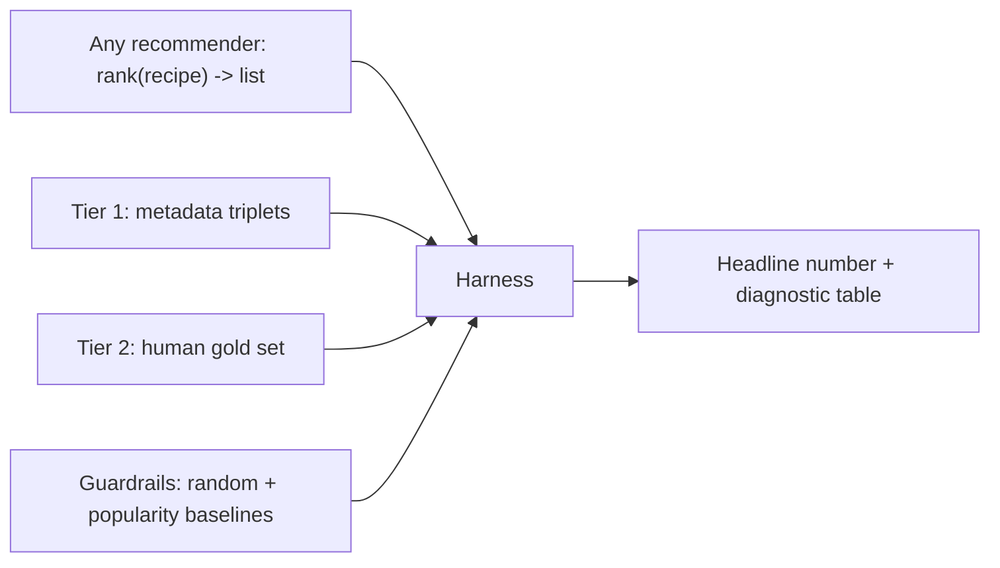

**Proposal in one line:** build one offline harness that turns "which recommender is better?" from an eyeball judgment into a single number, in under 30 seconds, before we have any users.

## Motivation

**Situation.** We are about to replace the recommender's core with the [embedding model](embedding-recipe-similarity).

**Complication.** We cannot tell whether a new model is better. We have no user interaction data (pre-launch) and no labeled similarity judgments. Every model so far — IDF and five variants — was judged by eye, which is why we spent months unable to say which was best.

**Question.** How do we measure recommender quality fast and reliably, before launch and before any behavioral signal exists?

**Answer.** Build a model-agnostic offline harness. Any recommender plugs into one interface; the harness scores it against three tiers of judgment — free metadata weak-labels for the fast daily loop, a small human gold set for truth, behavioral data later — guarded against self-deception by baselines, proxy-to-gold correlation, and known-answer probes, and returns one headline number in under 30 seconds.

## Design

### Architecture

A recommender is a function: `rank(recipeId) -> RecipeId[]`. The IDF engine and the embedding model both implement it, so the harness scores them through one pipe. Build one pipe, not two.

### Three tiers of judgment

**Tier 1 — metadata weak-labels (free, instant, the daily driver).** Cuisine, course, and base are free labels. Turn them into triplets: an anchor, a positive (shares cuisine + course + base), a negative (shares none). Metric: **triplet accuracy** — how often the model ranks the positive closer than the negative. One number, millions of triplets for free, runs in seconds.

The caveat that governs its use: optimizing Tier 1 alone just teaches a model to recover cuisine labels we already have. Same-cuisine is not always "similar," and cross-cuisine can be (two coconut curries). Tier 1 is necessary, not sufficient — superb at catching gross failure (the IDF rare-ingredient weirdness scores terribly), useless as the final word.

**Tier 2 — a small human gold set (~200–300 judgments, the source of truth).** Ask pairwise questions ("is A more similar to B or C?") — humans are far more consistent at relative than absolute calls. The trick that makes 300 labels go far: **label the disagreements.** Run both recommenders, find the pairs where they most disagree, and label only those. Agreement cases teach nothing; the disagreements carry all the signal.

**Tier 3 — behavioral (later, the real truth).** Swipe-accept, save rate, A/B — unavailable pre-launch. Leave the slot. When it arrives, the one question that matters is whether Tier 1/2 predicts Tier 3; an offline metric that doesn't is decoration.

### Reliability guardrails

A fast metric that lies is worse than none. Four cheap checks:

1. **Baselines in the harness.** Always score a *random* and a *popularity* recommender alongside the real ones. A trustworthy metric must show `random < popularity < IDF < embeddings`. If the real model barely beats random, the metric or the model is broken — and we learn it immediately.
2. **Correlate Tier 1 against Tier 2.** Before trusting triplet accuracy for daily iteration, confirm models that win on metadata also win on the human gold set. If they diverge, the proxy is lying; stop trusting it.
3. **Known-answer probes (the unit test).** ~20 hand-picked cases asserted in the repo: "carbonara → pasta/Italian, never a smoothie." The smallest thing that fails loudly on a regression.
4. **A regression probe for the original symptom.** The reason this work exists: IDF recommends weird dishes off one rare ingredient. For queries containing a rare ingredient, measure whether the top-k is dominated by it. Track it as its own number so we can *prove* embeddings fixed it, not merely assert it.

### Metrics

- **Triplet accuracy** — Tier 1 and Tier 2 headline. Interpretable, single scalar, drives daily iteration.
- **Precision@k / nDCG@k** — on the Tier 2 query set, for graded final judgment.

### The build

- **Recommender interface.** One method, `rank(recipeId) -> RecipeId[]`. Each model implements it; the harness imports both and loops the test set.
- **Precompute once per model.** Embed all recipes, hold vectors in memory. Nearest-neighbor is **brute-force cosine** — at a few thousand to 50k recipes, one matrix multiply, a few seconds. Skip FAISS/ANN until the corpus is genuinely large.
- **Checked-in, versioned test set.** Gold triplets and the query set live in a repo file, not regenerated per run. Same input every run = comparable numbers over time. A random test set each run is useless.
- **Output.** One headline scalar plus a small diagnostic table (per-cuisine breakdown, the rare-ingredient probe, the baselines). One script, under 30 seconds end to end.

That 30-second loop — change model, run, read number — is the deliverable. The models are easy to swap; the missing piece has always been the number.

### Testing

The harness is itself test infrastructure, so its own correctness rests on the baselines: if `random` ever scores near a real model, or the ordering `random < popularity < IDF` breaks, the harness is wrong. That ordering assertion is the harness's own unit test.

## Drawbacks

- **Tier 1 can mislead if trusted blindly** — mitigated only by the Tier 1↔Tier 2 correlation check. Without Tier 2, we are optimizing a proxy.
- **Tier 2 costs human hours** — ~200–300 labels. The disagreement-sampling trick minimizes it, but it is not free.
- **Offline ≠ online.** Until Tier 3 exists, we are betting offline quality predicts real behavior. The harness makes the bet measurable, not certain.

## Alternatives

- **Ship the embedding model without a harness** — how the last five models were judged, and why we cannot rank them. Rejected: it repeats the exact failure.
- **Wait for user data, then use behavioral metrics only** — blocks all pre-launch model work behind launch. Rejected: metadata gives a usable signal now.
- **One human-labeled set, no metadata tier** — reliable but too slow for a tight iteration loop. Rejected: the daily loop needs a free, instant metric.

## Decisions

### Lead with metadata weak-labels, anchor with a small human gold set

**Framework:** direct criterion — maximize iteration speed without losing a reliable ground truth.

Metadata triplets give a free, instant, million-example signal for the daily loop; a small disagreement-sampled human set gives the trustworthy anchor. The correlation check binds them: the cheap metric is valid only while it tracks the expensive one. This is the standard offline-evaluation shape (a large weak signal validated against a small gold set).

## Unresolved questions

| ID | Question | Status | Resolution |
|---|---|---|---|
| Q-01 | Do we have any implicit behavioral signal today (saves, imports) usable as an early Tier 3? | open | |
| Q-02 | Who labels the ~200–300 Tier 2 pairs, and by when? | open | |
| Q-03 | Threshold on the rare-ingredient regression probe that counts as "fixed"? | open | |
| Q-04 | k for Precision@k / nDCG@k — tie to how many recommendations the app surfaces. | open | |
