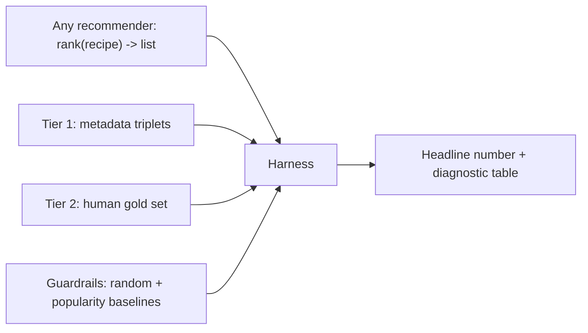
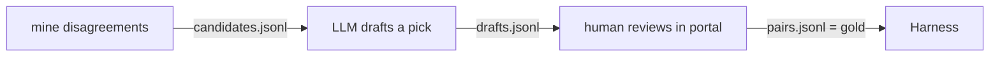

**Proposal in one line:** build one offline harness that turns "which recommender is better?" from an eyeball judgment into a single number, in under 30 seconds, before we have any users.

## Motivation

**Situation.** We are about to replace the recommender's core with the [embedding model](embedding-recipe-similarity).

**Complication.** We cannot tell whether a new model is better. We have no user interaction data (pre-launch) and no labeled similarity judgments. Every model so far — IDF and five variants — was judged by eye, which is why we spent months unable to say which was best.

**Question.** How do we measure recommender quality fast and reliably, before launch and before any behavioral signal exists?

**Answer.** Build a model-agnostic offline harness. Any recommender plugs into one interface; the harness scores it against three tiers of judgment — free metadata weak-labels for the fast daily loop, a small human gold set for truth, behavioral data later — guarded against self-deception by baselines, proxy-to-gold correlation, and known-answer probes, and returns one headline number in under 30 seconds.

## Design

### Architecture

A recommender is a function: `rank(recipeId) -> RecipeId[]`. The IDF engine and the embedding model both implement it, so the harness scores them through one pipe. Build one pipe, not two.

### Three tiers of judgment

**Tier 1 — metadata weak-labels (free, instant, the daily driver).** Cuisine, course, and base are free labels. Turn them into triplets: an anchor, a positive (shares cuisine + dish type), a negative (shares neither — nor even the protein). Metric: **triplet accuracy** — how often the model ranks the positive closer than the negative. One number, millions of triplets for free, runs in seconds.

The caveat that governs its use: optimizing Tier 1 alone just teaches a model to recover cuisine labels we already have. Same-cuisine is not always "similar," and cross-cuisine can be (two coconut curries). Tier 1 is necessary, not sufficient — superb at catching gross failure (the IDF rare-ingredient weirdness scores terribly), useless as the final word.

**Tier 2 — a small human-corrected gold set (~200–300 judgments, the source of truth).** Ask pairwise questions ("is A more similar to B or C?") — humans are far more consistent at relative than absolute calls. The trick that makes 300 labels go far: **label the disagreements.** Run both recommenders, find the pairs where they most disagree, and label only those. Agreement cases teach nothing; the disagreements carry all the signal.

**Labeling is LLM-drafted, human-corrected.** An LLM answers each pairwise question first; humans review and correct its calls through an **admin portal** (a review queue: the anchor + two candidates, the LLM's pick and reason, accept-or-flip). This turns 300 labels from "300 judgments made from scratch" into "300 judgments reviewed," which is faster and keeps a human as the final authority on the gold set. Corrected labels are what gets checked into the versioned test set.

**Tier 3 — behavioral (later, the real truth).** Swipe-accept, save rate, A/B — unavailable pre-launch. Leave the slot. When it arrives, the one question that matters is whether Tier 1/2 predicts Tier 3; an offline metric that doesn't is decoration.

### Reliability guardrails

A fast metric that lies is worse than none. Four cheap checks:

1. **Baselines in the harness.** Always score a *random* and a *popularity* recommender alongside the real ones. A trustworthy metric must show `random < popularity < IDF < embeddings`. If the real model barely beats random, the metric or the model is broken — and we learn it immediately.
2. **Correlate Tier 1 against Tier 2.** Before trusting triplet accuracy for daily iteration, confirm models that win on metadata also win on the human gold set. If they diverge, the proxy is lying; stop trusting it.
3. **Known-answer probes (the unit test).** ~20 hand-picked cases asserted in the repo: "carbonara → pasta/Italian, never a smoothie." The smallest thing that fails loudly on a regression.
4. **A regression probe for the original symptom.** The reason this work exists: IDF recommends weird dishes off one rare ingredient. For queries containing a rare ingredient, measure the fraction of the top-k that shares that rare ingredient. Judge it **relative to IDF, not against an absolute threshold** — IDF and embeddings are scored in the same run, so "fixed" means embeddings' rare-ingredient dominance is far below IDF's (target: less than half). Track it as its own number so we can *prove* embeddings fixed it, not merely assert it.

### Metrics

- **Triplet accuracy** — Tier 1 and Tier 2 headline. Interpretable, single scalar, drives daily iteration.
- **Precision@10 / nDCG@10** — on the Tier 2 query set, for graded final judgment. k = 10, tied to the swipe deck's `DECK_DEFAULT_LIMIT` — the only surface that shows recommendations, so quality is measured over exactly the window a user sees per batch.

### The build

- **Recommender interface.** One method, `rank(recipeId) -> RecipeId[]`. Each model implements it; the harness imports both and loops the test set.
- **Precompute once per model.** Embed all recipes, hold vectors in memory. Nearest-neighbor is **brute-force cosine** — at a few thousand to 50k recipes, one matrix multiply, a few seconds. Skip FAISS/ANN until the corpus is genuinely large.
- **Checked-in, versioned test set.** Gold triplets and the query set live in a repo file, not regenerated per run. Same input every run = comparable numbers over time. A random test set each run is useless.
- **Output.** One headline scalar plus a small diagnostic table (per-cuisine breakdown, the rare-ingredient probe, the baselines). One script, under 30 seconds end to end.

That 30-second loop — change model, run, read number — is the deliverable. The models are easy to swap; the missing piece has always been the number.

### Testing

The harness is itself test infrastructure, so its own correctness rests on the baselines: if `random` ever scores near a real model, or the ordering `random < popularity < IDF` breaks, the harness is wrong. That ordering assertion is the harness's own unit test.

## Implementation detail

Three procedures the design above assumes but does not spell out: how Tier 1 triplets are generated, how the Tier 2 gold set is produced, and how the review portal works. All three write to a **checked-in, versioned `eval/gold/` directory** (JSONL), never regenerated per run — same input every run, comparable numbers over time.

One grounding note on what "recommender" means here. The harness scores a **recipe-to-recipe similarity** function — `rank(recipeId) -> RecipeId[]` — not the personalized swipe ranker. Today that similarity is the sparse IDF taste profile (`recipeTasteProfiles.weights`, a `baseIngredientId -> idfWeight` map) compared by in-memory cosine (`server/src/ranking/taste/taste-profile.ts`, sourced through `TasteSpace` in `taste/index.ts`); the [embedding model](embedding-recipe-similarity) is the replacement. Both implement the same `rank(recipeId)` signature — the single pipe the harness runs. (`RankingEngine.rank(recipes, prefs)` in `server/src/ranking/ranking-engine.ts` is the separate user-preference ranker, out of scope here.)

Metadata comes from the `recipeCategories` join table (`server/src/schema.ts`), one row per `(recipeId, facet, value)`, exposed in the domain model as `RecipeCategories { cuisine[], mealType[], dishType[], primaryIngredient[], foodCategory[] }`. Three facets drive the triplets, in **two roles** — dish identity defines a positive; the protein only hardens a negative:

| Facet | Example values | Role |
|---|---|---|
| `cuisine` | italian, thai, mexican (slugs from the `cuisines` table) | defines the positive |
| `dish_type` | pasta, pizza, soup, salad, curry, dessert, main_course … (25 values) | defines the positive |
| `primary_ingredient` | seafood, poultry, beef, pork, tofu, beans, grain … | hardens the negative |

`dish_type` is the "what kind of dish" label — Pasta, Soup, Pizza, Curry — and with `cuisine` it captures "same kind of dish, same tradition," which is what makes a pair *similar*. `primary_ingredient` is the protein/base; it deliberately does **not** gate the positive (see below).

**Blocker — `dish_type` must be split first.** Today `dish_type` also carries meal-role values (`main_course`, `side_dish`, `appetizer`, `dessert`), which would leak weak positives (two unrelated dishes matching only on `main_course`). The [split-course-facet spec](../specs/split-course-facet/spec.md) lifts those into a separate `course` facet, leaving `dish_type` as pure form. This harness's Tier 1 keys its positive on `cuisine` + `dish_type` (form) and can use `course` as a filter to keep a dessert from pairing with a main — both assume that split has landed.

### 1. Generating the Tier 1 triplet labels

Script `labels:triplets` (`tsx scripts/build-eval-triplets.ts`), run once, output committed to `eval/gold/triplets.jsonl`.

A triplet is `{ anchor, positive, negative }`. Each facet is an array, so "shares" means set intersection:

- **Anchor** — any recipe with `cuisine` and `dish_type` both non-empty.
- **Positive** — shares at least one value on **both `cuisine` and `dish_type`** (both intersections non-empty). "Same kind of dish, same tradition" — e.g. two Italian pastas, regardless of protein.
- **Negative** — shares **nothing** on `cuisine`, `dish_type`, *or* `primary_ingredient` (all three intersections empty). "Unrelated dish."

Why the protein (`primary_ingredient`) doesn't gate the positive: requiring it to match would reject genuinely similar pairs that differ only by protein — a chicken tikka and a lamb tikka share cuisine and `dish_type` and are obviously alike. The dish-identity signal lives in `dish_type` (pasta / pizza / soup / curry), so `cuisine` + `dish_type` defines the positive. The protein earns its keep on the **negative** instead: a beef pasta and a beef stew share a protein and shouldn't be labeled "unrelated," so a hard negative must differ on it too.

The generator (deterministic, with the seed recorded in the file header):

1. Load all recipes + their `RecipeCategories`.
2. Build a simple inverted index of facet value → recipeIds (`cuisine:italian -> […]`, etc.).
3. Positive pool = recipes in the intersection of all three of the anchor's facet buckets; negative pool = recipes absent from all three.
4. Sample up to *K* triplets per anchor (cap ~5) so popular cuisines don't swamp the set; dedup; drop anchors with an empty positive or negative pool.
5. Write `{anchorId, positiveId, negativeId}` rows plus a header (seed, corpus size N, generation date).

The harness scores each model on **triplet accuracy** — the fraction where `cosine(anchor, positive) > cosine(anchor, negative)`. Millions are available for free; the checked-in file freezes a fixed sample so the number is comparable across runs.

**The rare-ingredient probe reuses existing data — no new computation.** "Rare" is already quantified: the `ingredientDistinctiveness` table (`server/src/schema.ts`, built by `scripts/build-taste-space.ts`) holds `documentFrequency` and `idf` per `baseIngredientId`. The probe:

1. Pick anchors whose recipe contains a base ingredient with `documentFrequency` below a threshold (bottom decile, or `df < ~30` — the same noisy tail the [embedding proposal](embedding-recipe-similarity) prunes).
2. Take the model's top-10 and measure the fraction that also contain that rare base ingredient.
3. Report the mean fraction per model. Judged relative to IDF (Q-03): embeddings' number should sit far below IDF's.

### 2. Generating the Tier 2 hand-labeled gold set

Pairwise, disagreement-sampled, LLM-drafted, human-corrected — three stages, three files under `eval/gold/`:

**Stage A — mine the disagreements** (`labels:mine`). Run both recommenders over a sample of anchors. For each anchor, form the question `(anchor, A, B)` from the two candidates the models rank most *oppositely* — one ranks A over B, the other B over A, by the widest margin. These max-disagreement pairs carry the signal; agreement teaches nothing. Take ~300 → `candidates.jsonl`.

**Stage B — LLM drafts each pick** (`labels:draft`). For each `(anchor, A, B)`, prompt the LLM with the three recipes' `title`, `cuisine`, `dishType`, `primaryIngredient`, and top ingredients, and ask the same relative question the human will: *"Is A or B more similar to the anchor?"* Return `{ pick: "A" | "B", reason: <one line> }` → `drafts.jsonl`. Reuse the existing server LLM client (the chef already runs DeepSeek).

**Stage C — human review** produces the gold set (next section) → `pairs.jsonl`: `{ anchorId, aId, bId, pick, source: "human-confirmed" | "human-flipped" }`. This file is the checked-in Tier 2 truth; the harness scores Precision@10 / nDCG@10 and Tier-2 triplet accuracy against it.

Why LLM-draft-then-correct beats labeling cold: 300 pairs reviewed (confirm the obvious in a second, flip the wrong ones) is far faster than 300 judged from scratch, and a human stays the final authority. The LLM is a first-pass labeler, not the source of truth.

### 3. The label-review portal

**Recommendation: a local-first review tool, not a hosted web app.** The product is Expo/React Native — there is no web surface, and no admin auth beyond the server's bearer guard (`server/src/auth-guard.ts`). Standing up a deployed, authenticated portal for a one-off pass of ~300 labels is the over-build. Instead:

A single `tsx scripts/label-portal.ts` that starts a **Hono** server (already a dependency) bound to `localhost`, serving:

- `GET /` — one self-contained HTML page: the next unreviewed pair (anchor card + candidate A / B, each with title, image, cuisine/dish/base chips, key ingredients), the LLM's pick highlighted with its reason, and buttons **Confirm** / **Flip** / **Skip**.
- `GET /api/next` — the next `drafts.jsonl` row not yet in `pairs.jsonl`.
- `POST /api/verdict` — append `{ …pair, pick, source }` to `pairs.jsonl` and advance.

Run it, open `localhost:<port>`, click through the queue; every verdict lands in the checked-in gold file as you go — crash-safe, progress on disk, not in memory. No deploy, no login (localhost is the boundary), no frontend build, no DB migration — the gold set stays a versioned repo file, consistent with the rest of the harness.

`ponytail:` local single-reviewer tool; if labeling ever needs to be remote or multi-reviewer, promote it to a `/admin/labels` route on the Hono server behind an `adminGuard` (bearer + admin allow-list) and move the queue into Turso. Not needed for the first 300.

The review state the portal needs is small:

| Field | Source |
|---|---|
| `anchorId, aId, bId` | Stage A |
| `llmPick, llmReason` | Stage B |
| `pick` | human verdict (Confirm → `llmPick`, Flip → the other) |
| `source` | `"human-confirmed"` / `"human-flipped"` |

## Drawbacks

- **Tier 1 can mislead if trusted blindly** — mitigated only by the Tier 1↔Tier 2 correlation check. Without Tier 2, we are optimizing a proxy.
- **Tier 2 costs human hours** — ~200–300 labels. The disagreement-sampling trick minimizes it, but it is not free.
- **Offline ≠ online.** Until Tier 3 exists, we are betting offline quality predicts real behavior. The harness makes the bet measurable, not certain.

## Alternatives

- **Ship the embedding model without a harness** — how the last five models were judged, and why we cannot rank them. Rejected: it repeats the exact failure.
- **Wait for user data, then use behavioral metrics only** — blocks all pre-launch model work behind launch. Rejected: metadata gives a usable signal now.
- **One human-labeled set, no metadata tier** — reliable but too slow for a tight iteration loop. Rejected: the daily loop needs a free, instant metric.

## Decisions

### Lead with metadata weak-labels, anchor with a small human gold set

**Framework:** direct criterion — maximize iteration speed without losing a reliable ground truth.

Metadata triplets give a free, instant, million-example signal for the daily loop; a small disagreement-sampled human set gives the trustworthy anchor. The correlation check binds them: the cheap metric is valid only while it tracks the expensive one. This is the standard offline-evaluation shape (a large weak signal validated against a small gold set).

## Unresolved questions

| ID | Question | Status | Resolution |
|---|---|---|---|
| Q-01 | Do we have any implicit behavioral signal today (saves, imports) usable as an early Tier 3? | resolved | No usable signal today. Tier 3 stays an empty slot until launch behavioral data exists; the harness ships on Tiers 1+2. |
| Q-02 | Who labels the ~200–300 Tier 2 pairs, and by when? | resolved | LLM drafts every label; humans review and correct through an admin portal. Corrected labels become the checked-in gold set. |
| Q-03 | Threshold on the rare-ingredient regression probe that counts as "fixed"? | resolved | No absolute threshold — judged relative to IDF (scored in the same run). "Fixed" = embeddings' rare-ingredient dominance below half of IDF's. |
| Q-04 | k for Precision@k / nDCG@k — tie to how many recommendations the app surfaces. | resolved | k = 10, the swipe deck's `DECK_DEFAULT_LIMIT` — the only surface that shows recommendations. |
