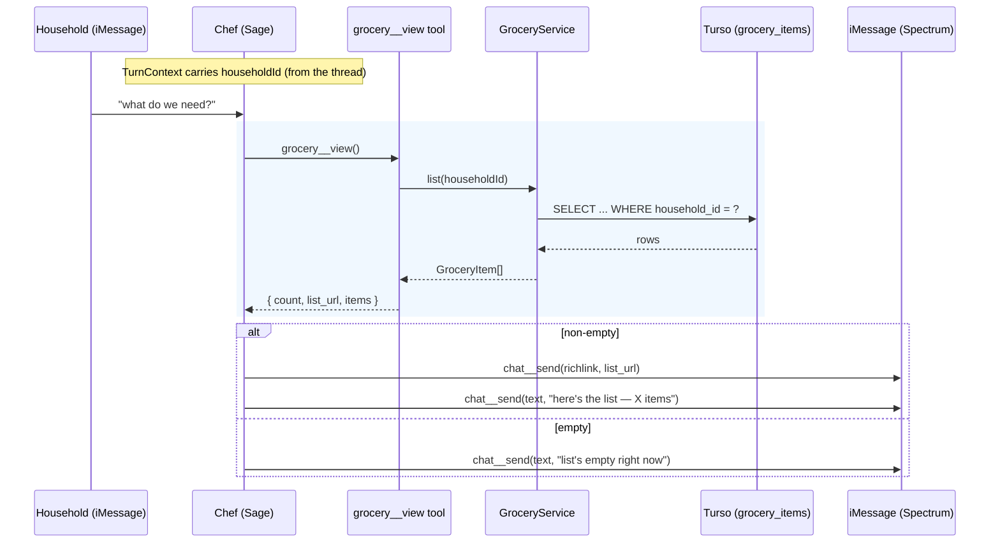
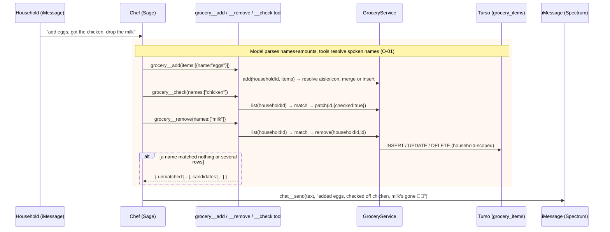
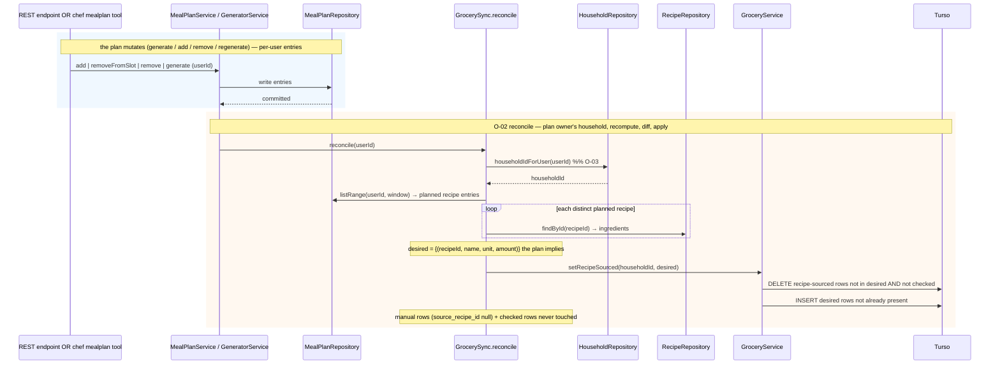
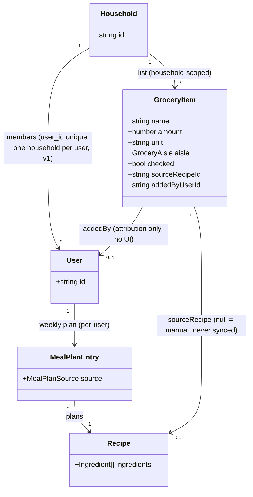
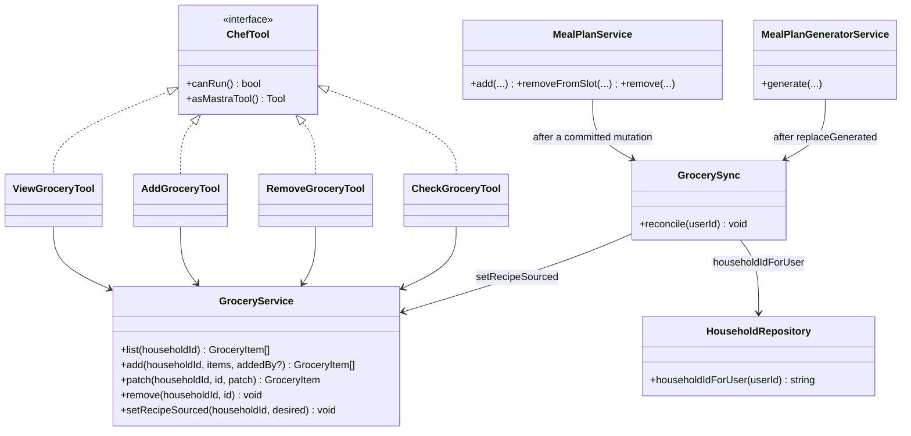
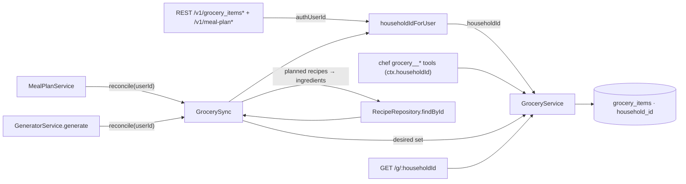

# Groceries in the chef ("Sage")

Sage can already plan a household's week and share it as one tappable card. She can't touch the
grocery list — the thing the plan produces. This design gives the thread the grocery tab's
functionality two ways:

1. **The list stays in sync with the plan automatically.** The grocery list is a *derived view*
   of the plan: whenever the plan changes — generated, a recipe added to a slot, one swapped or
   removed — the recipe-sourced grocery items follow. Nobody asks Sage to "stock the list." This
   is the meaty part of the design and is spec'd precisely below.
2. **Conversational edits + a card.** Sage views the list (as a browsable `/g/:householdId`
   card), adds manual items, removes items, and checks things off — the grocery tab's manual
   affordances, over iMessage — through four `grocery__*` tools resident in the objectives that
   use them, the way the `mealplan__*` tools are.

Two founder decisions shape this revision:

- **The list belongs to the household, not the user.** `grocery_items` moves from user scope to
  household scope. In v1 a user belongs to exactly one household (`household_members.user_id` is
  unique), so the migration backfill is deterministic. This is the substantive change and is
  worked through below (migration, the five REST endpoints, merge logic, the card URL, and the
  auto-sync hook).
- **Tool discovery was considered and measured, not built (v1).** The founder asked whether the
  grocery commands should sit behind an L2 tool-discovery meta-tool (`tools__list`) rather than be
  resident — the vertical-agent L1/L2 context hierarchy. We measured: four grocery tool schemas
  weigh **~400–600 tokens resident**, against a per-turn context already several thousand tokens
  (persona ~2k + briefing + transcript + the resident `mealplan__*`/`facts__*`/`chat__send`).
  Making a discovered tool callable requires a **second `agent.generate` pass** (Mastra 1.63.2
  injects tools per-generate via `toolsets`/constructor `tools`, never into a live loop), which
  roughly doubles latency on every grocery turn — and the chef's tool-loop latency is already its
  dominant cost (project memory: Groq reverted for it). Discovery would save ~400 tokens on
  grocery-free turns while adding a resident meta-tool (~150 tokens every turn) plus a full extra
  generation on every grocery turn plus the registry machinery. **At four tools that is a losing
  trade** — resident is correct for v1. The L1/L2 seam is designed below as the documented upgrade
  path for when the discoverable-tool count justifies it (reminders' `mealplan__remind`, imports).

The chef's grocery tools are **thin over the existing `GroceryService`** (now household-scoped);
the sync is a **reconcile hook at the meal-plan chokepoints**. The grocery page reuses the plan
page's SSR pipeline (Tailwind v4 + daisyUI `harvest` theme, content-hashed CSS).

# Reviews

| Reviewer | Status | Feedback |
|---|---|---|
| Jordan | not_started | |
| Architect | not_started | |

---

# Use Cases

- **F-01 View the grocery list** — the household asks what's on the list ("what do we need?").
  Sage reads the household's list and sends the card (`/g/:householdId`) — the whole list as one
  browsable page, aisle by aisle. Empty list ⇒ she says so in words.
- **F-02 Add items** — "add eggs and a dozen tortillas". Sage adds each to the household list;
  the service resolves aisle/icon/default-unit and merges by name+unit.
- **F-03 Remove an item** — "take milk off the list". Sage resolves the name to a row and removes it.
- **F-04 Check off / uncheck items** — "got the chicken", "we still need eggs". Sage patches
  `checked` per named item.
- **F-05 List follows the plan (automatic)** — no actor asks for it. When the plan is generated,
  a recipe added to a slot, or one removed/swapped, the household list's recipe-sourced items
  reconcile to match the plan. Manual items and checked items are preserved.
- **O-01 Resolve a spoken item to a list row** — map a free-text name to one of the household's
  grocery rows, disambiguating when several match.
- **O-02 Reconcile recipe-sourced items to the plan** — the sync primitive: make the household's
  recipe-sourced rows equal the multiset the plan owner's current plan implies, touching nothing
  manual or checked.
- **O-03 Resolve a caller to their household** — one indexed lookup (`household_members.user_id →
  household_id`) that scopes every REST endpoint and routes the reconcile.

---

# Use Case Implementations

## View the grocery list — Implements F-01

## Add / remove / check off — Implements F-02, F-03, F-04 (via O-01)

## List follows the plan — Implements F-05 (via O-02, O-03)

The sync fires after a committed plan mutation, inside the chokepoints the REST endpoints and the
chef tools already route through. It resolves the plan owner's household, then reconciles.

Extensions:

- **Idempotent replay** — reconcile recomputes the target and diffs, so a redelivered chef turn
  or retried REST call finds the list already correct and writes nothing.
- **Checked item whose recipe leaves the plan** — kept (it was bought). Reconciles away only once
  it's unchecked and still absent.
- **Recipe in two slots** — one distinct planned recipe ⇒ one contribution (Q-02 on quantity).
- **Plan owner has no household row** — `householdIdForUser` returns null; reconcile no-ops (a
  web-onboarding user with a plan but no household; the iMessage flow always creates one). Logged,
  self-heals when a household is attached. See Q-06.
- **`findById` null** (recipe deleted mid-window) — that recipe contributes nothing; its rows
  reconcile away. Skip nulls, no crash.

## After the first generate, Sage mentions the list — briefing hint

When `first_meal_plan`'s `generate` task completes, the plan card goes out and the household list
is now stocked (reconcile fired inside `generate`). One line in that objective's instructions lets
Sage mention it ("your grocery list's ready too — say 'what do we need' anytime"). A prompt hint,
no code path; it earns its place because the auto-stocked list is otherwise invisible until asked.

---

# Entities

No new entity. The change is `GroceryItem`'s owner: **household, not user.** `source_recipe_id`
stays the sync seam.

`source_recipe_id` null = manual (household-owned, never synced); non-null = recipe-sourced
(sync-owned, replaced to match the plan). `checked` overrides — a checked item is preserved
regardless of source. `added_by_user_id` (nullable) is free attribution — kept because it's one
column, **no UI built on it** (YAGNI).

The plan is per-user; the list is per-household. Reconcile bridges them: the plan owner's entries
imply the household's recipe-sourced rows. In v1 (one plan, generated for the thread owner) this
is unambiguous. If two members ever hold separate plans feeding one household list, reconcile
would need a plan-owner key on each row — the seam, not built (Q-05).

---

# Tables

## grocery_items (change — original at schema.ts:502)

| Column | Type | Constraints | Notes |
|---|---|---|---|
| household_id | text | not null, fk → households (cascade) | **new** — replaces user_id as the owner |
| added_by_user_id | text | nullable, fk → users (set null) | **new** — who added it; attribution only |
| user_id | — | **dropped** | superseded by household_id |

Everything else (`name`, `amount`, `unit`, `quantity_text`, `aisle`, `icon`, `checked`,
`source_recipe_id`, `position`, `created_at`) is unchanged. Index `grocery_items_user_idx` becomes
`grocery_items_household_idx` on `household_id` (every query is household-scoped). See Q-03 on a
`(household_id, source_recipe_id)` index for the reconcile delete — deferred.

## Migration (in-place, deterministic backfill)

1. Add `household_id` (nullable) and `added_by_user_id` (nullable).
2. Backfill both from the current owner:
   `UPDATE grocery_items SET household_id = (SELECT hm.household_id FROM household_members hm WHERE hm.user_id = grocery_items.user_id), added_by_user_id = user_id;`
   Deterministic because `household_members.user_id` is unique.
3. Any row whose owner has no household (web-onboarding user, no membership) has `household_id`
   null after step 2 — **delete those rows** (a per-user list that can't map to a household is
   defunct under the new model; the next plan/add re-creates as needed). Small and one-off.
4. Make `household_id` not-null; drop `user_id`; rename the index to `grocery_items_household_idx`.

Standard Drizzle `generate` → `migrate`. Backwards-incompatible with old code (which reads
`user_id`), so deploy the code and migration together (see Deployment).

No other table changes. Sync reads `meal_plan_entries` + `ingredients` + `household_members`, all
unchanged.

---

# Modules

New code: the `HouseholdRepository.householdIdForUser` resolver, the household-scoped
`GroceryService` (owner column swap + `setRecipeSourced`), the `GrocerySync` reconcile, the four
resident list tools, and the SSR page. Nothing in `add`/`patch`/`remove`/`list`'s *shape*
changes — only the column they scope on.

Changes by file:

- **`src/repositories/household-repository.ts`** — add `householdIdForUser(userId)`: one indexed
  SELECT on `household_members`. The single resolver the REST endpoints and the reconcile share.
- **`src/schema.ts` + a migration** — `grocery_items`: add `household_id` (fk, not-null after
  backfill) + `added_by_user_id` (nullable fk), drop `user_id`, rename the index.
- **`src/repositories/grocery-repository.ts` + `src/models/grocery-item.ts`** — swap `userId` →
  `householdId` in every WHERE / insert; `findMergeCandidate` keys on `householdId` (was `userId`)
  so a shared item merges across the household. Add `addedByUserId` to insert + model. Mechanical.
- **`src/services/grocery-service.ts`** — methods take `householdId` (+ optional `addedBy` on
  `add`). Add `setRecipeSourced(householdId, desired)`: one transaction — delete recipe-sourced
  (`source_recipe_id is not null`) **unchecked** rows not in `desired`, insert `desired` rows not
  already present (matched by `source_recipe_id + name + unit + amount`). The one net-new write.
- **`src/index.ts`** — the five grocery REST endpoints resolve `householdIdForUser(authUserId)`
  and pass `householdId` to the service (a caller only ever touches their own household — no
  cross-household id is accepted). `POST` passes `addedBy: authUserId`. Register
  `GET /g/:householdId`.
- **`src/services/meal-plan-service.ts`** — after committed `add`/`removeFromSlot`/`remove`, call
  `GrocerySync.reconcile(userId)`. This one chokepoint covers the REST plan endpoints
  (`index.ts:335,343`) and the chef's `mealplan__add/remove_recipe_to_slot`.
- **`src/planning/generator-service.ts`** — after `replaceGenerated` (`generator-service.ts:93`),
  call `GrocerySync.reconcile(userId)`.
- **`src/services/grocery-sync.ts` (new)** — `reconcile(userId)`: `householdIdForUser` → plan
  window `listRange(userId)` → distinct recipes → `findById` → build `desired` →
  `setRecipeSourced(householdId, desired)`.
- **`src/chef/tools/grocery.ts` (new)** — `grocery__view / grocery__add / grocery__remove /
  grocery__check`, each `create(ctx, db)` wiring `GroceryService` and reading `ctx.householdId`.
  `grocery__add` takes structured `{name, amount?, unit?}` (the model parses "2 cups of flour";
  the mobile app's `lib/grocery/parse.ts` exists only because a text box has no LLM). O-01 name
  resolution is a small shared helper.
- **`src/chef/tools/registry.ts` + objective tool lists** — register the four `grocery__*` ids in
  `FACTORIES` and add them to the resident `tools` list of the objectives where groceries belong
  (`first_meal_plan` at minimum, plus any post-onboarding/"everyday" objective). Resident, not
  discovered — see the tool-discovery decision (measured: not worth it at four tools). There is no
  `groceries` objective.
- **`src/chef/chef-agent.ts`** — add `grocery__add/__remove/__check` to `MUTATING_TOOL_IDS`
  (`grocery__view` is a pure read).
- **`src/chef/objectives/first-meal-plan.ts`** — the one briefing hint about the stocked list.
- **`src/grocery-page.tsx` (new)** — SSR page, aisle-major, reuses `plan-page.tsx`.
- **`styles/recipe.css`** — add `@source "../src/grocery-page.tsx";` (unstyled without it —
  commit `0ebfd7c`).

Reconcile runs after-commit, in-request (a few indexed reads + a small diff); the chokepoint is
the one place to move it to a queue job if it ever drags (Q-07).

---

# APIs

## Grocery REST endpoints `/v1/grocery_items*` (changed — auth model)

The five existing endpoints (`index.ts:349–387`) keep their paths, request/response shapes, and
the mobile client (`lib/api/groceries.ts`) unchanged. What changes is the **scope**: each resolves
`householdIdForUser(authUserId)` and operates on that household's list instead of the caller's
user rows. A member of the household sees and edits the shared list; there is no cross-household
access (the household id is derived from the token, never supplied). `POST` records
`added_by_user_id = authUserId`.

## Grocery card page `GET /g/:householdId`

The household's grocery list as one browsable HTML page — the iMessage grocery card's target.
Public by unguessable uuid, same trust model as `/r/:id` and `/p/:userId`.

### Request

- Path: `householdId` — string (uuid)

### Success Response `200`

- Headers: content-type `text/html`; cache-control `no-store` (the list mutates constantly)
- Body: aisle-major sections (store-walk order), one row per item (icon, name, quantity, checked
  strikethrough), an item count, an empty-state. Golden-hour theme via `RECIPE_CSS_HREF`.

No error response: an unknown householdId renders an empty list (no enumeration; matches
`/p/:userId`).

---

# Testing

## Test Coverage

| Use Case | Type | Unit | Integration | E2E |
|---|---|---|---|---|
| F-01 View | Flow | | x | x |
| F-02 Add | Flow | | x | |
| F-03 Remove | Flow | | x | |
| F-04 Check off | Flow | | x | |
| F-05 List follows the plan | Flow | | x | x |
| O-01 Resolve name | Op | x | | |
| O-02 Reconcile | Op | x | x | |
| O-03 Household resolve | Op | | x | |

## Test Approach

### Unit Tests

- **O-01 name resolution** — exact / case-insensitive / substring / no-match (→ unmatched +
  candidates) / several-match (→ candidates, no action).
- **O-02 desired-set builder** — plan entries + ingredients → `desired`: distinct recipes only,
  a recipe in two slots contributes once, null `findById` skipped.

### Integration Tests

Vitest against a `file:` libSQL DB (run files individually — vitest/libSQL lock note in memory).
Seed a household + members + a user's plan + recipes:

- **Household scoping** — two members of one household; an item added by member A is visible to
  member B's read; a second household's list is isolated. `findMergeCandidate` merges across the
  household (member A's "eggs" + member B's "eggs" → one line).
- **F-05 generate / add / remove / regenerate** — same as before but asserting rows land under
  `household_id`: generate stocks the household list; `MealPlanService.add` (and the chef tool)
  add a recipe's items; `removeFromSlot` drops unchecked items while a **checked** item survives;
  regenerate preserves manual + checked, diffs generated.
- **O-02 idempotency** — `reconcile(userId)` twice, no plan change → second call writes zero rows.
- **O-03** — `householdIdForUser` returns the member's household; null for a user with no
  membership (asserts the reconcile no-op path).
- **Migration backfill** — seed pre-migration rows (user-scoped) + memberships, run the backfill
  SQL, assert `household_id` populated deterministically and an orphan (no membership) row deleted.
- **`GET /g/:householdId`** — seeded household list renders aisle headers + names; empty renders
  the empty-state.

### End-to-End Tests

Extend `chef-sim.ts`: (1) "generate my week" → plan card sent *and* the household list populated;
(2) swap a recipe → old items leave, new arrive; (3) "what do we need?" → richlink to
`/g/:householdId`; (4) a second household member's turn sees the same list (proves household
scope through the chef path).

## Test Infrastructure

None new. `GroceryService`/`MealPlanService` have `file:`-db coverage and factories; `chef-sim.ts`
exists. A household+members seed helper may already exist for the household tests — reuse it.

---

# Deployment

## Migrations

| Order | Type | Description | Backwards-Compatible |
|---|---|---|---|
| 1 | schema | add `grocery_items.household_id` + `added_by_user_id` (both nullable) | yes |
| 2 | data | backfill `household_id`/`added_by_user_id` from the owner via `household_members`; delete orphan rows | yes |
| 3 | schema | `household_id` not-null; drop `user_id`; rename index → `grocery_items_household_idx` | **no** |

## Deploy Sequence

Step 3 is backwards-incompatible (old code reads `user_id`), so **deploy the code and the
migration together** (single deploy; the additive steps 1–2 run first, the drop in step 3 lands
with the new code). `PUBLIC_APP_URL` must be set (already required by the recipe/plan cards).

## Backfill (plans → lists)

Optional one-off after deploy: `reconcile(userId)` for every user with a current plan, so existing
plans stock their household lists immediately. Idempotent; skippable (the next plan mutation
reconciles anyway).

## Rollback Plan

Steps 1–2 roll back freely. After step 3, a code rollback needs the reverse migration (re-add
`user_id`, backfill from a household member) — so treat step 3 as the point of no cheap return;
verify on a branch DB first. A reconcile bug cannot corrupt manual or checked items — the sync
never writes them. To silence sync without a deploy: revert the reconcile calls (a small patch).

---

# Monitoring

Structured logs only (no metrics stack), matching current practice.

## Logging

| Event | Fields | Level | Why |
|---|---|---|---|
| list tool ran | threadId, tool (view/add/remove/check), n | info | F-01–F-04 audit |
| grocery reconcile | userId, householdId, planRecipes, inserted, deleted, kept_checked | info | F-05 — the sync's heartbeat; planRecipes>0 with inserted=0 on a fresh plan = misfire |
| reconcile no household | userId | info | O-03 no-op path; a stream means users with plans but no household |
| name unmatched | threadId, tool, name | info | O-01 — resolution too strict |

---

# Decisions

## The grocery list is household-scoped; resolve the household from the caller/plan-owner

**Framework:** Direct criterion — founder decision (Q-01 resolved); the data model already
supports it deterministically.

`household_members.user_id` is unique (one household per user in v1), so `user_id → household_id`
is a single indexed lookup — the migration backfill and the REST/reconcile scoping are all
deterministic, no ambiguity. `grocery_items` gains `household_id` (owner) and drops `user_id`;
`added_by_user_id` is kept as free attribution with no UI. The REST endpoints derive the household
from the token (never accept a household id), so cross-household access is impossible by
construction.

### Alternatives Considered
- **New `household_id` column, keep `user_id`:** two owner columns, ambiguous which one scopes a
  query, and a merge key that could disagree with itself. Dropping `user_id` keeps one owner.
- **A `list` table owning items, FK to household:** a whole table + join to express "the
  household's grocery list" — over-built for one list per household (this is the multi-list infra
  the founder said not to build).

## Reconcile-from-state, not incremental deltas (unchanged from prior revision)

**Framework:** Direct criterion — idempotency under replay.

`GroceryService.add` merges by name+unit and sums amounts, so deltas double-count on replay
(redelivered chef turns, retried REST calls). `reconcile` recomputes the plan-implied set and
diffs against current recipe-sourced rows: a replay writes nothing, and generate/add/remove/
regenerate collapse into one operation. Recipe-sourced rows carry `source_recipe_id` and are not
cross-recipe merged, so a recipe's contribution is added/removed precisely — the "decrement a
merged line" attribution problem never arises. Manual (`source_recipe_id null`) and checked rows
are never written by the sync.

## Four resident `grocery__*` tools, not a tool-discovery meta-tool (Q-02 resolved)

**Framework:** Fermi ROI — the founder asked for the token-cost case, measured, not asserted.

The question: keep the four grocery tools resident (L1), or hide them behind a `tools__list`
discovery meta-tool (L2, the vertical-agent context hierarchy) so they cost nothing on turns that
don't touch groceries?

**Measured cost of resident (L1):** the four grocery tool schemas (descriptions + input schemas)
weigh **~400–600 tokens**, paid on every turn of an objective that carries them. The per-turn
context is already several thousand tokens (persona ~2k + briefing + transcript + the resident
`mealplan__*` / `facts__*` / `tasks__update` / `chat__send`). So resident groceries add single-digit
percent to a turn — noise against the transcript and persona.

**Measured cost of discovery (L2):** a resident `tools__list` meta-tool is itself ~100–150 tokens
every turn (paid even on grocery-free turns — the opposite of the saving it's meant to buy). And
making a discovered tool callable is the real cost: Mastra 1.63.2 accepts tools only at
construction (`tools`) or per-generate (`toolsets` / `clientTools`) — **there is no injection into a
live tool-loop**. So a discovered tool needs a **second `agent.generate` pass** with the expanded
set (the pattern the recovery pass at `chef-agent.ts:271` already uses). That roughly doubles
model latency on every grocery turn, and the chef's tool-loop latency is already its dominant cost
(project memory: Groq reverted at ~12–25s/turn).

**ROI:** discovery *saves* ~400 tokens only on grocery-free turns, and *spends* ~150 resident
tokens every turn + a full extra generation (latency + tokens) on every grocery turn + the registry
machinery. At **four** tools that is strongly negative. Discovery earns out only when the
discoverable set is large (the skill's own L2/L3 examples are big tool families and huge raw
substrates), not four cheap wrappers. The vertical-agent skill says so directly: as models
strengthen, "yesterday's L2 collapses into L1" — four cheap tools on a capable model are L1.

**Choice:** resident. Groceries are the bread-and-butter (L1); the four tools are token-cheap,
fast, and consequence-reporting (they return `list_url` + what landed), matching the L1 discipline.

**The L1/L2 seam (designed, not built).** When the discoverable-tool count grows (reminders'
`mealplan__remind`, imports, a second list kind), the upgrade is: (1) a `tools__list` meta-tool
resident in every objective, returning `{id, one-line description}` for tools NOT already in the
current context; (2) it flips a per-turn flag the runner reads after `generate` returns and
**re-enters `generate` once** with the discovered ids added to the `tools` map (mechanism (b) —
Mastra has no live injection); (3) an on-demand tool registry (the existing `FACTORIES` map already
is one — `registry.ts:12`) partitioned into resident vs. discoverable. Nothing here is built now;
`FACTORIES` is the registry, and the recovery pass is the re-entry precedent, so the seam is a
small, well-understood change when the count justifies it.

### Alternatives Considered
- **`tools__list` discovery meta-tool now:** measured negative ROI at four tools (above); the
  second-generate latency is the killer given the chef's latency budget.
- **`tools__search` (semantic) meta-tool:** even heavier — embeds a query, needs an index; a
  list-flavored discovery over a handful of tools is a linear scan at most. Not for four tools.
- **A `groceries` objective holding the tools:** the founder rejected it — groceries are ambient,
  not a mode you enter; and it wouldn't reduce resident cost inside that objective anyway.

## Reconcile at every mutation (incremental), not only at plan confirm (unchanged)

**Framework:** Direct criterion — laziness + correctness agree.

Reconcile is idempotent and cheap, so firing on every mutation is simpler than a confirm gate (no
"confirmed yet?" state) and keeps the list live during the feedback loop. Confirm-time sync means
fewer calls but a stale window and an extra gated path.

## A public `/g/:householdId` page, reusing the plan-page pipeline (URL now household-keyed)

**Framework:** Direct criterion — the plan card is the proven precedent.

`GET /g/:householdId` mirrors `GET /p/:userId`: SSR React, the `harvest` daisyUI theme via the
content-hashed `RECIPE_CSS_HREF`, `no-store`, public-by-unguessable-uuid. Sage sends it with one
`chat__send` `richlink`; because the URL is under `PUBLIC_APP_URL`, the consumer's richlink router
(`imessage/consumer.ts:72`) sends it via `sendRecipeCard` — the static `app(url, {live:false})`
tappable card — for free. The `@source` line in `styles/recipe.css` is mandatory (commit `0ebfd7c`).

---

# Open Questions

| ID | Question | Status | Resolution |
|---|---|---|---|
| Q-01 | List owner: user or household? | resolved | **Household.** `grocery_items` moves to `household_id`; deterministic backfill via unique `household_members.user_id`. |
| Q-02 | Groceries behind a tool-discovery meta-tool, or resident? | resolved | **Resident four `grocery__*` tools.** Measured: ~400–600 tokens resident vs. a meta-tool (~150 tokens/turn) + a mandatory second `generate` pass per grocery turn (Mastra has no live tool injection) — negative ROI at four tools. No `groceries` objective. L1/L2 discovery seam designed as the upgrade path (see Decisions). |
| Q-03 | Add a `(household_id, source_recipe_id)` index for the reconcile delete? Recommendation: skip until reconcile latency is a real number (a per-household list is dozens of rows). | open | |
| Q-04 | Which objectives carry the resident `grocery__*` tools — `first_meal_plan` clearly; is there a post-onboarding/"everyday" objective they should also sit in so groceries work outside a planning flow? (Confirm against how objective `tools` lists are assembled in `registry.ts`/the objective definitions.) | open | |
| Q-05 | Multi-planner households: the plan is per-user, the list per-household. If two members ever hold separate plans feeding one list, reconcile needs a plan-owner key per row. Not built (v1 = one plan, thread owner). Confirm v1 assumption holds. | open | |
| Q-06 | Plan owner with no household row (web-onboarding user): reconcile no-ops. Is a plan without a household a real state to support, or does every planning user get a household? Recommendation: treat as no-op + log; revisit if the log fires. | open | |
| Q-07 | Reconcile runs in-request after the plan write. If a large plan/slow recipe read drags latency, move it to a `userId`-keyed queue job. Recommendation: in-request for now. | open | |

---

# Appendix A — Changelog

| Date | Author | Change |
|---|---|---|
| 2026-09-05 | Claude (groceries-designer) | Initial draft |
| 2026-09-05 | Claude (groceries-designer) | Founder revision 1: drop `grocery__add_from_plan`; list auto-syncs from plan mutations via a reconcile hook at the meal-plan chokepoints (reconcile-from-state, not deltas; recipe-sourced rows carry `source_recipe_id`; manual + checked preserved). |
| 2026-09-05 | Claude (groceries-designer) | Founder revision 2: (Q-01) grocery list moves to **household** scope — `grocery_items.household_id` replaces `user_id`, deterministic backfill via unique `household_members.user_id`, REST endpoints authorize by household, card is `/g/:householdId`, reconcile routes to the plan owner's household; `added_by_user_id` kept as free attribution. |
| 2026-09-05 | Claude (groceries-designer) | Founder revision 3 (Q-02 re-scoped): the "generic list-tool family" interpretation was wrong — the founder meant a tool-DISCOVERY meta-tool (`tools__list`), the L1/L2 hierarchy. Measured it: four `grocery__*` tools weigh ~400–600 tokens resident; a meta-tool costs ~150 tokens/turn + a mandatory second `generate` pass per grocery turn (Mastra 1.63.2 has no live tool injection — verified). Negative ROI at four tools ⇒ keep them **resident** (`grocery__*`, not `list__*`), no multi-list framing. Designed the L1/L2 discovery seam (registry + re-entry pass) as the documented upgrade path for when the discoverable-tool count grows. |
