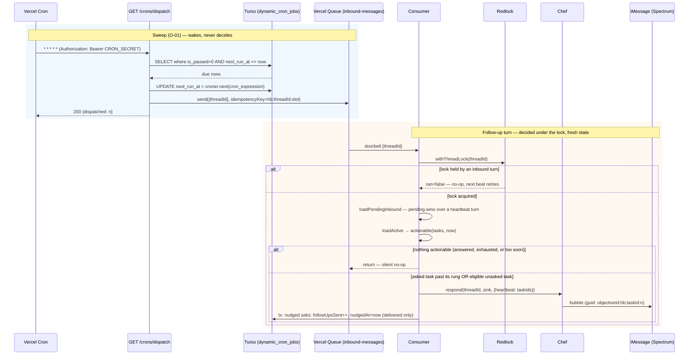
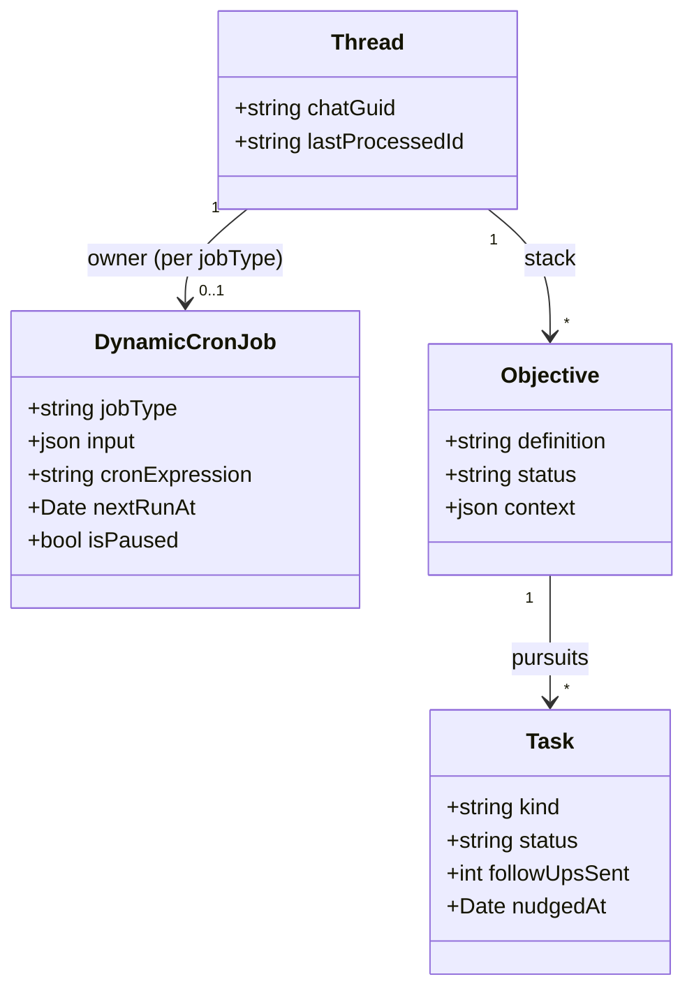
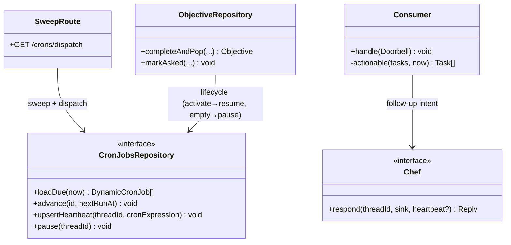
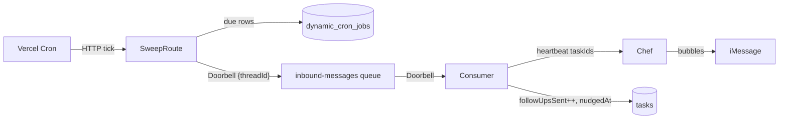

# Heartbeat — proactive follow-up on objective tasks

A thread's objective can stall: the chef asks a question (`elicit` task → `asked`) and the
household never answers, or a turn ends leaving an eligible task never asked. Today nothing
re-engages them — turns only run when an inbound message rings the doorbell. This design
adds a **heartbeat**: a configurable cron per thread that wakes the consumer, which —
under the existing per-thread lock — checks whether the active objective **can advance**:

- an **`asked` task gone quiet** — nudged on an escalating ladder: **5m, 30m, 60m, 4h,
  8h, 24h** after the last touch, then silence; or
- an **eligible `unasked` task** (gates satisfied, never delivered) — actionable at the
  next beat, no ladder wait.

If either exists, the chef runs a turn; if not, the beat is a silent no-op.

The timer mechanism follows the kickback-server `dynamic_cron_jobs` pattern: one table
holding a cron expression and the next run time per job, swept by a single static Vercel
cron that advances `next_run_at` and enqueues the due work. The sweeper only *wakes*
threads; all follow-up decisions happen in the consumer, under the thread lock, against
fresh state — so a nudge can never race a reply that already answered the question.

# Reviews

| Reviewer | Status | Feedback |
|---|---|---|
| Jordan | not_started | |

---

# Use Cases

- **F-01 Advance a stalled objective** — a heartbeat fires for a thread whose active
  objective has actionable work: an `asked` task with no answer past the current ladder
  rung (chef nudges; ladder advances; after the 6th nudge the task goes quiet) or an
  eligible `unasked` task (chef asks/delivers it — the normal turn behaviour, just
  proactively triggered).
- **O-01 Sweep dynamic cron jobs** — every minute, select unpaused rows with
  `next_run_at <= now`, advance `next_run_at` from the cron expression, dispatch each by
  `job_type`.
- **O-02 Heartbeat lifecycle** — a thread's heartbeat row is created/resumed when an
  objective becomes active and paused when the objective stack empties, at the same
  chokepoints that flip objective status today.

---

# Use Case Implementations

## Scheduled objective advance — Implements F-01



Extensions:

- **User replied just before the beat** — `loadPendingInbound` returns the reply; the
  loop runs a normal turn instead. If the reply filled the task, `actionable` finds
  nothing on the next iteration. The stale beat is harmless by construction.
- **Doorbell redelivered** — the heartbeat guid (`objectiveId:hb:taskId:n`, where `n` is
  the nudge number for asks and `0` for a first ask) is deterministic, so the sink skips
  the already-sent bubble; the counter update re-commits idempotently (same turn shape
  as kick-off redelivery today).
- **Chef stays silent** (`reply === null` or not delivered) — no commit, counters
  unchanged; the next beat retries. One heartbeat attempt per objective per `handle()`
  call bounds the drain loop (same guard as `kickedOff`). A chef that stays silent on an
  eligible `unasked` task retries at beat cadence indefinitely — bounded by the cron
  (≤ 288/day at `*/5`), logged, and self-healing the moment the chef acts.

## What's actionable

```
actionable(tasks, now) =
  // Arm 1 — quiet ask, nudge on the ladder
  tasks where status = 'asked'
    and followUpsSent < LADDER.length
    and now - nudgedAt >= LADDER[followUpsSent]
  ∪
  // Arm 2 — eligible work never delivered: the objective can advance right now
  tasks where status = 'unasked'
    and every task in afterTaskIds is terminal   // the existing eligibility gate
```

**Arm 1 — the follow-up ladder.** `FOLLOW_UP_LADDER = [5m, 30m, 60m, 4h, 8h, 24h]` — a
constant in code, gaps measured from the last touch (`nudgedAt`), not from the original
ask. `nudgedAt` is stamped whenever a task flips to `asked` (the existing chokepoints:
`confirmAcks` and `tasks__update`) and again on each committed nudge. After nudge #6 the
task stays `asked` but is never due again (see Q-01).

**Arm 2 — eligible unasked work (elicits AND emits, WI-04).** No ladder wait: if a
turn ended leaving an eligible task undone (a parked turn, a gate that opened as the
turn closed, a crash), the next beat picks it up and the chef runs its normal
ask/deliver behaviour. Emit safety comes from **guid scoping, not exclusion**: an
emit-bearing heartbeat turn rides the same objective-id guid scope that kick-offs use
— one idempotency domain for an objective's content, whichever arm sends it. Content
an earlier attempt already delivered is silently swallowed by the sink's
`alreadySent` guard, the chef keeps going, and the emit still gets marked done
(`tasks__update` or the AC-8 net). When emits and nudges are due together, the emits
take the turn and nudges catch the next beat — nudge bubbles must never ride the
colliding objective scope. Known ceiling (`consumer.ts` ponytail note): the shared
scope would swallow a future MID-objective emit's content across turns; none exists
today — per-bubble scoping if one is added. Solo-task exclusivity applies as in a
normal turn.

Multiple actionable tasks resolve in ONE turn — the chef sees all of them and composes
one message; the commit advances every `asked` task it nudged (arm-2 tasks advance
through the normal `asked`/`tasks__update` paths).

---

# Entities



---

# Tables

## dynamic_cron_jobs (new)

Kickback-server shape, adapted to Drizzle/SQLite. `owner_*` identifies the job (unique
per owner + type); `input` is the dispatch payload, opaque to the sweeper.

| Column Name | Type | Constraints | Notes |
|---|---|---|---|
| id | text | pk | UUID |
| job_type | text | not null | `'thread_heartbeat'` (only type today) |
| owner_type | text | not null | `'thread'` |
| owner_id | text | not null | threads.id (no FK — polymorphic, like kickback) |
| input | text (json) | not null | `{ "threadId": ... }` |
| cron_expression | text | not null | default `*/5 * * * *`; per-thread configurable |
| next_run_at | integer (timestamp) | not null | advanced by the sweeper |
| is_paused | integer (bool) | not null, default 0 | |
| created_at / updated_at | integer (timestamp) | not null | |

Indexes: unique `(owner_type, owner_id, job_type)`; `(is_paused, next_run_at)` for the
sweep query.

## tasks (change — original in schema.ts:846)

| Column Name | Type | Constraints | Notes |
|---|---|---|---|
| nudged_at | integer (timestamp) | nullable | last touch: stamped on `asked` + each nudge |

`follow_ups_sent` already exists (schema.ts:860, currently unused) — this design puts it
to work; no change needed.

---

# Modules





Changes by file:

- **`src/schema.ts`** — `dynamicCronJobs` table; `tasks.nudgedAt`.
- **`src/crons/` (new)** — `CronJobsRepository` (Drizzle), the sweep handler, and a thin
  `nextRun(cronExpression)` wrapper over `croner`.
- **`src/index.ts`** — register `GET /crons/dispatch`, guarded by `CRON_SECRET`.
- **`src/imessage/consumer.ts`** — third arm in the drain-loop exit test: no pending, no
  pop, no kickoff marker **and nothing actionable** ⇒ return. A heartbeat turn reuses
  the kick-off shape (no trigger id) with guidPrefix `objectiveId:hb:...`, and commits
  the nudge counters/timestamps in the existing transaction, delivered-only.
- **`src/chef/*`** — `respond` accepts the heartbeat intent (actionable task ids, which
  arm each came from) and folds one instruction line into the turn context; stamping
  `nudgedAt` on `asked` lands in the two existing status chokepoints.
- **`src/chef/objective-repository.ts`** — on objective activation (creation with an
  empty stack, and `completeAndPop`'s successor) `upsertHeartbeat`; when the stack
  empties, `pause`.

---

# APIs

## Sweep dynamic crons `GET /crons/dispatch`

Runs one sweep: advance due rows, enqueue their work. Invoked by Vercel Cron every
minute (`vercel.json` `crons`); callable manually with the secret for testing.

### Request

- Headers
    - authorization: `Bearer <CRON_SECRET>`

### Success Response `200`

- Body
    - dispatched: int — doorbells enqueued this sweep

### Unauthorized Response `401`

- Body
    - error: string

---

# Testing

## Test Coverage

| Use Case | Type | Unit | Integration | E2E |
|---|---|---|---|---|
| F-01: Advance stalled objective | Flow | | x | x |
| O-01: Sweep | Op | x | x | |
| O-02: Lifecycle | Op | | x | |

## Test Approach

### Unit Tests

`actionable` is a pure function — table-test both arms: each ladder rung boundary, the
exhausted case (`followUpsSent = 6`), non-`asked` statuses, missing `nudgedAt`; and for
arm 2, an eligible unasked task (gates terminal), a gated one (not actionable), and a
solo task. Same for the `nextRun` croner wrapper (a known expression at a known instant).

### Integration Tests

Vitest against a `file:` libSQL DB (existing pattern; run files individually — see the
vitest/libSQL lock note in project memory):

- **Sweep**: seed due + not-due + paused rows → invoke the handler with a mock queue
  client → assert `next_run_at` advanced and exactly the due doorbells sent.
- **Consumer heartbeat arm**: seed an active objective with an `asked` task past rung 1,
  stub chef/sender, `StubThreadLock` → bare doorbell ⇒ nudge turn, counter + `nudgedAt`
  committed. Variants: eligible `unasked` task ⇒ ask turn; pending inbound wins; chef
  silent ⇒ no commit; redelivery ⇒ no double-send; lock held ⇒ no-op.
- **Lifecycle**: activating an objective upserts/resumes the row; emptying the stack
  pauses it.

### End-to-End Tests

One `chef-sim.ts` scenario: objective asks a question → advance the clock past rung 1 →
run a sweep → assert the nudge bubble and the advanced ladder state.

## Test Infrastructure

A clock seam for the ladder (pass `now` into `dueFollowUps` and the sweep) — no new
harness work beyond that.

---

# Deployment

## Migrations

| Order | Type | Description | Backwards-Compatible |
|---|---|---|---|
| 1 | schema | create `dynamic_cron_jobs` + indexes; add `tasks.nudged_at` | yes |
| 2 | data | seed a heartbeat row per thread with an active objective (one-off script, `scripts/`) | yes |

## Deploy Sequence

Migrate, then deploy (additive schema — old code ignores both). Set `CRON_SECRET` in
Vercel env before the deploy that adds the `crons` entry, or every tick 401s.

## Rollback Plan

Code rollback is safe against the new schema. To silence the feature without a deploy:
`UPDATE dynamic_cron_jobs SET is_paused = 1`.

---

# Monitoring

No metrics stack exists — structured logs only, matching current practice.

## Logging

| Event | Fields | Level | Why |
|---|---|---|---|
| sweep completed | due, dispatched, ms | info | O-01 heartbeat-of-the-heartbeat: absence in logs = crons not firing |
| sweep failed | error | error | the only alert-worthy condition |
| nudge sent | threadId, taskId, nudgeNo | info | F-01 audit trail; nudgeNo distribution shows where households answer |

---

# Decisions

## Global sweep over a `dynamic_cron_jobs` table (not per-thread workflows or delayed queue messages)

**Framework:** Direct criterion — chosen by Jordan; proven shape (kickback-server).

Per-thread cadence lives in data, ops surface is one static cron + one table, and
pause/resume/reconfigure is an UPDATE. Granularity bottoms out at the 1-minute sweep,
which the 5-minute finest rung never notices.

### Alternatives Considered
- **Durable Workflow per thread sleeping to the next deadline:** N live runs to cancel/reschedule on every reply; state in two places.
- **Delayed queue message per follow-up deadline:** precise, but cancelling stale delays on user replies adds bookkeeping the lock-time check makes unnecessary.

## Cost: dynamic table + sweep vs. a platform cron per thread

**Framework:** Direct criterion — a platform cron per thread is not actually available,
and the sweep is cheaper anyway.

Vercel crons are **static deploy-time config** (`vercel.json` `crons`): creating one per
thread at runtime would require a redeploy per new thread, and the Pro plan caps a
project at **40 cron jobs total** — dead on arrival past 40 threads. The dynamic table
is the only mechanism that gives *per-thread* cadence at runtime.

It is also the cheap shape. Fixed cost: one short sweep invocation per minute
(~43k/month) doing one indexed SELECT. Variable cost: one queue send + one consumer
invocation per **due** thread beat (N threads at `*/5` ⇒ N × 288 beats/day), and pausing
rows when the objective stack empties zeroes out idle threads. If N grows enough that
no-op beats (active objective, nothing actionable) dominate, the cheap lever is an
**advisory pre-filter** in the sweep — skip enqueueing threads whose tasks can't
plausibly be actionable, decided from an indexed read; the consumer still makes the real
decision under the lock, so the filter can only save money, never cause a wrong nudge.
Deferred until beat volume is a real number.

## The sweeper wakes; the consumer decides

**Framework:** Direct criterion — correctness under concurrency.

Due-ness is evaluated inside `withThreadLock` against fresh task state, so a nudge can
never fire for a question answered moments earlier, and heartbeat/inbound turns
serialize through the mechanism that already exists (`lock.ts:1`). The alternative —
deciding at sweep time — reintroduces every stale-state race the lock was built to kill.

## Reuse the `inbound-messages` doorbell (no new topic, no new consumer)

**Framework:** Direct criterion — the drain loop already handles "woken with nothing
pending" for kick-offs.

A bare `{threadId}` doorbell is exactly the wake-up the heartbeat needs; the follow-up
arm is one more clause in the existing exit test. Beat idempotency key
`hb:<threadId>:<slot>` dedupes retried sweeps of the same slot.

## Advance `next_run_at` before enqueueing

**Framework:** Direct criterion — kickback's ordering, correct here too.

Crash between advance and enqueue = one missed beat, healed by the next tick (a beat
carries no unique payload — it's a wake-up). The reverse order risks duplicate beats
forever on a poisoned row. Duplicates are harmless anyway (queue key + lock), so this
just keeps the row from wedging.

## `croner` for next-run computation

**Framework:** Direct criterion — already in `node_modules` (transitive), zero-dep,
maintained. Promote it to a direct dependency.

---

# Open Questions

| ID | Question | Status | Resolution |
|---|---|---|---|
| Q-01 | After the 24h nudge (ladder exhausted), should a *required* task be `defaulted` so the objective can complete, or stay `asked` forever? Recommendation: stay quiet for now; defaulting changes objective semantics and deserves its own decision. | open | |
| Q-02 | Quiet hours — the 4h/8h/24h rungs can land at 3am. The per-thread `cron_expression` can encode waking hours (e.g. `*/5 8-21 * * *`) since the ladder measures elapsed time and the beat merely checks. Ship that as the default expression? | open | |
| Q-03 | Vercel plan check: every-minute crons require Pro (Hobby: 2 crons, daily min). Confirm the project's plan before setting `* * * * *`. | open | |

---

# Appendix A — Changelog

| Date | Author | Change |
|---|---|---|
| 2026-09-05 | Claude (w/ Jordan) | Initial draft |
| 2026-09-05 | Claude (w/ Jordan) | Broaden trigger: heartbeat fires on ANY actionable work (quiet asks on the ladder OR eligible unasked tasks — "can the objective advance?"); add cost decision: dynamic table + sweep vs. platform cron per thread |
| 2026-09-05 | Claude | Arm 2 narrowed to elicits (as built in WI-02): the heartbeat asks questions, never re-delivers emit content |
| 2026-09-05 | Claude (w/ Jordan) | WI-04 reverses the WI-02 narrowing: arm 2 includes emits, made safe by scoping emit-bearing heartbeat turns to the kick-off's objective-id guid domain — duplicates swallow silently and the emit still gets marked done |
