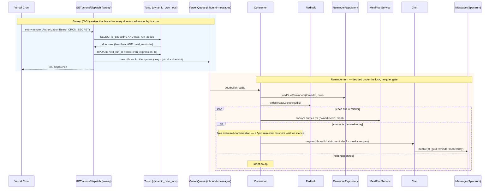
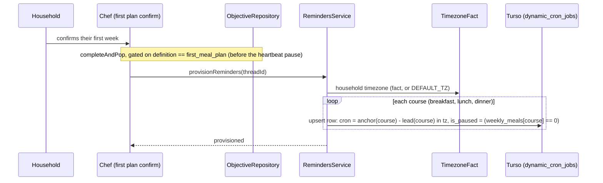
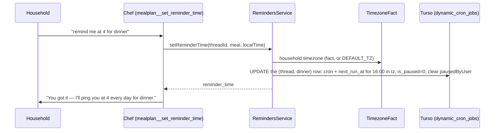
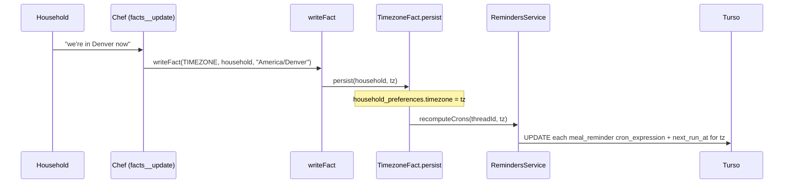
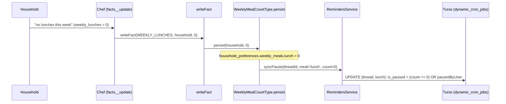
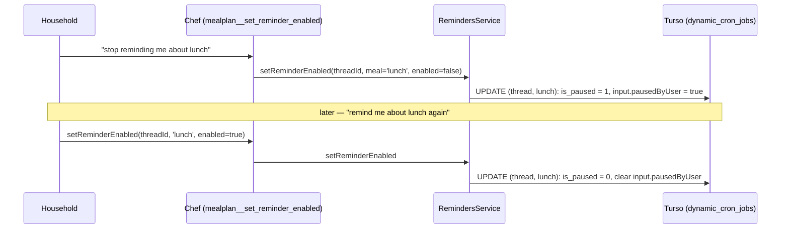
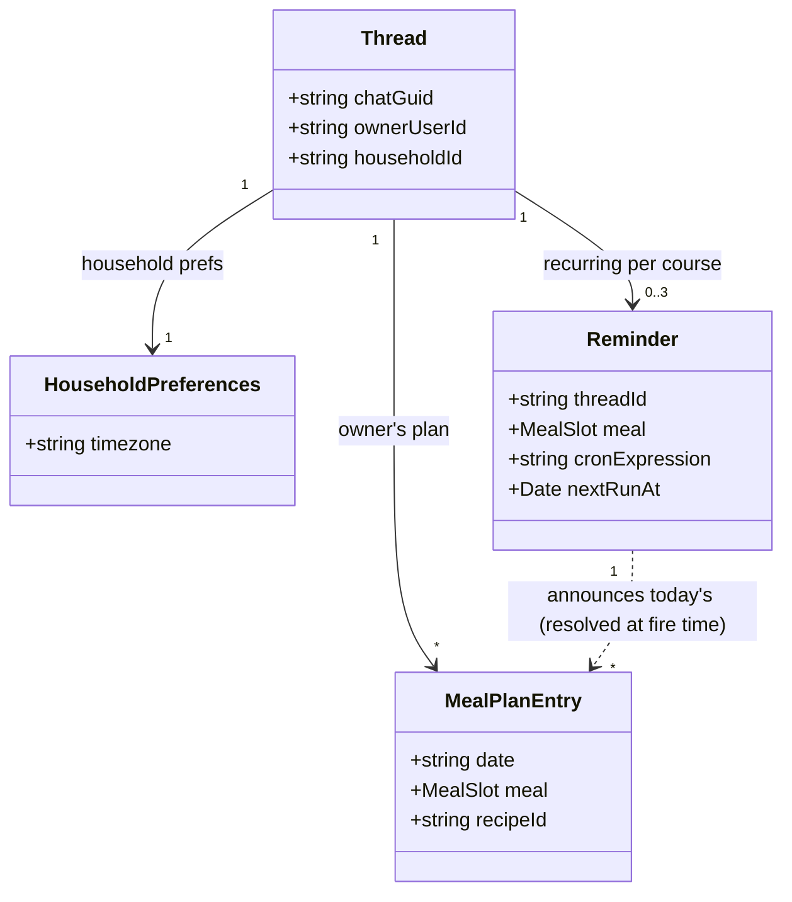
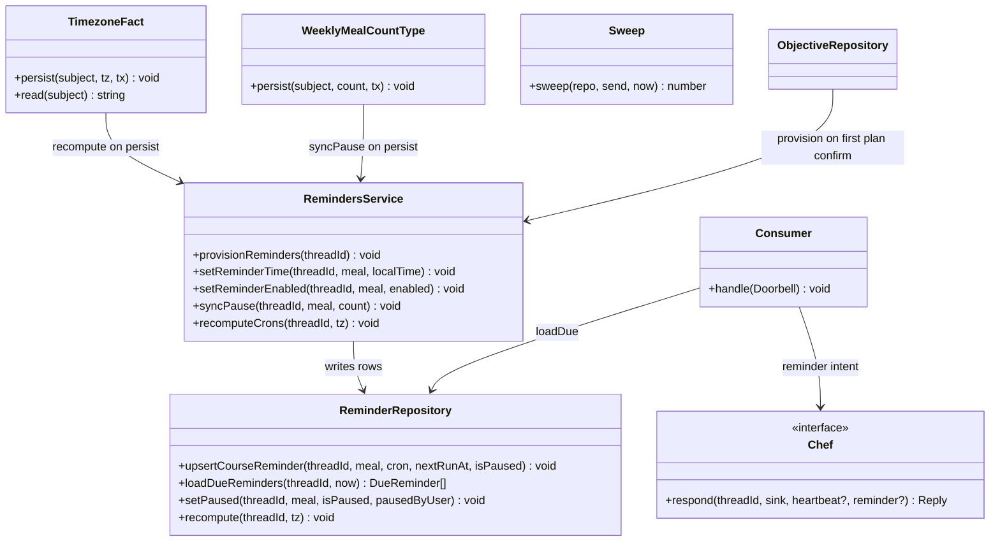
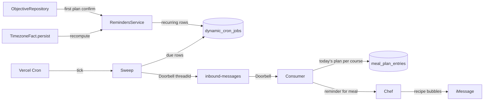

# Meal reminders — Sage tells the household what to cook, before the meal

A confirmed meal plan knows what's for dinner tonight; the household doesn't, until they open the
plan page. This design adds **reminders**: a scheduled send from Sage that arrives *before* a
meal — "tonight you're cooking Chicken Marbella — here's the recipe" — so the plan reaches the
household when it's useful.

Every reminder is **one recurring `dynamic_cron_jobs` row per (thread, course)** — `job_type =
'meal_reminder'`, `input = {threadId, meal}`, a daily `cron_expression` set to a local time. When
it fires, the consumer **reads today's plan for that course**: something planned → announce it;
nothing planned → silent no-op. The rows are created once and just live. **Nothing touches them
when the plan changes** — the plan is read at fire time, so swaps and regenerations are
automatically correct.

The row's time starts at a sensible default (course anchor − lead) and the household **retunes
it in conversation**: "remind me at 4 for dinner" just updates that course's `cron_expression` —
every night at 4 from then on. There is no separate "one-time" event; a reminder is a standing
daily time the user owns.

A reminder is the deferred **"TRIGGERS"** concept — a scheduled activation pointing at plan
content — realized on the heartbeat's own timer (`dynamic_cron_jobs` + sweep + doorbell +
consumer lock, PR #91) with a dispatch-by-type change. No new table, no new topic, no new
consumer, no new cron.

This design extends `heartbeat/DESIGN.md`; read it first. This doc adds the `meal_reminder`
job type, a household `timezone` fact, and the reminder arm in the consumer.

# Reviews

| Reviewer | Status | Feedback |
|---|---|---|
| Jordan | not_started | |

---

# Use Cases

- **F-01 Provision a household's reminders** — a household's per-course recurring reminder rows
  are created (at first plan confirm), each with a cron derived from its course anchor, the
  course lead time, and the household timezone.
- **F-02 Fire a reminder** — a reminder's daily time arrives; the consumer reads today's plan for
  that course and, if planned, Sage announces the meal and its recipe(s) — exactly once, whether
  or not the thread is mid-conversation. Nothing planned ⇒ silent no-op.
- **F-03 Set a course's reminder time** — the household tells Sage when to remind them for a
  course ("remind me at 4 for dinner"); Sage updates that course's recurring row to the new local
  time. Standing from then on. Setting a time also un-pauses the course.
- **F-04 Recompute on timezone change** — the household's timezone fact is set/changed; every
  `meal_reminder` cron for that thread is recomputed to the new local time.
- **F-05 Pause a course with no meals** — the household's weekly count for a course drops to 0
  (a preference write); that course's row is paused. Raising it back above 0 un-pauses it —
  unless the household explicitly turned it off (F-06 precedence).
- **F-06 Pause/resume a course explicitly** — "stop reminding me about lunch" / "remind me about
  lunch again"; Sage pauses or resumes that course's row. An explicit pause is authoritative: a
  later preference bump does not resurrect it.
- **O-01 Dispatch a due row** — the sweep wakes every due thread and advances each due row by its
  cron. (The dispatch-by-type change: `meal_reminder` rows dispatch alongside heartbeats.)

---

# Use Case Implementations

## Fire a reminder — Implements F-02

Extensions:

- **User is mid-conversation** — the reminder arm runs regardless (Decision: no quiet gate). A
  genuinely-pending inbound turn runs first in the loop; the reminder rides the next iteration.
- **Doorbell redelivered / recomputed the same day** — the per-day guid (`reminder:<meal>:<local
  date>`) makes the bubble idempotent: the sink's `alreadySent` guard swallows a resend, so a
  household never sees the same dinner reminder twice in a day.
- **Nothing planned for the course today** — `loadTodaysPlan` returns no entries; the arm sends
  nothing, the row stays for tomorrow. This covers "the household does dinner but skipped tonight."
  A course they never do at all is *paused* at the meal-count level (F-05), so it doesn't even
  fire — the two cases are handled at different layers (paused = standing "no", empty today =
  this-week "no").

## Provision reminders — Implements F-01

Provisioning is idempotent (upsert on `(owner, job_type, meal)`); running it again re-asserts the
same rows. Each course's `is_paused` is **derived from the household's weekly meal count** at
provision time — a course the household plans zero of starts paused. **Reminders are a property of
"has a plan," not "has an active objective"** — so unlike the heartbeat, live rows are NOT paused
when the objective stack empties. A household that confirmed a plan and then went quiet still gets
its dinner reminder tomorrow.

## Set a course's reminder time — Implements F-03

The row is provisioned already (F-01), so this is an `UPDATE`, idempotent by construction. If the
course has no row yet (an edge — provision failed), the service upserts one. Setting a time is an
intent to be reminded, so it un-pauses the course and clears any user-pause marker. Standing from
then on — there is no one-time variant (see Decision + Q-05).

## Recompute on timezone change — Implements F-04

`writeFact` is the single validate→persist chokepoint for facts, so recompute hangs off
`TimezoneFact.persist` — set the tz anywhere and the crons follow. Until the fact is set, crons
use `DEFAULT_TZ` (env).

## Pause a course with no meals — Implements F-05

Same `writeFact` chokepoint as the timezone (F-04): the `WeeklyMealCountType` for a course is
already per-meal, so its `persist` knows exactly which course changed and syncs that one row.
`is_paused` becomes `count === 0 || pausedByUser`, so raising the count back above 0 un-pauses —
*unless* the household explicitly turned it off (the `pausedByUser` marker, F-06). The week's plan
entries stay uncoupled: a nonzero preference with zero entries this particular week still fires
and finds nothing (F-02 silent no-op).

The fact's subject is a *household*; reminder rows are keyed by *thread*. There's no
household→thread lookup today (a thread carries `household_id`, not the reverse), so `syncPause`
resolves it — either a new `ThreadRepository.findByHousehold(householdId)` or a
`ReminderRepository.setPausedByHousehold(...)` that joins `dynamic_cron_jobs.owner_id =
threads.id WHERE threads.household_id = ?`. One indexed query; the join form is the lazier of the
two (no new public method on ThreadRepository).

## Pause/resume a course explicitly — Implements F-06

`input.pausedByUser` (a JSON flag on the row) is what makes an explicit pause authoritative: F-05's
recompute reads it and won't un-pause a user-paused course when the meal count rises. An explicit
resume (or `setReminderTime`, F-03) clears the flag, handing control back to the preference-derived
rule.

---

# Entities

`Reminder` is a **view over a `dynamic_cron_jobs` row** (`job_type = 'meal_reminder'`), not a new
table. Every reminder is recurring; it names (thread, course) and carries no plan content — it
resolves today's recipes live when it fires, so a swap or regen is always reflected.

---

# Tables

## dynamic_cron_jobs (change — original in `heartbeat/DESIGN.md`, `schema.ts:875`)

One column added so the recurring table can also hold per-course reminders. `cron_expression`
stays `not null` — every reminder is recurring, like the heartbeat.

| Column Name | Type | Constraints | Notes |
|---|---|---|---|
| meal | text | nullable | the course for a `meal_reminder` row (`breakfast`/`lunch`/`dinner`); null for a heartbeat |

A reminder row: `job_type='meal_reminder'`, `owner_type='thread'`, `owner_id=threadId`,
`meal='dinner'`, `cron_expression='30 16 * * *'` (16:30 local), `next_run_at`=next occurrence,
`input={threadId, meal:'dinner', pausedByUser?:true}`.

`input.pausedByUser` (optional JSON flag, no schema change — `input` is already a JSON blob) marks
a course the household explicitly turned off, so a preference-derived recompute (F-05) won't
resurrect it. Absent/false ⇒ `is_paused` follows the weekly meal count. Pausing lives in the
existing `is_paused` column; the flag only records *why*, to protect an explicit choice.

The existing unique index `(owner_type, owner_id, job_type)` must include `meal` so a thread holds
one row per course while heartbeats (meal null) keep their single row:

| Index | Columns | Unique | Notes |
|---|---|---|---|
| dynamic_cron_jobs_owner_uidx (change) | `(owner_type, owner_id, job_type, meal)` | yes | one heartbeat (meal null) + up to one reminder per course per thread |
| dynamic_cron_jobs_due_idx (unchanged) | `(is_paused, next_run_at)` | no | the sweep query |

`meal` is a plain nullable column the repository fills. No `fires_at` / `slot_key` / one-shot
bookkeeping columns — a recurring reminder needs none.

## household_preferences (change — original in `schema.ts`)

| Column Name | Type | Constraints | Notes |
|---|---|---|---|
| timezone | text | nullable | IANA zone (e.g. `America/Denver`); the `TIMEZONE` household fact persists here; null ⇒ `DEFAULT_TZ` |

---

# Modules

Changes by file:

- **`src/schema.ts`** — add `dynamic_cron_jobs.meal` column; widen the owner unique index to
  include `meal`. Add `household_preferences.timezone`. (`cron_expression` unchanged — stays
  not-null.)
- **`src/crons/sweep.ts`** — drop the `job.jobType !== 'thread_heartbeat'` early-continue so
  `meal_reminder` rows dispatch too; every due row advances by its cron (unchanged loop otherwise).
  `nextRun` gets the row's tz (reminders fire in local time).
- **`src/crons/next-run.ts`** — take a `timezone` argument instead of the hardcoded `"UTC"`
  (croner already supports `{ timezone }`); heartbeats pass `UTC` (unchanged behaviour), reminders
  pass the household zone.
- **`src/crons/cron-jobs-repository.ts`** — add `meal` to the selected/loaded fields (schema
  otherwise unchanged).
- **`src/reminders/` (new)** — `ReminderRepository` (Drizzle over `dynamic_cron_jobs` scoped to
  `job_type='meal_reminder'`) and `RemindersService` (anchor/lead → cron math, tz lookup).
- **`src/chef/facts/fact-types.ts`** — a `TimezoneType` household fact (mirrors
  `GroceryShoppingDayType`): validate IANA, persist to `household_preferences.timezone`, and in
  `persist` call `RemindersService.recomputeCrons`. And in the existing `WeeklyMealCountType.persist`
  (fact-types.ts:266, already per-course), call `RemindersService.syncPause(threadId, meal, count)`.
- **`src/chef/objective-repository.ts`** — on the first-meal-plan objective completing (the
  existing `completeAndPop` chokepoint), `provisionReminders`.
- **`src/chef/tools/mealplan.ts` + `registry.ts`** — `SetReminderTimeTool`
  (`mealplan__set_reminder_time`) updates a course's time (and un-pauses it); `SetReminderEnabledTool`
  (`mealplan__set_reminder_enabled`) pauses/resumes a course (`is_paused` + `pausedByUser` flag).
- **`src/imessage/consumer.ts`** — a reminder arm before the heartbeat arm: `loadDueReminders`,
  per due course read today's plan, run a reminder turn (guid `reminder:<meal>:<local date>`), no
  quiet gate. No delete — rows are standing.
- **`src/imessage/chef.ts` + `src/chef/briefing.ts`** — `respond` gains `reminder?:
  ReminderIntent` (`{ meal, recipes }`); the briefing folds a one-line "announce tonight's dinner"
  instruction.

The chef tool follows the existing `ChefTool` pattern (`static create(ctx, db)`, `canRun()`,
`asMastraTool()`), household-scoped from `TurnContext`.

---

# APIs

No new HTTP endpoint. Reminders ride the existing `GET /crons/dispatch` sweep (its dispatch now
also handles `meal_reminder` rows) and the existing `inbound-messages` doorbell. Setting a
reminder time is a **chef tool**, not HTTP.

## mealplan__set_reminder_time (chef tool, not HTTP)

Sets (or changes) the standing daily reminder time for a course; also un-pauses it.

- **Input**: `meal` (breakfast|lunch|dinner|snack), `time` (local wall-clock, e.g. `"16:00"` —
  resolved to a cron in the household tz by the service).
- **Returns**: `{ meal, reminder_time }` — the new standing time.

## mealplan__set_reminder_enabled (chef tool, not HTTP)

Pauses or resumes a course's reminder — "stop reminding me about lunch" / "remind me again".

- **Input**: `meal` (breakfast|lunch|dinner|snack), `enabled` (bool).
- **Returns**: `{ meal, enabled }`. `enabled=false` sets `is_paused` + the `pausedByUser` flag (so
  a later meal-count bump won't resurrect it); `enabled=true` clears both.

---

# Testing

## Test Coverage

| Use Case | Type | Unit | Integration | E2E |
|---|---|---|---|---|
| F-01: Provision | Flow | x | x | |
| F-02: Fire a reminder | Flow | | x | x |
| F-03: Set a course's time | Flow | x | x | |
| F-04: Recompute on tz change | Flow | | x | |
| F-05: Pause on zero meals | Flow | | x | |
| F-06: Explicit pause/resume | Flow | | x | |
| O-01: Dispatch a due row | Op | x | x | |

## Test Approach

### Unit Tests

- **Cron derivation** — `RemindersService`: `cron = anchor(course) − lead(course)` in a given tz,
  table-tested per course; the same math for `setReminderTime` (a requested local time → cron in
  tz); and the DST-boundary sanity of the croner+tz wrapper (a known expression + zone + instant).
  Pure given `now` and `tz`.
- **Pause rule** — `is_paused = count === 0 || pausedByUser`: table-test the four combinations.
  Pure.

### Integration Tests

Vitest against a `file:` libSQL DB (existing pattern; run files individually, `pkill -f vitest`
between runs, `ulimit -n 30000` — see project memory on vitest/libSQL locks):

- **provisionReminders** — provision a thread → assert one recurring row per course with the tz'd
  cron and `is_paused` derived from the weekly count (a 0-count course starts paused); provision
  again → still one row per course (idempotent upsert).
- **setReminderTime** — set dinner to 16:00 → assert that row's `cron_expression`/`next_run_at`
  moved and `is_paused` cleared; set again → the same one row, new time (idempotent UPDATE).
- **recomputeCrons** — set the timezone fact → assert every `meal_reminder` row's
  `cron_expression`/`next_run_at` moved to the new zone; a thread with no reminders is a no-op.
- **syncPause (F-05)** — set weekly_lunches=0 → lunch row paused; set weekly_lunches=3 → lunch
  row live again. Then the precedence case: explicit pause (F-06) lunch → set weekly_lunches=3 →
  lunch stays paused (`pausedByUser` protected it); explicit resume → live.
- **Sweep dispatch** — seed a due reminder + a due heartbeat + a due-but-paused reminder + a
  not-due row → invoke the sweep with a mock queue → assert the two live due rows advanced
  (tz-aware), the paused row is skipped (the `loadDue` query already filters `is_paused=false`),
  and exactly the live due doorbells sent.
- **Consumer reminder arm** — seed a thread with a due dinner reminder + a plan with tonight's
  dinner, stub chef/sender, `StubThreadLock` → doorbell ⇒ reminder turn naming the dinner.
  Variants: nothing planned tonight ⇒ silent, row survives; mid-conversation (pending inbound ⇒
  pending turn first); redelivery ⇒ no double-send (per-day guid).

### End-to-End Tests

One `chef-sim.ts` scenario: confirm a plan (rows provisioned) → advance the clock to dinner's
cron time → run a sweep → assert the bubble names tonight's dinner and its recipe url; advance a
day with an empty dinner slot → sweep → assert silence.

## Test Infrastructure

A clock seam (`now` into `loadDueReminders` and the sweep — the sweep already takes `now`) and a
tz seam (pass tz into the cron math). Reuse the heartbeat suite's `StubThreadLock` + mock queue.

---

# Deployment

## Migrations

| Order | Type | Description | Backwards-Compatible |
|---|---|---|---|
| 1 | schema | add `dynamic_cron_jobs.meal`; widen owner unique index to include `meal`; add `household_preferences.timezone` | yes |
| 2 | data | none — reminders are provisioned lazily at the next first-plan-confirm; existing households can be provisioned by a one-off script if desired | n/a |

All additive. Widening the unique index: existing rows have `meal = null`, and `(thread,
thread_id, thread_heartbeat, null)` stays unique per thread.

## Deploy Sequence

Migrate, then deploy. The sweep's reminder handling is inert until a `meal_reminder` row exists,
and none exists until the new code writes one — old and new code coexist against the migrated
schema.

## Rollback Plan

Code rollback is safe: old sweep code hits `job.jobType !== 'thread_heartbeat' ⇒ continue`, so
`meal_reminder` rows are ignored (never dispatched) until roll-forward. To silence without a
deploy: `UPDATE dynamic_cron_jobs SET is_paused = 1 WHERE job_type = 'meal_reminder'`.

---

# Monitoring

No metrics stack — structured logs only, matching `heartbeat/DESIGN.md`.

## Logging

| Event | Fields | Level | Why |
|---|---|---|---|
| reminders provisioned | threadId, courses | info | F-01 audit: a confirm with 0 courses flags a tz/anchor bug |
| reminder fired | threadId, meal, recipes | info | F-02 audit trail; absence while rows are due = the arm isn't running |
| reminder skipped (nothing planned) | threadId, meal | debug | F-02 confirms the silent-no-op path, not a bug |

The sweep's existing `sweep completed {due, dispatched}` line covers dispatch health.

---

# Decisions

## One recurring row per (thread, course); the household picks the time

**Framework:** Direct criterion — founder feedback ("why isn't this a recurring cron? remind the
user every night and let them pick the time"), which is also the laziest correct shape.

A household's dinner is at a fixed local time daily, so one recurring row per (thread, course)
captures it — and because the row carries no plan content, the plan is simply **read at fire
time**. That single fact deletes an entire subsystem: no scheduling on plan writes, no
rescheduling on edits, no per-date rows, no lifecycle coupling to `replaceGenerated` / slot tools,
and no one-shot machinery at all (no nullable cron, no delete-on-fire, no sweep branch). A swap or
a full regen is reflected automatically because the reminder never cached what it was going to say.

"Remind me at 4 for dinner" is not a separate event — it's the household **retuning that standing
row's time**. There is one concept (a daily per-course time the user owns), one code path (an
`UPDATE`), and nothing that can fire twice or leak.

### Alternatives Considered
- **One-shot row per planned meal (draft 1):** `scheduleForWeek`/`rescheduleSlot` hooks, a
  `slot_key` column, per-date rows, delete-on-fire — all deleted by the recurring model.
- **A one-shot flavour just for explicit "remind me at 4" (draft 2):** a nullable `cron_expression`
  (null = one-shot), a sweep branch (advance-if-cron-else-leave), and delete-after-fire in the
  consumer. Rejected: the founder's insight is that "remind me at 4" *is* the recurring time, so a
  standing `UPDATE` covers it with zero new machinery. One-time-only reminders are out of scope
  (Q-05).
- **Never provision a course, only create on first "remind me":** loses the automatic
  dinner reminder every household wants by default. Provision-all-with-derived-pause gives the
  default for free and still lets a household turn a course off (below).

## Provision all courses, pause the ones with no meals (derived pause)

**Framework:** Direct criterion — founder requirement ("remove or pause these crons when the
household doesn't have these courses for the week"), taken at the laziest rung.

Provision breakfast/lunch/dinner for every thread, but set each row's `is_paused` from the
household's weekly meal count — a course they plan zero of starts paused, so no daily no-op fire
for a course that isn't a thing for this household. Keep it in sync at the **`weekly_meals` write
chokepoint**: `WeeklyMealCountType.persist` (fact-types.ts:266) is already per-course, so it flips
exactly the one row when a count crosses 0. This is the same `writeFact`→recompute pattern the
timezone uses — no new coupling surface, one hook on a preference that changes rarely and has one
write path.

Crucially this pauses on the *preference* (a standing "we don't do lunch"), not on the *plan
entries* (this particular week has no lunch) — so the zero-coupling-to-plan-mutations win is
intact. A nonzero preference with an empty week still fires and finds nothing (F-02 silent no-op),
which is correct: the household does lunch, just not today.

### Alternatives Considered
- **Pause from the plan entries (fire-time or a plan-write hook):** re-introduces coupling to
  every plan mutation — the thing the recurring model exists to avoid. The preference is the right
  altitude for "does this household do this course at all."
- **Delete the row instead of pausing:** then a re-add has to re-provision (recompute the cron,
  the tz) — pausing keeps the tuned time and is a one-column flip. `is_paused` already exists and
  the sweep already honours it.

## User-explicit pause beats preference recompute (a `pausedByUser` flag, no new column)

**Framework:** Direct criterion — the founder's precedence requirement, least machinery.

"Stop reminding me about lunch" must survive a later `weekly_lunches = 3` edit — the household
said stop. The rule is `is_paused = count === 0 || pausedByUser`, where `pausedByUser` is a JSON
flag on the row's existing `input` blob (no schema change). F-05's recompute reads it and won't
resurrect a user-paused course; an explicit resume, or `setReminderTime` (an intent to be
reminded), clears it. One optional boolean, read exactly where the recompute already reads `input`.

### Alternatives Considered
- **A `paused_by` enum column:** a schema migration for what one JSON flag on an already-JSON
  column does.
- **Recompute never resumes (only pauses):** simpler, but then adding lunches back to the week
  wouldn't bring the reminder back — the founder wants a meal-count bump to un-pause a
  *preference*-paused course. The flag is the minimum that distinguishes the two pause reasons.

## Timezone is a household fact, recomputed at the fact-write chokepoint

**Framework:** Direct criterion — founder resolved Q-01 ("we need a timezone, or a state fact");
reuse the existing facts machinery.

A `TIMEZONE` household fact mirrors `GROCERY_SHOPPING_DAY`: it validates an IANA zone, persists to
`household_preferences.timezone`, and is elicited or inferred in conversation. Because `writeFact`
is the single validate→persist chokepoint, recompute hangs off `TimezoneType.persist` — setting
the zone anywhere re-derives that thread's reminder crons. Until the fact is set, crons use a
`DEFAULT_TZ` env fallback so reminders still fire (in a sensible default zone) pre-elicitation.
`next-run.ts` already wraps croner, which takes a `{ timezone }` per call — heartbeats keep `UTC`,
reminders pass the household zone.

## No quiet gate for reminders (unlike the heartbeat)

**Framework:** Direct criterion — the reminder's job is to arrive *on time*.

The heartbeat suppresses itself when the thread is active. A reminder is the opposite: "start
dinner in 90 minutes" is worthless if it waits for silence. It fires at its instant regardless of
conversation state, still serializing through the lock and deferring to a genuinely-pending
inbound turn (that turn runs first in the loop), so it never interleaves mid-turn.

## The sweeper wakes; the consumer reads the plan under the lock

**Framework:** Direct criterion — the heartbeat's own correctness rule, reused.

The doorbell stays a bare `{threadId}` (no marker). The consumer reads which reminders are due and
resolves today's plan under `withThreadLock` against fresh state — so a swap moments before the
fire is reflected, and a course with nothing planned no-ops. Packing plan content into the
doorbell would fork its shape and reintroduce stale-payload races the lock exists to kill.

## Provision when the first-meal-plan objective completes (not tied to the objective lifecycle)

**Framework:** Direct criterion — a chokepoint that already exists and knows the thread, but a
lifetime that does not follow the objective.

`objective-repository`'s `completeAndPop` is where an objective finishes and it carries the
`threadId`. The first-meal-plan objective completing is exactly "this household now has a plan
worth reminding about," so provisioning hangs off that pop — gated on `done.definition ===
first_meal_plan` so a later objective completing doesn't re-provision. Note first-meal-plan is the
last objective on the stack, so its pop hits the stack-empty branch that pauses the *heartbeat*;
provisioning runs there, before that pause. The reminder rows are independent of the heartbeat's
pause — their pause is derived from meal counts (F-01/F-05), not the objective stack — because a
household keeps a plan (and its reminders) after the conversation that built it ends.

Ponytail note: this is one `if (done.definition === firstMealPlanObjective.id)` in `completeAndPop`
plus the `RemindersService` call. If reminders ever need to exist without ever confirming a
first plan (e.g. a web-only household later texts in), move provisioning to a household-creation
chokepoint — not needed today.

---

# Open Questions

| ID | Question | Status | Resolution |
|---|---|---|---|
| Q-01 | Timezone source. | resolved | Founder: household-scoped `TIMEZONE` fact persisted to `household_preferences.timezone`, elicited/inferred in conversation, `DEFAULT_TZ` env fallback. Crons derive from it; recompute at the `writeFact` chokepoint (F-04). |
| Q-02 | Course anchor + lead defaults. Proposal: dinner anchor 18:00 local / lead 90m (cron 16:30); lunch anchor 12:00 / lead 90m (10:30); breakfast anchor 08:00 → remind 20:00 the prior evening (a morning-of ping is too late to shop/prep — encode as a 20:00 cron announcing *tomorrow's* breakfast, or drop breakfast from v1). Snack: none. Confirm the set and whether breakfast ships in v1. | open | |
| Q-03 | Group threads: one reminder to the whole chat (current design — the thread's owner's plan) vs. per-member. Keep thread-level for v1? | open | |
| Q-04 | Breakfast semantics: because breakfast's lead crosses midnight, its reminder announces *the next day's* breakfast, so "today's plan" resolution differs for breakfast (read tomorrow). Confirm, or drop breakfast auto-reminders for v1 and keep the "read today" rule uniform. | open | |
| Q-05 | One-time-only reminders ("just remind me today, not every day") are out of scope for v1 — every reminder is a standing daily time. If a household asks for a single nudge, add a one-shot flavour later (a nullable `cron_expression` + delete-after-fire, the draft-2 shape). Ship recurring-only first? Recommendation: yes. | open | |
| Q-06 | Snack: not provisioned (no natural anchor time). If a household wants a snack reminder, `set_reminder_time` for snack would need to upsert a row (the "no row yet" edge in F-03). Ship without snack provisioning, upsert-on-demand? Recommendation: yes. | open | |

---

# Appendix A — Changelog

| Date | Author | Change |
|---|---|---|
| 2026-09-05 | Claude | Initial draft — one-shot-per-meal reminders scheduled at plan-write chokepoints |
| 2026-09-05 | Claude (founder feedback) | Reworked to recurring per-course crons that read the plan at fire time: deleted the plan-mutation lifecycle coupling (scheduleForWeek/rescheduleSlot), the slot_key column, per-date rows, and delete-on-fire for the auto path. Timezone resolved as a household fact recomputed at the writeFact chokepoint (F-04). Explicit reminders kept as a slim one-shot flavour. |
| 2026-09-05 | Claude (founder feedback) | Killed the one-shot flavour entirely: "remind me at 4 for dinner" now UPDATEs the course's recurring row (F-03 = set-the-time). `cron_expression` stays not-null (dropped the nullable migration); sweep advances every due row (no one-shot branch); consumer never deletes (rows are standing). One-time-only reminders are out of scope (Q-05). |
| 2026-09-05 | Claude (founder feedback) | Added pause lifecycle: courses with weekly_meals=0 are paused (F-05, derived at the WeeklyMealCountType.persist chokepoint); explicit "stop reminding me" pause/resume (F-06, mealplan__set_reminder_enabled). Precedence via a `pausedByUser` flag on the row's `input` JSON (no schema change) — a preference bump won't resurrect a user-paused course. Provisioning (F-01) now derives `is_paused` from meal counts. |
